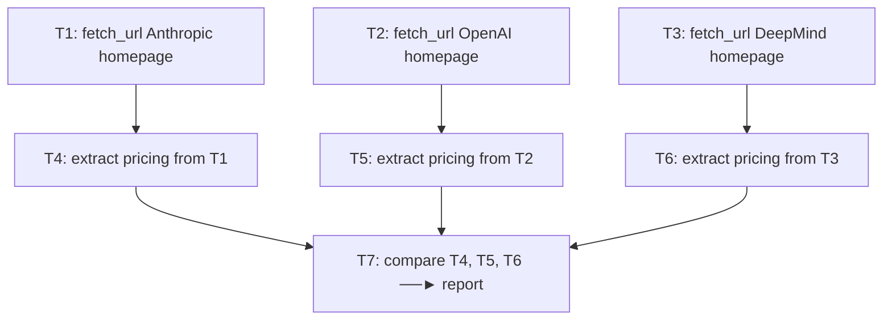

---
tags:
  - ai
  - agents
gardening: 🌱
date: 2026-05-25
reference:
  - https://arxiv.org/abs/2210.03629
  - https://arxiv.org/abs/2303.11366
  - https://arxiv.org/abs/2305.10601
  - https://www.anthropic.com/research/building-effective-agents
  - https://arxiv.org/abs/2305.04091
---
## Where we are, and why this matters

An *agent architecture* is the control-flow scaffolding that wraps an LLM and turns it from a "predict the next token" engine into something that pursues goals over multiple steps, using tools, with feedback. The two dominant families of single-agent architectures in 2023 and 2024 are:

1. **ReAct**: interleave reasoning and action in one tight loop.
2. **Plan-and-Execute**: split the work into two stages, thinking first and doing second.

A note on terminology. The literature sometimes calls this pattern *Plan-and-Solve* (after the prompting paper that popularized the term), or *Planner / Executor*. In Anthropic's "Building Effective Agents" framing, this is one instance of the more general *workflow* category (a structured composition of LLM calls), as opposed to *agent* (an LLM that dynamically directs its own process). We'll use "Plan-and-Execute" throughout.

## The problem Plan-and-Execute solves

To understand why anyone would split an agent in two, you need to understand the pain points of ReAct. Recall the ReAct loop:

```
                ┌────────── single LLM context ──────────┐
                │                                        │
   ┌─────────┐  │   Thought₁ ──► Action₁ ──► Obs₁        │
   │  GOAL   │──┤   Thought₂ ──► Action₂ ──► Obs₂        │
   └─────────┘  │   Thought₃ ──► Action₃ ──► Obs₃        │
                │   ...                                  │
                └────────────────────────────────────────┘
```

Every iteration appends a new `(Thought, Action, Observation)` triple to the *same* context window, and the LLM is re-invoked with the entire growing history. This has four concrete consequences:

### 1 Context grows linearly in steps

If a single Thought/Action/Observation triple costs $c$ tokens on average, and the task takes $n$ steps, then the LLM input at step $k$ is approximately:

$$ \text{tokens}_k \approx \text{prompt} + c \cdot (k-1) $$

The total tokens billed across the whole trajectory is:

$$ T_{\text{ReAct}} = \sum_{k=1}^{n} (\text{prompt} + c \cdot (k-1)) = n \cdot \text{prompt} + c \cdot \frac{n(n-1)}{2} \in O(n^2) $$

That is a quadratic cost in steps. For a 30-step task with $c = 500$ tokens, you'll burn roughly $30 \cdot 500 \cdot 15 = 225{,}000$ input tokens just from re-feeding history, on top of system prompts.

### 2 Reasoning happens locally, never globally

At step 7, the model is staring at observations 1 through 6 and asking "what's the next move?" It cannot easily step back and say "this whole approach is wrong; we should restart with a different strategy." Each Thought is a greedy local decision. The model has no incentive (and no clean place) to do strategic, top-down decomposition.

### 3 No parallelism

The loop is strictly sequential by construction: step $k+1$ depends on the observation of step $k$, even when the underlying tasks are independent. If your goal is "research three companies and compare them," ReAct researches company A, then B, then C, even though A, B, and C have no dependency on each other.

### 4 The trace and the controller are conflated

The "what should I do" decisions and the "I am doing it" actions live in the same prompt, in the same model, with the same temperature settings. You can't cheaply substitute a smaller, faster model for the boring execution steps, because every step is asked to be both a strategist and a worker.

## The Plan-and-Execute architecture

The core idea is simple: separate the strategic decision-making from the tactical execution into two distinct LLM invocations or stages.

```
┌────────────────────────────────────────────────────────────────┐
│                                                                │
│   ┌─────────┐      ┌──────────────┐      ┌──────────────────┐  │
│   │  GOAL   │─────►│   PLANNER    │─────►│   TASK GRAPH     │  │
│   └─────────┘      │  (1 LLM call)│      │  (DAG of steps)  │  │
│                    └──────────────┘      └──────────────────┘  │
│                                                  │             │
│                                                  ▼             │
│                                          ┌──────────────────┐  │
│                                          │    EXECUTOR      │  │
│                                          │  walks the DAG,  │  │
│                                          │  calls tools,    │  │
│                                          │  collects output │  │
│                                          └──────────────────┘  │
│                                                  │             │
│                                                  ▼             │
│                                          ┌──────────────────┐  │
│                                          │   FINAL ANSWER   │  │
│                                          └──────────────────┘  │
│                                                                │
└────────────────────────────────────────────────────────────────┘
```

There are exactly three pieces.

### The planner

The planner is a single LLM invocation whose input is the user's goal (plus relevant context and a description of available tools), and whose output is a structured *plan*.

The planner is typically prompted to:

1. Decompose the goal into atomic subtasks.
2. Identify dependencies among subtasks (does task B need task A's output?).
3. Choose, for each task, which tool to use and with what arguments.
4. Emit the whole thing as machine-parseable structured output (JSON, typically with a schema).

The planner runs once at the start.

### The task graph

A task graph is a directed acyclic graph (DAG) $G = (V, E)$ where:

- Each vertex $v \in V$ is a single, executable task (a tool call with arguments).
- Each edge $(u, v) \in E$ encodes a dependency: $v$ cannot run until $u$ has produced output.

The graph being acyclic is essential. A cycle would mean "task A depends on task B which depends on task A," which has no executable order.

A linear plan (a numbered list 1, 2, 3, ...) is just the special case where the DAG is a chain. A real DAG looks like this:



Notice that T1, T2, and T3 have no dependencies and can run in parallel. T4, T5, and T6 each depend only on their respective fetch, so they too can run in parallel after their parent finishes. Only T7 must wait for all three branches. This exposed concurrency is one of Plan-and-Execute's structural advantages over ReAct.

### The executor

The executor is a controller (which may or may not itself be an LLM) that walks the task graph and dispatches each task to its tool when its dependencies have been satisfied.

The executor's job is mechanically simple:

1. Find the set of ready tasks (all dependencies done with successful outputs).
2. Dispatch ready tasks, possibly in parallel, to their respective tools.
3. Collect outputs into a results map.
4. Substitute results into dependent tasks' arguments (for example, `{{ T4.output }}` references).
5. Repeat until all tasks are done or progress stalls.

The executor does not need to do strategic reasoning. It just walks the DAG. This is why the executor can often be a non-LLM scheduler (pure code), or a much cheaper or smaller LLM for tasks like "summarize this output and feed it forward."

## A reference implementation

Here is a minimal but realistic Plan-and-Execute implementation in TypeScript. It is intentionally compact. Production systems add retries, timeouts, observability, and resource limits, but the core algorithm is exactly this.

```typescript
// ─── Types ───────────────────────────────────────────────────────────

type ToolName = "fetch_url" | "extract" | "compare" | "summarize";

type Task = {
  readonly id: string;
  readonly description: string;
  readonly tool: ToolName;
  readonly args: Readonly<Record<string, unknown>>;
  readonly dependencies: readonly string[]; // ids of prerequisite tasks
};

type Plan = {
  readonly goal: string;
  readonly tasks: readonly Task[];
};

type TaskResult =
  | { readonly status: "success"; readonly output: unknown }
  | { readonly status: "failure"; readonly error: string };

type ToolFn = (args: Readonly<Record<string, unknown>>) => Promise<unknown>;

// ─── Planner: one LLM call, structured output ────────────────────────

const plan = async (
  goal: string,
  toolSpecs: Readonly<Record<ToolName, string>>,
): Promise<Plan> => {
  const system = `You decompose goals into a DAG of tool calls.
Available tools:
${Object.entries(toolSpecs).map(([n, d]) => `- ${n}: ${d}`).join("\n")}
Output strict JSON matching the Plan schema.`;

  const response = await llm.generate({
    system,
    user: goal,
    schema: PLAN_SCHEMA, // JSON Schema for { goal, tasks: Task[] }
  });
  return response.parsed as Plan;
};

// ─── Argument substitution: resolve {{ T1.output }} references ───────

const resolveArgs = (
  args: Readonly<Record<string, unknown>>,
  results: ReadonlyMap<string, TaskResult>,
): Record<string, unknown> => {
  const out: Record<string, unknown> = {};
  for (const [k, v] of Object.entries(args)) {
    if (typeof v === "string") {
      const match = v.match(/^\{\{\s*(\w+)\.output\s*\}\}$/);
      if (match !== null) {
        const dep = results.get(match[1]);
        out[k] = dep?.status === "success" ? dep.output : undefined;
        continue;
      }
    }
    out[k] = v;
  }
  return out;
};

// ─── Run a single task ───────────────────────────────────────────────

const runTask = async (
  task: Task,
  tools: Readonly<Record<ToolName, ToolFn>>,
  results: ReadonlyMap<string, TaskResult>,
): Promise<TaskResult> => {
  const tool = tools[task.tool];
  if (tool === undefined) {
    return { status: "failure", error: `unknown tool: ${task.tool}` };
  }
  try {
    const resolved = resolveArgs(task.args, results);
    const output = await tool(resolved);
    return { status: "success", output };
  } catch (err) {
    return { status: "failure", error: String(err) };
  }
};

// ─── Executor: walks the DAG, parallelizes ready tasks ───────────────

const execute = async (
  p: Plan,
  tools: Readonly<Record<ToolName, ToolFn>>,
): Promise<ReadonlyMap<string, TaskResult>> => {
  const results = new Map<string, TaskResult>();
  const done = (id: string): boolean =>
    results.get(id)?.status === "success";
  const ready = (t: Task): boolean =>
    !results.has(t.id) && t.dependencies.every(done);

  // Fixed-point iteration: keep dispatching ready tasks until none remain.
  while (results.size < p.tasks.length) {
    const wave = p.tasks.filter(ready);
    if (wave.length === 0) break; // deadlock: blocked by upstream failure

    const outcomes = await Promise.all(
      wave.map(async (t) => [t.id, await runTask(t, tools, results)] as const),
    );
    for (const [id, r] of outcomes) results.set(id, r);
  }
  return results;
};

// ─── The full pipeline ───────────────────────────────────────────────

const planAndExecute = async (
  goal: string,
  toolSpecs: Readonly<Record<ToolName, string>>,
  tools: Readonly<Record<ToolName, ToolFn>>,
): Promise<ReadonlyMap<string, TaskResult>> => {
  const p = await plan(goal, toolSpecs);
  return execute(p, tools);
};
```

Walk through this carefully. The whole architecture sits in fewer than 80 lines because the idea is small. The complexity in real systems lives in three places not shown.

First, plan validation. Does the DAG type-check? Are tool arguments well-formed? Are there cycles? Reject malformed plans before executing.

Second, replanning. What to do when a task fails.

Third, streaming output back to the planner. This is for the "interactive" or "agentic" variant where the planner can refine the plan after partial execution.

## Replanning: making it adaptive

The naive Plan-and-Execute as drawn is open-loop. The planner emits a plan and never sees the consequences. That works fine for tasks whose structure you can predict from the goal alone (such as "compare these three companies' homepage pricing"), but it breaks when reality contradicts the plan's assumptions (the homepage 404s, or the API returned a different schema than expected).

The standard fix is to add a *replanner*, sometimes the same LLM and sometimes a third role, that runs after each batch of execution and decides:

1. Are we done? Return the answer.
2. Is the plan still valid? Continue executing.
3. Does the plan need amendment? Emit a new plan (typically only the remaining tasks) given what we've now observed.

```
   ┌─────────┐      ┌──────────┐      ┌────────────┐      ┌────────────┐
   │  GOAL   │─────►│  PLANNER │─────►│  EXECUTOR  │─────►│ REPLANNER  │
   └─────────┘      └──────────┘      │ (one wave) │      └────────────┘
                          ▲           └────────────┘             │
                          │                                      │
                          └──────────── revise plan ─────────────┘
                                            │
                                            ▼
                                       ┌─────────┐
                                       │ FINISH  │
                                       └─────────┘
```

This is the topology used by, for example, LangGraph's `plan_and_execute` template. The replanner loop is the bridge between fully open-loop Plan-and-Execute and ReAct. As you make the replan happen more often (every task instead of every wave), you converge toward ReAct. As you make it happen less often (or never), you have pure open-loop Plan-and-Execute. There's a continuous design dial here, not a binary choice.

Two related architectures are worth naming here. **Reflexion** is in a related design space: after a failed trajectory, the agent generates a written reflection in natural language and uses it as additional context for the next attempt. Reflexion is orthogonal to Plan-and-Execute. You can add reflective memory to either ReAct or Plan-and-Execute, and the replanner is one place where reflections are naturally consumed.

**Tree of Thoughts** generalizes the planning step further. Instead of producing one plan, it explores a tree of candidate plans or thoughts with backtracking and lookahead, using the LLM itself to evaluate intermediate states. Tree of Thoughts can be seen as a much more elaborate planner that performs search over plans rather than emitting one.

## Trade-offs vs ReAct

Here is the table to internalize.

| Dimension | ReAct | Plan-and-Execute |
|---|---|---|
| Control flow | Interleaved reasoning and acting in one loop | Two-stage: plan once, then execute |
| Context growth | $O(n^2)$ tokens for $n$ steps (history re-fed) | Planner pays $O(p)$ once; each executor task pays $O(c_e)$. Total $O(p + n \cdot c_e)$ with small $c_e$ |
| Strategic view | Local, greedy at each step | Global decomposition up front |
| Adaptivity | High. Every step is a decision point | Low (open-loop) to medium (with replanner) |
| Parallelism | None (sequential by construction) | Native. Independent DAG nodes run concurrently |
| Model mixing | One model does everything | Strong planner with cheap executor is idiomatic |
| Debuggability | Trace is linear, but reasoning is embedded in prose | Plan is an explicit, inspectable artifact |
| Failure mode | Loops, drift, "lost in the middle" on long traces | Cascading failure if early plan is wrong; brittle if replanning is weak |
| Best for | Open-ended, exploratory, environment-driven tasks | Well-scoped tasks with predictable decomposition |
| Token cost | High and superlinear in steps | Lower and roughly linear in tasks |
| Latency | $O(n)$ sequential model round-trips | $O(\text{depth of DAG})$, often much less than $n$ |

Four rows deserve more detail.

### Cost: quadratic versus linear

ReAct's total input tokens scale as $O(n^2)$ in step count. Plan-and-Execute's cost decomposes as:

$$ T_{\text{P\&E}} = \underbrace{C_p}_{\text{planner: one large call}} + \sum_{i=1}^{n} \underbrace{c_{e,i}}_{\text{each executor call: small}} $$

The planner is typically the only call that needs the full system prompt, all tool descriptions, and the goal. Each executor call only needs its own task and its dependencies' outputs, not the entire trajectory. For a 30-step task, this is often a 5× to 20× token reduction, and the gap widens with task length.

### Latency: depth, not length

ReAct latency is $n \cdot \ell$ where $\ell$ is per-step latency and $n$ is the step count. Plan-and-Execute latency is approximately:

$$ L_{\text{P\&E}} \approx L_p + d(G) \cdot \ell_e $$

where $d(G)$ is the longest path (depth) through the DAG, not the total number of nodes. The wider the DAG, the better Plan-and-Execute looks. For the three-company comparison DAG in section 2.2, ReAct would run 7 steps sequentially, while Plan-and-Execute runs in depth 3 (fetch, then extract, then compare) with width 3 at each layer.

### Adaptivity: the primary trade-off

ReAct's tight feedback loop is its strength in open environments such as a web browser, a real-world API that might fail, or an interactive game. The agent can pivot at every step.

Plan-and-Execute commits to a plan up front. If your initial plan was wrong because the planner didn't know X, the executor will dutifully execute the wrong plan unless you've added replanning. This is the single most important risk to understand. Pure Plan-and-Execute is appropriate when:

- The goal is well-specified.
- The decomposition is predictable from the goal alone, without needing intermediate observations.
- Or, you have a robust replanner that closes the loop.

If you find yourself replanning after almost every task, you've reinvented ReAct with extra overhead, and you should reconsider.

### Model mixing

Because the planner does the hard cognitive work and the executor does mechanical dispatch, you can run the planner on a strong model (Claude Opus, GPT-4-class) and the executor on a much cheaper one (Claude Haiku, GPT-4o-mini). If the executor is doing pure tool dispatch with no reasoning, it can even be plain code with no LLM at all. ReAct cannot do this cleanly, because every step needs to be both strategist and worker, so every step pays for a strong model.

Anthropic's "Building Effective Agents" piece makes the related architectural distinction between *workflows* (deterministic compositions of LLM calls) and *agents* (LLMs that dynamically direct their own processes). Plan-and-Execute with a fixed planner and executor is on the workflow side. ReAct is on the agent side. Replanning Plan-and-Execute is in between. Anthropic's recommendation: start with workflows, and escalate to agents only when the predictability of workflows fails you.

## When to choose which

A decision framework. Match the architecture to the shape of the task.

| Question | If YES | If NO |
|---|---|---|
| Is the goal decomposable into subtasks knowable up front? | Plan-and-Execute | ReAct |
| Are there independent subtasks that could run in parallel? | Plan-and-Execute (big win) | Either |
| Will execution surface information that changes the strategy? | ReAct, or P&E with replanner | Pure P&E |
| Is per-token cost a hard constraint? | Plan-and-Execute | (ReAct only if you can bound $n$) |
| Is the environment unpredictable or interactive? | ReAct | Pure P&E unsafe |
| Do you need explicit auditability of the plan before execution? | Plan-and-Execute | ReAct (post-hoc only) |
| Is the task short ($n \leq 5$)? | Either; ReAct simpler | n/a |
| Is the task long ($n \geq 20$)? | Plan-and-Execute strongly preferred | n/a |

A practical pattern: for production systems in 2024 and 2025, the most common architecture is *Plan-and-Execute with a replanner*. It captures most of Plan-and-Execute's efficiency wins while restoring most of ReAct's adaptivity. Pure ReAct survives best in exploratory contexts such as research agents or browsing agents, where every observation genuinely changes the plan.

## Common failure modes (and how to recognize them)

Plan-and-Execute fails in characteristic ways. Recognizing these is the difference between a system that works in the demo and one that works in production.

### The "ghost plan" failure

The planner emits a plan that references tools, schemas, or facts that don't actually exist. The executor either crashes (best case) or hallucinates outputs to match (worst case). The fix is to validate the plan against the actual tool registry before executing. Reject any plan that calls a non-existent tool or supplies arguments that fail schema validation.

### The "premature commitment" failure

The planner doesn't have enough information to decompose the task and emits a plan based on guesses. By task 3, reality has diverged from the plan, and the executor is doing useless work. The fix is to add an initial information-gathering phase ("inspect the codebase," "browse the docs," "probe the API") whose output feeds the real planning call. This is sometimes called a scout or reconnaissance phase.

### The "dependency leak" failure

The planner under-specifies dependencies. Two tasks share an implicit data dependency that the planner missed, so the executor runs them in parallel and gets a race condition. The fix is to prompt the planner to explicitly justify why each pair of parallel-able tasks has no dependency, and (in code) make tools idempotent and stateless where possible.

### The "infinite replanning" failure

When you add a replanner, it can decide to revise the plan every single iteration. Now you're paying ReAct's quadratic cost plus the overhead of restating the plan each time. The fix is to rate-limit replanning. Require a justification for revision, bound the number of revisions, and prefer continuing the current plan when execution is making progress.
