### Tier 0 · Foundations

- [-] LLM Internals
  - [ ] Transformer architecture
  - [ ] Autoregressive token prediction
  - [ ] Attention mechanism
  - [x] KV cache mechanics ([Context Window Mech](1.2%20Context%20Window%20Mechanics.md))
  - [x] Why position in context matters ([Context Window Mech](1.2%20Context%20Window%20Mechanics.md))
- [-] Prompt Engineering
  - [ ] System vs. user vs. assistant turns
  - [ ] Few-shot examples & format anchoring
  - [ ] Chain-of-thought prompting
  - [ ] XML/structured output tagging
  - [x] Negative space prompting ([1.3 AI Inference](1.3%20AI%20Inference.md))
  - [ ] Prompt sensitivity & brittleness
- [x] Token Economics
  - [x] What a token is (BPE, tokenization) ([Context Window Mech](1.2%20Context%20Window%20Mechanics.md))
  - [x] Input vs. output token pricing ([Token Econ](1.1%20Token%20Economics.md))
  - [x] KV cache cost implications ([Token Econ](1.1%20Token%20Economics.md))
  - [x] Cost modeling for multi-step agents ([Token Econ](1.1%20Token%20Economics.md) + [Sub-Agents](3.4%20Sub-Agents.md))
- [-] Context Windows
  - [x] Hard limits & what happens at the boundary ([Context Window Mech](1.2%20Context%20Window%20Mechanics.md))
  - [x] Lost-in-the-middle degradation ([Context Window Mech](1.2%20Context%20Window%20Mechanics.md))
  - [x] Context as working memory ([Context Window Mech](1.2%20Context%20Window%20Mechanics.md))
  - [ ] Prefix caching strategies
- [-] Sampling
  - [ ] Temperature
  - [ ] Top-p (nucleus sampling)
  - [ ] Top-k
  - [ ] Per-step sampling strategies
  - [x] Determinism requirements for agents ([3.2 Determinism in Agents](3.2%20Determinism%20in%20Agents.md))

### Tier 1 · Agent Concepts

- [-] What Makes an Agent (vs. chatbot)
  - [x] Action space definition
  - [ ] Environment & goal definition
  - [x] Multi-step vs. single-turn
- [ ] The Agent Loop
  - [ ] Perceive → Reason → Act → Observe
  - [ ] Termination conditions
  - [ ] Loop vs. recursion patterns
- [-] Tool Use / Function Calling
  - [ ] Tool schema design (JSON Schema)
  - [ ] Tool selection mechanics
  - [ ] Result injection into context
  - [ ] Security boundary: request vs. execute
- [ ] Memory Types
  - [x] In-context (working memory)
  - [ ] External / semantic (vector DB)
  - [ ] Episodic (summarized session history)
  - [ ] Procedural (CLAUDE.md / system prompt)
- [ ] State Management
  - [ ] Externalizing state explicitly
  - [ ] State as a first-class artifact
  - [ ] Resumability & interruption handling
- [-] Artifacts
  - [-] Files, records, API responses
  - [ ] Trajectory vs. artifact distinction

### Tier 2 · Core Patterns

- [ ] ReAct Pattern
  - [ ] Thought / Action / Observation interleaving
  - [ ] Why scratchpad thoughts steer output
  - [ ] Failure modes (thought/action desync)
- [ ] Plan-and-Execute
  - [ ] Planner LLM vs. executor LLM
  - [ ] Plan as an inspectable artifact
  - [ ] Plan staleness & re-planning triggers
- [-] Multi-Agent Architectures
  - [x] Orchestrator / subagent (hierarchical)
  - [ ] Fan-out / fan-in (parallel)
  - [ ] Pipeline (sequential specialization)
  - [ ] Peer-to-peer (debate / critique)
- [-] Human-in-the-Loop
  - [x] When to insert checkpoints
  - [-] Irreversibility as the trigger
  - [ ] Confidence surfacing
- [ ] Reflection Loops
  - [ ] Self-critique pattern
  - [ ] Separate critic model
  - [ ] Cost/quality tradeoff

### Tier 3 · Infrastructure

- [ ] MCP (Model Context Protocol)
  - [ ] JSON-RPC 2.0 basics
  - [ ] Primitives: Tools / Resources / Prompts
  - [ ] stdio vs. HTTP+SSE transports
  - [ ] Server manifest & capability discovery
  - [ ] Building a minimal MCP server
- [ ] Agent Frameworks
  - [ ] Framework taxonomy (chain vs. graph vs. role)
  - [ ] Abstraction tradeoffs
  - [ ] When to use none (raw API)
- [ ] Vector Stores & RAG
  - [ ] Embeddings (what they represent)
  - [ ] ANN search (HNSW, IVF)
  - [ ] Chunking strategies
  - [ ] Hybrid search (dense + BM25)
  - [ ] Re-ranking with cross-encoders
- [ ] Message Passing
  - [ ] Turn structure & roles
  - [ ] Tool call / tool result pairing
  - [ ] Context assembly strategies
- [ ] Structured Outputs
  - [ ] JSON Schema design
  - [ ] Constrained decoding (strict mode)
  - [ ] Validation & retry patterns

### Tier 4a · Coding Agents

- [-] Code-Edit Loop
  - [x] Read → Plan → Apply → Verify
  - [-] Mechanical verification (tests, tsc, lint)
  - [-] Feedback injection & iteration
- [-] Two-Tier Memory
  - [x] CLAUDE.md: procedural & domain knowledge
  - [x] MEMORY.md: session scratchpad
  - [-] Versioning CLAUDE.md in source control
- [x] Skills & Custom Instructions
  - [x] Skill anatomy (trigger, behavior, scope)
  - [x] Skill composition & delegation
  - [x] Skill discovery via naming
- [-] Repo-Level Context Management
  - [ ] Dependency graph traversal
  - [ ] Semantic codebase search
  - [-] Key file manifests
- [ ] Editing Strategies
  - [ ] Line-based (str_replace)
  - [ ] AST-based transformations
  - [ ] Anchoring for uniqueness
- [-] Multi-Agent Code Workflows
  - [x] Task decomposition across subagents
  - [-] Review agent pattern
  - [x] Parallel module work

### Tier 4b · Desktop Agents

- [ ] Computer Use API
  - [ ] Screenshot → action loop
  - [ ] Action space (mouse, keyboard, screenshot)
  - [ ] Coordinate stability problem
- [ ] Accessibility Tree
  - [ ] Semantic vs. pixel-based targeting
  - [ ] Platform APIs (macOS AX, Windows UIA)
  - [ ] Hybrid: AT for identification, coords for click
- [ ] Browser Agents
  - [ ] CDP / Playwright / Puppeteer
  - [ ] DOM-based action space
  - [ ] Claude in Chrome pattern
- [ ] Sandboxing
  - [ ] Docker / VM isolation
  - [ ] Credential scoping
  - [ ] Snapshot & restore
- [ ] Safety Patterns
  - [ ] Action logging
  - [ ] Dry-run mode
  - [ ] HITL before irreversible writes
  - [ ] Step count limits

### Tier 5 · Evaluation & Safety

- [ ] Eval Design
  - [ ] Model-graded evals
  - [ ] Deterministic checks
  - [ ] Human preference scoring
  - [ ] Trajectory evals
- [ ] Prompt Injection
  - [ ] Attack surface in tool outputs
  - [ ] Goal hijacking mechanics
  - [ ] Mitigations (scrubbing, goal tracking)
- [ ] Observability
  - [ ] Distributed tracing (spans, traces)
  - [ ] OpenTelemetry for AI conventions
  - [ ] Tooling (Langfuse, Braintrust, Weave)
- [-] Failure Mode Taxonomy
  - [-] Infinite loops
  - [x] Context drift
  - [-] Hallucinated tools
  - [ ] Premature stopping
  - [ ] Over-delegation
- [-] Cost Management
  - [ ] Model routing by step complexity
  - [-] Prompt caching strategies
  - [-] Context pruning & summarization

### Tier 6 · Advanced

- [ ] Long-Horizon Planning
  - [ ] Task DAGs with status tracking
  - [ ] Hierarchical decomposition
  - [ ] Periodic re-planning
- [ ] Self-Improving Agents
  - [ ] Automated prompt optimization loops
  - [ ] Eval-driven refinement
  - [ ] Overfitting to metrics (risk)
- [ ] Multimodal Agents
  - [ ] Expanded action space (image, audio, video)
  - [ ] Cross-modal state coherence
  - [ ] Tool types by modality
- [ ] World Models
  - [ ] Internal environment representation
  - [ ] Planning via simulation
  - [ ] State vs. observation distinction
- [ ] Alignment in Agentic Contexts
  - [ ] Minimal footprint principle
  - [ ] Reversibility preference
  - [ ] Constitutional AI / self-critique at runtime
  - [ ] Cascade failure mechanics