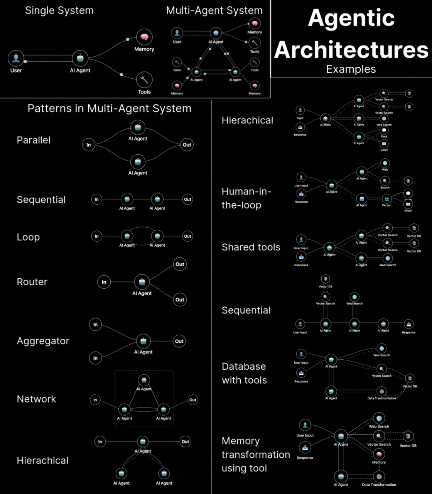

---
tags:
  - ai
  - needs-refinement
gardening: 🌱
date: 2025-04-28
reference:
  - https://www.linkedin.com/posts/leadgenmanthan_agentic-architectures-are-the-hottest-thing-activity-7320670395685072896-fOtA?rcm=ACoAADNFf7YBahmCaq_G2gw7PzlCzMroAleWm50
---
Simply put, Agentic Architectures are a **𝘀𝘁𝗮𝗻𝗱𝗮𝗿𝗱𝗶𝘇𝗲𝗱 𝘄𝗮𝘆 𝗳𝗼𝗿 𝗟𝗟𝗠𝘀 𝘁𝗼 𝗰𝗼𝗹𝗹𝗮𝗯𝗼𝗿𝗮𝘁𝗲** via a **𝘀𝘁𝗿𝘂𝗰𝘁𝘂𝗿𝗲𝗱 𝗽𝗮𝘁𝘁𝗲𝗿𝗻 𝗮𝗽𝗽𝗿𝗼𝗮𝗰𝗵**.

What this means for you:
You can now build a **𝗳𝘂𝗹𝗹𝘆 𝗶𝗻𝘁𝗲𝗴𝗿𝗮𝘁𝗲𝗱 𝗔𝗜 𝘀𝘆𝘀𝘁𝗲𝗺** using multiple agents organized in patterns that fit your specific needs.

Agentic Architectures are organizational frameworks, allowing AI systems to efficiently distribute workloads, share knowledge, and combine specialized capabilities. No more one-size-fits-all approaches!

Let's understand first Single Agent System and Multi-Agent System. Each approach has distinct advantages:

Single-Agent System:
- **𝗦𝗶𝗺𝗽𝗹𝗲𝗿 𝗮𝗿𝗰𝗵𝗶𝘁𝗲𝗰𝘁𝘂𝗿𝗲** with one AI agent connecting directly to tools & memory
- **𝗟𝗼𝘄𝗲𝗿 𝗹𝗮𝘁𝗲𝗻𝗰𝘆** without inter-agent communication overhead
- **𝗘𝗮𝘀𝗶𝗲𝗿 𝗱𝗲𝗽𝗹𝗼𝘆𝗺𝗲𝗻𝘁** with fewer components to integrate
- **𝗜𝗱𝗲𝗮𝗹 𝗳𝗼𝗿** focused, domain-specific tasks with clear boundaries

Multi-Agent System:
- **𝗗𝗶𝘀𝘁𝗿𝗶𝗯𝘂𝘁𝗲𝗱 𝗽𝗿𝗼𝗰𝗲𝘀𝘀𝗶𝗻𝗴** across specialized AI agents
- **𝗦𝗰𝗮𝗹𝗮𝗯𝗹𝗲 𝗮𝗿𝗰𝗵𝗶𝘁𝗲𝗰𝘁𝘂𝗿𝗲** that can grow with complexity
- **𝗣𝗮𝗿𝗮𝗹𝗹𝗲𝗹 𝗲𝘅𝗲𝗰𝘂𝘁𝗶𝗼𝗻** for improved performance on complex tasks
- **𝗜𝗱𝗲𝗮𝗹 𝗳𝗼𝗿** cross-domain problems requiring multiple types of expertise

Multi-agent systems are more implementable as they allow for custom architectures, distributed workloads, tailored precisely to your problem's complexity.

Multi-Agent System Patterns
1. Parallel: Multiple agents process simultaneously for maximum speed and throughput.
2. Sequential: Agents work in sequence, each refining previous outputs for complex tasks.
3. Loop: Circular flow enables iterative improvement until desired quality is reached.
4. Router: One agent directs inputs to specialized paths based on content analysis.
5. Aggregator: Consolidates multiple inputs into comprehensive unified outputs.
6. Network: Interconnected agents share knowledge bidirectionally for complex reasoning.
7. Hierarchical: Manager-worker structure handles complexity through delegated subtasks.

Multi-agent systems win because you can mix-and-match patterns to solve exactly your problem.

Agentic Architecture examples:
1. Hierarchical: Parent-child agent delegation with clear authority flows
2. Human-in-the-loop: AI systems with human oversight at critical points
3. Shared tools: Multiple agents accessing common resources efficiently
4. Sequential: Agents working in chain order, each building on previous outputs
5. Database with tools: Centralized knowledge with specialized access methods
6. Memory transformation using tool: Raw data conversion into structured AI memory

