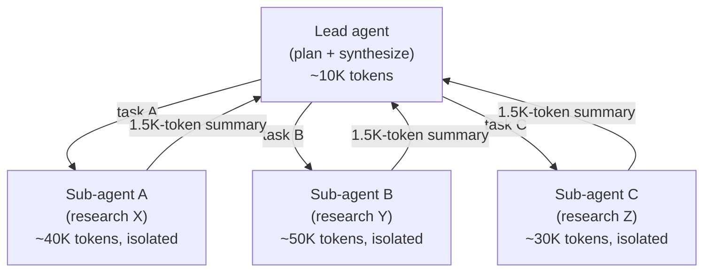

---
tags:
  - ai
  - agents
gardening: 🌱
date: 2026-05-31
reference:
  - https://www.anthropic.com/engineering/effective-context-engineering-for-ai-agents
  - https://www.anthropic.com/research/building-effective-agents
  - https://platform.claude.com/docs/en/agents-and-tools/agent-skills/overview
  - https://www.anthropic.com/engineering/equipping-agents-for-the-real-world-with-agent-skills
  - https://platform.claude.com/docs/en/agents-and-tools/agent-skills/best-practices
  - https://research.trychroma.com/context-rot
  - https://arxiv.org/abs/1706.03762
  - https://lilting.ch/en/articles/stripe-minions-agent-architecture
  - https://medium.com/@janithprabhash/beyond-copilot-how-stripes-autonomous-ai-minions-merge-1-000-prs-a-week-9eb7838c562d
  - https://vorstel.com/feeds/blog/effective-context-engineering-ai-agents
---
## Why this module exists

Before late 2024, most practitioner conversation about getting good results from large language models centered on a single idea: write a better prompt. The craft was called **prompt engineering**, and the artifact was a single string of instructions you tuned until it produced the output you wanted on a single inference call.

That mental model is sufficient when the LLM is a one-shot text transformer. Classify this email. Summarize this paragraph. Translate this sentence. It begins to break the moment you build an **agent**, by which I mean a system that runs in a loop, calls tools, accumulates intermediate state, and operates over many inference calls before finishing a task.

The reason it breaks is structural. A one-shot prompt is a fixed string. An agent's working memory grows turn over turn: tool calls, tool results, retrieved documents, intermediate reasoning, sub-agent summaries, and notes written to memory all pile into the same finite window the model attends to on every step. The question is no longer "what should I write in the prompt?" but rather "what configuration of context is most likely to generate our model's desired behavior?"

That question, answered systematically with engineering rigor across the lifetime of an agent, is the discipline of **context engineering**.

## Foundational definitions

Three rigorous definitions are needed before going further.

**Definition 1, context.** In Anthropic's framing, context refers to the set of tokens included when sampling from a large-language model. That is the precise technical meaning. Less precisely, context is everything the model can "see" at the moment it generates its next response. For a chat model that means the system prompt, the user's current message, the prior turns, any documents pasted in, and (for an agent) the running history of tool calls and their outputs.

**Definition 2, prompt engineering.** The practice of writing and organizing the *instructions* given to an LLM to elicit a desired output. The artifact is typically a system prompt or a single user prompt. The discipline focuses on phrasing, structure, examples (few-shot), and decomposition. It is largely static. You write the prompt once and reuse it across many calls.

**Definition 3, context engineering.** Anthropic defines it as the set of strategies for curating and maintaining the optimal set of tokens (information) during LLM inference, including all the other information that may land there outside of the prompts. The artifact is not a string. It is a system of policies and mechanisms that decide what enters context, what leaves, what gets compressed, what gets retrieved, and when each of those happens.

The framing from Anthropic worth holding onto is this: in contrast to the discrete task of writing a prompt, context engineering is iterative and the curation phase happens each time we decide what to pass to the model. Prompt engineering happens once at design time. Context engineering happens every single turn at runtime.

Prompt engineering is a proper subset of context engineering. You still need to write good system prompts. That work has not gone away. But it is now one of perhaps a dozen surfaces you manage.

## The mechanical justification: why context is a scarce resource

To understand why context engineering had to become a discipline, you have to look at the architecture of the model itself. There are four mechanical reasons context is scarce.

### Fixed context windows

Every LLM has a hard upper limit on the number of tokens it can process per inference call. Claude Sonnet 4.5 and Opus 4.x support context windows in the 200K to 1M token range depending on the variant and deployment. GPT-class models have similar bounds. Beyond that limit, tokens are physically not accepted by the API. This is the obvious constraint.

### The attention budget

Less obvious, and more important, is the attention budget. LLMs are based on the transformer architecture, which enables every token to attend to every other token across the entire context. This results in n² pairwise relationships for n tokens.

Formally, if a sequence has $n$ tokens, the self-attention mechanism computes attention weights $A \in \mathbb{R}^{n \times n}$ where

$$A_{ij} = \mathrm{softmax}\left(\frac{Q_i K_j^\top}{\sqrt{d_k}}\right)$$

for every pair $(i, j)$. The computation is $O(n^2)$ in both time and memory, but the *quality* consequence matters even more than the cost. Every additional token competes with every other token for the same fixed pool of attention mass that $\text{softmax}$ distributes. As its context length increases, a model's ability to capture these pairwise relationships gets stretched thin, creating a natural tension between context size and attention focus.

This is the central insight. The model has an attention budget, a finite amount of "where to look" mass, and that mass gets divided across whatever you put in the window. Add irrelevant tokens and you dilute the model's attention to the relevant ones.

### Training distribution

Models develop their attention patterns from training data distributions where shorter sequences are typically more common than longer ones. This means models have less experience with, and fewer specialized parameters for, context-wide dependencies. Even where a model technically supports a 200K window, its attention behavior was shaped by examples mostly under, say, 8K tokens. The further out on the tail of context length you operate, the further you are from the training distribution.

### Position encoding limits

Transformers don't natively know token order. They learn position via *position encodings*. To support longer windows than the model was originally trained on, vendors apply techniques like position encoding interpolation that allow models to handle longer sequences by adapting them to the originally trained smaller context, though with some degradation in token position understanding.

The composite effect of all four constraints has a name.

### Context rot

Researchers at Chroma documented this empirically. As the number of tokens in the context window grows, the model's recall accuracy on information embedded in that context degrades. The degradation is not a cliff at the window boundary. It is a gradient that begins much earlier. Anthropic summarizes the phenomenon this way: as the number of tokens in the context window increases, the model's ability to accurately recall information from that context decreases. While some models exhibit more gentle degradation than others, this characteristic emerges across all models.

A rough mental picture of the curve:

```
   recall
   ▲
1.0│●●●●●●●●●●●●
   │            ●●●●●●●
   │                   ●●●●●●
   │                         ●●●●●●
   │                               ●●●●●●●
   │                                      ●●●●●●●●
   │                                              ●●●●●●●●●●●●
0.0│
   └──────────────────────────────────────────────────────────▶  tokens in window
                              context rot
```

The shape varies by model and task, but the general property is universal: diminishing returns on adding more context. Context, therefore, must be treated as a finite resource with diminishing marginal returns.

This is the mechanical foundation that makes context engineering a real engineering discipline rather than a stylistic preference. There is a measurable performance penalty for putting the wrong tokens, or too many tokens, in the window.

## The surface area of "context"

When someone new to the field hears "context," they often think only of the system prompt and the user's message. The full surface is much larger. For a working agent, context typically includes all of the following on a given inference call:

```
┌─────────────────────────────────────────────────────┐
│                THE CONTEXT WINDOW                   │
├─────────────────────────────────────────────────────┤
│                                                     │
│  ┌─────────────────────┐  ┌─────────────────────┐   │
│  │   System prompt     │  │   Tool definitions  │   │
│  │  (role, rules,      │  │  (JSON schemas      │   │
│  │   instructions)     │  │   for each tool)    │   │
│  └─────────────────────┘  └─────────────────────┘   │
│                                                     │
│  ┌─────────────────────┐  ┌─────────────────────┐   │
│  │   Few-shot          │  │   Retrieved         │   │
│  │   examples          │  │   documents (RAG)   │   │
│  └─────────────────────┘  └─────────────────────┘   │
│                                                     │
│  ┌─────────────────────┐  ┌─────────────────────┐   │
│  │   Prior user/       │  │   Tool call results │   │
│  │   assistant turns   │  │  (search hits,      │   │
│  │  (message history)  │  │   file contents)    │   │
│  └─────────────────────┘  └─────────────────────┘   │
│                                                     │
│  ┌─────────────────────┐  ┌─────────────────────┐   │
│  │   Sub-agent         │  │   External memory   │   │
│  │   summaries         │  │   (NOTES.md, etc.)  │   │
│  └─────────────────────┘  └─────────────────────┘   │
│                                                     │
│  ┌─────────────────────┐  ┌─────────────────────┐   │
│  │   MCP server        │  │   Current user      │   │
│  │   outputs           │  │   message           │   │
│  └─────────────────────┘  └─────────────────────┘   │
│                                                     │
└─────────────────────────────────────────────────────┘
```

Anthropic enumerates the same surface: we need strategies for managing the entire context state (system instructions, tools, Model Context Protocol (MCP), external data, message history, etc).

Every one of these surfaces is a design decision. Each one is a potential context-engineering lever. A practitioner who only thinks about the system prompt is leaving most of the surface unmanaged.

## The guiding principle

If you reduce the whole discipline to a single sentence, it is this, from Anthropic: good context engineering means finding the smallest possible set of high-signal tokens that maximize the likelihood of some desired outcome.

Stated formally, you are solving an optimization problem of the rough form

$$C^{*} = \arg\min_{C \subseteq U} |C| \quad \text{subject to} \quad \Pr(\text{success} \mid C) \geq \tau$$

where $U$ is the universe of information you *could* include, $C$ is the curated subset you actually include, $|C|$ is token count, and $\tau$ is your desired success threshold. The objective is minimum tokens at sufficient quality, not maximum tokens.

This is the inverse of the naive instinct, which is "if more context might help, include it." The naive instinct is wrong because of context rot. Adding marginal tokens past a point actually *reduces* $\Pr(\text{success} \mid C)$ even when the tokens are individually relevant.

Three corollary principles fall out of this objective. Anthropic and downstream practitioners express them as the **what, when, and why** of context curation:

| | Question | Implication |
|---|---|---|
| **What** | Which tokens go in? | Select by signal, not availability. Relevance times specificity. |
| **When** | At what point in the loop do they enter? | Prefer just-in-time over up-front when feasible. |
| **Why** | What is each token paying for? | Every token has a financial cost and an attention cost. If it isn't earning either, drop it. |

The "why" deserves a closer look. Tokens have two distinct costs. The financial cost is direct: API providers bill per million input tokens, and this scales linearly with $|C|$ across every turn of an agent loop. The cognitive cost is the attention-budget consumption, and that one degrades *output quality*, not just price.

## The patterns

Context engineering as a practice is a library of techniques applied against the surface. The patterns below are drawn from Anthropic's *Effective context engineering for AI agents* (2025) and *Building Effective Agents* (2024), and they are validated by production systems like Stripe's Minions.

### Calibrating the system prompt to the right altitude

A system prompt operates at the wrong altitude in two failure modes. At one extreme, we see engineers hardcoding complex, brittle logic in their prompts to elicit exact agentic behavior. This approach creates fragility and increases maintenance complexity over time. At the other extreme, engineers sometimes provide vague, high-level guidance that fails to give the LLM concrete signals for desired outputs or falsely assumes shared context.

```
                          ┌──────────────────────────┐
   too prescriptive  ─────│   if-else hardcoded      │ ─── brittle, fragile
   (over-engineered)      │   prompts                │
                          └──────────────────────────┘

                          ┌──────────────────────────┐
     right altitude  ─────│  specific enough to      │ ─── reliable, durable
                          │  guide; flexible enough  │
                          │  to leverage model       │
                          └──────────────────────────┘

                          ┌──────────────────────────┐
          too vague  ─────│   overly general,        │ ─── unreliable, inconsistent
                          │   assumes shared context │
                          └──────────────────────────┘
```

The actionable advice: start by testing a minimal prompt with the best model available to see how it performs on your task, and then add clear instructions and examples to improve performance based on failure modes found during initial testing. Iterate up from minimal. Don't start by writing everything and prune down.

Structure prompts with clear sections, using XML tags or Markdown headers, so each kind of information lives in a known place: `<background>`, `<instructions>`, `## Tool guidance`, `## Output format`. This isn't aesthetic; it gives the model consistent landmarks to attend to.

### Curating a minimal tool set

Tool definitions live in context on every single turn. If you wire up 50 tools, the JSON schemas for all 50, including descriptions, parameters, and examples, are paid for every call.

The pattern Anthropic recommends: tools should be self-contained, robust to error, and extremely clear with respect to their intended use. One of the most common failure modes seen is bloated tool sets that cover too much functionality or lead to ambiguous decision points about which tool to use. If a human engineer can't definitively say which tool should be used in a given situation, an AI agent can't be expected to do better.

Stripe Minions is the production exemplar. The clever constraint: Stripe has over 400 internal tools, but giving an AI all 400 causes token paralysis. The orchestrator curates a surgical subset of ~15 relevant tools so the agent starts with rich, highly focused context. The orchestrator's job, before the agent even starts, is tool selection. The agent never sees 400. It sees 15 relevant ones.

### Just-in-time context (vs. pre-inference retrieval)

The traditional RAG pattern is *pre-inference retrieval*: embed the user query, search a vector store, dump the top-k chunks into the prompt, then run inference. This works well for one-shot QA. It is suboptimal for agents.

The agentic alternative is *just-in-time retrieval*. Agents built with the "just in time" approach maintain lightweight identifiers (file paths, stored queries, web links, etc.) and use these references to dynamically load data into context at runtime using tools.

Concretely, instead of putting the entire database table in context, you give the agent a `query_db` tool and let it decide what to pull and when. Instead of putting a whole codebase in context, you give it `glob`, `grep`, `head`, and `tail` and let it explore. Anthropic's agentic coding solution Claude Code uses this approach to perform complex data analysis over large databases. The model can write targeted queries, store results, and leverage Bash commands like head and tail to analyze large volumes of data without ever loading the full data objects into context.

The cognitive metaphor: we generally don't memorize entire corpuses of information, but rather introduce external organization and indexing systems like file systems, inboxes, and bookmarks to retrieve relevant information on demand.

The trade-off is real: runtime exploration is slower than retrieving pre-computed data. Not only that, but opinionated and thoughtful engineering is required to ensure that an LLM has the right tools and heuristics for effectively navigating its information landscape. Without proper guidance, an agent can waste context by misusing tools, chasing dead-ends, or failing to identify key information.

A hybrid is often best. Claude Code uses one: CLAUDE.md files are naively dropped into context up front, while primitives like glob and grep allow it to navigate its environment and retrieve files just-in-time. Cheap, stable, high-signal material goes in up front. Everything else is fetched on demand.

### Compaction

Once an agent runs long enough, its message history alone will fill the window. Compaction is the standard technique for handling this.

Compaction is the practice of taking a conversation nearing the context window limit, summarizing its contents, and reinitiating a new context window with the summary.

```
   Turn 1 ──┐
   Turn 2   │
   Turn 3   ├──► [compactor LLM] ──► "summary of T1-T15"  ──┐
   ...      │                                               │
   Turn 15 ─┘                                               ▼
                                                  ┌──────────────────┐
                                                  │  New context:    │
                                                  │  - summary       │
                                                  │  - last 5 files  │
                                                  │  - Turn 16 ►     │
                                                  └──────────────────┘
```

The implementation pattern from Claude Code: they implement this by passing the message history to the model to summarize and compress the most critical details. The model preserves architectural decisions, unresolved bugs, and implementation details while discarding redundant tool outputs or messages. The agent can then continue with this compressed context plus the five most recently accessed files.

The risk: the art of compaction lies in the selection of what to keep versus what to discard, as overly aggressive compaction can result in the loss of subtle but critical context whose importance only becomes apparent later. The recommended discipline is to tune the compactor prompt on real agent traces. First maximize recall, so you don't lose anything important. Then iterate to improve precision, so you don't keep junk.

A lighter form of compaction is **tool result clearing**. Once a tool has run, the raw verbose output (a 50KB log, a binary search result) can be replaced with a short reference in older turns while keeping recent results full-fidelity. Anthropic ships this as a primitive on the Claude Developer Platform.

### Structured note-taking (external memory)

If compaction is destructive compression of past context, note-taking is additive persistence to an external store.

Structured note-taking, or agentic memory, is a technique where the agent regularly writes notes persisted to memory outside of the context window. These notes get pulled back into the context window at later times.

The pattern is dead simple. Give the agent a tool to write a file (NOTES.md, TODO.md, or a memory store), and instruct it to log decisions, progress, and findings as it works. When context fills or a session resets, the agent can re-read its own notes.

A canonical example: Claude playing Pokémon demonstrates how memory transforms agent capabilities in non-coding domains. The agent maintains precise tallies across thousands of game steps. Without any prompting about memory structure, it develops maps of explored regions, remembers which key achievements it has unlocked, and maintains strategic notes. After context resets, the agent reads its own notes and continues multi-hour training sequences.

Mechanically:

```
   ┌──── context window ─────┐
   │                         │
   │   ...working memory...  │       writes       ┌─────────────┐
   │                         │ ─────────────────► │  NOTES.md   │
   │   write_note(...)       │                    │  TODO.md    │
   │                         │ ◄───────────────── │  memory/    │
   │   read_note(...)        │       reads        └─────────────┘
   │                         │
   └─────────────────────────┘                   (lives outside context)
```

The agent's working memory stays small. Its durable memory lives on the filesystem and is paged in selectively. This is the same architecture as a human writing notes during a long research project. You don't try to hold everything in your head.

### Sub-agent architectures

When a task naturally decomposes into independent sub-problems, you can give each sub-problem its own clean context window by spawning a sub-agent.

Sub-agent architectures provide another way around context limitations. Rather than one agent attempting to maintain state across an entire project, specialized sub-agents can handle focused tasks with clean context windows. The main agent coordinates with a high-level plan while subagents perform deep technical work or use tools to find relevant information. Each subagent might explore extensively, using tens of thousands of tokens or more, but returns only a condensed, distilled summary of its work (often 1,000-2,000 tokens).

The architecture:



The lead agent never sees the 120K tokens of raw exploration the three sub-agents performed. It sees three short summaries. This approach achieves a clear separation of concerns—the detailed search context remains isolated within sub-agents, while the lead agent focuses on synthesizing and analyzing the results. Anthropic reports substantial improvements on complex research tasks using this pattern.

### Progressive disclosure (the Skills model)

Skills are Anthropic's mechanism for packaging procedural knowledge for an agent. The mechanism is itself a context-engineering pattern called **progressive disclosure**.

Skills can contain three types of content, each loaded at different times. The three levels:

Metadata loading (~100 tokens): Claude scans available Skills to identify relevant matches. Full instructions (<5k tokens): Load when Claude determines the Skill applies. Bundled resources: Files and executable code load only as needed.

```
   Level 1: YAML frontmatter (name + description)     ~100 tokens
            ALWAYS in context. Just enough for Claude to know the skill exists.
                                  │
                                  │  triggered when relevant
                                  ▼
   Level 2: SKILL.md body                              < 5,000 tokens
            Loaded when Claude decides the skill applies to current task.
                                  │
                                  │  navigated as needed
                                  ▼
   Level 3: references/, scripts/, assets/             unbounded
            Loaded file-by-file when SKILL.md instructs Claude to consult them.
```

This is context engineering as architecture. Agents with a filesystem and code execution tools don't need to read the entirety of a skill into their context window when working on a particular task. This means that the amount of context that can be bundled into a skill is effectively unbounded.

You can ship 40 skills with rich resources and pay only about 4,000 tokens of metadata to keep all 40 discoverable. Only the relevant one expands.

## Case study: Stripe's Minions

Stripe's Minions system is a production demonstration of context engineering at industrial scale. Two facts about the codebase make naive approaches impossible: their codebase consists of hundreds of millions of lines of code, primarily written in Ruby with Sorbet typing — an uncommon stack full of homegrown libraries that public LLMs have never seen in their training data.

The engineering decisions, mapped to the patterns in §6:

| Decision                                                                                                                                                                                                              | Pattern                                                                        |
| --------------------------------------------------------------------------------------------------------------------------------------------------------------------------------------------------------------------- | ------------------------------------------------------------------------------ |
| The orchestrator curates a surgical subset of ~15 relevant tools so the agent starts with rich, highly focused context                                                                                                | minimal tool set                                                               |
| Toolshed's MCP tool calls fetch context dynamically—internal documentation, ticket details, build statuses, code intelligence via search                                                                              | just-in-time                                                                   |
| Blueprints, developed by Stripe as Minions' core technology, fuses the two primitives defined in Anthropic's Building Effective Agents: workflows and agents, with deterministic nodes interleaved with agentic nodes | constraining altitude with deterministic gates instead of brittle prompt rules |
| Each Minion runs in an isolated VM                                                                                                                                                                                    | sub-agent contexts, isolated state                                             |
| Hard cap at two CI rounds before falling back to a human                                                                                                                                                              | bounded loops, fail-loud                                                       |

Notice that Stripe's solution to "the agent needs context about our codebase" was not "give it the codebase." It was *build the orchestration system that decides what slice the agent sees for each task*. That orchestrator is the context engineer.

## Why "discipline" is the right word

Several features of context engineering distinguish it from prompt engineering and qualify it as a discipline:

1. **It is iterative, not one-shot.** A prompt is written once. A context strategy runs every turn and must be evaluated on traces, not on single examples. In contrast to the discrete task of writing a prompt, context engineering is iterative and the curation phase happens each time we decide what to pass to the model.

2. **It has measurable failure modes.** Context rot is empirically observed, not stylistic. You can measure recall degradation against context length on your own tasks. You can A/B test compaction prompts. You can profile token usage per tool. The discipline is amenable to engineering rigor.

3. **It has a quantitative objective.** Minimum tokens at target quality. This is an optimization problem, not a matter of taste.

4. **It spans the system, not the prompt.** A context engineer makes decisions about tool design, retrieval architecture, memory layout, sub-agent topology, and compaction policy. The system prompt is one of perhaps ten artifacts. It is not *the* artifact.

5. **It has its own anti-patterns.** Bloated tool sets. Over-aggressive compaction. Pre-loading "just in case." Echoing tool results back to the agent that already saw them. Each anti-pattern is named, recognizable, and avoidable.

6. **It is the design surface that determines agent reliability.** Practitioners building production agents consistently report that the difference between an unreliable agent and a reliable one is rarely model choice. It is context management. As the field has put it bluntly: most failures in production AI agents aren't model failures. They are context failures.

## Mental model to leave with

When you build an agent, hold this picture in your head:

```
                    ┌─────────────────────────────────────────┐
                    │                                         │
                    │              THE MODEL                  │
                    │                                         │
                    │   has finite attention                  │
                    │   degrades on long, noisy inputs        │
                    │   billed per input token                │
                    │                                         │
                    └────────────────────▲────────────────────┘
                                         │
                                         │  context window (each turn)
                                         │
              ┌──────────────────────────┴──────────────────────────┐
              │                                                     │
              │            CONTEXT ENGINEERING SURFACE              │
              │                                                     │
              │   ┌─────────────┐  ┌─────────────┐  ┌─────────────┐ │
              │   │   what      │  │   when      │  │   why       │ │
              │   │ goes in?    │  │ does it     │  │ is each     │ │
              │   │ (select by  │  │ enter?      │  │ token paid  │ │
              │   │  signal)    │  │ (just-in-   │  │  for?       │ │
              │   │             │  │  time pref.)│  │ (attention  │ │
              │   │             │  │             │  │  + dollars) │ │
              │   └─────────────┘  └─────────────┘  └─────────────┘ │
              │                                                     │
              │   Patterns: altitude calibration, minimal tools,    │
              │   JIT retrieval, compaction, external memory,       │
              │   sub-agents, progressive disclosure                │
              │                                                     │
              └─────────────────────────────────────────────────────┘
                                         ▲
                                         │
              ┌──────────────────────────┴──────────────────────────┐
              │                                                     │
              │                 THE UNIVERSE                        │
              │                                                     │
              │   codebases, docs, tools, APIs, message logs,       │
              │   prior turns, MCP servers, external memory,        │
              │   sub-agent results, retrieved chunks, ...          │
              │                                                     │
              └─────────────────────────────────────────────────────┘
```

The discipline sits *between* an effectively unbounded universe of available information and a model with a tightly bounded attention budget. Its job, on every turn, is to choose. Prompt engineering writes the choosing rules at design time. Context engineering executes the choosing at run time, every turn, forever, and it treats that execution as a first-class engineering surface to be measured, optimized, and improved.

That is what it means to call context engineering a discipline. And that is why, as agents become the dominant mode of LLM deployment, context engineering, not prompt engineering, is the surface where most of the work, and most of the value, now lives.
