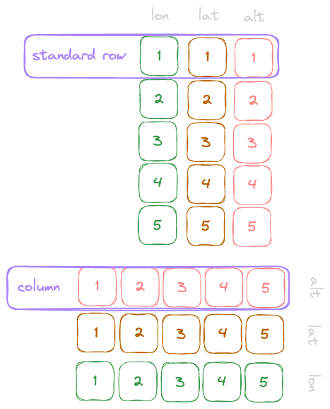

---
tags:
  - arrow
  - notes
---

```js
[
  { lon: 1, lat: 0, alt: 10 },
  { lon: 2, lat: 9, alt: 11 },
  { lon: 3, lat: 8, alt: 12 },
  { lon: 4, lat: 7, alt: 13 },
  { lon: 5, lat: 6, alt: 14 },
]

// A standard row format you give you something like
const rowOne = { lon: 1, lat: 0, alt: 10 };

// Whereas a columnar would be something like
const lonColumn = [1, 2, 3, 4, 5];
const latColumn = [0, 9, 8, 7, 6];
```



---