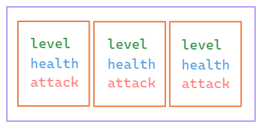
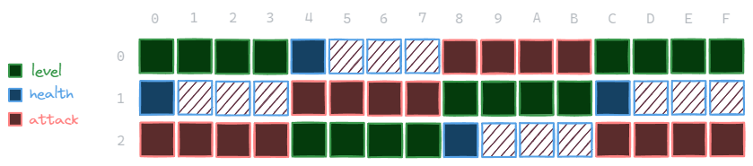
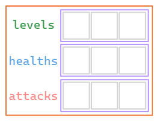
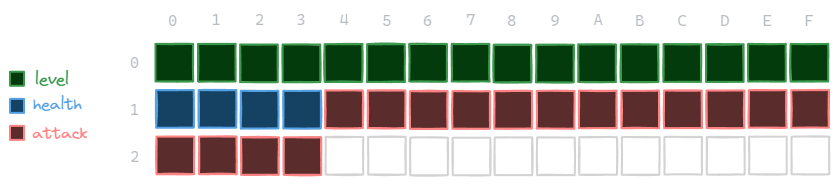

---
tags:
  - comp-sci
  - cpu
  - memory
gardening: 🌳
date: 2025-02-22
reference:
  - https://en.algorithmica.org/hpc/cpu-cache/aos-soa/
  - https://en.wikipedia.org/wiki/AoS_and_SoA
  - https://www.geeksforgeeks.org/c-array-of-structure/
  - https://www.tutorialspoint.com/cprogramming/c_arrays_of_structures.htm
  - https://www.theprofessionalprogrammer.com/2018/04/arrays-of-structures-or-structures-of.html
---
## Array of Structures (AoS)

In the Array of Structures (AoS) approach, each element of the array is a structure that contains all the data fields associated with a single entity. This method is particularly intuitive, as it models real-world objects as a single unit of data, which makes the code easier to read and maintain.

```c
typedef struct {
  int32_t level;
  int8_t health;
  int32_t attack;
} Monster;
```

When you create an array of `Monster` structures, each element in the array represents one entity, with all its associated data bundled together.



With AoS, memory for each structure is allocated consecutively. This means that each structure is stored as a contiguous block in memory. When you declare an array of `Monster`, the compiler allocates one contiguous block of memory for the entire array.



- The first element starts at `0x00` and extends to `0x0B`.
- The next element ranges from `0x0C` to `0x17`.
- This pattern continues for subsequent elements.

By bundling each object’s fields together, the Array of Structures maintains an intuitive grouping. This is especially helpful when considering an object as a whole. Accessing all the properties of a single object becomes straightforward, and making changes to one object (such as copying or modifying it) is easier since all the data is contained within one structure.

However, there are downsides to this approach. If you need to operate on a specific field for multiple objects—like updating all `health` values—the data for that field is mixed with other fields. This can lead to poor cache performance. Modern processors utilize SIMD (Single Instruction, Multiple Data) instructions that work best with contiguous arrays of the same type, making AoS less efficient when you only need to access a single field.

## Structure of Arrays

In a Structure of Arrays (SoA), instead of grouping all related fields of an entity into a single structure (as in an Array of Structures, AoS), each field is stored in its own dedicated array.

```c
typedef struct {
  int32_t levels [3];
  int8_t healths [3];
  int32_t attacks [3];
} monsters_t;
```

This means that for monster `i`, its level is at `levels[i]`, its health at `healths[i]`, and its attack at `attacks[i]`.



This means that each attribute of your data has a contiguous block of memory allocated for it, holding that attribute for all entities.




This approach enhances data locality for specific fields. When you need to process or update a single field across many entities—such as updating all positions or applying a physics update to velocities—the memory accesses are sequential. This contiguous access pattern takes advantage of cache lines, resulting in fewer cache misses and better overall performance. Modern CPUs support Single Instruction, Multiple Data (SIMD) instructions, which work best when data is laid out contiguously. For example, updating positions by adding velocities can be vectorized, allowing multiple elements to be processed in a single operation. With SoA, you can perform operations on one attribute without needing to load the entire object into the cache. This can save memory bandwidth when only a subset of the data is required. Additionally, when using parallel processing (such as with threads or GPU computing), having data in separate arrays allows for easier partitioning of tasks, as each thread or compute unit can work on its own chunk of the array.

However, there are trade-offs to consider when implementing this approach. The programmer must ensure that the arrays remain synchronized. For instance, if you remove or insert a particle, you need to update all arrays consistently. Any mistakes in this process can lead to data inconsistency. The SoA pattern can also be less intuitive because it breaks the natural “object” concept into separate arrays, which may make the code harder to understand, especially for those accustomed to an object-oriented view. Furthermore, manipulating the "object" as a whole can require additional code to coordinate updates across multiple arrays.

## Choosing Between the Two

**Array of Structures (AoS)** is an excellent choice when you frequently work with complete objects and prefer natural, bundled data. It enhances readability and maintainability, especially when the entire object is needed at once. If your application logic focuses on complete objects—such as managing entities in a simulation or representing items in a collection—AoS is a suitable option. 

For projects where maintainability and readability are crucial, and performance isn't critically dependent on processing individual attributes in isolation, AoS provides a straightforward and easy-to-understand data layout. Additionally, when the dataset is small to moderate, the performance differences between AoS and Structure of Arrays (SoA) are often minimal, making the simplicity of AoS more appealing than the potential performance advantages of SoA.

**Structure of Arrays (SoA)** is particularly advantageous when performing operations on a specific field across multiple objects, such as in numerical computations, simulations, or vectorized code. Its superior cache utilization and compatibility with SIMD (Single Instruction, Multiple Data) make it ideal for scenarios like particle physics and fluid dynamics simulations, as well as graphics programming in game engines, where data-parallel operations are common. SoA is especially beneficial when processing large datasets that require repeated access to only certain fields. If your goal is to leverage vectorized instructions fully, the contiguous layout of SoA can lead to significant performance improvements.