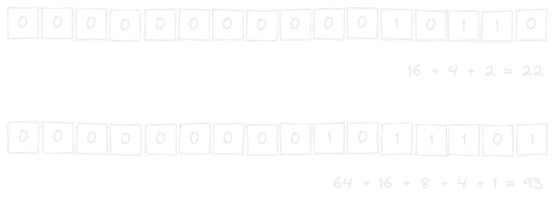
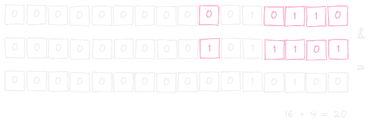
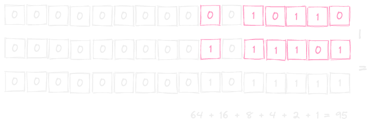
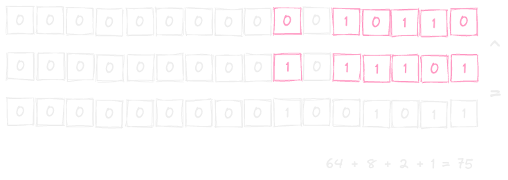
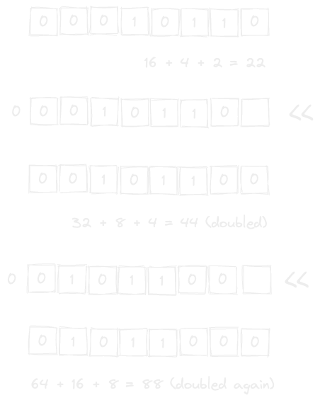
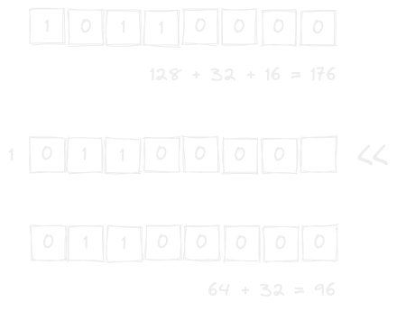
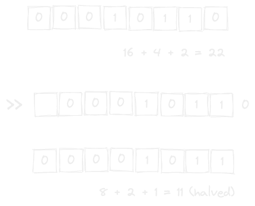
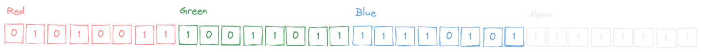

---
tags:
  - bitwise
gardening: 🌿
---
## bitwise AND (`&`)

For each bit, if both are `1`, the resulting bit is `1`. If either or both are `0`, the resulting bit is `0`. i.e. it does a logical AND on each bit individually.

Given the following two values:



Performing the bitwise AND would visually look like:



```
22 & 93 === 20
```

AND (&) can be used to check even/odd. Since the only odd bit is the right most bit, which is one.  AND against `1` will give `1` or `0`.

```ts
const isEven = (n: number) => (n & 1) === 0;
```

Another use is for checking bit masks. Say you had a user config of (yes | no) states.


```js
const userOptions = 0b0000;
```
Then you can check options based on a bit mask.

```js
const SHOULD_SHOW_B = 0b0100;

const hasFlag = (flags, mask) => !!(flags & mask);

const userConfig = 0b0101;

console.log(hasFlag(userConfig, SHOULD_SHOW_B));
// --> true
```

## bitwise OR (`|`)

For each bit, if either or both are `1`, the resulting bit is `1`. If both are `0`, the resulting bit is `0`. i.e. it does a logical OR on each bit individually.

Given the following two values:


Performing the bitwise OR would visually look like:



```
22 | 93 === 95
```

Using the user options example above, the OR operator can be used to turn options ON.

```js
const SHOULD_SHOW_B = 0b0100;

const hasFlag = (flags, mask) => !!(flags & mask);
const turnOnFlag = (flags, mask) => flags | mask;

let userConfig = 0b0001;

console.log(hasFlag(userConfig, SHOULD_SHOW_B));
// --> false

userConfig = turnOnFlag(userConfig, SHOULD_SHOW_B);

console.log(hasFlag(userConfig, SHOULD_SHOW_B));
// --> true
```

## Using AND (`&`) and OR (`|`) together

Using them both together with the config example from before. We can toggle the user configs

```js
const SHOULD_SHOW_A = 0b1000;

const hasFlag = (flags, mask) => !!(flags & mask);
const turnOnFlag = (flags, mask) => flags | mask;
const turnOffFlag = (flags, mask) => flags & ~mask; // bitwise NOT (~) on mask to inverse

const toggleOption = (flags, mask) =>
  hasFlag(flags, mask) ? turnOffFlag(flags, mask) : turnOnFlag(flags, mask);

let userConfig = 0b0101;

console.log(hasFlag(userConfig, SHOULD_SHOW_A));
// --> false

userConfig = toggleOption(userConfig, SHOULD_SHOW_A);

console.log(hasFlag(userConfig, SHOULD_SHOW_A));
// --> true

userConfig = toggleOption(userConfig, SHOULD_SHOW_A);

console.log(hasFlag(userConfig, SHOULD_SHOW_A));
// --> false
```

Or say that we want to do a broad check to see if **any** of the options are set so we can skip processing if none is needed. We can combine both the AND and OR operators into the check.

```js
const SHOULD_SHOW_A = 0b1000;
const SHOULD_SHOW_B = 0b0100;
const SHOULD_SHOW_C = 0b0010;
const SHOULD_SHOW_D = 0b0001;

const hasAnyFlag = (flags) => !!(flags & (SHOULD_SHOW_A | SHOULD_SHOW_B | SHOULD_SHOW_C | SHOULD_SHOW_D));
// SHOULD_SHOW_A | SHOULD_SHOW_B | SHOULD_SHOW_C | SHOULD_SHOW_D === 0b1111

const userAConfig = 0b0101;
const userBConfig = 0b0000;

console.log(hasAnyFlag(userAConfig));
// --> true

console.log(hasAnyFlag(userBConfig));
// --> false
```

## bitwise XOR (`^`) [Exclusive OR]

The exclusive OR is slightly different to the OR in that only one of the two bits can be `1` for it to equal `1`. All other cases are equal to `0`.

Given the following two values:


Performing the bitwise XOR would visually look like:



```
22 ^ 93 === 75
```

While the above toggling example works, that's more than should be needed to make a bit go from `1` to `0` and vice versa. As luck would have it, and you probably guessed, the XOR can do that for us.

```js
const SHOULD_SHOW_A = 0b1000;

const hasFlag = (flags, mask) => !!(flags & mask);

const toggleOption = (flags, mask) => flags ^ mask;

let userConfig = 0b0101;

console.log(hasFlag(userConfig, SHOULD_SHOW_A));
// --> false

userConfig = toggleOption(userConfig, SHOULD_SHOW_A);

console.log(hasFlag(userConfig, SHOULD_SHOW_A));
// --> true

userConfig = toggleOption(userConfig, SHOULD_SHOW_A);

console.log(hasFlag(userConfig, SHOULD_SHOW_A));
// --> false
```

## Logical Shifting (`<<`, `>>`)

When shifting, as the name would suggest, each bit is shifting, left or right, one place. And a `0` is added to the left or right respectively. As a result, the left-most or right-most bit is lost.



We are now effectly multiplying by 2 each time. But what happens when we lose the most significant digit?



Shifting to the right works the same but in the opposite direction.



Since it only operates on whole numbers, the result of a shift right on an odd number is "rounded" down.

## Using Logical Shift to (Un)Pack RGBA Codes

A RGBA code is actually four 8-bit integers "packed" together.



```
83, 155, 245, 255
```
```js
const rgbaCode = 0b01010011100110111111010111111111;
```

To "unpack" them, we can use a combination of right shift and an AND bit mask. The mask will take the first 8 bits.


```js
const VALUE_MASK = 0b00000000000000000000000011111111;
```

In order to get the Alpha, we just need to AND the value against the code mask.

```js
const VALUE_MASK = 0b00000000000000000000000011111111;
const rgbaCode = 0b01010011100110111111010111111111;

const alpha = rgbaCode & VALUE_MASK;
// 0b00000000000000000000000011111111
```

And then to get the rest we just need to shift the original code over 8, 16, 24 (respectively) and then AND them against the mask.


```js
const blueBits = rgbaCode >> 8;
```

And so on and so forth.

```js
const VALUE_MASK = 0b00000000000000000000000011111111;
const rgbaCode = 0b01010011100110111111010111111111; // 1402729983

const alpha = rgbaCode & VALUE_MASK;
// 0b00000000000000000000000011111111 -> 255

const blue = (rgbaCode >> 8) & VALUE_MASK;
// 0b00000000000000000000000011110101 -> 245

const green = (rgbaCode >> 16) & VALUE_MASK;
// 0b00000000000000000000000010011011 -> 155

const red = rgbaCode >> 24;
// Since were shifting all the way over, we dont need to mask
// 0b00000000000000000000000001010011 -> 83

console.log([red, green, blue, alpha].join(', '));
// 83, 155, 245, 255
```

And to pack them back up we simply need to shift each one the appropriate number to the left.

```js
const red = 83;
const green = 155;
const blue = 245;
const alpha = 255;

const packedColor = (red << 24) + (green << 16) + (blue << 8) + alpha;

console.log(packedColor.toString(2));
// 0b01010011100110111111010111111111
// Technically its "1010011100110111111010111111111", JS trims the zeros from the left
```

## bitwise Not (`~`)

The bitwise NOT operator is a "two's compliment" operation. Going into that is a little out of scope for this gist but you can read more about it [here](https://en.wikipedia.org/wiki/Two's_complement), [here](https://www.rit.edu/academicsuccesscenter/sites/rit.edu.academicsuccesscenter/files/documents/math-handouts/DM3_TwosComplement_BP_9_22_14.pdf) and [here](https://mathcenter.oxford.emory.edu/site/cs170/twosComplement/). That being said, the quick and dirty way to think about is that if the operand is positive: 
> Add one and then flip the sign

`~0 -> -(0 + 1) -> -1`

```js
~0
// >> -1
```

`~342 -> -(342 + 1) -> -343`

```js
~342
// >> -343
```

And if the operand is negative:
> Flip the sign and then subtract one

`~(-1) -> -(-1) - 1 -> 0`

```js
~(-1)
// >> 0
```

```js
~(-743)
// >> 742
```

A fairly common use case is using it to determine if an array index was found.

```js
const idx = [].findIndex(x => <condition>)

if(~idx) {
  // ...
}
```

Since, given the "quick and dirty" above, only `-1` will result in `0`<sup>(*)</sup> and thus be falsey. The condition will execute only when an index is found. As opposed to the slightly more verbose `if(idx > -1)`.

**[\*]**: Ok, that is kind of a lie. Due to the way the number system works `~Number.MAX_SAFE_INTEGER` will also evaluate to `0`. Though I would like to think that the chances of an array with `9007199254740991` elements is low, it's still worth noting.


Check and add some of the stuff from:
- https://cp-algorithms.com/algebra/bit-manipulation.html
- https://sudorudo.medium.com/bitwise-for-dummies-c1b996c21cbc
- https://www.geeksforgeeks.org/introduction-to-bitwise-algorithms-data-structures-and-algorithms-tutorial/
- https://www.alexhyett.com/bitwise-operators/
