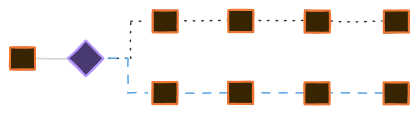
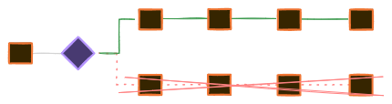

---
tags:
  - cpu
  - comp-sci
gardening: 🌳
date: 2025-01-05
reference:
  - https://en.wikipedia.org/wiki/Branch_predictor
  - https://en.wikipedia.org/wiki/Predication_(computer_architecture)
  - https://blog.cloudflare.com/branch-predictor/
  - https://en.algorithmica.org/hpc/pipelining/branching/
  - https://stackoverflow.com/questions/11227809/why-is-processing-a-sorted-array-faster-than-processing-an-unsorted-array#answer-11227902
---
Modern CPUs utilize pipelines to execute multiple instructions at the same time. However, branch instructions, such as conditional jumps, create uncertainty because the CPU cannot immediately determine which path the program will take.

```c
if (x > 0) {
  doSomething();
} else {
   doSomethingElse();
}
```

For example, the CPU cannot decide whether to execute `doSomething()` or `doSomethingElse()` until it evaluates the expression `x > 0`.

Without branch prediction, the CPU would need to wait for the result of `x > 0`, leading to a stall in the pipeline. Branch prediction helps maintain a full pipeline by guessing the most likely outcome of the branch instruction.

Modern CPUs utilize hardware-based **branch predictors** that monitor the history of branch instructions.

- **Branch History Table (BHT):** This is a table within the CPU that records the outcomes of recent branches. Each entry in the table corresponds to a specific branch instruction and indicates whether it was taken or not.
- **Two-Bit Predictor:** This is a common technique where two bits are assigned to each branch to track the pattern of taken and not-taken outcomes. This method helps reduce mis-predictions for branches that exhibit consistent behavior.

Once the CPU predicts the outcome of a branch, it begins to execute instructions along the predicted path **speculatively**. If the prediction turns out to be correct, the results are retained. However, if the prediction is incorrect, the speculative results are discarded, and the pipeline is flushed, resulting in a penalty known as a "branch mis-prediction penalty."

**Speculative**



**Correct Prediction**


**Mis-prediction**



### Branchless Programming

Branchless programming is a technique used to eliminate conditional branches (e.g., `if`, `else`, `switch`) in performance-critical code. It replaces these branches with mathematical operations, bitwise operations, or lookups to avoid branch mis-prediction penalties and enhance CPU pipeline efficiency.

```c
// branched
int min(int a, int b) {
  return (a < b) ? a : b;
}

// branchless arithmetic
int min(int a, int b) {
  return a * (a < b) 
       + b * (b <= a);
}

// branched
int is_even(int x) {
  return (x % 2 == 0) ? 1 : 0;
}

// branchless bitwise
int is_even(int x) {
  return !(x & 1);
}
```
