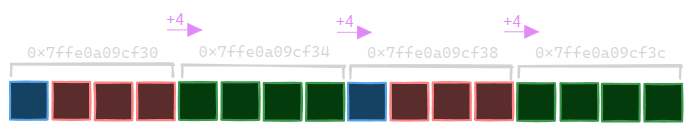
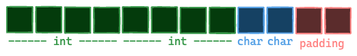
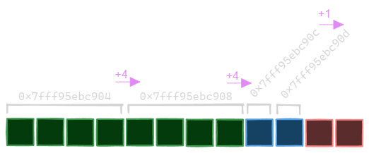
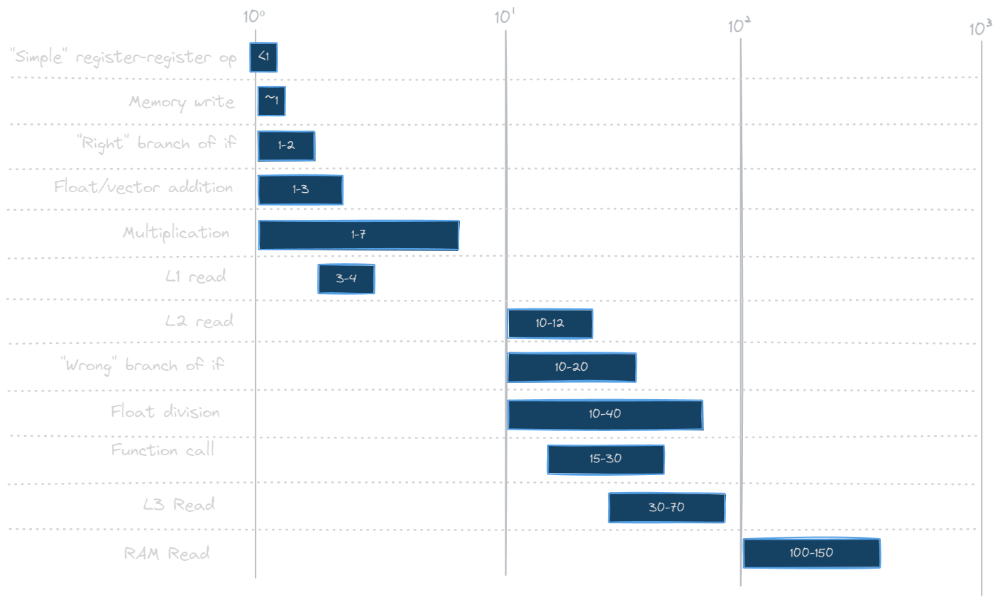

---
tags:
  - cpu
  - comp-sci
gardening: 🌳
date: 2025-01-05
reference:
  - https://en.wikipedia.org/wiki/CPU_cache
  - https://en.wikipedia.org/wiki/Locality_of_reference
  - https://gameprogrammingpatterns.com/data-locality.html
  - https://www.nic.uoregon.edu/~khuck/ts/acumem-report/manual_html/ch05s01.html
  - https://en.algorithmica.org/hpc/cpu-cache/cache-lines/
---
A CPU cache is a small, high-speed memory that is located inside or near the CPU. It stores copies of data from frequently accessed locations in the main memory (RAM), which helps reduce the time the CPU spends waiting for data to be retrieved from the slower main memory.

## Cache Hierarchy

1. **CPU Registers**: (168 registers) - immediate access, with the speed of the innermost core of the processor.
2. **L1 Cache:** (640 KB) - fast access, with the speed of the innermost memory bus owned exclusively by each core.
3. **L2 Cache:** (8 MB) - slightly slower access, with the speed of the memory bus shared between twins of cores.
4. **L3 Cache:** (32 MB) - even slower access, with the speed of the memory bus shared between even more cores of the same processor.
5. **Physical Memory (RAM):** (> 1GB) - slow access, the speed of which is limited by the spatial distances and general hardware interfaces between the processor and the memory modules on the motherboard.
6. **Disk (Virtual Memory):** - very slow, due to the narrower (in bit width), physically much longer data channel between the main board of the computer and the disk devices, and due to the extraneous software protocol needed on the top of the slow hardware interface.

_Values given are for an AMD Ryzen 7 7900X. Values will vary based on CPU._

## How Does a Cache Work?

- **Cache Hit:** A cache hit occurs when the CPU requests data that is already stored in the cache. In this case, the CPU can quickly retrieve the data, which is much faster than obtaining it from main memory.
- **Cache Miss:** A cache miss happens when the requested data is not found in the cache. In this situation, the CPU must fetch the data from the slower main memory. Once the data is retrieved, it may be stored in the cache for future access.

This caching mechanism speeds up data processing by reducing the time the CPU spends waiting for data retrieval. Modern systems often read blocks of lower memory into the next level of the memory hierarchy. If this process displaces currently used memory, the operating system attempts to predict which data will be accessed the least and moves it down the memory hierarchy.


_Simplified example_

## Types of Cache Misses

1. **Cold Miss (Compulsory Miss)**: This type of miss occurs when data is accessed for the first time and is not yet present in the cache.
2. **Conflict Miss**: This happens when multiple data items are mapped to the same cache line, resulting in one item being evicted to make room for another. 
3. **Capacity Miss**: This occurs when the cache cannot hold all the data required by the program, leading to the eviction of older data. 
4. **Coherence Miss**: This is relevant in multi-core processors, where it is necessary to maintain data consistency across different caches.

## Cache Line

Data is transferred between memory and cache in blocks of fixed size, called _cache lines_ or _cache blocks_. A cache line is a small, fixed-size block of memory utilized by a CPU cache to store data. When data is retrieved from main memory, it is stored in these cache lines. The size of cache lines typically ranges from 32 to 128 bytes, depending on the architecture. The entire cache line represents the smallest unit of memory that the cache can manage.

When a cache line is copied from memory into the cache, a cache entry is created. This entry includes the copied data (Data Block), the requested memory location (Tag) as well as additional meta data. When the processor needs to read from or write to a memory location, it first checks the cache for a corresponding entry. The cache searches for the contents of the requested memory location within any cache lines that may contain that address.


If the processor finds the memory location in the cache, this is called a cache hit. In this case, the processor can immediately read from or write to the data within the cache line. However, if the memory location is not found in the cache, this is referred to as a cache miss. In the event of a cache miss, the cache allocates a new entry, copies the required data from the main memory, and then fulfills the request using the data now stored in the cache.

The CPU cache operates on the principle of [spatial locality](Locality%20of%20Reference%20and%20Memory%20Locality.md), which means that when a program accesses a memory location, it is likely to access nearby memory locations shortly thereafter. To enhance performance, the CPU retrieves an entire block of adjacent memory (the cache line), rather than just the requested byte. This strategy helps prepare for future memory requests, improving overall efficiency.

For example, if a cache line is 64 bytes, and the CPU requests data at address `0x000`, the cache might fetch the block from `0x000` to `0x03F`.

## Key Performance Metrics

1. **Hit Rate**: Percentage of memory requests served by the cache.
2. **Miss Rate**: Percentage of memory requests not served by the cache.
3. **Latency**: The time taken to fetch data from the cache compared to main memory (CPU stall).

## Eviction Policies

When a cache reaches its full capacity, it must determine which data to remove in order to free up space. The following are common eviction policies:
1. **Least Recently Used (LRU)**: This policy evicts the data that has not been accessed for the longest time.
2. **First In, First Out (FIFO)**: This approach removes the oldest data in the cache first.
3. **Random Replacement**: With this method, a cache line is chosen at random to be evicted, regardless of how long it has been stored.

## Alignment

Alignment refers to the positioning of data in memory relative to the CPU’s word size and cache line boundaries. Proper alignment ensures that data fits neatly within these boundaries, preventing inefficiencies. A piece of data is considered aligned if its memory address is a multiple of its size; for example, a 4-byte integer is aligned if its memory address is divisible by 4 (e.g., `0x1004`, `0x1008`).

The word size of a CPU is the natural unit of data that it processes (e.g., 32-bit or 64-bit). Alignment typically requires data to be positioned at word-size boundaries to meet the CPU’s requirements. To maintain this alignment, compilers may insert padding between struct members or after the end of a struct, ensuring that each member meets its alignment requirement.

Different data types have varying alignment requirements:

- **1-byte types** (e.g., `char`): No alignment needed.
- **2-byte types** (e.g., `short`): Must be aligned to 2-byte boundaries.
- **4-byte types** (e.g., `int`, `float`): Must be aligned to 4-byte boundaries.
- **8-byte types** (e.g., `double`, `long long`): Must be aligned to 8-byte boundaries.

**Bad Alignment**

```c
struct Student {
  char f_initial;
  int score;
  char l_initial;
  int semester;
};

printf("size of Student: %zu\n", sizeof(Student));
// size of Student: 16
```


If we examine the memory addresses for each field, it becomes clearer.



**Good Alignment**

```c
struct OptStudent {
  int semester;
  int score;
  char f_initial;
  char l_initial;
};

printf("size of OptStudent: %zu\n", sizeof(OptStudent));
// size of OptStudent: 12
```


The size for the good alignment.



A developer can manually add padding to ensure proper alignment, a practice often used in a concept called "Data-oriented Design." However, when adding padding manually, it's important to avoid over-aligning the data. For instance, aligning a 1-byte variable to a 64-byte boundary results in 63 bytes of unused space.

```c
struct PaddedStruct {
  int a;       // 4 bytes
  char pad[4]; // 4 bytes of padding
  double b;    // 8 bytes
};
```

## For Fun: Speed Chart



_Full chart: http://ithare.com/infographics-operation-costs-in-cpu-clock-cycles/#rabbitref-Wikipedia.BranchPredictor_
