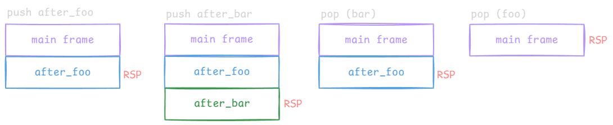
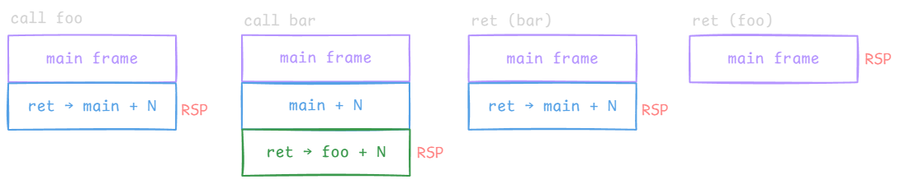
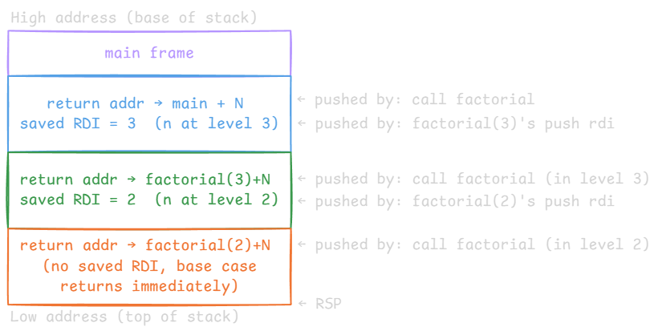

---
tags:
  - cpu
gardening: 🌳
date: 2026-02-21
reference:
  - https://www.youtube.com/watch?v=7YyALikxAlU
  - https://en.wikipedia.org/wiki/Calling_convention
  - https://en.wikipedia.org/wiki/Inline_expansion
  - https://en.algorithmica.org/hpc/architecture/functions/
---
From the hardware's perspective there is nothing inherently special about one piece of code calling another. The CPU simply executes instructions sequentially. The challenge falls primarily on the **compiler**, which must emit additional machine instructions to implement the semantics of a function call: jump to the callee, execute it, and return to the exact instruction following the call site.

## Inlining vs. Outlining

The compiler has two fundamental strategies for implementing function calls.

### Function Inlining

The compiler copies the body of the called function directly into the caller at every call site, substituting the concrete arguments. The result behaves as if the program was never modularized, a single sequence of instructions where calls are replaced by the callee's body.

```c
int double_val(int x) { return x * 2; }
int main() {
  int a = double_val(3);
  int b = double_val(7);
}
```

```asm
; After inlining - double_val body pasted at each call site.
; The label double_val does not exist in the output binary.
main:
    mov  eax, 3          ; a = double_val(3): load x = 3
    imul eax, 2          ;   eax = 3 * 2 = 6
    mov  [rbp - 4], eax  ;   store a

    mov  eax, 7          ; b = double_val(7): load x = 7
    imul eax, 2          ;   eax = 7 * 2 = 14
    mov  [rbp - 8], eax  ;   store b
    ret
```

Because execution never leaves the current instruction stream, no jump overhead exists and all instructions are contiguous in memory, maximizing instruction cache utilization.

### Function Outlining

The compiler emits the function's code **once**, at a separate memory location. Every call site must jump to that location, and execution must return to the instruction immediately following the call when the function finishes.

```asm
; Outlined double_val - emitted once at a separate address.
; main must jump to it and somehow return each time.

main:                        ; lives at, say, 0x1000
    mov  edi, 3
    jmp  double_val          ; jump to 0x2000
    ; ← execution must resume here for the first call

    mov  edi, 7
    jmp  double_val          ; jump to 0x2000 again
    ; ← and here for the second call

double_val:                  ; lives at, say, 0x2000
    imul edi, 2
    mov  eax, edi
    ; ... must return - but to which call site?
```

This is where the hard problem begins: **how does the CPU know where to return?**

## Deriving the Return Address Mechanism

### Naive Approach: Hardcoded Jump

The simplest idea is to hardcode a label for the return site directly inside the function:

```asm
; main calls do_something from two places.
main:
    jmp  do_something        ; first call
after_first_call:
    jmp  do_something        ; second call
after_second_call:
    ret

do_something:
    mov  eax, 42             ; the work
    jmp  after_first_call    ; hardcoded - ALWAYS returns here.
                             ; after_second_call is unreachable.
```

**The Problem:** `after_second_call` is never reached. The function is permanently bound to one return site and can only be meaningfully called from one location in the program.

### Single Dynamic Return Address

Make the return address a writable variable. Before jumping, the caller stores the address it wants to return to in `return_addr`. The function reads it at the end.

```asm
section .data
    return_addr dq 0         ; one shared 64-bit slot

main:
    mov  qword [return_addr], after_first_call
    jmp  do_something
after_first_call:
    mov  qword [return_addr], after_second_call
    jmp  do_something
after_second_call:
    ret

do_something:
    mov  eax, 42
    jmp  [return_addr]       ; returns to whichever address caller stored
```

This handles two call sites correctly. **The Problem:** it breaks the moment `do_something` itself calls another function. The inner call overwrites `return_addr`, destroying the outer return address:

```asm
section .data
    return_addr dq 0

main:
    mov  qword [return_addr], after_foo   ; (1) store main's return address
    jmp  foo
after_foo:
    ret

foo:
    ; (2) foo must call bar. It writes bar's return address into the
    ;     same variable, permanently clobbering after_foo.
    mov  qword [return_addr], after_bar
    jmp  bar
after_bar:
    ; (3) bar returned correctly to here.
    ;     foo now tries to return to main using return_addr...
    jmp  [return_addr]       ; return_addr == after_bar, not after_foo.
                             ; foo jumps back to after_bar - infinite loop.

bar:
    mov  eax, 99
    jmp  [return_addr]       ; return_addr == after_bar → correct for bar ✓
                             ; but by the time foo reads it, it is wrong.
```

Step (2) clobbers step (1). There is no way to recover `after_foo` once it has been overwritten.

### The Stack Solution

The return address problem is inherently **LIFO**: the most recently entered function is always the first to return. A stack is exactly the right data structure. The protocol is:

1. Before jumping to a function, **push** the return address onto the stack.
2. When the function finishes, **pop** the top of the stack and jump to it.

The same `main → foo → bar` scenario, implemented manually (RSP tracks the top; stack grows downward):

```asm
main:
    ; Call foo: manually push main's return address.
    sub  rsp, 8                  ; Move the top-of-stack pointer down by one 8-byte slot
    mov  qword [rsp], after_foo  ; Write address to top of stack
    jmp  foo
after_foo:
    ret

foo:
    ; Call bar: push foo's return address.
    ; main's return address is still untouched below it on the stack.
    sub  rsp, 8                  ; Move the top-of-stack pointer down by one 8-byte slot
    mov  qword [rsp], after_bar  ; Write address to top of stack
    jmp  bar
after_bar:
    ; Return to main: pop foo's return address and jump.
    mov  rax, [rsp]        ; Read top of stack, rax = after_foo  ✓
    add  rsp, 8            ; Move the top-of-stack pointer up by one 8-byte slot
    jmp  rax

bar:
    mov  eax, 99
    ; Return to foo: pop bar's return address and jump.
    mov  rax, [rsp]        ; Read top of stack, rax = after_bar  ✓
    add  rsp, 8            ; Move the top-of-stack pointer up by one 8-byte slot
    jmp  rax
```

Stack state at each stage:



<!--
push after_foo      push after_bar      pop (bar)           pop (foo)
┌─────────────┐     ┌─────────────┐     ┌─────────────┐     ┌─────────────┐
│  main frame │     │  main frame │     │  main frame │     │  main frame │
├─────────────┤     ├─────────────┤     ├─────────────┤     └─────────────┘
│ after_foo   │←RSP │  after_foo  │     │ after_foo   │←RSP      ↑ RSP
└─────────────┘     ├─────────────┤     └─────────────┘
                    │ after_bar   │←RSP
                    └─────────────┘
-->

The LIFO property guarantees that each function always pops exactly its own return address, regardless of call depth.

## The Stack Pointer Register

The manual implementation above uses two instructions per push (`sub rsp` + `mov [rsp]`) and two per pop (`mov reg` + `add rsp`), each accessing memory. CPUs since the 1970s address this with a **dedicated register**, the **stack pointer** (`RSP` on x86-64). Because it lives inside the processor, the pointer update requires no memory round-trip.

The stack pointer enables two hardware-accelerated composite instructions:

| Instruction | Equivalent sequence             |
| ----------- | ------------------------------- |
| `push val`  | `sub rsp, 8` → `mov [rsp], val` |
| `pop reg`   | `mov reg, [rsp]` → `add rsp, 8` |

Both execute as single instructions that update `rsp` and access memory once, effectively collapsing the explicit `sub`/`add` plus `mov` sequences into a compact form. The manual stack example simplifies to:

```asm
main:
    push after_foo      ; sub rsp,8 + mov [rsp], after_foo
    jmp  foo
after_foo:
    ret

foo:
    push after_bar
    jmp  bar
after_bar:
    pop  rax            ; mov rax,[rsp] + add rsp,8
    jmp  rax            ; return to main

bar:
    mov  eax, 99
    pop  rax
    jmp  rax            ; return to foo
```

## CALL and RET

`CALL` and `RET` are hardware shortcuts that absorb the remaining boilerplate `push`/`jmp` and `pop`/`jmp` pairs:

```asm
; CALL target  ≡  push <address of instruction after the CALL>
;                 jmp  target

; RET          ≡  pop  rax
;                 jmp  rax
```

The full `main → foo → bar` example collapses to:

```asm
main:
    call foo        ; push return addr → main+N; jmp foo
    ret

foo:
    call bar        ; push return addr → foo+N; jmp bar
    mov  ecx, eax   ; use bar's result (eax = 99)
    ret             ; pop → jumps back to main+N

bar:
    mov  eax, 99
    ret             ; pop → jumps back to foo+N
```

Stack trace as this executes:



<!--
call foo            call bar            ret (bar)           ret (foo)
┌─────────────┐     ┌─────────────┐     ┌─────────────┐     ┌─────────────┐
│  main frame │     │  main frame │     │  main frame │     │  main frame │
├─────────────┤     ├─────────────┤     ├─────────────┤     └─────────────┘
│ ret→main+N  │←RSP │  main+N     │     │ ret→main+N  │←RSP      ↑ RSP
└─────────────┘     ├─────────────┤     └─────────────┘
                    │ ret→foo+N   │←RSP
                    └─────────────┘
-->

## Argument Passing and Return Values

The compiler must also inject code to move arguments to where the callee expects them, and to expose the return value back to the caller. This is governed by the platform's **calling convention**, specified in the ABI.

### Via Registers (preferred)

Arguments are loaded into designated registers before the call. Under the **System V AMD64 ABI** (Linux, macOS), the first six integer arguments map to `RDI`, `RSI`, `RDX`, `RCX`, `R8`, `R9` in order. The integer return value is placed in `RAX`.

```asm
; int add(int a, int b) { return a + b; }
; a → EDI,  b → ESI,  return → EAX

main:
    mov  edi, 3          ; a = 3
    mov  esi, 4          ; b = 4
    call add
    ; EAX = 7 on return, use it directly
    ret

add:
    lea  eax, [rdi + rsi]    ; eax = a + b
    ret
```

### Via Stack (excess or oversized arguments)

When a function takes more than six integer arguments, arguments seven and beyond are pushed by the caller onto the stack in right-to-left order before `CALL`. Inside the callee, `[rsp]` holds the return address (pushed by `CALL` itself), so the first stack-passed argument is at `[rsp + 8]`.

```asm
; void process(int a, b, c, d, e, f, g)
; a → RDI  b → RSI  c → RDX  d → RCX  e → R8  f → R9   (first six - registers)
; g → [rsp + 8] inside callee              (seventh - stack)

main:
    push 7               ; g: pushed first so it lands at [rsp+8] after CALL
    mov  r9d,  6         ; f
    mov  r8d,  5         ; e
    mov  ecx,  4         ; d
    mov  edx,  3         ; c
    mov  esi,  2         ; b
    mov  edi,  1         ; a
    call process
    add  rsp, 8          ; caller cleans up the one stack-passed arg
    ret

process:
    ; Stack on entry to process:
    ;   RSP + 0  →  return address     (pushed by CALL)
    ;   RSP + 8  →  g = 7              (pushed by main)
    ;
    ; Register args are live immediately:
    ;   RDI=1  RSI=2  RDX=3  RCX=4  R8=5  R9=6
    mov  eax, [rsp + 8]  ; eax = g = 7
    add  eax, edi        ; eax = g + a = 8
    ret
```

### Caller-Saved vs. Callee-Saved Registers

Argument passing covers _inputs_, but the calling convention must also specify which registers a function is permitted to clobber. Under System V AMD64 there are two categories:

|Category|Registers|Responsibility|
|---|---|---|
|**Caller-saved**|`RAX`, `RCX`, `RDX`, `RSI`, `RDI`, `R8–R11`|Caller saves them before `CALL` if it still needs them|
|**Callee-saved**|`RBX`, `RBP`, `R12–R15`|Callee saves them on entry and restores before `RET`|

The names describe _who is responsible for preservation_. A function is free to destroy any caller-saved register; if the caller needs that value after the call it must push it first. Callee-saved registers must be left in their original state when the function returns, the callee pushes them in its prologue and pops them in its epilogue.

```asm
; A function that uses RBX (callee-saved) and RCX (caller-saved).
;
; Because RBX is callee-saved, it must be preserved.
; Because RCX is caller-saved, it can be clobbered freely.

work:
    push rbx            ; save callee-saved register
    mov  rbx, rdi       ; use rbx to hold the argument across the inner call

    mov  ecx, 0         ; clobber rcx freely - caller's problem
    call inner          ; may destroy rax, rcx, rdx, rsi, rdi, r8-r11

    imul eax, rbx       ; rbx still holds original rdi - safe
    pop  rbx            ; restore callee-saved register
    ret
```

The distinction has a direct performance implication: leaf functions (those that call nothing else) can avoid saving any registers at all, since no call will clobber them. Non-leaf functions must be more careful.

### Red Zone

The System V AMD64 ABI reserves a 128-byte region _below_ `RSP`, the **red zone**, that the OS guarantees will not be disturbed by signal or interrupt handlers. A leaf function can therefore use this area for temporaries without adjusting `RSP` at all, saving the `sub`/`add` pair from the prologue/epilogue.

```asm
; Leaf function using the red zone instead of adjusting RSP.
; [rsp - 8] through [rsp - 128] are safe to use.

leaf:
    mov  [rsp - 8],  rdi     ; spill arg 1 to red zone
    mov  [rsp - 16], rsi     ; spill arg 2 to red zone
    ; ... no sub rsp needed ...
    mov  rax, [rsp - 8]
    add  rax, [rsp - 16]
    ret
```

The red zone does not exist on Windows x64, which uses a different ABI with a **shadow space** (32 bytes above the return address that the callee may use for home space).

### Stack Frame Layout

The frame pointer `RBP` provides a stable base address within a stack frame. On entry the callee saves the caller's `RBP`, then sets `RBP` to the current `RSP`. Local variables are addressed at negative offsets from `RBP`; arguments passed on the stack are at positive offsets.

```asm
; Standard prologue / epilogue with frame pointer.

callee:
    push rbp            ; save caller's frame pointer
    mov  rbp, rsp       ; establish this frame's base
    sub  rsp, 32        ; allocate 32 bytes for local variables

    ; Locals: [rbp - 8], [rbp - 16], [rbp - 24], [rbp - 32]
    ; Stack args (if any): [rbp + 16] (return addr at [rbp + 8])

    mov  [rbp - 8], rdi ; store first arg as a local

    ; ...

    mov  rsp, rbp       ; deallocate locals
    pop  rbp            ; restore caller's frame pointer
    ret
```

Omitting the frame pointer (`-fomit-frame-pointer` in GCC/Clang) frees `RBP` as a general-purpose register, which can matter in register-constrained loops, but it makes stack unwinding and debugging harder because tooling can no longer walk frames by following saved `RBP` chains.

## Inlining vs. Outlining: Tradeoffs

Neither strategy is universally superior. The compiler applies heuristics to decide, and systems languages expose overrides (`inline` in C, `#[inline]` in Rust).

| Factor                   | Favors Inlining                                                     | Favors Outlining                                                              |
| ------------------------ | ------------------------------------------------------------------- | ----------------------------------------------------------------------------- |
| **Binary size**          | Small, rarely-called functions                                      | Large functions called many times                                             |
| **Instruction overhead** | Short functions where CALL/RET cost is non-trivial relative to body | Deep call stacks                                                              |
| **Cache locality**       | Hot loop calling a small function - keeps everything in L1i         | Rarely-executed paths (e.g. error handlers) - outlining keeps hot code denser |
| **Recursion**            | Not viable - depth unknown at compile time                          | Required                                                                      |

### Cache Locality Detail

If an outlined function is called inside a tight loop, the CPU may suffer an **instruction cache miss** on every iteration: the function's code lives at a different address and may not be resident in L1i. Inlining places the body immediately adjacent to the loop, keeping the entire hot path in cache.

Conversely, a rarely-executed error handler placed inline bloats the hot code region. Outlining it removes it from the hot path, giving frequently-run instructions a better chance of fitting entirely within L1i cache lines.

## Recursion

Recursion requires outlining by definition: the compiler cannot statically unroll an unknown number of recursive levels. However, outlining alone is insufficient: each recursive call must have its own **isolated copy** of local variables and its own return address, otherwise deeper calls overwrite the state of shallower ones.

The solution is the stack mechanism. Each invocation of `factorial` pushes `n` (held in `RDI`) before recursing, because the `CALL` inside the function will overwrite `RDI` when passing `n-1` as the next argument:

```c
int factorial(int n) {
  if (n <= 1) return 1;
  return n * factorial(n - 1);
}
```

```asm
; int factorial(int n) - n in EDI, return value in EAX

factorial:
    cmp  edi, 1
    jle  .base_case          ; n <= 1 → return 1 immediately

    ; Recursive case: n * factorial(n-1)
    push rdi                 ; save this call's n - it would be lost
                             ; once we modify EDI for the recursive call
    dec  edi                 ; edi = n - 1 (argument for next level)
    call factorial           ; pushes return addr; result in EAX
    pop  rdi                 ; restore this call's n from the stack
    imul eax, edi            ; eax = n * factorial(n-1)
    ret

.base_case:
    mov  eax, 1
    ret
```

Stack layout during `factorial(3)`, each level owns a return address slot and a saved `RDI` slot:


<!--
High address (base of stack)
┌───────────────────────────────────────────────┐
│ main frame                                    │
├───────────────────────────────────────────────┤
│ return addr → main+N                          │ ← pushed by: call factorial
│ saved RDI = 3  (n at level 3)                 │ ← pushed by: factorial(3)'s push rdi
├───────────────────────────────────────────────┤
│ return addr → factorial(3)+N                  │ ← pushed by: call factorial (in level 3)
│ saved RDI = 2  (n at level 2)                 │ ← pushed by: factorial(2)'s push rdi
├───────────────────────────────────────────────┤
│ return addr → factorial(2)+N                  │ ← pushed by: call factorial (in level 2)
│ (no saved RDI, base case returns immediately) │
└───────────────────────────────────────────────┘ ← RSP
Low address (top of stack)
-->

Unwind sequence: `factorial(1)` returns `EAX=1` → `factorial(2)` pops `RDI=2`, computes `2×1=2`, returns `EAX=2` → `factorial(3)` pops `RDI=3`, computes `3×2=6`, returns `EAX=6`.

How each stack frame is structured, and how the compiler lays out local variables within it, is covered in [Stack and Heap](./Stack%20and%20Heap.md).

## Tail Call Optimisation

A **tail call** is a call that is the last action of a function, its result is returned directly without any further computation. When the compiler detects this pattern it can replace the `CALL` with a `JMP`, reusing the current frame rather than creating a new one. This eliminates the stack growth that causes the overflow described in [Stack and Heap](./Stack%20and%20Heap.md).

Compare the naive recursive `factorial` above with a tail-recursive reformulation using an accumulator:

```c
// Not tail-recursive: n * factorial(n-1) requires n to survive the call.
int factorial(int n);

// Tail-recursive: the recursive call IS the return value.
int factorial_tail(int n, int acc) {
  if (n <= 1) return acc;
  return factorial_tail(n - 1, n * acc);   // tail position
}
```

The compiler can transform `factorial_tail` into a loop:

```asm
; int factorial_tail(int n, int acc) — n in EDI, acc in ESI

factorial_tail:
    cmp  edi, 1
    jle  .done              ; n <= 1 → return acc

    ; Tail call: update args in-place and jump back to the top.
    imul esi, edi           ; acc = n * acc
    dec  edi                ; n   = n - 1
    jmp  factorial_tail     ; reuse this frame, no CALL, no stack growth

.done:
    mov  eax, esi           ; return acc
    ret
```

Stack state remains flat regardless of the input value: only a single frame ever exists. The `CALL`/`RET` pair is replaced by a `JMP` back to the function's own entry point, which is equivalent to the loop:

```c
int factorial_tail_iterative(int n, int acc) {
  while (n > 1) { acc = n * acc; n = n - 1; }
  return acc;
}
```

TCO is guaranteed by the standard in languages like Scheme and Kotlin; in C and C++ it is a quality-of-implementation detail (compilers apply it under `-O2`/`-O3` when provable). Rust applies it opportunistically. The `[[clang::musttail]]` / `[[gnu::musttail]]` attributes force it explicitly and cause a compile error if the call is not in tail position.