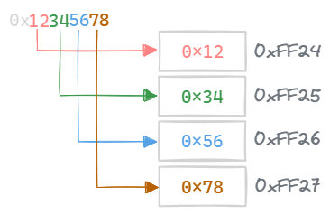
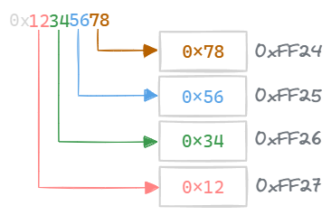

---
tags:
  - comp-sci
  - memory
gardening: 🌳
date: 2025-04-05
reference:
  - https://en.wikipedia.org/wiki/Endianness
  - https://www.freecodecamp.org/news/what-is-endianness-big-endian-vs-little-endian/
  - https://www.baeldung.com/cs/big-endian-vs-little-endian
  - https://www.geeksforgeeks.org/little-and-big-endian-mystery/
playground: https://onecompiler.com/c/43dysck2m
---
Endianness is a key concept in computer architecture that describes the order in which a sequence of bytes is stored in memory. In simple terms, it refers to whether the most significant byte (MSB) is stored at the lowest memory address (big-endian) or whether the least significant byte (LSB) is stored first (little-endian).

## Most and Least Significant Byte

The **most significant byte (MSB)** is the byte in a multi-byte number that holds the highest order bits, meaning it contributes the greatest value to the overall representation of the number. On the other hand, the **least significant byte (LSB)** contributes the lowest value. 

For example, consider the decimal number 2,984. If we change the last digit, 4, to 5, the number increases by just 1. However, if we change the first digit, 2, to 3, the number increases by 1,000. This principle applies equally to bytes and bits.

## Representation

When working with multi-byte data, like a 32-bit integer, a computer must determine how to arrange these bytes in memory. If we represent a 32-bit integer in hexadecimal as `0x12345678`, it will occupy four consecutive bytes in memory.

In big-endian, the bytes are stored in memory in the same order as the hexadecimal representation:



In little-endian, the bytes are reversed in memory:



```c
int main() {
  unsigned int value = 0x12345678; // 305419896
  unsigned char *byte_ptr = (unsigned char *)&value;
	unsigned char msb = (value >> 24) & 0xFF;

  printf("Memory representation of 0x12345678:\n");
	printf("The most significant byte is: 0x%02X\n\n", msb);

  for (int i = 0; i < sizeof(value); i++) {
    printf("Byte %d: 0x%02X\n", i, byte_ptr[i]);
  }

  if (byte_ptr[0] == 0x78) {
    printf("\nThis system is little-endian.\n");
  }
  else if (byte_ptr[0] == 0x12) {
    printf("\nThis system is big-endian.\n");
  }
  else {
    printf("\nUnknown endianness.\n");
  }

  return 0;
}
```

In a big-endian system this would print:

```
Memory representation of 0x12345678:
The most significant byte is: 0x12

Byte 0: 0x12
Byte 1: 0x34
Byte 2: 0x56
Byte 3: 0x78

This system is big-endian.
```

And in little-endian:

```
Memory representation of 0x12345678:
The most significant byte is: 0x12

Byte 0: 0x78
Byte 1: 0x56
Byte 2: 0x34
Byte 3: 0x12

This system is little-endian.
```