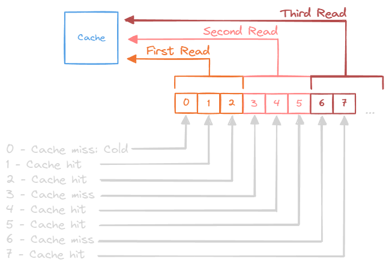
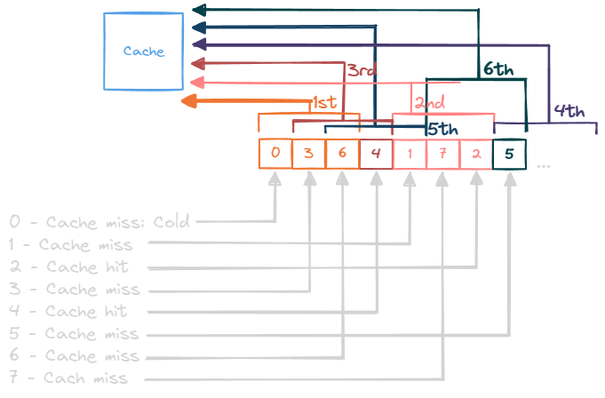

---
tags:
  - comp-sci
gardening: 🌳
date: 2025-01-05
reference:
  - https://en.wikipedia.org/wiki/Locality_of_reference
  - https://www.geeksforgeeks.org/locality-of-reference-and-cache-operation-in-cache-memory/
  - https://www.geeksforgeeks.org/difference-between-spatial-locality-and-temporal-locality/
  - https://gameprogrammingpatterns.com/data-locality.html
---
## Locality of Reference

The locality of reference, also known as the principle of locality, refers to the tendency of a processor to repeatedly access the same set of memory locations within a short timeframe. There are two main types of reference locality: temporal and spatial.

**Focus:** This concept pertains to access patterns during program execution, including both data and instruction references.

**Scope:** Locality of reference extends beyond memory; it applies to overall program behavior and can also involve non-memory-related resources, such as files or network buffers.

**Typical Use Cases:** This principle is commonly applied in high-level software optimization, compiler design, and operating systems.

**Example:** When a program repeatedly accesses the same function, such as within a loop, it demonstrates locality of reference. This behavior can lead to instruction-level caching by the CPU, enhancing performance.

## Memory Locality

Memory locality refers to the manner in which data is accessed in memory during program execution. It is essential for optimizing performance in modern systems, particularly concerning [caches](CPU%20Cache.md).

**Focus:**  
Understanding how data is accessed in memory, including caches and RAM. This involves optimizing memory hierarchies to minimize access times.

**Scope:**  
This topic is closely related to hardware components, such as CPU caches, RAM, and storage systems.

**Typical Use Cases:**  
Memory locality is important in performance tuning, system architecture, and cache optimization.

**Example:**  
A loop that iterates through an array demonstrates memory locality, as it accesses consecutive elements in memory, which aligns with the operation of hardware caches.

### Visualizing Locality

Good memory locality would be something like:




While bad memory locality would be:




### In Practice

Although a distinction exists between the two terms, they often overlap. "Memory locality" specifically refers to the hardware-level implementation of locality principles, while "locality of reference" is a broader concept related to program execution.

When optimizing for low-level performance—for example, when working on cache-efficient algorithms—it's important to focus on memory locality. Conversely, if you're analyzing overall program behavior, such as in compiler design or operating system optimization, you would discuss locality of reference.

## Spatial Locality

Spatial locality refers to the tendency of a program to access memory locations that are close to one another in a short period of time. When a program accesses a specific memory location (for example, an element in an array), it is likely to access nearby locations soon thereafter (such as the next few elements in the array). This behavior is commonly observed in loops, where consecutive elements are processed.

Modern processors take advantage of spatial locality by preloading blocks of memory, known as cache lines, from RAM into the CPU cache. For example, iterating through an array in order (as in `for (int i = 0; i < n; i++)`) ensures sequential access, which can improve performance.

## Temporal Locality

Temporal locality refers to the tendency of a program to access the same memory location multiple times within a short time frame. Variables or instructions that are frequently used, such as loop counters or often called functions, demonstrate temporal locality. When a piece of data is loaded into the cache, it is advantageous to use that data again soon in order to avoid accessing the slower main memory.

Cache systems take advantage of temporal locality by keeping recently accessed data readily available. For example, consider a program that uses a variable in multiple iterations of a loop, like in the expression `sum += x`, where `x` is reused in each iteration.

## Visualizing the Concepts  

Spatial locality is like flipping through the pages of a book in sequential order.  

Temporal locality involves frequently referencing the same page when solving a problem.

### Spatial Locality Example

```c
int array[1000];

for (int i = 0; i < 1000; i++) {
    array[i] = i * 2;
}
```

The loop accesses `array[0]`, `array[1]`, `array[2]`, and so on, in sequence. Since memory for arrays is allocated contiguously, accessing elements in order takes advantage of spatial locality. When one element is loaded into the cache, the adjacent elements are also loaded (due to cache lines). This results in fewer cache misses, faster memory access.

### Temporal Locality Example

```c
int sum = 0;
int array[1000];

for (int i = 0; i < 1000; i++) {
    sum += array[i];
}
```

The variable `sum` is accessed repeatedly within the loop. Once `sum` is loaded into the cache, it stays there for repeated use, minimizing memory fetch operations. This results in improved efficiency as `sum` remains in the CPU cache throughout the loop.

### Combined Locality Example

```c
int A[100][100], B[100][100], C[100][100];

// Initialize A and B
for (int i = 0; i < 100; i++) {
    for (int j = 0; j < 100; j++) {
        A[i][j] = i + j;
        B[i][j] = i - j;
    }
}

// Multiply A and B into C
for (int i = 0; i < 100; i++) {
    for (int j = 0; j < 100; j++) {
        C[i][j] = 0;
        for (int k = 0; k < 100; k++) {
            C[i][j] += A[i][k] * B[k][j];
        }
    }
}
```

Accessing `A[i][k]` in the innermost loop traverses consecutive elements in each row of matrix A, demonstrating spatial locality.

On the other hand, accessing `B[k][j]` involves column-wise access. If matrix B is not stored in column-major order, this could lead to cache misses. However, these issues can be mitigated using blocking techniques. This access pattern also shows spatial locality, but for matrix B.

The element `C[i][j]` is continually updated within the innermost loop, illustrating temporal locality in matrix C.
