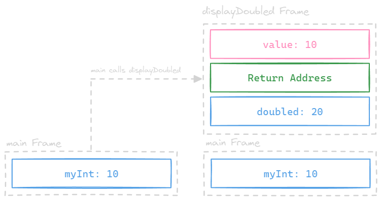
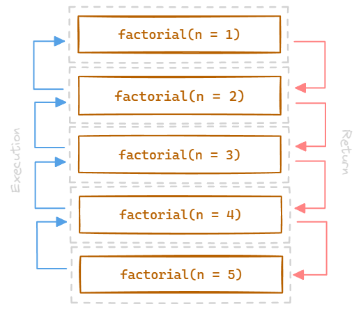
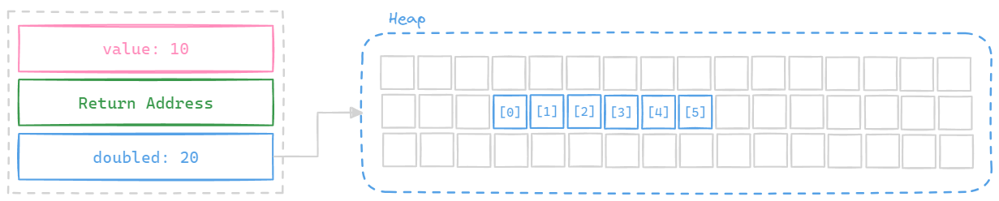

---
tags:
  - comp-sci
  - memory
gardening: 🌳
date: 2025-03-08
reference:
  - https://en.wikipedia.org/wiki/Call_stack
  - https://en.wikipedia.org/wiki/Memory_management#HEAP
---
## Stack

A **call stack** consists of **stack frames** (also known as _activation records_ or _activation frames_). These data structures are machine-dependent and application binary interface (ABI)-dependent, containing state information for subroutines. Each stack frame corresponds to a call to a subroutine that has not yet returned.

The stack frame at the top of the stack belongs to the currently executing routine, which can access information within its frame (such as parameters or local variables) in any order. A typical stack frame includes at least the following items: the arguments (parameter values) passed to the routine, the return address back to the caller, and space for the routine's local variables.

Since the call stack is organized like a stack, the caller pushes the return address onto it. When the called subroutine finishes executing, it pops the return address off the call stack and transfers control back to that address.

```c
void displayDoubled(int value) {
  int doubled = value * 2; // local variable
  printf("doubled = %d\n", doubled);
}

int main() {
  int myInt = 10;        // local variable in main
  displayDouble(myInt);  // call to functionA
  return 0;
}
```



If a called subroutine invokes another subroutine, it will push another return address onto the call stack, and this process continues, stacking information as the program dictates.

```c
int factorial(int n) {
  if (n <= 1) {
    return 1;
  }
  else {
    return n * factorial(n - 1);
  }
}

int main() {
  int result = factorial(5);
  printf("Factorial of 5 is %d\n", result);
  return 0;
}
```



If the stack grows to consume all the allocated space, an error known as a **stack overflow** occurs, often resulting in a program crash. Adding a subroutine's entry to the call stack is sometimes referred to as "winding," while removing entries is known as "unwinding."

The return address is saved upon entering the subroutine. Having such a field located in a known position within the stack frame allows code to access each frame sequentially below the currently executing routine's frame. It also facilitates restoring the frame pointer to the _caller’s_ frame just before the routine returns.

## Heap

The heap is a mechanism that allows programs to dynamically allocate memory as needed and free it for reuse when it is no longer required. It serves as a pool of long-lived memory that is shared across the entire program. Unlike stack memory, which is automatically allocated and deallocated with function calls, heap memory is managed independently, enabling more flexible memory usage. This characteristic is why heap memory is often referred to as "dynamic memory."

```c
int *new_int_array(int size) {
  int *new_arr = (int*)malloc(size * sizeof(int));
  
  if (new_arr == NULL) {
    fprintf(stderr, "Memory allocation failed\n");
    exit(1);
  }
  
  return new_arr;
}
```




Various techniques have been developed to enhance memory management. For instance, virtual memory systems distinguish between the memory addresses utilized by a process and the actual physical addresses. This separation allows multiple processes to run simultaneously and can extend the size of the virtual address space beyond the available RAM by using methods like paging or swapping with secondary storage.

When a memory allocation request is made, the system's task is to find a block of unused memory large enough to satisfy the request. Memory requests are fulfilled by allocating portions from a large pool known as the heap or free store. At any given time, some sections of the heap are in use, while others remain "free" (unused) and available for future allocations.

### Automatic Management: Garbage Collection

Garbage collection is a method that automatically identifies memory allocated to objects that are no longer in use by a program and reclaims that memory to a pool of available memory locations. This approach differs from "manual" memory management, where the programmer explicitly writes code to request and release memory. Although automatic garbage collection reduces the workload for programmers and helps prevent certain types of memory allocation errors, it does require its own memory resources and can compete with the application program for processor time.

Prominent Language Examples: Lisp, C#, Java, Go, and JavaScript

### Automatic Management: Reference Counting

Reference counting is a method used to determine when memory is no longer needed by a program. It does this by keeping track of a counter that indicates how many independent pointers refer to a particular piece of memory. Whenever a new pointer is created to point to this memory, the counter increases. Conversely, when a pointer changes its target, or if it is deleted or no longer points to any area, the counter decreases.

When the counter reaches zero, the memory is considered unused and can be freed. Some reference counting systems require programmer intervention, while others are implemented automatically by the compiler. A drawback of reference counting is that circular references can occur, leading to memory leaks. This issue can be addressed in two ways: by introducing a concept called a "weak reference" (which does not affect the reference count but is notified when the memory it points to is no longer valid) or by combining reference counting with garbage collection.

Prominent Language Examples: Objective-C and Swift

### Automatic Management: Ownership

In an ownership and borrowing model, each value has a single **owner**—a variable that is responsible for managing the memory associated with that value. When the owner goes out of scope, the value is automatically deallocated. When ownership is transferred (or moved) from one variable to another, the previous owner becomes invalid. This mechanism helps prevent issues like double frees and invalid memory access. 

You can create references to a value without taking ownership. Borrowing can be either immutable, allowing multiple references, or mutable, permitting only one reference at a time.

Prominent Language Examples: Rust