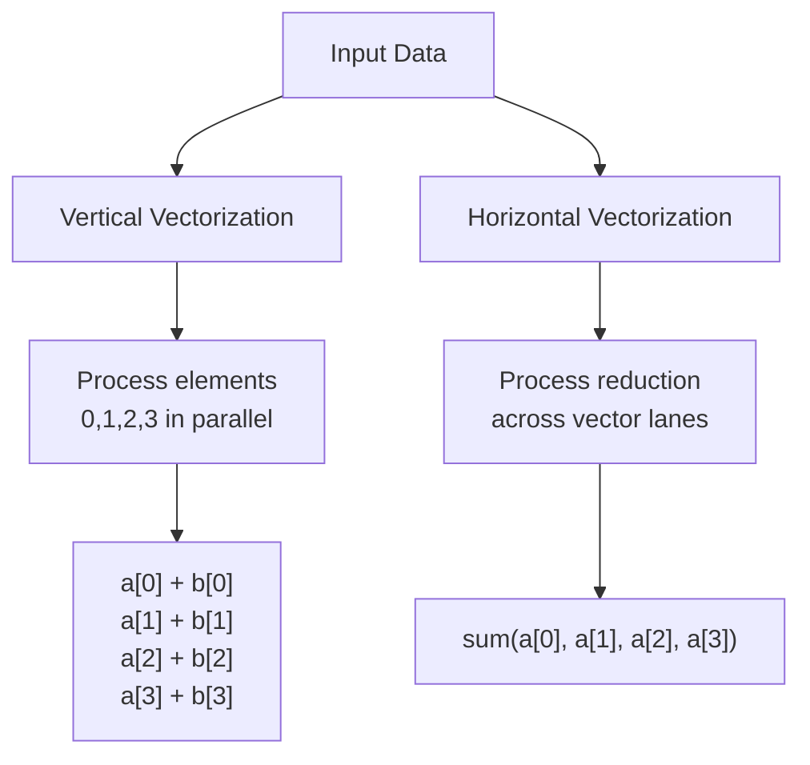

---
tags:
  - comp-sci
gardening: 🌱
date: 2025-07-08
reference:
---
Vectorization is a parallel computing technique that exploits data-level parallelism by performing the same operation on multiple data elements simultaneously. This fundamental optimization technique transforms scalar operations into vector operations, enabling significant performance improvements for computationally intensive workloads.

The mathematical foundation of vectorization can be expressed as transforming a scalar operation:

$$\forall i \in [0, n): y_i = f(x_i)$$

Into a vector operation:

$$\mathbf{Y} = f(\mathbf{X})$$

Where $\mathbf{X}$ and $\mathbf{Y}$ are vectors of length $n$, and $f$ is applied element-wise across the entire vector in parallel.

## Hardware Foundations

### SIMD Architecture

Single Instruction, Multiple Data (SIMD) architectures form the hardware foundation for vectorization. Modern processors include specialized vector processing units with wide registers capable of holding multiple data elements.

```
┌───────────────────────────────────────────────────────────┐
│                    Vector Register (256-bit)              │
├─────────────┬─────────────┬─────────────┬─────────────────┤
│   f64[0]    │   f64[1]    │   f64[2]    │    f64[3]       │
│  64 bits    │  64 bits    │  64 bits    │   64 bits       │
└─────────────┴─────────────┴─────────────┴─────────────────┘

┌───────────────────────────────────────────────────────────┐
│              Vector Arithmetic Unit                       │
├─────────────┬─────────────┬─────────────┬─────────────────┤
│    ALU 0    │    ALU 1    │    ALU 2    │     ALU 3       │
└─────────────┴─────────────┴─────────────┴─────────────────┘
```

Common SIMD instruction sets include:

- **x86-64**: SSE (128-bit), AVX (256-bit), AVX-512 (512-bit)
- **ARM**: NEON (128-bit), SVE (scalable)
- **RISC-V**: Vector Extension (scalable)

### Memory Layout Considerations

Vectorization efficiency depends heavily on memory access patterns. Contiguous memory access enables efficient vector loads and stores:

```
Efficient (Unit Stride):
┌──────┬──────┬──────┬──────┬──────┬──────┬──────┬──────┐
│ a[0] │ a[1] │ a[2] │ a[3] │ a[4] │ a[5] │ a[6] │ a[7] │
└──────┴──────┴──────┴──────┴──────┴──────┴──────┴──────┘
   │      │      │      │
   └──────┴──────┴──────┴──── Vector Load (4 elements)

Inefficient (Non-contiguous):
┌──────┬─────┬──────┬─────┬──────┬─────┬──────┬─────┐
│ a[0] │  ?  │ a[1] │  ?  │ a[2] │  ?  │ a[3] │  ?  │
└──────┴─────┴──────┴─────┴──────┴─────┴──────┴─────┘
   │            │            │            │
   └────────────┴────────────┴────────────┴──── Gather/Scatter Required
```

## Types of Vectorization

### 1. Automatic Vectorization

Modern compilers can automatically identify vectorizable loops and generate SIMD instructions. The compiler performs dependency analysis and determines if loop iterations can be executed in parallel.

**Prerequisites for Auto-vectorization:**

- No loop-carried dependencies
- Predictable iteration count
- Unit stride memory access
- Compiler-recognizable reduction patterns

### 2. Explicit Vectorization

Developers can explicitly request vectorization using intrinsics or high-level vector APIs, providing fine-grained control over SIMD operations.

### 3. Horizontal vs Vertical Vectorization



## Vectorization in Rust and C

Both Rust and C provide multiple approaches to vectorization, from high-level APIs to low-level intrinsics.

### Standard Library Approach

**Rust:**

```rust
use std::arch::x86_64::*;

// High-level vectorization using iterators
fn vector_add_iterator(a: &[f32], b: &[f32]) -> Vec<f32> {
	a.iter()
		.zip(b.iter())
		.map(|(&x, &y)| x + y)
		.collect()
}

// Compiler hints for vectorization
fn vector_add_manual(a: &[f32], b: &[f32], result: &mut [f32]) {
	assert_eq!(a.len(), b.len());
	assert_eq!(a.len(), result.len());
	
	for i in 0..a.len() {
		// Bounds checks eliminated by assert
		unsafe {
			*result.get_unchecked_mut(i) = 
				*a.get_unchecked(i) + *b.get_unchecked(i);
		}
	}
}
```

**C:**

```c
#include <stddef.h>
#include <assert.h>

// Compiler hints for vectorization
void vector_add_manual(const float* restrict a, const float* restrict b, 
                      float* restrict result, size_t len) {
	// restrict keyword hints no pointer aliasing
	#pragma omp simd  // OpenMP SIMD directive
	for (size_t i = 0; i < len; i++) {
		result[i] = a[i] + b[i];
	}
}

// GCC/Clang specific vectorization pragmas
void vector_add_pragma(const float* restrict a, const float* restrict b,
                      float* restrict result, size_t len) {
	#pragma GCC ivdep  // Ignore vector dependencies
	#pragma clang loop vectorize(enable)
	for (size_t i = 0; i < len; i++) {
		result[i] = a[i] + b[i];
	}
}
```

### SIMD Intrinsics

**Rust (Portable SIMD):**

```rust
#![feature(portable_simd)]
use std::simd::{f32x8, Simd};

fn vector_add_simd(a: &[f32], b: &[f32]) -> Vec<f32> {
	const LANES: usize = 8;
	let mut result = Vec::with_capacity(a.len());
	
	// Process chunks of 8 elements
	let chunks = a.len() / LANES;
	for i in 0..chunks {
		let offset = i * LANES;
		let va = Simd::<f32, 8>::from_slice(&a[offset..offset + LANES]);
		let vb = Simd::<f32, 8>::from_slice(&b[offset..offset + LANES]);
		let vr = va + vb;
		result.extend_from_slice(&vr.to_array());
	}
	
	// Handle remainder elements
	for i in (chunks * LANES)..a.len() {
		result.push(a[i] + b[i]);
	}
	
	result
}
```

**C (AVX Intrinsics):**

```c
#include <immintrin.h>
#include <stdlib.h>
#include <string.h>

void vector_add_avx(const float* restrict a, const float* restrict b,
                   float* restrict result, size_t len) {
	const size_t lanes = 8;  // AVX processes 8 floats
	const size_t chunks = len / lanes;
	
	// Process chunks of 8 elements
	for (size_t i = 0; i < chunks; i++) {
		size_t offset = i * lanes;
		__m256 va = _mm256_loadu_ps(&a[offset]);
		__m256 vb = _mm256_loadu_ps(&b[offset]);
		__m256 vr = _mm256_add_ps(va, vb);
		_mm256_storeu_ps(&result[offset], vr);
	}
	
	// Handle remainder elements
	for (size_t i = chunks * lanes; i < len; i++) {
		result[i] = a[i] + b[i];
	}
}

// SSE version for older processors
void vector_add_sse(const float* restrict a, const float* restrict b,
                   float* restrict result, size_t len) {
	const size_t lanes = 4;  // SSE processes 4 floats
	const size_t chunks = len / lanes;
	
	for (size_t i = 0; i < chunks; i++) {
		size_t offset = i * lanes;
		__m128 va = _mm_loadu_ps(&a[offset]);
		__m128 vb = _mm_loadu_ps(&b[offset]);
		__m128 vr = _mm_add_ps(va, vb);
		_mm_storeu_ps(&result[offset], vr);
	}
	
	for (size_t i = chunks * lanes; i < len; i++) {
		result[i] = a[i] + b[i];
	}
}
```

### Complex Example: Matrix Multiplication

**Rust:**

```rust
use std::simd::{f32x8, Simd};

pub struct Matrix {
	data: Vec<f32>,
	rows: usize,
	cols: usize,
}

impl Matrix {
	pub fn new(rows: usize, cols: usize) -> Self {
		Self {
			data: vec![0.0; rows * cols],
			rows,
			cols,
		}
	}
	
	#[inline]
	fn get(&self, row: usize, col: usize) -> f32 {
		self.data[row * self.cols + col]
	}
	
	#[inline]
	fn set(&mut self, row: usize, col: usize, value: f32) {
		self.data[row * self.cols + col] = value;
	}
}

// Naive implementation
fn matmul_naive(a: &Matrix, b: &Matrix, c: &mut Matrix) {
	assert_eq!(a.cols, b.rows);
	assert_eq!(c.rows, a.rows);
	assert_eq!(c.cols, b.cols);
	
	for i in 0..a.rows {
		for j in 0..b.cols {
			let mut sum = 0.0;
			for k in 0..a.cols {
				sum += a.get(i, k) * b.get(k, j);
			}
			c.set(i, j, sum);
		}
	}
}

// Vectorized implementation with loop tiling
fn matmul_vectorized(a: &Matrix, b: &Matrix, c: &mut Matrix) {
	const LANES: usize = 8;
	const TILE_SIZE: usize = 64;
	
	assert_eq!(a.cols, b.rows);
	
	for i_tile in (0..a.rows).step_by(TILE_SIZE) {
		for j_tile in (0..b.cols).step_by(TILE_SIZE) {
			for k_tile in (0..a.cols).step_by(TILE_SIZE) {
				
				let i_end = (i_tile + TILE_SIZE).min(a.rows);
				let j_end = (j_tile + TILE_SIZE).min(b.cols);
				let k_end = (k_tile + TILE_SIZE).min(a.cols);
				
				for i in i_tile..i_end {
					for j in (j_tile..j_end).step_by(LANES) {
						let j_simd_end = (j + LANES).min(j_end);
						let simd_width = j_simd_end - j;
						
						if simd_width == LANES {
							// Full SIMD width
							let mut acc = Simd::<f32, 8>::splat(0.0);
							
							for k in k_tile..k_end {
								let a_val = Simd::<f32, 8>::splat(a.get(i, k));
								let b_vals = Simd::<f32, 8>::from_slice(
										&b.data[k * b.cols + j..k * b.cols + j + LANES]
								);
								acc += a_val * b_vals;
							}
							
							// Add to existing values in C
							let c_vals = Simd::<f32, 8>::from_slice(
									&c.data[i * c.cols + j..i * c.cols + j + LANES]
							);
							let result = c_vals + acc;
							
							c.data[i * c.cols + j..i * c.cols + j + LANES]
								.copy_from_slice(&result.to_array());
						} else {
							// Handle remainder
							for j_rem in j..j_simd_end {
								let mut sum = c.get(i, j_rem);
								for k in k_tile..k_end {
									sum += a.get(i, k) * b.get(k, j_rem);
								}
								c.set(i, j_rem, sum);
							}
						}
					}
				}
			}
		}
	}
}
```

**C:**

```c
#include <immintrin.h>
#include <stdlib.h>
#include <string.h>
#include <assert.h>

typedef struct {
	float* data;
	size_t rows;
	size_t cols;
} Matrix;

Matrix* matrix_new(size_t rows, size_t cols) {
	Matrix* m = malloc(sizeof(Matrix));
	m->data = calloc(rows * cols, sizeof(float));
	m->rows = rows;
	m->cols = cols;
	return m;
}

void matrix_free(Matrix* m) {
	free(m->data);
	free(m);
}

static inline float matrix_get(const Matrix* m, size_t row, size_t col) {
	return m->data[row * m->cols + col];
}

static inline void matrix_set(Matrix* m, size_t row, size_t col, float value) {
	m->data[row * m->cols + col] = value;
}

// Naive implementation
void matmul_naive_c(const Matrix* a, const Matrix* b, Matrix* c) {
	assert(a->cols == b->rows);
	assert(c->rows == a->rows);
	assert(c->cols == b->cols);
	
	for (size_t i = 0; i < a->rows; i++) {
		for (size_t j = 0; j < b->cols; j++) {
			float sum = 0.0f;
			for (size_t k = 0; k < a->cols; k++) {
				sum += matrix_get(a, i, k) * matrix_get(b, k, j);
			}
			matrix_set(c, i, j, sum);
		}
	}
}

// Vectorized implementation with loop tiling
void matmul_vectorized_c(const Matrix* a, const Matrix* b, Matrix* c) {
	const size_t LANES = 8;
	const size_t TILE_SIZE = 64;
	
	assert(a->cols == b->rows);
	
	for (size_t i_tile = 0; i_tile < a->rows; i_tile += TILE_SIZE) {
		for (size_t j_tile = 0; j_tile < b->cols; j_tile += TILE_SIZE) {
			for (size_t k_tile = 0; k_tile < a->cols; k_tile += TILE_SIZE) {
				
				size_t i_end = (i_tile + TILE_SIZE < a->rows) ? 
											i_tile + TILE_SIZE : a->rows;
				size_t j_end = (j_tile + TILE_SIZE < b->cols) ? 
											j_tile + TILE_SIZE : b->cols;
				size_t k_end = (k_tile + TILE_SIZE < a->cols) ? 
											k_tile + TILE_SIZE : a->cols;
				
				for (size_t i = i_tile; i < i_end; i++) {
					for (size_t j = j_tile; j < j_end; j += LANES) {
						size_t j_simd_end = (j + LANES < j_end) ? j + LANES : j_end;
						size_t simd_width = j_simd_end - j;
						
						if (simd_width == LANES) {
							// Full SIMD width
							__m256 acc = _mm256_setzero_ps();
							
							for (size_t k = k_tile; k < k_end; k++) {
								__m256 a_val = _mm256_set1_ps(matrix_get(a, i, k));
								__m256 b_vals = _mm256_loadu_ps(&b->data[k * b->cols + j]);
								acc = _mm256_fmadd_ps(a_val, b_vals, acc);
							}
							
							// Add to existing values in C
							__m256 c_vals = _mm256_loadu_ps(&c->data[i * c->cols + j]);
							__m256 result = _mm256_add_ps(c_vals, acc);
							_mm256_storeu_ps(&c->data[i * c->cols + j], result);
						} else {
							// Handle remainder
							for (size_t j_rem = j; j_rem < j_simd_end; j_rem++) {
								float sum = matrix_get(c, i, j_rem);
								for (size_t k = k_tile; k < k_end; k++) {
									sum += matrix_get(a, i, k) * matrix_get(b, k, j_rem);
								}
								matrix_set(c, i, j_rem, sum);
							}
						}
					}
				}
			}
		}
	}
}
```

### Reduction Operations

**Rust:**

```rust
use std::simd::{f32x8, Simd};

fn sum_vectorized(data: &[f32]) -> f32 {
	const LANES: usize = 8;
	let mut acc = Simd::<f32, 8>::splat(0.0);
	
	// Process full SIMD chunks
	let chunks = data.len() / LANES;
	for i in 0..chunks {
		let offset = i * LANES;
		let v = Simd::<f32, 8>::from_slice(&data[offset..offset + LANES]);
		acc += v;
	}
	
	// Horizontal reduction
	let mut result = acc.reduce_sum();
	
	// Handle remainder
	for &x in &data[chunks * LANES..] {
		result += x;
	}
	
	result
}

fn dot_product_vectorized(a: &[f32], b: &[f32]) -> f32 {
	assert_eq!(a.len(), b.len());
	
	const LANES: usize = 8;
	let mut acc = Simd::<f32, 8>::splat(0.0);
	
	let chunks = a.len() / LANES;
	for i in 0..chunks {
		let offset = i * LANES;
		let va = Simd::<f32, 8>::from_slice(&a[offset..offset + LANES]);
		let vb = Simd::<f32, 8>::from_slice(&b[offset..offset + LANES]);
		acc += va * vb;
	}
	
	let mut result = acc.reduce_sum();
	
	// Process remainder
	for i in (chunks * LANES)..a.len() {
		result += a[i] * b[i];
	}
	
	result
}
```

**C:**

```c
#include <immintrin.h>

// Horizontal sum of AVX register
static inline float horizontal_sum_avx(__m256 v) {
	// Add upper and lower 128-bit lanes
	__m128 lo = _mm256_castps256_ps128(v);
	__m128 hi = _mm256_extractf128_ps(v, 1);
	__m128 sum = _mm_add_ps(lo, hi);
	
	// Horizontal add within 128-bit register
	sum = _mm_hadd_ps(sum, sum);
	sum = _mm_hadd_ps(sum, sum);
	
	return _mm_cvtss_f32(sum);
}

float sum_vectorized_c(const float* data, size_t len) {
	const size_t lanes = 8;
	__m256 acc = _mm256_setzero_ps();
	
	// Process full SIMD chunks
	const size_t chunks = len / lanes;
	for (size_t i = 0; i < chunks; i++) {
		size_t offset = i * lanes;
		__m256 v = _mm256_loadu_ps(&data[offset]);
		acc = _mm256_add_ps(acc, v);
	}
	
	// Horizontal reduction
	float result = horizontal_sum_avx(acc);
	
	// Handle remainder
	for (size_t i = chunks * lanes; i < len; i++) {
		result += data[i];
	}
	
	return result;
}

float dot_product_vectorized_c(const float* restrict a, const float* restrict b, 
                              size_t len) {
	const size_t lanes = 8;
	__m256 acc = _mm256_setzero_ps();
	
	const size_t chunks = len / lanes;
	for (size_t i = 0; i < chunks; i++) {
		size_t offset = i * lanes;
		__m256 va = _mm256_loadu_ps(&a[offset]);
		__m256 vb = _mm256_loadu_ps(&b[offset]);
		acc = _mm256_fmadd_ps(va, vb, acc);  // Fused multiply-add
	}
	
	float result = horizontal_sum_avx(acc);
	
	// Process remainder
	for (size_t i = chunks * lanes; i < len; i++) {
		result += a[i] * b[i];
	}
	
	return result;
}

// Alternative using intrinsic horizontal reduction (AVX512)
#ifdef __AVX512F__
float sum_vectorized_avx512(const float* data, size_t len) {
	const size_t lanes = 16;
	__m512 acc = _mm512_setzero_ps();
	
	const size_t chunks = len / lanes;
	for (size_t i = 0; i < chunks; i++) {
		size_t offset = i * lanes;
		__m512 v = _mm512_loadu_ps(&data[offset]);
		acc = _mm512_add_ps(acc, v);
	}
	
	float result = _mm512_reduce_add_ps(acc);
	
	// Handle remainder
	for (size_t i = chunks * lanes; i < len; i++) {
		result += data[i];
	}
	
	return result;
}
#endif
```

## Performance Analysis

### Theoretical Performance Bounds

The theoretical speedup from vectorization can be calculated as:

$$\text{Speedup} = \frac{\text{Vector Width}}{\text{Scalar Width}}$$

For AVX-256 with 32-bit floats: $\text{Speedup} = \frac{256}{32} = 8\times$

However, real-world performance depends on:

- Memory bandwidth utilization
- Cache behavior
- Pipeline efficiency
- Branch prediction accuracy

### Roofline Model

The roofline model provides a framework for analyzing vectorization performance:

$$\text{Performance} = \min(\text{Peak Compute}, \text{Bandwidth} \times \text{Arithmetic Intensity})$$

Where Arithmetic Intensity is:

$$\text{AI} = \frac{\text{Operations}}{\text{Bytes Transferred}}$$

### Benchmarking Framework

**Rust:**

```rust
use std::time::Instant;

fn benchmark_vectorization() {
	const SIZE: usize = 1_000_000;
	let a: Vec<f32> = (0..SIZE).map(|i| i as f32).collect();
	let b: Vec<f32> = (0..SIZE).map(|i| (i * 2) as f32).collect();
	
	// Warmup
	for _ in 0..10 {
		let _result = vector_add_iterator(&a, &b);
	}
	
	// Benchmark iterator approach
	let start = Instant::now();
	let iterations = 100;
	for _ in 0..iterations {
		let _result = vector_add_iterator(&a, &b);
	}
	let iterator_time = start.elapsed().as_nanos() as f64 / iterations as f64;
	
	// Benchmark SIMD approach
	let start = Instant::now();
	for _ in 0..iterations {
		let _result = vector_add_simd(&a, &b);
	}
	let simd_time = start.elapsed().as_nanos() as f64 / iterations as f64;
	
	println!("Iterator approach: {:.2} ns/iteration", iterator_time);
	println!("SIMD approach: {:.2} ns/iteration", simd_time);
	println!("Speedup: {:.2}x", iterator_time / simd_time);
	
	// Calculate bandwidth utilization
	let bytes_processed = SIZE * 2 * std::mem::size_of::<f32>(); // Read a and b
	let bandwidth_gbps = (bytes_processed as f64) / (simd_time * 1e-9) / 1e9;
	println!("Memory bandwidth: {:.2} GB/s", bandwidth_gbps);
}
```

**C:**

```c
#include <time.h>
#include <stdio.h>
#include <stdlib.h>

// High-resolution timing
static inline double get_time_ns(void) {
	struct timespec ts;
	clock_gettime(CLOCK_MONOTONIC, &ts);
	return ts.tv_sec * 1e9 + ts.tv_nsec;
}

void benchmark_vectorization_c(void) {
	const size_t SIZE = 1000000;
	const int iterations = 100;
	
	// Allocate aligned memory
	float* a = aligned_alloc(32, SIZE * sizeof(float));
	float* b = aligned_alloc(32, SIZE * sizeof(float));
	float* result_manual = aligned_alloc(32, SIZE * sizeof(float));
	float* result_simd = aligned_alloc(32, SIZE * sizeof(float));
	
	// Initialize data
	for (size_t i = 0; i < SIZE; i++) {
		a[i] = (float)i;
		b[i] = (float)(i * 2);
	}
	
	// Warmup
	for (int i = 0; i < 10; i++) {
		vector_add_manual(a, b, result_manual, SIZE);
	}
	
	// Benchmark manual approach
	double start = get_time_ns();
	for (int i = 0; i < iterations; i++) {
		vector_add_manual(a, b, result_manual, SIZE);
	}
	double manual_time = (get_time_ns() - start) / iterations;
	
	// Benchmark SIMD approach
	start = get_time_ns();
	for (int i = 0; i < iterations; i++) {
		vector_add_avx(a, b, result_simd, SIZE);
	}
	double simd_time = (get_time_ns() - start) / iterations;
	
	printf("Manual approach: %.2f ns/iteration\n", manual_time);
	printf("SIMD approach: %.2f ns/iteration\n", simd_time);
	printf("Speedup: %.2fx\n", manual_time / simd_time);
	
	// Calculate bandwidth utilization
	size_t bytes_processed = SIZE * 2 * sizeof(float); // Read a and b
	double bandwidth_gbps = (bytes_processed) / (simd_time * 1e-9) / 1e9;
	printf("Memory bandwidth: %.2f GB/s\n", bandwidth_gbps);
	
	// Verify correctness
	int errors = 0;
	for (size_t i = 0; i < SIZE && errors < 10; i++) {
		if (result_manual[i] != result_simd[i]) {
			printf("Error at index %zu: manual=%.6f, simd=%.6f\n", 
						 i, result_manual[i], result_simd[i]);
			errors++;
		}
	}
	
	free(a);
	free(b);
	free(result_manual);
	free(result_simd);
}
```

## Compiler Optimizations

### Auto-vectorization Analysis

**Rust:** Rust's LLVM backend can automatically vectorize many loops. To verify vectorization:

```bash
# Compile with vectorization reports
RUSTFLAGS="-C target-cpu=native -C opt-level=3 -C llvm-args=-vectorize-slp-aggressive" \
    cargo build --release

# View assembly output
cargo rustc --release -- --emit asm
```

**C:** GCC and Clang provide extensive vectorization capabilities:

```bash
# GCC with vectorization reports
gcc -O3 -march=native -ftree-vectorize -fopt-info-vec-optimized \
    -fopt-info-vec-missed -mavx2 -mfma program.c

# Clang with vectorization reports  
clang -O3 -march=native -Rpass=loop-vectorize -Rpass-missed=loop-vectorize \
      -Rpass-analysis=loop-vectorize program.c

# Intel Compiler with detailed reports
icc -O3 -xHost -qopt-report=5 -qopt-report-phase=vec program.c
```

### Preventing Vectorization Inhibitors

**Rust:** Common patterns that prevent auto-vectorization:

```rust
// BAD: Loop-carried dependency
fn cumulative_sum_bad(data: &mut [f32]) {
	for i in 1..data.len() {
		data[i] += data[i - 1]; // Dependencies prevent vectorization
	}
}

// GOOD: Independent operations
fn element_wise_operation(a: &[f32], b: &[f32], result: &mut [f32]) {
	for i in 0..a.len() {
		result[i] = a[i] * 2.0 + b[i]; // No dependencies
	}
}

// BAD: Unpredictable branches
fn conditional_bad(data: &[f32], result: &mut [f32]) {
	for i in 0..data.len() {
		if data[i] > 0.0 {  // Branch divergence
			result[i] = data[i].sqrt();
		} else {
			result[i] = -data[i];
		}
	}
}

// GOOD: Branchless computation
fn conditional_good(data: &[f32], result: &mut [f32]) {
	for i in 0..data.len() {
		let mask = (data[i] > 0.0) as i32 as f32;
		result[i] = mask * data[i].sqrt() + (1.0 - mask) * (-data[i]);
	}
}
```

**C:** Equivalent C patterns with compiler-specific optimizations:

```c
// BAD: Loop-carried dependency
void cumulative_sum_bad(float* data, size_t len) {
	for (size_t i = 1; i < len; i++) {
		data[i] += data[i - 1]; // Dependencies prevent vectorization
	}
}

// GOOD: Independent operations with compiler hints
void element_wise_operation(const float* restrict a, const float* restrict b,
                           float* restrict result, size_t len) {
	#pragma omp simd
	#pragma GCC ivdep
	for (size_t i = 0; i < len; i++) {
		result[i] = a[i] * 2.0f + b[i]; // No dependencies
	}
}

// BAD: Unpredictable branches
void conditional_bad(const float* data, float* result, size_t len) {
	for (size_t i = 0; i < len; i++) {
		if (data[i] > 0.0f) {  // Branch divergence
			result[i] = sqrtf(data[i]);
		} else {
			result[i] = -data[i];
		}
	}
}

// GOOD: Branchless computation
void conditional_good(const float* data, float* result, size_t len) {
	#pragma omp simd
	for (size_t i = 0; i < len; i++) {
		float mask = (data[i] > 0.0f) ? 1.0f : 0.0f;
		result[i] = mask * sqrtf(data[i]) + (1.0f - mask) * (-data[i]);
	}
}

// Using compiler intrinsics for conditional operations
void conditional_simd(const float* data, float* result, size_t len) {
	const size_t lanes = 8;
	const size_t chunks = len / lanes;
	
	for (size_t i = 0; i < chunks; i++) {
		size_t offset = i * lanes;
		__m256 vals = _mm256_loadu_ps(&data[offset]);
		__m256 zero = _mm256_setzero_ps();
		
		// Create mask for positive values
		__m256 mask = _mm256_cmp_ps(vals, zero, _CMP_GT_OQ);
		
		// Conditional computation
		__m256 sqrt_vals = _mm256_sqrt_ps(vals);
		__m256 neg_vals = _mm256_sub_ps(zero, vals);
		
		// Blend based on mask
		__m256 result_vec = _mm256_blendv_ps(neg_vals, sqrt_vals, mask);
		_mm256_storeu_ps(&result[offset], result_vec);
	}
	
	// Handle remainder
	for (size_t i = chunks * lanes; i < len; i++) {
		result[i] = (data[i] > 0.0f) ? sqrtf(data[i]) : -data[i];
	}
}
```

## Advanced Techniques

### Vectorized Sorting Networks

```rust
use std::simd::{f32x8, Simd};

fn sort_8_elements(mut v: Simd<f32, 8>) -> Simd<f32, 8> {
	// Bitonic sorting network for 8 elements
	macro_rules! compare_swap {
		($vec:expr, $mask:expr) => {
			let other = $vec.swizzle_dyn($mask);
			let min_vals = $vec.simd_min(other);
			let max_vals = $vec.simd_max(other);
			$vec = min_vals.select($mask.into(), max_vals);
		};
	}
	
	// Stage 1: Sort pairs
	compare_swap!(v, [1, 0, 3, 2, 5, 4, 7, 6]);
	
	// Stage 2: Sort 4-element groups
	compare_swap!(v, [2, 3, 0, 1, 6, 7, 4, 5]);
	compare_swap!(v, [1, 0, 3, 2, 5, 4, 7, 6]);
	
	// Stage 3: Sort 8-element group
	compare_swap!(v, [4, 5, 6, 7, 0, 1, 2, 3]);
	compare_swap!(v, [2, 3, 0, 1, 6, 7, 4, 5]);
	compare_swap!(v, [1, 0, 3, 2, 5, 4, 7, 6]);
	
	v
}
```

### Vectorized String Processing

```rust
use std::simd::{u8x32, Simd, SimdPartialEq};

fn count_character_vectorized(text: &[u8], target: u8) -> usize {
	const LANES: usize = 32;
	let target_vec = Simd::<u8, 32>::splat(target);
	let mut count = 0;
	
	let chunks = text.len() / LANES;
	for i in 0..chunks {
		let offset = i * LANES;
		let text_chunk = Simd::<u8, 32>::from_slice(&text[offset..offset + LANES]);
		let matches = text_chunk.simd_eq(target_vec);
		count += matches.to_bitmask().count_ones() as usize;
	}
	
	// Handle remainder
	for &byte in &text[chunks * LANES..] {
		if byte == target {
			count += 1;
		}
	}
	
	count
}
```

## Best Practices and Pitfalls

### Memory Alignment

**Rust:**

```rust
use std::alloc::{alloc, dealloc, Layout};

fn create_aligned_buffer<T>(len: usize, align: usize) -> Vec<T> {
	let layout = Layout::from_size_align(len * std::mem::size_of::<T>(), align)
			.expect("Invalid layout");
	
	unsafe {
		let ptr = alloc(layout) as *mut T;
		if ptr.is_null() {
				panic!("Allocation failed");
		}
		Vec::from_raw_parts(ptr, len, len)
	}
}

// Ensure 32-byte alignment for AVX operations
fn aligned_operation() {
	let mut data = create_aligned_buffer::<f32>(1024, 32);
	// ... vectorized operations on aligned data
}
```

**C:**

```c
#include <stdlib.h>
#include <stdint.h>
#include <stdalign.h>

// Create aligned buffer using aligned_alloc (C11)
float* create_aligned_buffer_c11(size_t len, size_t align) {
	size_t size = len * sizeof(float);
	// Round up size to multiple of alignment
	size = (size + align - 1) & ~(align - 1);
	return (float*)aligned_alloc(align, size);
}

// Cross-platform aligned allocation
float* create_aligned_buffer_portable(size_t len, size_t align) {
#ifdef _MSC_VER
	return (float*)_aligned_malloc(len * sizeof(float), align);
#elif defined(__GNUC__) || defined(__clang__)
	return (float*)aligned_alloc(align, 
															((len * sizeof(float) + align - 1) 
															 & ~(align - 1)));
#else
	// Fallback using posix_memalign
	void* ptr;
	if (posix_memalign(&ptr, align, len * sizeof(float)) != 0) {
			return NULL;
	}
	return (float*)ptr;
#endif
}

void free_aligned_buffer(float* ptr) {
#ifdef _MSC_VER
	_aligned_free(ptr);
#else
	free(ptr);
#endif
}

// Check alignment at runtime
bool is_aligned(const void* ptr, size_t align) {
	return ((uintptr_t)ptr & (align - 1)) == 0;
}

// Example usage
void aligned_operation_c(void) {
	const size_t len = 1024;
	const size_t align = 32; // 32-byte alignment for AVX
	
	float* data = create_aligned_buffer_portable(len, align);
	if (!data) {
		printf("Failed to allocate aligned memory\n");
		return;
	}
	
	// Verify alignment
	if (!is_aligned(data, align)) {
		printf("Warning: Memory not properly aligned\n");
	}
	
	// Initialize data
	for (size_t i = 0; i < len; i++) {
		data[i] = (float)i;
	}
	
	// Perform vectorized operations
	// ... use aligned loads/stores for better performance
	
	free_aligned_buffer(data);
}

// Stack alignment for small arrays
void stack_aligned_operation(void) {
	// Ensure stack alignment using compiler attributes
	alignas(32) float data[1024];
	
	// Compiler guarantees 32-byte alignment
	assert(is_aligned(data, 32));
	
	// Use aligned SIMD operations
	for (size_t i = 0; i < 1024; i += 8) {
		__m256 v = _mm256_load_ps(&data[i]); // Aligned load
		v = _mm256_mul_ps(v, _mm256_set1_ps(2.0f));
		_mm256_store_ps(&data[i], v); // Aligned store
	}
}
```

### Common Pitfalls

**1. False Dependencies / Pointer Aliasing**

**Rust:**

```rust
// Use restrict-like patterns
fn process_separate_arrays(a: &[f32], b: &mut [f32]) {
	assert!(!std::ptr::eq(a.as_ptr(), b.as_ptr()));
	// Now compiler knows arrays don't alias
	
	for i in 0..a.len().min(b.len()) {
		b[i] = a[i] * 2.0 + 1.0;
	}
}

// Use non-overlapping slice guarantees
fn process_non_overlapping(data: &mut [f32]) {
	let (left, right) = data.split_at_mut(data.len() / 2);
	// Compiler knows left and right don't overlap
	
	for (l, r) in left.iter_mut().zip(right.iter()) {
		*l += *r;
	}
}
```

**C:**

```c
// Use restrict keyword to indicate non-aliasing
void process_separate_arrays_c(const float* restrict a, float* restrict b, 
                              size_t len) {
	#pragma omp simd
	for (size_t i = 0; i < len; i++) {
		b[i] = a[i] * 2.0f + 1.0f;
	}
}

// Compiler-specific no-alias annotations
void process_with_annotations(const float* a, float* b, size_t len) {
	// GCC specific
	#pragma GCC ivdep
	// Intel compiler specific  
	#pragma ivdep
	// Clang specific
	#pragma clang loop vectorize(enable)
	
	for (size_t i = 0; i < len; i++) {
		b[i] = a[i] * 2.0f + 1.0f;
	}
}
```

**2. Misaligned Access**

**Rust:**

```rust
// Check alignment
fn check_alignment_rust(data: &[f32]) {
	let ptr = data.as_ptr() as usize;
	assert_eq!(ptr % 32, 0, "Data not 32-byte aligned");
	
	// Use aligned SIMD operations
	// ... vectorized code
}

// Handle potentially unaligned data
fn handle_unaligned(data: &[f32]) -> Vec<f32> {
	let mut result = Vec::with_capacity(data.len());
	
	// Find aligned start
	let ptr = data.as_ptr() as usize;
	let alignment = 32;
	let offset = if ptr % alignment == 0 {
		0
	} else {
		alignment - (ptr % alignment) / std::mem::size_of::<f32>()
	};
	
	// Process unaligned prefix
	for &x in &data[..offset.min(data.len())] {
		result.push(x * 2.0);
	}
	
	// Process aligned middle section with SIMD
	// ... SIMD code for data[offset..]
	
	result
}
```

**C:**

```c
// Check alignment at runtime
void check_alignment_c(const float* data) {
	uintptr_t ptr = (uintptr_t)data;
	if (ptr % 32 != 0) {
		printf("Warning: Data not 32-byte aligned\n");
	}
}

// Handle unaligned data gracefully
void process_with_alignment_check(const float* data, float* result, size_t len) {
	uintptr_t ptr = (uintptr_t)data;
	size_t alignment = 32;
	size_t offset = 0;
	
	// Calculate offset to next aligned boundary
	if (ptr % alignment != 0) {
		offset = (alignment - (ptr % alignment)) / sizeof(float);
		offset = (offset > len) ? len : offset;
	}
	
	// Process unaligned prefix scalar
	for (size_t i = 0; i < offset; i++) {
		result[i] = data[i] * 2.0f;
	}
	
	// Process aligned portion with SIMD
	const size_t lanes = 8;
	const size_t aligned_len = len - offset;
	const size_t chunks = aligned_len / lanes;
	
	for (size_t i = 0; i < chunks; i++) {
		size_t idx = offset + i * lanes;
		__m256 v = _mm256_load_ps(&data[idx]); // Aligned load
		v = _mm256_mul_ps(v, _mm256_set1_ps(2.0f));
		_mm256_store_ps(&result[idx], v); // Aligned store
	}
	
	// Handle remainder
	for (size_t i = offset + chunks * lanes; i < len; i++) {
		result[i] = data[i] * 2.0f;
	}
}
```

**3. Inefficient Reductions**

**Rust:**

```rust
// BAD: Frequent horizontal operations
fn inefficient_reduction_bad(data: &[f32]) -> f32 {
	let mut result = 0.0;
	for chunk in data.chunks_exact(8) {
		let v = Simd::<f32, 8>::from_slice(chunk);
		result += v.reduce_sum(); // Expensive horizontal operation
	}
	result
}

// GOOD: Accumulate in SIMD register
fn efficient_reduction_good(data: &[f32]) -> f32 {
	let mut acc = Simd::<f32, 8>::splat(0.0);
	
	for chunk in data.chunks_exact(8) {
		let v = Simd::<f32, 8>::from_slice(chunk);
		acc += v; // Keep accumulating in SIMD
	}
	
	let mut result = acc.reduce_sum(); // Single horizontal reduction
	
	// Handle remainder
	for &x in data.chunks_exact(8).remainder() {
		result += x;
	}
	
	result
}
```

**C:**

```c
// BAD: Frequent horizontal operations
float inefficient_reduction_bad_c(const float* data, size_t len) {
	float result = 0.0f;
	const size_t lanes = 8;
	
	for (size_t i = 0; i < len; i += lanes) {
		if (i + lanes <= len) {
			__m256 v = _mm256_loadu_ps(&data[i]);
			result += horizontal_sum_avx(v); // Expensive each iteration
		}
	}
	return result;
}

// GOOD: Accumulate in SIMD register
float efficient_reduction_good_c(const float* data, size_t len) {
	const size_t lanes = 8;
	__m256 acc = _mm256_setzero_ps();
	
	const size_t chunks = len / lanes;
	for (size_t i = 0; i < chunks; i++) {
		__m256 v = _mm256_loadu_ps(&data[i * lanes]);
		acc = _mm256_add_ps(acc, v); // Keep in SIMD
	}
	
	float result = horizontal_sum_avx(acc); // Single horizontal reduction
	
	// Handle remainder
	for (size_t i = chunks * lanes; i < len; i++) {
		result += data[i];
	}
	
	return result;
}

// Multiple accumulators to increase ILP (Instruction Level Parallelism)
float efficient_reduction_ilp_c(const float* data, size_t len) {
	const size_t lanes = 8;
	const size_t unroll = 4;
	
	__m256 acc0 = _mm256_setzero_ps();
	__m256 acc1 = _mm256_setzero_ps();
	__m256 acc2 = _mm256_setzero_ps();
	__m256 acc3 = _mm256_setzero_ps();
	
	const size_t chunks = len / (lanes * unroll);
	for (size_t i = 0; i < chunks; i++) {
		size_t base = i * lanes * unroll;
		__m256 v0 = _mm256_loadu_ps(&data[base]);
		__m256 v1 = _mm256_loadu_ps(&data[base + lanes]);
		__m256 v2 = _mm256_loadu_ps(&data[base + 2 * lanes]);
		__m256 v3 = _mm256_loadu_ps(&data[base + 3 * lanes]);
		
		acc0 = _mm256_add_ps(acc0, v0);
		acc1 = _mm256_add_ps(acc1, v1);
		acc2 = _mm256_add_ps(acc2, v2);
		acc3 = _mm256_add_ps(acc3, v3);
	}
	
	// Combine accumulators
	__m256 final_acc = _mm256_add_ps(
		_mm256_add_ps(acc0, acc1),
		_mm256_add_ps(acc2, acc3)
	);
	
	float result = horizontal_sum_avx(final_acc);
	
	// Handle remainder
	for (size_t i = chunks * lanes * unroll; i < len; i++) {
		result += data[i];
	}
	
	return result;
}
```

## Conclusion

Vectorization represents a critical optimization technique for high-performance computing applications. The combination of modern hardware capabilities, sophisticated compiler optimizations, and explicit programming interfaces enables significant performance improvements for data-parallel workloads.

Key takeaways:

- Understand your target hardware's SIMD capabilities
- Design algorithms with vectorization in mind
- Profile and measure actual performance gains
- Balance portability with architecture-specific optimizations
- Consider memory access patterns and cache behavior

Effective vectorization requires understanding the interplay between algorithms, hardware, and compiler optimizations. Rust's growing ecosystem of SIMD support, from portable abstractions to platform-specific intrinsics, provides developers with powerful tools for exploiting modern processor capabilities while maintaining memory safety and performance.

The future of vectorization includes emerging technologies like scalable vector extensions (SVE, RISC-V Vector), GPU compute integration, and AI-accelerated processing units, making this an evolving and critical area of systems programming expertise.