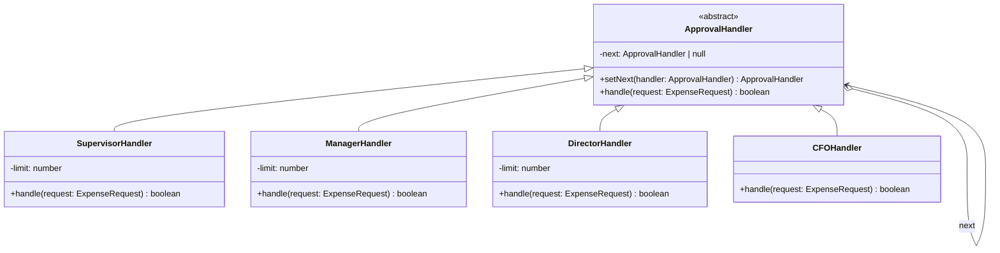

---
tags:
  - design-pattern
  - comp-sci
gardening: 🌿
date: 2026-06-06
reference:
  - https://github.com/deepakkum21/Books/blob/master/Design%20Patterns%20-%20Elements%20of%20Reusable%20Object%20Oriented%20Software%20-%20GOF.pdf
  - https://refactoring.guru/design-patterns/chain-of-responsibility
  - https://en.wikipedia.org/wiki/Chain-of-responsibility_pattern
---
## What & Why

The Chain of Responsibility (CoR) pattern solves a request routing problem: a request needs to be handled by one of several possible handlers, but the sender should not need to know which one processes it.

Many systems have multiple objects that can potentially handle a request. Hardcoding which handler processes which request creates tight coupling between sender and receiver. Adding a handler, changing the order, or removing one forces changes in the sender.

The canonical motivating scenario is expense approval routing. A reimbursement of $200 goes to a supervisor. A request for $5,000 goes to a manager. A request for $200,000 goes to the CFO. The employee submitting the expense should not need to know the approval hierarchy or route the request themselves. The request travels up the chain until someone is authorized to approve it.

CoR formalizes this as a linked sequence of handlers where each handler either:

1. Processes the request and stops the chain, or
2. Passes the request to the next handler in the chain

This separates two distinct concerns: the logic for deciding whether to handle a request, and the mechanism for finding the right handler. The GoF explicitly note this introduces a risk: if no handler processes the request, it silently falls off the end of the chain. This is a known failure mode that must be explicitly designed around.

Modern practical appearances of this pattern include HTTP middleware pipelines (Express, Koa, Hono), DOM event bubbling, logging severity routing, and permission escalation systems.

## Structure Diagram



## Traditional Class-Based Implementation

```typescript
type ExpenseRequest = {
  readonly amount: number;
  readonly description: string;
  readonly requester: string;
};

abstract class ApprovalHandler {
  private next: ApprovalHandler | null = null;

  setNext(handler: ApprovalHandler): ApprovalHandler {
    this.next = handler;
    return handler;
  }

  handle(request: ExpenseRequest): boolean {
    if (this.next !== null) {
      return this.next.handle(request);
    }
    console.log(`[DENIED] No handler approved: ${request.description} ($${request.amount})`);
    return false;
  }
}

class SupervisorHandler extends ApprovalHandler {
  private readonly limit = 500;

  handle(request: ExpenseRequest): boolean {
    if (request.amount <= this.limit) {
      console.log(`[Supervisor] Approved: ${request.description} ($${request.amount})`);
      return true;
    }
    return super.handle(request);
  }
}

class ManagerHandler extends ApprovalHandler {
  private readonly limit = 5_000;

  handle(request: ExpenseRequest): boolean {
    if (request.amount <= this.limit) {
      console.log(`[Manager] Approved: ${request.description} ($${request.amount})`);
      return true;
    }
    return super.handle(request);
  }
}

class DirectorHandler extends ApprovalHandler {
  private readonly limit = 50_000;

  handle(request: ExpenseRequest): boolean {
    if (request.amount <= this.limit) {
      console.log(`[Director] Approved: ${request.description} ($${request.amount})`);
      return true;
    }
    return super.handle(request);
  }
}

class CFOHandler extends ApprovalHandler {
  // Terminal handler: no limit check, approves anything that reaches it
  handle(request: ExpenseRequest): boolean {
    console.log(`[CFO] Approved: ${request.description} ($${request.amount})`);
    return true;
  }
}

// Usage
const supervisor = new SupervisorHandler();
const manager = new ManagerHandler();
const director = new DirectorHandler();
const cfo = new CFOHandler();

supervisor.setNext(manager).setNext(director).setNext(cfo);

supervisor.handle({ amount: 200,     description: 'Office supplies',    requester: 'Alice' });
supervisor.handle({ amount: 3_000,   description: 'Conference tickets',  requester: 'Bob'   });
supervisor.handle({ amount: 40_000,  description: 'Server hardware',     requester: 'Carol' });
supervisor.handle({ amount: 200_000, description: 'Enterprise license',  requester: 'Dave'  });
// [Supervisor] Approved: Office supplies ($200)
// [Manager]    Approved: Conference tickets ($3000)
// [Director]   Approved: Server hardware ($40000)
// [CFO]        Approved: Enterprise license ($200000)
```

**Key Characteristics**:

- **Linear chain structure**: Handlers are linked in a singly-linked sequence; each knows only its immediate successor and nothing else about the chain
- **Pass or handle**: Each concrete handler either fully resolves the request or unconditionally delegates to `super.handle()`
- **Fluent `setNext()` return**: Returning the handler from `setNext()` enables the left-to-right chaining syntax shown in usage
- **Abstract base enforces delegation**: The base class `handle()` contains the fallthrough logic, meaning subclasses call `super.handle()` to continue the chain
- **Implicit routing**: The sender calls `handle()` on the head of the chain with no knowledge of who will actually process the request

## Function-Based Alternative

We achieve Chain of Responsibility behavior through:

1. **Middleware functions as handlers**: Each handler is a curried function that accepts a `next` continuation and returns a new handler function, rather than a subclass with a mutable pointer
2. **`reduceRight` composition**: Assembles the chain right-to-left over the middleware array so the first middleware in the list runs first against the request
3. **Continuation passing**: Instead of calling `super.handle()`, each handler calls the `next` function it received via closure, making the delegation explicit and compiler-visible
4. **Explicit terminal handler**: The chain requires a declared terminal handler passed to `reduceRight` as its initial value, making the "what happens if nothing matches" case impossible to forget
5. **Immutable chain**: Once assembled, the chain is a pure function with no mutable internal links; the same `buildChain` call always produces the same routing behavior

```typescript
type ExpenseRequest = {
  readonly amount: number;
  readonly description: string;
  readonly requester: string;
};

type ApprovalResult = {
  readonly approved: boolean;
  readonly by: string;
};

// A chain is a function from request to result
type ApprovalChain = (request: ExpenseRequest) => ApprovalResult;

// A middleware wraps a chain and returns a new chain
type ApprovalMiddleware = (next: ApprovalChain) => ApprovalChain;

// Generic handler factory: approve if under limit, otherwise delegate
const withLimit = (role: string, limit: number): ApprovalMiddleware =>
  (next) => (request) => {
    if (request.amount <= limit) {
      return { approved: true, by: role };
    }
    return next(request);
  };

// Terminal handler: always approves (CFO has no limit)
const cfoApproval: ApprovalChain = (_request) => ({
  approved: true,
  by: 'CFO',
});

// Compose middleware right-to-left; leftmost runs first
const buildChain = (
  ...middlewares: ApprovalMiddleware[]
): ApprovalChain =>
  middlewares.reduceRight(
    (next, middleware) => middleware(next),
    cfoApproval
  );

// Usage
const approvalChain = buildChain(
  withLimit('Supervisor', 500),
  withLimit('Manager',    5_000),
  withLimit('Director',   50_000),
);

const requests: ReadonlyArray<ExpenseRequest> = [
  { amount: 200,     description: 'Office supplies',    requester: 'Alice' },
  { amount: 3_000,   description: 'Conference tickets', requester: 'Bob'   },
  { amount: 40_000,  description: 'Server hardware',    requester: 'Carol' },
  { amount: 200_000, description: 'Enterprise license', requester: 'Dave'  },
];

requests.forEach((req) => {
  const result = approvalChain(req);
  const status = result.approved ? 'Approved' : 'Denied';
  console.log(`[${result.by}] ${status}: ${req.description} ($${req.amount})`);
});
// [Supervisor] Approved: Office supplies ($200)
// [Manager]    Approved: Conference tickets ($3000)
// [Director]   Approved: Server hardware ($40000)
// [CFO]        Approved: Enterprise license ($200000)
```

> **Note**: This is precisely the pattern Express and Koa implement. Their `(req, res, next) => void` middleware signature is a direct instantiation of `ApprovalMiddleware` with a different request type. The `next()` call in an Express middleware is the continuation; `app.use()` is `buildChain`.

## Comparison: Class vs Function

| Aspect | Class-based | Function-based |
| --- | --- | --- |
| Chain construction | Imperative `setNext()` calls | Declarative `buildChain(...)` |
| Handler unit | Abstract class subclass | Curried middleware factory |
| Delegation mechanism | `super.handle()` | `next(request)` continuation |
| Mutability | Mutable `next` pointer per instance | Immutable function closures |
| Fallthrough handling | Implicit; base class handles it | Explicit terminal function required |
| Missed fallthrough | Silent request drop | Compile error: `reduceRight` needs an initial value |
| Reuse | Instantiate per chain | Same factory, different arguments |
| Testing | Requires instantiation, chain setup | Pure function, testable in isolation |
| Real-world analog | Direct GoF pattern | Express/Koa/Hono middleware pipeline |

### Problems with Traditional Class-Based Chain of Responsibility

1. **Silent request drops**: If any concrete handler forgets to call `super.handle()` when it cannot process the request, the chain breaks silently. The request is lost with no error or warning from the compiler.
2. **Mutable chain state**: The `next` pointer is a mutable private field. Reassigning it mid-runtime, or sharing handler instances across multiple chains, produces difficult-to-trace corruption.
3. **Inheritance for routing**: Every handler must subclass `ApprovalHandler`, creating a rigid type hierarchy to express what is fundamentally a routing concern. Adding a one-off handler that only appears in one chain still requires a full subclass.
4. **Implicit `super.handle()` contract**: The requirement to call `super.handle()` to continue the chain is a runtime contract between the abstract base and its subclasses. Nothing in the type system enforces it; it is discovered only at runtime when a request disappears.
5. **Non-composable configuration**: The chain topology is set up via ordered `setNext()` calls on specific object references. Reordering handlers, inserting one in the middle, or building different chains for different contexts requires careful imperative bookkeeping.
