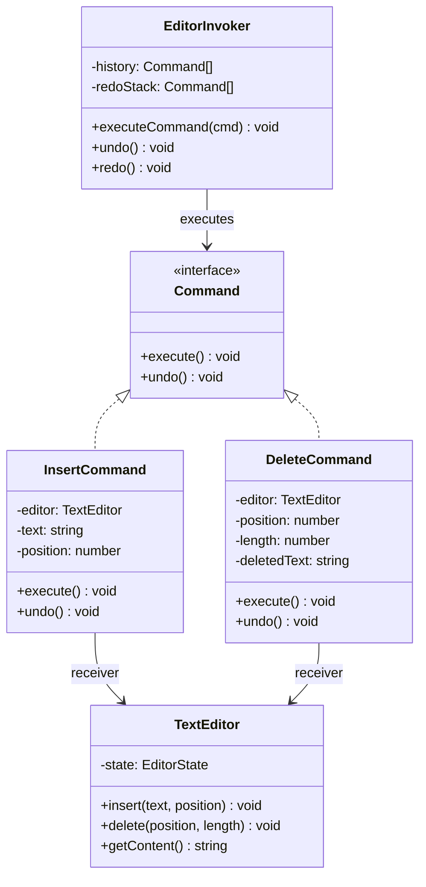

---
tags:
  - design-pattern
  - comp-sci
gardening: 🌿
date: 2026-06-07
reference:
  - https://github.com/deepakkum21/Books/blob/master/Design%20Patterns%20-%20Elements%20of%20Reusable%20Object%20Oriented%20Software%20-%20GOF.pdf
  - https://refactoring.guru/design-patterns/command
  - https://en.wikipedia.org/wiki/Command_pattern
---
## What & Why

The Command pattern converts a method call into a first-class object. Instead of directly invoking an operation on a receiver, you package the operation, its arguments, and the receiver reference into an object that can be stored, passed around, queued, logged, or reversed.

A method call is ephemeral. Once you call `editor.delete(0, 5)`, that invocation is gone. You have no record of what happened, no way to reverse it, and no way to schedule it for later. Systems that require undo/redo, transaction logs, task queues, or macro recording all need invocations to be persistent, inspectable, and reversible.

The GoF identify four distinct capabilities the pattern unlocks:

1. **Parameterization**: Pass different commands to the same invoker (e.g., a toolbar button can hold any command)
2. **Queueing and scheduling**: Store commands for deferred or sequential execution
3. **Logging and auditing**: Persist commands to reconstruct system state
4. **Undo/redo**: Each command knows its own inverse

The pattern has three roles. The **Receiver** knows how to perform the actual operation. The **Command** encapsulates an operation and its arguments. The **Invoker** calls `execute()` on commands without knowing what they do.

Real-world appearances include text editor undo/redo stacks, database transaction logs, job queues (Bull, BullMQ), and GUI action histories.

## Structure Diagram



## Traditional Class-Based Implementation

```typescript
type EditorState = {
  content: string;
  cursorPos: number;
};

// Receiver: knows how to perform operations, has no knowledge of commands
class TextEditor {
  private state: EditorState = { content: '', cursorPos: 0 };

  insert(text: string, position: number): void {
    const { content } = this.state;
    this.state = {
      content: content.slice(0, position) + text + content.slice(position),
      cursorPos: position + text.length,
    };
  }

  delete(position: number, length: number): void {
    const { content } = this.state;
    this.state = {
      content: content.slice(0, position) + content.slice(position + length),
      cursorPos: position,
    };
  }

  getContent(): string { return this.state.content; }
}

// Command contract
type Command = {
  execute(): void;
  undo(): void;
};

// Concrete command: insert text
class InsertCommand implements Command {
  private readonly editor: TextEditor;
  private readonly text: string;
  private readonly position: number;

  constructor(editor: TextEditor, text: string, position: number) {
    this.editor   = editor;
    this.text     = text;
    this.position = position;
  }

  execute(): void { this.editor.insert(this.text, this.position); }
  undo(): void    { this.editor.delete(this.position, this.text.length); }
}

// Concrete command: delete text
// NOTE: must capture deleted text during execute() for undo to work
class DeleteCommand implements Command {
  private readonly editor: TextEditor;
  private readonly position: number;
  private readonly length: number;
  private deletedText = ''; // mutable state captured at execute() time

  constructor(editor: TextEditor, position: number, length: number) {
    this.editor   = editor;
    this.position = position;
    this.length   = length;
  }

  execute(): void {
    this.deletedText = this.editor.getContent().slice(
      this.position,
      this.position + this.length,
    );
    this.editor.delete(this.position, this.length);
  }

  undo(): void { this.editor.insert(this.deletedText, this.position); }
}

// Invoker: manages history, has no knowledge of what commands do
class EditorInvoker {
  private readonly history: Command[]   = [];
  private readonly redoStack: Command[] = [];

  executeCommand(command: Command): void {
    command.execute();
    this.history.push(command);
    this.redoStack.length = 0; // new command invalidates redo history
  }

  undo(): void {
    const command = this.history.pop();
    if (command !== undefined) {
      command.undo();
      this.redoStack.push(command);
    }
  }

  redo(): void {
    const command = this.redoStack.pop();
    if (command !== undefined) {
      command.execute();
      this.history.push(command);
    }
  }
}

// Usage
const editor  = new TextEditor();
const invoker = new EditorInvoker();

invoker.executeCommand(new InsertCommand(editor, 'Hello',  0));
invoker.executeCommand(new InsertCommand(editor, ' World', 5));
console.log(editor.getContent()); // 'Hello World'

invoker.undo();
console.log(editor.getContent()); // 'Hello'

invoker.redo();
console.log(editor.getContent()); // 'Hello World'

invoker.executeCommand(new DeleteCommand(editor, 0, 5));
console.log(editor.getContent()); // ' World'

invoker.undo();
console.log(editor.getContent()); // 'Hello World'
```

**Key Characteristics**:

- **Receiver decoupling**: `EditorInvoker` calls `execute()` with no knowledge of `TextEditor`. The receiver is wired inside the command at construction time
- **Mutable undo capture**: `DeleteCommand` stores `deletedText` as a mutable field that is populated during `execute()`, creating a temporal dependency between `execute()` and `undo()`
- **History as command array**: The invoker's `history` array stores original command objects; `undo()` traverses it in reverse calling `.undo()`
- **Redo invalidation**: Executing a new command clears the redo stack, which is standard editor behavior
- **Receiver reference embedded in command**: Each command instance holds a hard reference to the specific receiver it was created with

## Function-Based Alternative

We achieve Command behavior through:

1. **Command as a pure state function**: Instead of a class with side-effectful `execute()` and `undo()` methods, a command is a pure function `(state: EditorState) => CommandResult` that takes a state value and returns a new state value
2. **Undo captured at execution time via return value**: The `CommandResult` includes both the next state and the corresponding `undoCommand` computed from the current state. This replaces the mutable `this.deletedText` field with a value returned at execution time
3. **Symmetric undo/redo structure**: Because every command returns its inverse, calling the undo command itself returns the redo command. There is no special redo logic, only the same `Command` type applied recursively
4. **Invoker as pure state transitions**: `executeCommand`, `undoLast`, and `redoLast` are pure functions over `InvokerState`. No side effects, no mutation, full reproducibility
5. **No receiver coupling**: Commands operate on a state value passed in at call time rather than a receiver captured at construction time. The same command function applies to any compatible state

```typescript
type EditorState = {
  readonly content: string;
  readonly cursorPos: number;
};

type CommandResult = {
  readonly newState: EditorState;
  readonly undoCommand: Command;    // the inverse, computed at execution time
};

type Command = (state: EditorState) => CommandResult;

type InvokerState = {
  readonly editorState: EditorState;
  readonly undoStack: ReadonlyArray<Command>;
  readonly redoStack: ReadonlyArray<Command>;
};

// Command factories: pure functions, no receiver reference required
const insertCommand = (text: string, position: number): Command =>
  (state) => ({
    newState: {
      content:   state.content.slice(0, position) + text + state.content.slice(position),
      cursorPos: position + text.length,
    },
    undoCommand: deleteCommand(position, text.length),
  });

const deleteCommand = (position: number, length: number): Command =>
  (state) => {
    // captured here at execution time, not in a mutable field
    const deleted = state.content.slice(position, position + length);
    return {
      newState: {
        content:   state.content.slice(0, position) + state.content.slice(position + length),
        cursorPos: position,
      },
      undoCommand: insertCommand(deleted, position),
    };
  };

// Invoker: pure state transitions, no mutation
const executeCommand = (invoker: InvokerState, command: Command): InvokerState => {
  const { newState, undoCommand } = command(invoker.editorState);
  return {
    editorState: newState,
    undoStack:   [...invoker.undoStack, undoCommand],
    redoStack:   [],  // new execution invalidates redo history
  };
};

const undoLast = (invoker: InvokerState): InvokerState => {
  const { undoStack, editorState } = invoker;
  if (undoStack.length === 0) return invoker;

  const undoCommand = undoStack[undoStack.length - 1];
  const { newState, undoCommand: redoCommand } = undoCommand(editorState);

  return {
    editorState: newState,
    undoStack:   undoStack.slice(0, -1),
    redoStack:   [...invoker.redoStack, redoCommand],
  };
};

const redoLast = (invoker: InvokerState): InvokerState => {
  const { redoStack, editorState } = invoker;
  if (redoStack.length === 0) return invoker;

  const redoCommand = redoStack[redoStack.length - 1];
  const { newState, undoCommand } = redoCommand(editorState);

  return {
    editorState: newState,
    undoStack:   [...invoker.undoStack, undoCommand],
    redoStack:   redoStack.slice(0, -1),
  };
};

// Usage
const empty: InvokerState = {
  editorState: { content: '', cursorPos: 0 },
  undoStack:   [],
  redoStack:   [],
};

const s1 = executeCommand(empty, insertCommand('Hello',  0));
const s2 = executeCommand(s1,    insertCommand(' World', 5));
console.log(s2.editorState.content); // 'Hello World'

const s3 = undoLast(s2);
console.log(s3.editorState.content); // 'Hello'

const s4 = redoLast(s3);
console.log(s4.editorState.content); // 'Hello World'

const s5 = executeCommand(s4, deleteCommand(0, 5));
console.log(s5.editorState.content); // ' World'

const s6 = undoLast(s5);
console.log(s6.editorState.content); // 'Hello World'
```

## Comparison: Class vs Function

| Aspect | Class-based | Function-based |
| --- | --- | --- |
| Command unit | Class with `execute()` and `undo()` methods | Pure function `(state) => { newState, undoCommand }` |
| Undo capture mechanism | Mutable field set as a side effect of `execute()` | Value returned from the command at execution time |
| Receiver coupling | Hard reference captured at construction | No receiver; operates on a passed state value |
| History storage | Original command objects (`.undo()` called in reverse) | Undo command functions stored directly |
| Redo mechanism | Re-calls `.execute()` on stored command objects | Symmetric: calling undo's undo produces redo |
| Mutability | `deletedText` field mutated at runtime | All state transitions return new values |
| Testability | Requires receiver instance wired to command | Pure function, no setup required |
| Temporal coupling | `undo()` is only valid after `execute()` has run | No temporal coupling; undo is returned as a value |

### Problems with Traditional Class-Based Command

1. **Temporal coupling in undo capture**: `DeleteCommand.undo()` is only correct after `execute()` has been called to populate `this.deletedText`. Calling `undo()` on a fresh instance returns an empty string silently. The type system cannot enforce call order.
2. **Mutable command state**: `deletedText` is mutable state on the command object. If `execute()` is called a second time (perhaps the command is erroneously replayed), the field is overwritten and the original undo information is lost.
3. **Receiver reference lock-in**: Each command instance is permanently bound to one specific receiver at construction time. You cannot apply the same command logic to a different receiver or a test double without constructing a new instance.
4. **Redo requires re-execution of potentially impure commands**: Redo in the class-based version calls `.execute()` again on the same command object. If `execute()` had any non-deterministic behavior (timestamp, random ID), the redo produces a different result than the original execution.
5. **Class proliferation**: Every distinct operation requires a full class with a constructor, `execute()`, and `undo()`. A ten-operation editor requires ten command classes, where the functional approach requires ten factory functions.
