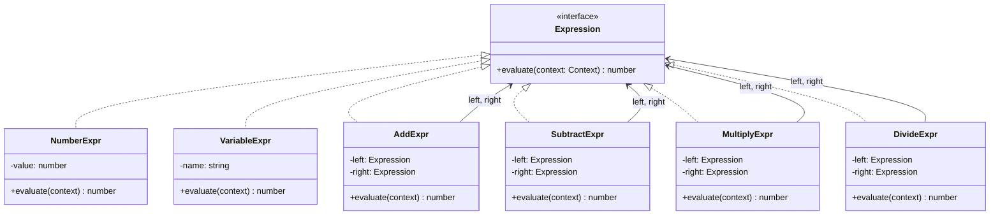

---
tags:
  - design-pattern
  - comp-sci
gardening: 🌿
date: 2026-06-07
reference:
  - https://github.com/deepakkum21/Books/blob/master/Design%20Patterns%20-%20Elements%20of%20Reusable%20Object%20Oriented%20Software%20-%20GOF.pdf
  - https://en.wikipedia.org/wiki/Interpreter_pattern
---
## What & Why

The Interpreter pattern defines a grammar for a language and provides an interpreter to evaluate sentences in that grammar. Each grammar rule becomes a class, and a sentence in the language is represented as a tree of those objects, an Abstract Syntax Tree (AST). To evaluate a sentence, you traverse the tree.

Certain categories of problems recur in a form that can be expressed as a simple language or formula. Rather than hardcoding every possible variant of the formula in procedural logic, you represent the structure of the formula as data (an AST) and write a single traversal to evaluate it.

Classic real-world applications include arithmetic expression evaluation (`x + y * 2`), Boolean filter languages (`status:active AND NOT banned`), SQL WHERE clause evaluation, regular expression matching, and template placeholder systems (`Hello, {{name}}!`).

GoF explicitly constrain when this pattern is appropriate on two axes:

1. **Grammar complexity**: Each rule becomes a class. A grammar with 20 rules produces 20 classes, and complex grammars become unmanageable. For anything beyond simple grammars, use a dedicated parser generator (ANTLR, tree-sitter, nearley).
2. **Performance requirements**: An interpreted AST traversal has overhead. If performance is critical, compile the AST to bytecode or a lower-level representation.

The GoF also note that the Interpreter pattern is structurally identical to the Composite pattern. Terminal expressions (numbers, variables) are leaves; non-terminal expressions (operators) are composites holding child expressions. Interpreting is recursive Composite traversal.

## Structure Diagram



## Traditional Class-Based Implementation

The expression `(x + 2) * (y - 1)` is represented as an object tree:

```
Multiply(
  Add(Variable("x"), Number(2)),
  Subtract(Variable("y"), Number(1))
)
```

Each node in that tree is an instance of a class corresponding to one grammar rule.

```typescript
type Context = Readonly<Record<string, number>>;

type Expression = {
  evaluate(context: Context): number;
};

// Terminal expressions (leaves): no children, hold a value directly
class NumberExpr implements Expression {
  constructor(private readonly value: number) {}

  evaluate(_context: Context): number {
    return this.value;
  }
}

class VariableExpr implements Expression {
  constructor(private readonly name: string) {}

  evaluate(context: Context): number {
    if (!(this.name in context)) {
      throw new Error(`Undefined variable: ${this.name}`);
    }
    return context[this.name];
  }
}

// Non-terminal expressions (composites): hold child Expression references
class AddExpr implements Expression {
  constructor(
    private readonly left: Expression,
    private readonly right: Expression,
  ) {}

  evaluate(context: Context): number {
    return this.left.evaluate(context) + this.right.evaluate(context);
  }
}

class SubtractExpr implements Expression {
  constructor(
    private readonly left: Expression,
    private readonly right: Expression,
  ) {}

  evaluate(context: Context): number {
    return this.left.evaluate(context) - this.right.evaluate(context);
  }
}

class MultiplyExpr implements Expression {
  constructor(
    private readonly left: Expression,
    private readonly right: Expression,
  ) {}

  evaluate(context: Context): number {
    return this.left.evaluate(context) * this.right.evaluate(context);
  }
}

class DivideExpr implements Expression {
  constructor(
    private readonly left: Expression,
    private readonly right: Expression,
  ) {}

  evaluate(context: Context): number {
    const divisor = this.right.evaluate(context);
    if (divisor === 0) throw new Error('Division by zero');
    return this.left.evaluate(context) / divisor;
  }
}

// Usage: (x + 2) * (y - 1)
const ast: Expression = new MultiplyExpr(
  new AddExpr(new VariableExpr('x'), new NumberExpr(2)),
  new SubtractExpr(new VariableExpr('y'), new NumberExpr(1)),
);

const context: Context = { x: 3, y: 5 };

console.log(ast.evaluate(context)); // (3 + 2) * (5 - 1) = 20
```

**Key Characteristics**:

- **One class per grammar rule**: Every terminal and non-terminal in the grammar maps to a dedicated class; the grammar structure is reflected directly in the class hierarchy
- **AST as a nested object tree**: Sentences are represented by nesting constructor calls, producing a tree whose shape matches the grammatical structure of the expression
- **Recursive `evaluate()`**: Non-terminal nodes delegate to their children and combine the results; tree traversal and evaluation are the same operation
- **Context as an explicit parameter**: Variable bindings are passed as an immutable `Context` object at interpretation time rather than stored as mutable state
- **Composite identity**: Terminal expressions are leaves, non-terminal expressions are composites; this is structurally the Composite pattern applied to grammar rules

## Function-Based Alternative

We achieve Interpreter behavior through:

1. **Discriminated union as the AST type**: All expression variants are encoded in a single `Expr` union type. Each variant carries exactly the data it needs; there is no class hierarchy or virtual dispatch
2. **Exhaustive `switch` as the evaluator**: A single `evaluate` function pattern-matches on the `kind` discriminant field. TypeScript's control flow analysis narrows the type inside each case and flags unhandled variants at compile time
3. **Smart constructors**: Plain factory functions (`num`, `variable`, `add`, etc.) build AST nodes as ordinary data objects. They compose cleanly with no `new` keyword
4. **Expression Problem advantage**: Adding a new interpreter operation (`prettyPrint`, `typeCheck`, `compile`) is a new standalone function with its own `switch`. No existing code is modified. In the OOP approach, this requires adding a method to every class
5. **AST is plain data**: Because nodes are plain objects, the AST can be logged, serialized to JSON, compared structurally, or passed across process boundaries with no additional work

```typescript
type Context = Readonly<Record<string, number>>;

// Discriminated union: the complete grammar encoded as a type
type NumberNode = { readonly kind: 'number';   readonly value: number };
type VariableNode = { readonly kind: 'variable'; readonly name: string  };
type BinaryNode = {
  readonly kind: 'add' | 'subtract' | 'multiply' | 'divide';
  readonly left: Expr;
  readonly right: Expr;
};

type Expr = NumberNode | VariableNode | BinaryNode;

// Smart constructors: build AST nodes as plain data objects
const num = (value: number): NumberNode => ({ kind: 'number', value });
const variable = (name: string): VariableNode => ({ kind: 'variable', name  });
const add = (left: Expr, right: Expr): BinaryNode => ({ kind: 'add', left, right });
const subtract = (left: Expr, right: Expr): BinaryNode => ({ kind: 'subtract', left, right });
const multiply = (left: Expr, right: Expr): BinaryNode => ({ kind: 'multiply', left, right });
const divide = (left: Expr, right: Expr): BinaryNode => ({ kind: 'divide', left, right });

// First interpreter: evaluate to a number
// TypeScript narrows Expr at each case; a missing case is a compile error
const evaluate = (expr: Expr, context: Context): number => {
  switch (expr.kind) {
    case 'number':
      return expr.value;

    case 'variable':
      if (!(expr.name in context)) {
	      throw new Error(`Undefined variable: ${expr.name}`);
	    }
      return context[expr.name];

    case 'add':
      return evaluate(expr.left, context) + evaluate(expr.right, context);

    case 'subtract':
      return evaluate(expr.left, context) - evaluate(expr.right, context);

    case 'multiply':
      return evaluate(expr.left, context) * evaluate(expr.right, context);

    case 'divide': {
      const divisor = evaluate(expr.right, context);
      if (divisor === 0) {
	      throw new Error('Division by zero');
	    }
      return evaluate(expr.left, context) / divisor;
    }
  }
};

// Second interpreter over the same AST: no class changes required
// Adding this in OOP requires a new method on every Expression class
const prettyPrint = (expr: Expr): string => {
  switch (expr.kind) {
    case 'number': return String(expr.value);
    case 'variable': return expr.name;
    case 'add': return `(${prettyPrint(expr.left)} + ${prettyPrint(expr.right)})`;
    case 'subtract': return `(${prettyPrint(expr.left)} - ${prettyPrint(expr.right)})`;
    case 'multiply': return `(${prettyPrint(expr.left)} * ${prettyPrint(expr.right)})`;
    case 'divide': return `(${prettyPrint(expr.left)} / ${prettyPrint(expr.right)})`;
  }
};

// Usage: (x + 2) * (y - 1)
const ast = multiply(
  add(variable('x'), num(2)),
  subtract(variable('y'), num(1)),
);

const context: Context = { x: 3, y: 5 };

console.log(evaluate(ast, context)); // 20
console.log(prettyPrint(ast));       // ((x + 2) * (y - 1))

// The AST is plain data: serializes natively
console.log(JSON.stringify(ast, null, 2));
```

## Comparison: Class vs Function

| Aspect | Class-based | Function-based |
| --- | --- | --- |
| Grammar representation | One class per rule | One variant per union member |
| New expression type | New class implementing `Expression` | New variant added to union type |
| New operation over AST | New method added to every class | New standalone function with its own `switch` |
| Exhaustiveness checking | No compiler enforcement | TypeScript narrows to `never` on unhandled variant |
| AST construction | Nested `new` calls | Composed smart constructor functions |
| AST as data | Object instances with behavior attached | Plain data objects, fully serializable |
| Multiple interpreters | Each requires modifying all classes | Each is an independent function |
| Testability | Requires class instantiation | Plain objects constructable with object literals |

### Problems with Traditional Class-Based Interpreter

1. **Class proliferation**: A grammar with 20 rules produces at minimum 20 classes. As the grammar grows, the number of files grows linearly with it.
2. **The Expression Problem, operations side**: Adding a new operation over the AST (`prettyPrint`, `typeCheck`, `compile`) requires adding a method to every existing class. There is no way to add an operation without touching all grammar rule files.
3. **No exhaustiveness checking**: Adding a new `Expression` subclass gives no compiler signal that existing switch statements or if-chains elsewhere are now incomplete. Missing cases are silent and produce incorrect runtime behavior.
4. **Evaluation logic is scattered**: To understand what `evaluate` does for `AddExpr`, you read `AddExpr.ts`. For `MultiplyExpr`, you read a different file. The complete semantics of the language have no single location; they are distributed across the entire class hierarchy.
5. **AST instances are not serializable as plain data**: An expression tree is a graph of class instances with behavior methods attached. Serializing it to JSON for caching, logging, or transmitting across a network requires a separate serialization layer. The discriminated union AST serializes natively.
