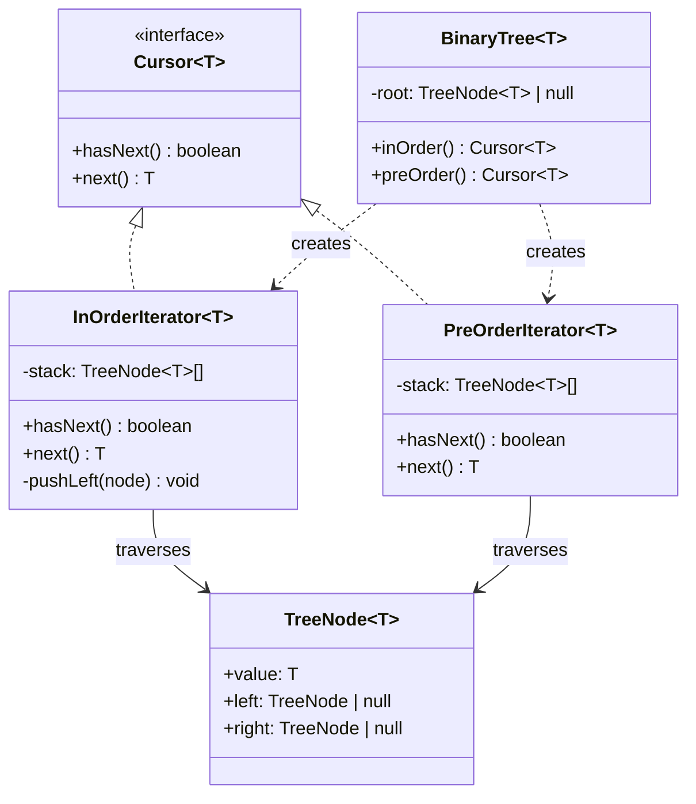

---
tags:
  - design-pattern
  - comp-sci
gardening: 🌿
date: 2026-06-07
reference:
  - https://github.com/deepakkum21/Books/blob/master/Design%20Patterns%20-%20Elements%20of%20Reusable%20Object%20Oriented%20Software%20-%20GOF.pdf
  - https://refactoring.guru/design-patterns/iterator
  - https://en.wikipedia.org/wiki/Iterator_pattern
---
## What & Why

The Iterator pattern provides a way to access elements of a collection sequentially without exposing the collection's underlying representation. The pattern decouples traversal logic from data structure internals.

A collection can be organized in many different ways internally (array, linked list, tree, graph), and each organization requires different traversal logic. If client code accesses the internal structure directly to traverse it, the client couples itself to that representation. Change the structure and all traversal code breaks.

Iterator solves this by presenting a uniform two-method contract regardless of the underlying structure: `hasNext()` to check whether elements remain, and `next()` to retrieve the next one. The client traverses any collection through this same interface without ever knowing how the data is organized.

GoF identify a critical distinction between two styles:

**External iterators**: The client controls traversal by calling `hasNext()` and `next()` explicitly. Multiple independent iterators can traverse the same collection simultaneously, each maintaining its own cursor position.

**Internal iterators**: The collection controls traversal and calls a client-provided callback for each element. More convenient, but less flexible. JavaScript's `Array.prototype.forEach` is an internal iterator.

This is also one of the most **language-integrated** patterns in JavaScript and TypeScript. The spec defines an official Iterator protocol on `Symbol.iterator`, generators implement it automatically via `yield`, and `for...of` is syntax sugar for consuming any object that implements it. The GoF pattern is literally encoded into the language standard.

## Structure Diagram



## Traditional Class-Based Implementation

A binary search tree is the ideal example domain because different traversal orders (in-order, pre-order, post-order) each require distinct algorithms, yet client code should not care which is used. In-order traversal for a BST visits nodes in sorted order, but it is naturally recursive. The iterative class must manually simulate the call stack using an explicit stack data structure.

```typescript
type TreeNode<T> = {
  readonly value: T;
  readonly left:  TreeNode<T> | null;
  readonly right: TreeNode<T> | null;
};

// GoF-style iterator contract (not the native JS Iterator protocol)
type Cursor<T> = {
  hasNext(): boolean;
  next(): T;
};

// Utility: build tree nodes and leaves
const node = <T>(
  value: T,
  left:  TreeNode<T> | null = null,
  right: TreeNode<T> | null = null,
): TreeNode<T> => ({ value, left, right });

// In-order: left subtree, root, right subtree (sorted order for BST)
// Simulates recursive traversal with an explicit stack
class InOrderIterator<T> implements Cursor<T> {
  private readonly stack: TreeNode<T>[] = [];

  constructor(root: TreeNode<T> | null) {
    this.pushLeft(root);
  }

  // Push all nodes along the left spine; the top of the stack is always next
  private pushLeft(node: TreeNode<T> | null): void {
    let current = node;
    while (current !== null) {
      this.stack.push(current);
      current = current.left;
    }
  }

  hasNext(): boolean { return this.stack.length > 0; }

  next(): T {
    if (!this.hasNext()) throw new Error('Iterator exhausted');
    const current = this.stack.pop()!;
    // After visiting a node, descend into its right subtree's left spine
    this.pushLeft(current.right);
    return current.value;
  }
}

// Pre-order: root, left subtree, right subtree
class PreOrderIterator<T> implements Cursor<T> {
  private readonly stack: TreeNode<T>[] = [];

  constructor(root: TreeNode<T> | null) {
    if (root !== null) this.stack.push(root);
  }

  hasNext(): boolean { return this.stack.length > 0; }

  next(): T {
    if (!this.hasNext()) throw new Error('Iterator exhausted');
    const current = this.stack.pop()!;
    // Right pushed first so left is popped (processed) first
    if (current.right !== null) this.stack.push(current.right);
    if (current.left  !== null) this.stack.push(current.left);
    return current.value;
  }
}

// Usage
//       4
//      / \
//     2   6
//    / \ / \
//   1  3 5  7
const tree = node(4,
  node(2, node(1), node(3)),
  node(6, node(5), node(7)),
);

const inOrd = new InOrderIterator(tree);
const inOrderResult: number[] = [];
while (inOrd.hasNext()) {
  inOrderResult.push(inOrd.next());
}
console.log(inOrderResult); // [1, 2, 3, 4, 5, 6, 7]

const preOrd = new PreOrderIterator(tree);
const preOrderResult: number[] = [];
while (preOrd.hasNext()) {
  preOrderResult.push(preOrd.next());
}
console.log(preOrderResult); // [4, 2, 1, 3, 6, 5, 7]
```

**Key Characteristics**:

- **Explicit stack simulates recursion**: In-order traversal is naturally recursive; the iterative version must manually manage a stack to preserve traversal state between `next()` calls
- **External iteration**: The client drives the loop via `hasNext()`/`next()`, enabling early termination, interleaving iterators, or pausing mid-traversal
- **One class per traversal order**: Each traversal strategy is a separate class with its own distinct stack management logic
- **Mutable single-use state**: The `stack` is consumed as the iterator advances; a second pass requires constructing a new instance
- **No language protocol integration**: This custom `Cursor<T>` does not implement `Symbol.iterator` and does not work with `for...of`, spread, or `Array.from()` without an adapter

## Function-Based Alternative

We achieve Iterator behavior through:

1. **Generators as lazy sequences**: A generator function (`function*`) suspends execution at each `yield`, automatically preserving the call stack between invocations. There is no manual stack to manage.
2. **`yield*` for recursive delegation**: `yield* inOrder(subtree)` recursively delegates to another generator and produces all of its values inline. The recursive structure of the generator mirrors the recursive structure of the algorithm directly.
3. **Native protocol integration**: Generator functions automatically implement `Symbol.iterator`. They work with `for...of`, spread, `Array.from()`, and destructuring with no adapter or wrapper code.
4. **New traversal as a new function**: Each traversal order is a standalone generator function. Adding post-order traversal is a four-line function rather than a new class with stack management.
5. **Lazy evaluation by default**: A generator computes nothing until the consumer requests the next value. A lazy pipeline over a million-node tree that takes only the first ten even values performs exactly as many steps as needed and no more.

```typescript
// Tree as a discriminated union
type EmptyNode = { readonly kind: 'empty' };
type TreeNode<T> = {
  readonly kind:  'node';
  readonly value: T;
  readonly left:  Tree<T>;
  readonly right: Tree<T>;
};
type Tree<T> = EmptyNode | TreeNode<T>;

const empty = <T>(): Tree<T> => ({ kind: 'empty' });
const node  = <T>(value: T, left: Tree<T>, right: Tree<T>): Tree<T> =>
  ({ kind: 'node', value, left, right });
const leaf  = <T>(value: T): Tree<T> => node(value, empty(), empty());

// In-order: left, root, right
// Three body lines; reads exactly like the recursive definition
function* inOrder<T>(tree: Tree<T>): Generator<T> {
  if (tree.kind === 'empty') return;
  yield* inOrder(tree.left);
  yield  tree.value;
  yield* inOrder(tree.right);
}

// Pre-order: root, left, right
function* preOrder<T>(tree: Tree<T>): Generator<T> {
  if (tree.kind === 'empty') return;
  yield  tree.value;
  yield* preOrder(tree.left);
  yield* preOrder(tree.right);
}

// Post-order: left, right, root
// Adding a third traversal strategy is a new function, not a new class
function* postOrder<T>(tree: Tree<T>): Generator<T> {
  if (tree.kind === 'empty') return;
  yield* postOrder(tree.left);
  yield* postOrder(tree.right);
  yield  tree.value;
}

// Lazy pipeline utilities: compose with any Iterable<T>
function* take<T>(iter: Iterable<T>, n: number): Generator<T> {
  let count = 0;
  for (const val of iter) {
    if (count >= n) return;
    yield val;
    count++;
  }
}

function* filterIter<T>(iter: Iterable<T>, pred: (v: T) => boolean): Generator<T> {
  for (const val of iter) {
    if (pred(val)) yield val;
  }
}

// Usage
//       4
//      / \
//     2   6
//    / \ / \
//   1  3 5  7
const tree = node(4,
  node(2, leaf(1), leaf(3)),
  node(6, leaf(5), leaf(7)),
);

// for...of works natively: generators implement Symbol.iterator
for (const val of inOrder(tree)) {
  process.stdout.write(`${val} `); // 1 2 3 4 5 6 7
}

// Spread into arrays
console.log([...preOrder(tree)]);  // [4, 2, 1, 3, 6, 5, 7]
console.log([...postOrder(tree)]); // [1, 3, 2, 5, 7, 6, 4]

// Lazy pipeline: only traverses nodes until two even values are found.
// No intermediate array is allocated at any stage.
const firstTwoEvens = [...take(filterIter(inOrder(tree), v => v % 2 === 0), 2)];
console.log(firstTwoEvens); // [2, 4]
```

## Comparison: Class vs Function

| Aspect | Class-based | Function-based |
| --- | --- | --- |
| Traversal state | Explicit stack mutated on each `next()` call | Implicit in the generator's suspended call frame |
| New traversal order | New class with its own stack management | New generator function |
| Language protocol | Custom `Cursor<T>`, no `for...of` | Native `Symbol.iterator` via generator |
| Lazy evaluation | Client breaks early from the `while` loop | Native via `yield`; computation suspends automatically |
| Recursive algorithms | Must be rewritten as iterative with manual stack | `yield*` expresses recursion directly |
| Composability | Requires adapter code for language integration | Works with `for...of`, spread, `Array.from()` |
| Multiple simultaneous | Separate instances share no state | Each `inOrder(tree)` call returns an independent iterator |
| Adding a third traversal | New class file | Four-line function |

### Problems with Traditional Class-Based Iterator

1. **Manual call stack reconstruction**: Recursive traversal must be converted to iterative form with an explicit stack. The push/pop logic for in-order traversal requires careful reasoning about left-spine ordering; it is not obvious code and it is not how the algorithm is naturally described.
2. **One class per traversal**: Each traversal order is a separate class. Three traversals, three classes, three files worth of nearly identical stack management boilerplate.
3. **No language protocol integration**: The custom `Cursor<T>` type is not the built-in JS iterator protocol. Using it with `for...of`, spread, or `Array.from()` requires wrapping it in an adapter that implements `Symbol.iterator`.
4. **Single-use state**: The iterator's stack is consumed as it advances. There is no reset mechanism; a second traversal requires constructing a new instance pointing at the original root.
5. **No lazy composition**: Building a lazy filter or map over the iterator requires either a separate decorator class wrapping the iterator or materializing the entire sequence into an array first. The generator pipeline composes lazily with zero intermediate allocation.
