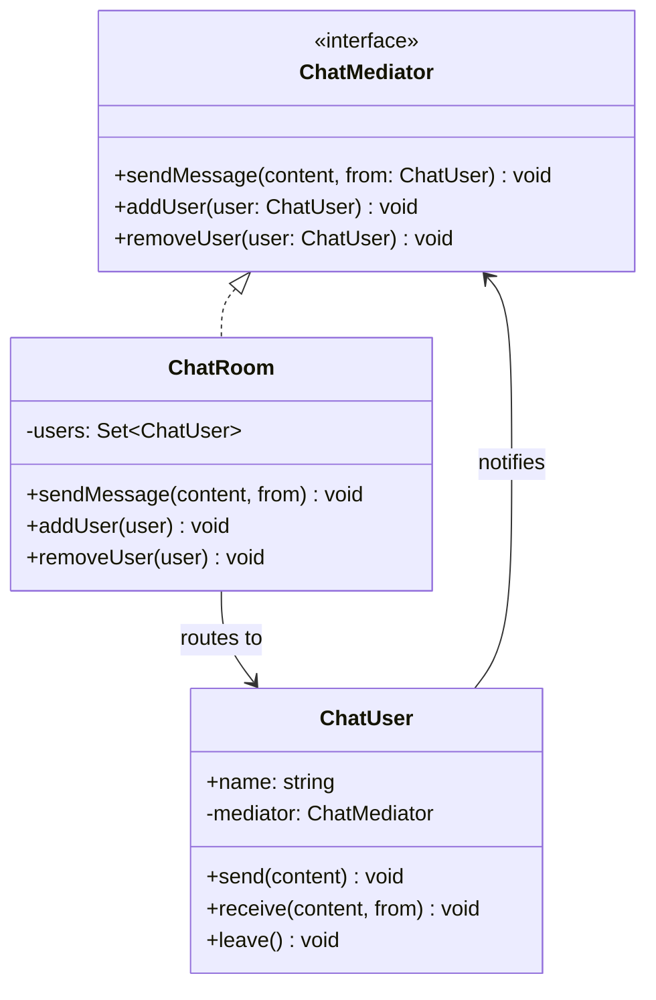

---
tags:
  - design-pattern
  - comp-sci
gardening: 🌿
date: 2026-06-07
reference:
---
## What & Why

The Mediator pattern defines a central coordinator object that encapsulates how a set of objects interact. Instead of objects communicating directly with each other, they communicate exclusively through the mediator. This promotes loose coupling by ensuring that no object holds a direct reference to any other object it collaborates with.

As the number of objects in a system grows, the number of direct connections between them grows quadratically. With five objects that each communicate with all others you have 20 directional connections. With ten objects you have 90. Each connection is a dependency: a change to one object potentially requires changes to every object it is wired to. Adding a new object requires wiring it to all existing objects. This is the N-to-N coupling problem.

The GoF motivate this concretely with a GUI dialog box. A dialog may have a filename input, a filter dropdown, a file list, and an OK button. The OK button should only be enabled when a filename is present. The file list should update when the filter changes. Naive implementation has each control hold a reference to every control it affects. Change any control and you must update all its collaborators. The Mediator pattern replaces all of those direct wires with a single central coordinator.

The Mediator solves N-to-N coupling by reducing it to N-to-1. Each object knows only the mediator. The mediator knows all participants. The dependency graph collapses from a mesh to a star topology.

Real-world appearances include air traffic control towers (aircraft communicate through the tower, not with each other), chat room servers, Redux/Flux stores (components dispatch to a central store rather than calling each other), and DOM event delegation.

## Structure Diagram



## Traditional Class-Based Implementation

```typescript
// Mediator contract: the only thing a colleague needs to know about
type ChatMediator = {
  sendMessage(content: string, from: ChatUser): void;
  addUser(user: ChatUser): void;
  removeUser(user: ChatUser): void;
};

// Colleague: holds a reference to the mediator only, never to other users
class ChatUser {
  readonly name: string;
  private readonly mediator: ChatMediator;

  constructor(name: string, mediator: ChatMediator) {
    this.name     = name;
    this.mediator = mediator;
    mediator.addUser(this);
  }

  send(content: string): void {
    console.log(`[${this.name}] => "${content}"`);
    this.mediator.sendMessage(content, this);
  }

  // Called by the mediator; the user never calls this on another user directly
  receive(content: string, from: ChatUser): void {
    console.log(`[${this.name}] <= "${content}" (from ${from.name})`);
  }

  leave(): void {
    this.mediator.removeUser(this);
    console.log(`[${this.name}] left the room`);
  }
}

// Concrete mediator: owns all routing logic
class ChatRoom implements ChatMediator {
  private readonly users: Set<ChatUser> = new Set();

  addUser(user: ChatUser): void    { this.users.add(user);    }
  removeUser(user: ChatUser): void { this.users.delete(user); }

  sendMessage(content: string, from: ChatUser): void {
    this.users.forEach(user => {
      if (user !== from) {
        user.receive(content, from);
      }
    });
  }
}

// Usage
const room = new ChatRoom();

const alice = new ChatUser('Alice', room);
const bob   = new ChatUser('Bob',   room);
const carol = new ChatUser('Carol', room);

alice.send('Hello everyone!');
// [Bob]   <= "Hello everyone!" (from Alice)
// [Carol] <= "Hello everyone!" (from Alice)

bob.send('Hey Alice!');
// [Alice] <= "Hey Alice!" (from Bob)
// [Carol] <= "Hey Alice!" (from Bob)

carol.leave();
// [Carol] left the room

alice.send('Just Alice and Bob now');
// [Bob] <= "Just Alice and Bob now" (from Alice)
```

**Key Characteristics**:

- **Colleagues hold no cross-references**: `ChatUser` never holds a reference to another `ChatUser`; it only knows the `ChatMediator`. This is the pattern's core structural invariant.
- **N-to-1 dependency graph**: Every colleague depends on the mediator; the mediator depends on every colleague. The mesh of connections collapses to a star.
- **Routing logic centralized**: All decisions about who receives which messages live in `ChatRoom.sendMessage()`. Adding routing rules (private messages, roles, moderation) means editing one class.
- **Mediator registers colleagues**: Colleagues self-register via the constructor, keeping the mediator's participant list synchronized with object lifetime
- **Bidirectional coupling is explicit**: The mediator knows all colleagues (the intended trade-off); colleagues know only the mediator (the benefit)

## Function-Based Alternative

We achieve Mediator behavior through:

1. **Typed event bus as the mediator**: The mediator becomes a generic `EventBus<Events>` parameterized by an event map type. This gives full compile-time type safety on event names and payload shapes; an invalid event name or wrong payload type is a type error, not a runtime bug.
2. **Colleagues as factory closures**: Each participant is created by a factory function that registers handlers on the bus and returns a plain object. No class, no `this`, and no inheritance required.
3. **Subscriptions as routing**: Instead of a single `sendMessage` method that imperatively routes to participants, each participant registers a handler that decides what to do when it receives an event. The routing is expressed as declarations.
4. **Unsubscribe via returned function**: `bus.on(event, handler)` returns a teardown function. When a participant leaves, it calls its saved unsubscribe functions. Teardown is a value, not a separate imperative `removeUser` call.
5. **Domain-agnostic bus**: The event bus has no knowledge of chat, users, or any domain concept. The same bus is reusable for any event-driven coordination scenario by changing the `Events` type parameter.

```typescript
type EventMap = Record<string, unknown>;

type EventBus<Events extends EventMap> = {
  emit<K extends keyof Events>(event: K, payload: Events[K]): void;
  on<K extends keyof Events>(
    event: K,
    handler: (payload: Events[K]) => void,
  ): () => void;  // returns unsubscribe function
};

// Generic event bus: no domain knowledge, fully reusable
const createEventBus = <Events extends EventMap>(): EventBus<Events> => {
  const handlers = new Map<keyof Events, Set<(payload: any) => void>>();

  const emit = <K extends keyof Events>(event: K, payload: Events[K]): void => {
    handlers.get(event)?.forEach(h => h(payload));
  };

  const on = <K extends keyof Events>(
    event: K,
    handler: (payload: Events[K]) => void,
  ): (() => void) => {
    if (!handlers.has(event)) {
      handlers.set(event, new Set());
    }
    handlers.get(event)!.add(handler);
    return () => { handlers.get(event)?.delete(handler); };
  };

  return { emit, on };
};

// Domain: define the event contract as a type
type ChatEvents = {
  'chat:message': { from: string; content: string };
  'chat:join':    { name: string };
  'chat:leave':   { name: string };
};

type Participant = {
  readonly name: string;
  send:  (content: string) => void;
  leave: () => void;
};

// Colleague factory: registers on the bus, returns a plain object
const createParticipant = (
  name: string,
  bus: EventBus<ChatEvents>,
): Participant => {
  const unsubMessage = bus.on('chat:message', ({ from, content }) => {
    if (from !== name) {
      console.log(`[${name}] <= "${content}" (from ${from})`);
    }
  });

  const unsubJoin = bus.on('chat:join', ({ name: joiner }) => {
    if (joiner !== name) {
      console.log(`[${name}] ${joiner} joined the room`);
    }
  });

  // Announce arrival after handlers are registered to receive own-join confirmation
  bus.emit('chat:join', { name });

  return {
    name,
    send: (content: string): void => {
      console.log(`[${name}] => "${content}"`);
      bus.emit('chat:message', { from: name, content });
    },
    leave: (): void => {
      // Teardown: unsubscribe all handlers before announcing departure
      unsubMessage();
      unsubJoin();
      bus.emit('chat:leave', { name });
      console.log(`[${name}] left the room`);
    },
  };
};

// Usage
const room = createEventBus<ChatEvents>();

const alice = createParticipant('Alice', room);
const bob = createParticipant('Bob', room);      // Alice: "Bob joined the room"
const carol = createParticipant('Carol', room);  // Alice, Bob: "Carol joined the room"

alice.send('Hello everyone!');
// [Bob]   <= "Hello everyone!" (from Alice)
// [Carol] <= "Hello everyone!" (from Alice)

bob.send('Hey Alice!');
// [Alice] <= "Hey Alice!" (from Bob)
// [Carol] <= "Hey Alice!" (from Bob)

carol.leave();
// [Carol] left the room

alice.send('Just Alice and Bob now');
// [Bob] <= "Just Alice and Bob now" (from Alice)
```

## Comparison: Class vs Function

| Aspect | Class-based | Function-based |
| --- | --- | --- |
| Mediator unit | Class implementing domain-specific interface | Generic typed event bus |
| Routing logic | Centralized in mediator methods | Distributed to subscriber handlers |
| Colleague unit | Class holding mediator reference | Closure with registered subscriptions |
| Type safety | Domain-specific method signatures | Event map type parameter, fully typed payloads |
| Teardown | Separate `removeUser()` call | Saved unsubscribe function, called on leave |
| Reusability | Mediator tied to one domain | Event bus reusable across any domain |
| Adding an event type | New method on mediator interface and class | New key added to `ChatEvents` type |
| Testability | Requires wiring class instances | Pure functions, handlers testable in isolation |

### Problems with Traditional Class-Based Mediator

1. **The mediator becomes a God Object**: As the number of interactions between colleagues grows, all routing logic concentrates in a single class. A system with a dozen colleague types produces a mediator with dozens of methods and conditional routing branches, making it the hardest class in the codebase to understand and test.
2. **Weak typing on the notification interface**: Many GoF implementations use a generic `notify(sender: object, event: string)` signature. This forces callers to pass untyped strings as event names and requires the mediator to cast senders to their concrete types. The typed event bus eliminates this entirely by encoding the event contract in the type system.
3. **Coupling is deferred, not eliminated**: The mediator still knows every colleague by type. It calls `user.receive()` directly. Adding a new colleague type that needs special routing requires modifying the mediator.
4. **No standard teardown protocol**: The GoF pattern does not define how colleagues deregister. Calling `removeUser()` must be remembered and wired manually. If a `ChatUser` instance is garbage collected without calling `leave()`, it silently remains in the mediator's set indefinitely.
5. **Single mediator is a serialization point**: All communication flows through one object. In high-frequency event scenarios, or wherever multiple independent subsystems share a mediator, all interactions are serialized through the same class, creating a bottleneck and a single point of failure.
