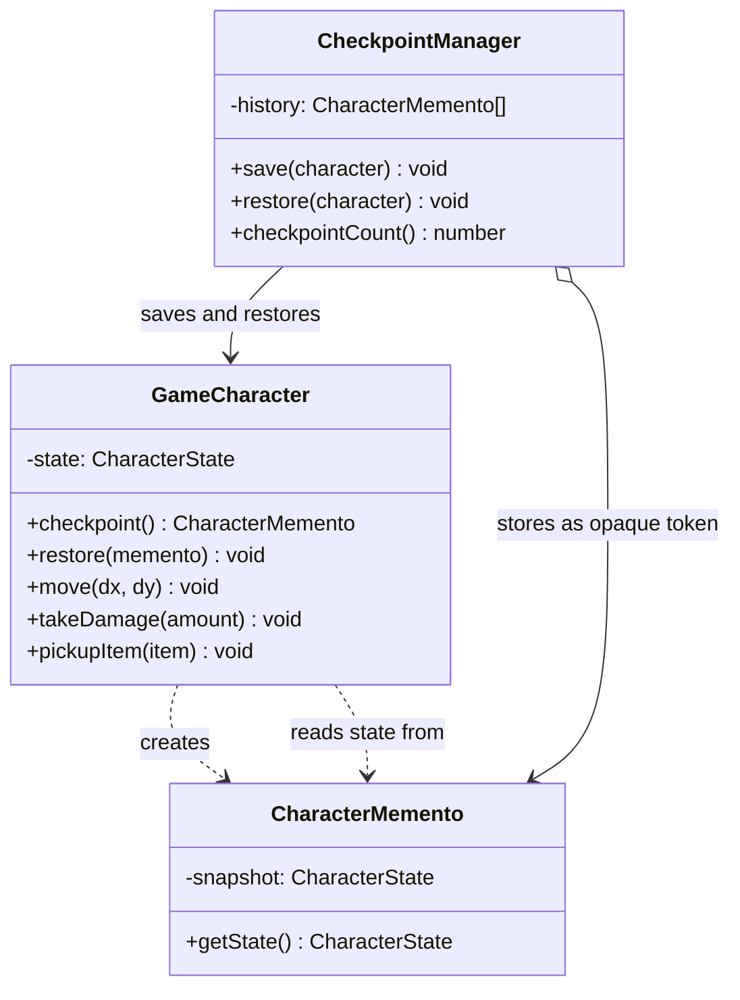

---
tags:
  - design-pattern
  - comp-sci
gardening: 🌿
date: 2026-06-07
reference:
---
## What & Why

The Memento pattern captures an object's internal state into an external object (the memento) so that the originator can be restored to that state later, without violating its encapsulation. The caretaker (the code managing history) stores mementos but must not be able to read or modify the contents of what it stores.

You need checkpointing, undo/redo, or save/restore for an object. The naive approach exposes all internal fields to external code so a snapshot can be taken. But this breaks encapsulation: any code that can read the fields to snapshot them can also write them, turning private internals into a public API. The Memento pattern allows state capture without leaking the object's internals.

The GoF define three roles:

**Originator**: The object whose state is being captured. It creates mementos from its current state and can restore itself from a memento. It has full access to the memento's contents.

**Memento**: The stored snapshot. It presents a wide interface to the originator (full state access) and a narrow interface to everyone else (just an opaque token that can be stored and retrieved).

**Caretaker**: Manages the history of mementos. It stores and retrieves them but cannot read or modify their contents.

**Memento vs Command for undo/redo**: Both patterns can implement undo, but they differ in what they store. Command stores the inverse operation: "to undo a delete, insert back." Memento stores the complete state snapshot: "to undo anything, restore the previous snapshot." Command is more memory-efficient when operations are well-defined and invertible. Memento is simpler when inverses are hard to define or state is small enough that full snapshots are cheap.

Real-world appearances include game save states, text editor undo history, database transaction snapshots, and browser session history.

## Structure Diagram



## Traditional Class-Based Implementation

```typescript
type Position = { readonly x: number; readonly y: number };

type CharacterState = {
  readonly health:    number;
  readonly mana:      number;
  readonly position:  Position;
  readonly inventory: ReadonlyArray<string>;
  readonly level:     number;
};

// Defensive copy: prevents aliasing between snapshots and live state
const copyState = (s: CharacterState): CharacterState => ({
  ...s,
  position:  { ...s.position },
  inventory: [...s.inventory],
});

// Memento: the opaque snapshot container
// TypeScript has no 'friend class' mechanism; GoF's narrow-vs-wide interface
// distinction is enforced here by convention rather than the type system.
// Only GameCharacter.restore() should call getState().
class CharacterMemento {
  private readonly snapshot: CharacterState;

  constructor(state: CharacterState) {
    this.snapshot = copyState(state);  // defensive copy at creation time
  }

  // Wide interface: only the originator calls this
  getState(): CharacterState {
    return copyState(this.snapshot);   // defensive copy at restoration time
  }
}

// Originator: creates and restores mementos; owns all state mutations
class GameCharacter {
  private state: CharacterState;

  constructor(initial: CharacterState) {
    this.state = copyState(initial);
  }

  checkpoint(): CharacterMemento {
    return new CharacterMemento(this.state);
  }

  restore(memento: CharacterMemento): void {
    this.state = memento.getState();
  }

  move(dx: number, dy: number): void {
    this.state = {
      ...this.state,
      position: { x: this.state.position.x + dx, y: this.state.position.y + dy },
    };
  }

  takeDamage(amount: number): void {
    this.state = { ...this.state, health: Math.max(0, this.state.health - amount) };
  }

  pickupItem(item: string): void {
    this.state = { ...this.state, inventory: [...this.state.inventory, item] };
  }

  status(): CharacterState { return copyState(this.state); }
}

// Caretaker: stores mementos as opaque tokens; never calls getState()
class CheckpointManager {
  private readonly history: CharacterMemento[] = [];

  save(character: GameCharacter): void {
    this.history.push(character.checkpoint());
    console.log(`Checkpoint saved (${this.history.length} total)`);
  }

  restore(character: GameCharacter): boolean {
    const memento = this.history.pop();
    if (memento === undefined) {
      console.log('No checkpoints available');
      return false;
    }
    character.restore(memento);
    console.log(`Restored to checkpoint (${this.history.length} remaining)`);
    return true;
  }

  checkpointCount(): number { return this.history.length; }
}

// Usage
const hero = new GameCharacter({
  health: 100, mana: 50, position: { x: 0, y: 0 }, inventory: ['sword'], level: 5,
});

const manager = new CheckpointManager();

manager.save(hero);           // Checkpoint saved (1 total)

hero.move(10, 5);
hero.takeDamage(60);
hero.pickupItem('health potion');

console.log(hero.status());
// { health: 40, mana: 50, position: { x: 10, y: 5 }, inventory: ['sword', 'health potion'], level: 5 }

manager.restore(hero);        // Restored to checkpoint (0 remaining)

console.log(hero.status());
// { health: 100, mana: 50, position: { x: 0, y: 0 }, inventory: ['sword'], level: 5 }
```

**Key Characteristics**:

- **Encapsulation by convention**: TypeScript has no `friend class` or package-private mechanism. The narrow interface for the caretaker (opaque token) vs wide interface for the originator (full state access) is enforced by documentation and convention, not the type system
- **Defensive copying at both ends**: `copyState` is called when creating the memento and again when restoring from it. Missing either copy creates aliasing bugs where the memento's snapshot shares object references with live state
- **Caretaker is intentionally ignorant**: `CheckpointManager` stores and retrieves `CharacterMemento` instances but never inspects their contents; it is decoupled from `CharacterState` entirely
- **LIFO stack history**: The history is a stack; restore is always to the most recent checkpoint. Jumping to an arbitrary checkpoint requires a different data structure
- **Memento class proliferates**: Every originator type needs a corresponding Memento class; ten originator types means ten Memento classes

## Function-Based Alternative

We achieve Memento behavior through:

1. **Immutable state is already a memento**: A `CharacterState` value that cannot be mutated is trivially safe to store as a snapshot. Sharing a reference to an immutable value between the originator and caretaker is safe by construction, eliminating the need for defensive copying entirely
2. **Session as originator plus history**: The "caretaker" pattern collapses to a plain record `{ current: CharacterState, history: ReadonlyArray<CharacterState> }`. No class is needed; the caretaker is just a field
3. **Pure transition functions**: `checkpoint`, `restore`, and `apply` are pure functions over `GameSession`. The same session value can be branched, compared, or logged at any point without side effects
4. **No encapsulation problem**: The Memento pattern's entire encapsulation concern (preventing caretakers from reading internal state) disappears because immutable values can be freely shared without risk of modification. There is nothing to protect
5. **Time travel by construction**: All past states are preserved as plain values in the history array. Restoring to any checkpoint is a direct index operation, not a stack unwind

```typescript
type Position = { readonly x: number; readonly y: number };

type CharacterState = {
  readonly health:    number;
  readonly mana:      number;
  readonly position:  Position;
  readonly inventory: ReadonlyArray<string>;
  readonly level:     number;
};

// The "memento" IS the state type: an immutable value
// No special class needed; any CharacterState is a valid snapshot
type GameSession = {
  readonly current: CharacterState;
  readonly history: ReadonlyArray<CharacterState>;
};

// Pure state transitions (originator operations)
const move = (s: CharacterState, dx: number, dy: number): CharacterState => ({
  ...s, position: { x: s.position.x + dx, y: s.position.y + dy },
});

const takeDamage = (s: CharacterState, amount: number): CharacterState => ({
  ...s, health: Math.max(0, s.health - amount),
});

const pickupItem = (s: CharacterState, item: string): CharacterState => ({
  ...s, inventory: [...s.inventory, item],
});

// Apply a transition to the current state, leaving history unchanged
const apply = (
  session: GameSession,
  fn: (s: CharacterState) => CharacterState,
): GameSession => ({ ...session, current: fn(session.current) });

// Caretaker operations: pure transitions over GameSession
const checkpoint = (session: GameSession): GameSession => ({
  current: session.current,
  history: [...session.history, session.current],
});

const restore = (session: GameSession): GameSession => {
  if (session.history.length === 0) return session;
  return {
    current: session.history[session.history.length - 1],
    history: session.history.slice(0, -1),
  };
};

// Restore to a specific checkpoint index without destroying history
const restoreTo = (session: GameSession, index: number): GameSession => ({
  current: session.history[index],
  history: session.history.slice(0, index),
});

// Usage
const initial: GameSession = {
  current: { health: 100, mana: 50, position: { x: 0, y: 0 }, inventory: ['sword'], level: 5 },
  history: [],
};

const s1 = checkpoint(initial);                               // save before dangerous area
const s2 = apply(s1, s => move(s, 10, 5));
const s3 = apply(s2, s => takeDamage(s, 60));
const s4 = apply(s3, s => pickupItem(s, 'health potion'));

console.log(s4.current);
// { health: 40, mana: 50, position: { x: 10, y: 5 }, inventory: ['sword', 'health potion'], level: 5 }

const s5 = restore(s4);                                       // restore to checkpoint

console.log(s5.current);
// { health: 100, mana: 50, position: { x: 0, y: 0 }, inventory: ['sword'], level: 5 }

// Multiple checkpoints: time travel to any index directly
const withTwoCheckpoints = [
  (s: GameSession) => checkpoint(s),                         // history[0]
  (s: GameSession) => apply(s, st => move(st, 5, 0)),
  (s: GameSession) => checkpoint(s),                         // history[1]
  (s: GameSession) => apply(s, st => takeDamage(st, 30)),
  (s: GameSession) => checkpoint(s),                         // history[2]
  (s: GameSession) => apply(s, st => move(st, 0, 10)),
].reduce((s, fn) => fn(s), initial);

const atCheckpoint0 = restoreTo(withTwoCheckpoints, 0);       // jump to any point
console.log(atCheckpoint0.current.position);                  // { x: 0, y: 0 }
```

## Comparison: Class vs Function

| Aspect | Class-based | Function-based |
| --- | --- | --- |
| Memento unit | `CharacterMemento` class instance | Plain `CharacterState` value |
| Encapsulation mechanism | `private` fields by convention (not enforced) | Immutability: nothing to protect against |
| Defensive copying | Required at creation and restoration | Not needed; immutable values are safe to alias |
| Caretaker | `CheckpointManager` class | `history: ReadonlyArray<CharacterState>` field |
| History access | Pop-only LIFO stack | Direct index, slice, or branch at any point |
| State inspection by caretaker | Blocked by convention only | No restriction needed; mutation is impossible |
| New originator type | New originator class and new Memento class | New state type; same `GameSession` wrapper |
| Testability | Requires instantiating both originator and caretaker | Pure functions over plain data |

### Problems with Traditional Class-Based Memento

1. **Encapsulation is convention, not enforcement**: TypeScript has no `friend class` or package-private construct. The caretaker "should not" call `memento.getState()`, but nothing in the type system prevents it. The GoF's narrow interface guarantee requires language features TypeScript does not have.
2. **Defensive copying is required and error-prone**: Every mutable reference inside `CharacterState` (arrays, nested objects) must be copied both when creating the memento and when restoring from it. Missing a nested reference creates an aliasing bug where the snapshot silently shares objects with live state.
3. **LIFO stack only by default**: `CheckpointManager` uses a stack, so restoring to checkpoint 3 of 10 requires popping 7 entries and discarding them, or redesigning the caretaker entirely. The functional version supports arbitrary index access with a one-line function.
4. **Memento class proliferates with originator types**: Every originator type needs a dedicated Memento class. Ten game entity types means ten Memento classes. In the functional version, a single `GameSession` wrapper works for any state type with a type parameter.
5. **No branching**: The class-based history is a linear stack. The functional version can branch the history (keep the session at `s4` AND at `s5` simultaneously) because sessions are values, not mutable objects. This enables parallel undo branches, diffing, and replay without additional infrastructure.
