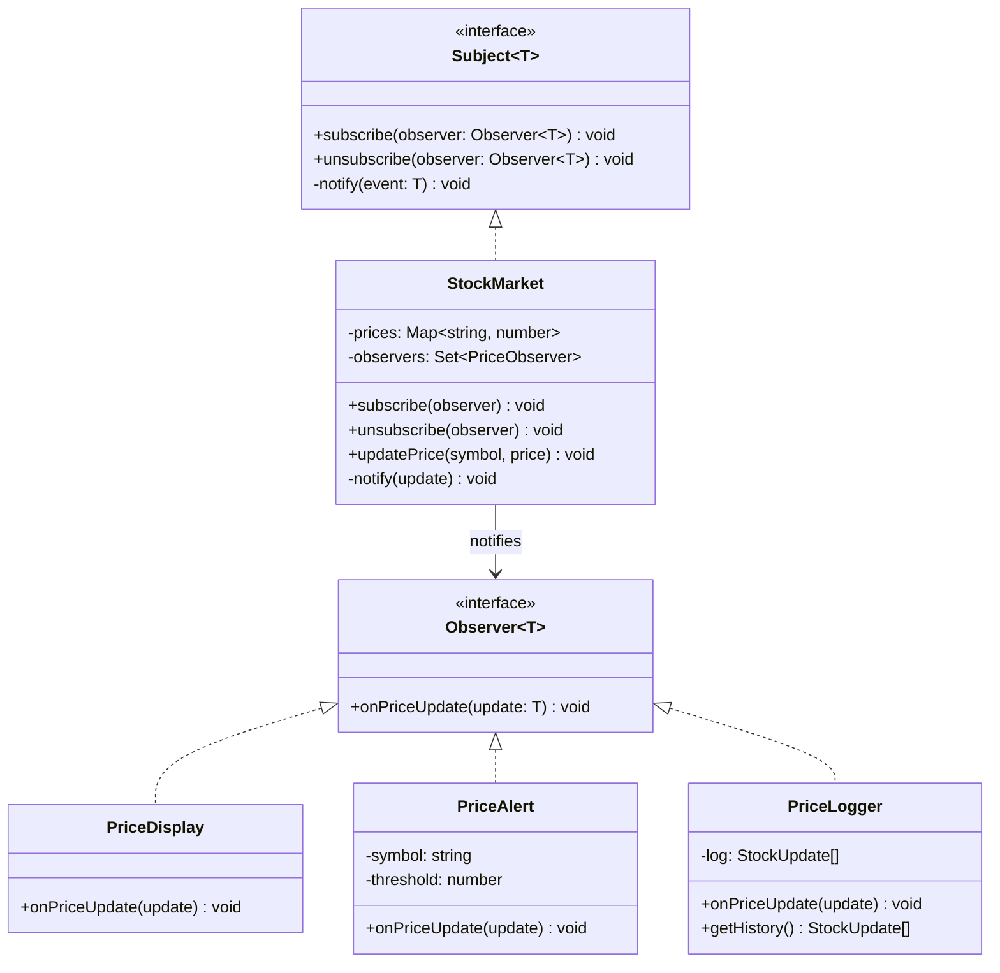

---
tags:
  - design-pattern
  - comp-sci
gardening: 🌿
date: 2026-06-07
reference:
  - https://github.com/deepakkum21/Books/blob/master/Design%20Patterns%20-%20Elements%20of%20Reusable%20Object%20Oriented%20Software%20-%20GOF.pdf
  - https://refactoring.guru/design-patterns/observer
  - https://en.wikipedia.org/wiki/Observer_pattern
---
## What & Why

The Observer pattern defines a one-to-many dependency between objects: when one object (the subject) changes state, all of its dependents (observers) are notified and updated automatically. The subject does not need to know the concrete types of its observers, only that they implement the observer contract.

An object's state changes matter to other parts of the system, but hardcoding which objects receive those changes creates tight coupling. If the subject calls methods on specific dependents directly, adding a new dependent requires modifying the subject. The subject should not need to know who is watching it.

Observer decouples this by inverting the relationship: observers register themselves with the subject. The subject maintains a list of registered observers and notifies all of them when state changes. The subject never knows who specifically is watching.

GoF identify an important risk: **cascading updates**. If an observer modifies the subject during its `update()` call, the subject notifies all observers again. Long chains of reactive dependencies can produce update cycles that are difficult to trace or terminate.

Real-world appearances include browser event listeners (`addEventListener`), React's re-render model (conceptually), MobX reactive state, RxJS `Subject`, Svelte stores, and virtually every UI data-binding system ever written.

**Relationship to the previous patterns**: We discussed after the Mediator lesson how Observer and Mediator are related. Both decouple senders from receivers, but Observer is one-to-many notification from a single source, while Mediator is N-to-N coordination through a central hub. An event bus is Observer infrastructure; a typed event contract with routing logic is Mediator behavior.

## Structure Diagram



## Traditional Class-Based Implementation

```typescript
type StockUpdate = {
  readonly symbol: string;
  readonly price: number;
  readonly previousPrice: number;
};

// Observer contract: all subscribers implement this
type PriceObserver = {
  onPriceUpdate(update: StockUpdate): void;
};

// Subject: maintains subscriber list, notifies on state change
class StockMarket {
  private readonly prices = new Map<string, number>();
  private readonly observers = new Set<PriceObserver>();

  subscribe(observer: PriceObserver): void {
	  this.observers.add(observer);
	}
  unsubscribe(observer: PriceObserver): void {
	  this.observers.delete(observer);
	}

  private notify(update: StockUpdate): void {
    this.observers.forEach(o => o.onPriceUpdate(update));
  }

  updatePrice(symbol: string, price: number): void {
    const previousPrice = this.prices.get(symbol) ?? price;
    this.prices.set(symbol, price);
    this.notify({ symbol, price, previousPrice });
  }

  getPrice(symbol: string): number | undefined {
    return this.prices.get(symbol);
  }
}

// Concrete observer: renders current price and direction
class PriceDisplay implements PriceObserver {
  onPriceUpdate({ symbol, price, previousPrice }: StockUpdate): void {
    const dir = price > previousPrice ? 'up' : price < previousPrice ? 'down' : 'flat';
    console.log(`[Display] ${symbol}: $${price.toFixed(2)} (${dir})`);
  }
}

// Concrete observer: fires when a specific symbol hits a threshold
class PriceAlert implements PriceObserver {
  constructor(
    private readonly symbol: string,
    private readonly threshold: number,
  ) {}

  onPriceUpdate({ symbol, price }: StockUpdate): void {
    if (symbol === this.symbol && price >= this.threshold) {
      console.log(`[Alert] ${symbol} hit $${this.threshold}: now $${price.toFixed(2)}`);
    }
  }
}

// Concrete observer: records a history of all updates
class PriceLogger implements PriceObserver {
  private readonly log: StockUpdate[] = [];

  onPriceUpdate(update: StockUpdate): void {
    this.log.push(update);
    console.log(`[Logger] Entry #${this.log.length}: ${update.symbol} @ $${update.price.toFixed(2)}`);
  }

  getHistory(): ReadonlyArray<StockUpdate> {
	  return [...this.log];
	}
}

// Usage
const market = new StockMarket();
const display = new PriceDisplay();
const alert = new PriceAlert('AAPL', 200);
const logger = new PriceLogger();

market.subscribe(display);
market.subscribe(alert);
market.subscribe(logger);

market.updatePrice('AAPL', 195.50);
// [Display] AAPL: $195.50 (flat)
// [Logger]  Entry #1: AAPL @ $195.50

market.updatePrice('AAPL', 201.00);
// [Display] AAPL: $201.00 (up)
// [Alert]   AAPL hit $200: now $201.00
// [Logger]  Entry #2: AAPL @ $201.00

market.unsubscribe(alert);

market.updatePrice('AAPL', 198.75);
// [Display] AAPL: $198.75 (down)
// [Logger]  Entry #3: AAPL @ $198.75  (alert no longer fires)
```

**Key Characteristics**:

- **Loose coupling via interface**: `StockMarket` depends only on `PriceObserver`; it has no knowledge of `PriceDisplay`, `PriceAlert`, or `PriceLogger` by type
- **Dynamic subscription**: Observers register and deregister at runtime; the subject's behavior does not change
- **Unsubscription requires the original instance**: `unsubscribe(alert)` must receive the same `alert` object that was passed to `subscribe`; anonymous observers or closures need their references explicitly retained for later removal
- **Pull vs push**: This implementation pushes the full `StockUpdate` to all observers; an alternative is to push only a notification and have observers pull the state they need
- **No initial value on subscribe**: A new subscriber only receives future updates; it has no way to get the current price at subscription time without a separate `getPrice()` call

## Function-Based Alternative

We achieve Observer behavior through:

1. **Writable store as subject**: A `createStore<T>` factory captures a `current` value and a `Set` of subscribers in a closure, returning `get`, `set`, `update`, and `subscribe` as a plain object. No class or inheritance required.
2. **Unsubscribe via returned function**: `subscribe` returns an unsubscribe function. Cleanup is a first-class value rather than a separate `unsubscribe(observer)` call that requires retaining the original observer reference.
3. **Immediate emission on subscribe**: The subscriber is called immediately with the current value at subscription time. New subscribers always receive a consistent initial state without a separate fetch step.
4. **Reference equality guard**: `Object.is(value, current)` in `set` skips re-notification when the value is unchanged. Primitive stores deduplicate automatically; this also prevents one class of cascading update cycles.
5. **Derived stores for computed state**: `derived` creates a read-only store whose value is a function of another store's value, updating automatically when the source changes. This replaces observer classes that exist solely to compute and hold derived values.

```typescript
type Subscriber<T> = (value: T) => void;
type Unsubscribe = () => void;

type ReadableStore<T> = {
  readonly get: () => T;
  readonly subscribe: (fn: Subscriber<T>) => Unsubscribe;
};

type WritableStore<T> = ReadableStore<T> & {
  readonly set: (value: T) => void;
  readonly update: (fn: (current: T) => T) => void;
};

const createStore = <T>(initial: T): WritableStore<T> => {
  // let is justified: the store's purpose is to hold reactive mutable state
  let current = initial;
  const subscribers = new Set<Subscriber<T>>();

  const set = (value: T): void => {
    if (Object.is(value, current)) return;   // skip unchanged values
    current = value;
    subscribers.forEach(fn => fn(current));
  };

  const subscribe = (fn: Subscriber<T>): Unsubscribe => {
    subscribers.add(fn);
    fn(current);                             // emit current value immediately
    return () => { subscribers.delete(fn); };
  };

  return {
    get:    () => current,
    set,
    update: (fn) => set(fn(current)),
    subscribe,
  };
};

// Derived store: read-only computed value; updates when source changes
const derived = <T, U>(
  source: ReadableStore<T>,
  fn: (value: T) => U,
): ReadableStore<U> => {
  const store = createStore<U>(fn(source.get()));
  source.subscribe(value => store.set(fn(value)));
  return { get: store.get, subscribe: store.subscribe };
};

// Usage: same stock market domain
type StockPrices = Readonly<Record<string, number>>;

const prices$ = createStore<StockPrices>({});

// Derived stores: computed values that update automatically
const aaplPrice$ = derived(prices$, p => p['AAPL'] ?? 0);
const aaplAlert$ = derived(aaplPrice$, price => price >= 200);

const unsubDisplay = prices$.subscribe(prices => {
  const entries = Object.entries(prices).map(([s, p]) => `${s}: $${p.toFixed(2)}`);
  if (entries.length > 0) {
	  console.log(`[Display] ${entries.join(', ')}`);
	}
});

const unsubAlert = aaplAlert$.subscribe(triggered => {
  if (triggered) {
    console.log(`[Alert] AAPL hit $200: now $${aaplPrice$.get().toFixed(2)}`);
  }
});

prices$.update(p => ({ ...p, AAPL: 195.50 }));
// [Display] AAPL: $195.50

prices$.update(p => ({ ...p, AAPL: 201.00 }));
// [Display] AAPL: $201.00
// [Alert]   AAPL hit $200: now $201.00

unsubDisplay();   // unsubscribe: just call the returned function

prices$.update(p => ({ ...p, AAPL: 198.75 }));
// (nothing: display unsubscribed, alert did not re-trigger since 198.75 < 200)

// Derived stores can themselves be derived further
const aaplStatus$ = derived(
  aaplPrice$,
  price => price >= 200 ? 'above-target' : price >= 190 ? 'near-target' : 'below-target',
);

aaplStatus$.subscribe(status => console.log(`[Status] AAPL: ${status}`));
// [Status] AAPL: near-target  (immediate emission of current value)
```

## Comparison: Class vs Function

| Aspect | Class-based | Function-based |
| --- | --- | --- |
| Subject unit | Class with `subscribe` / `unsubscribe` / `notify` | `createStore` closure |
| Observer unit | Class implementing `PriceObserver` | Subscriber function `(value: T) => void` |
| Unsubscription | `unsubscribe(observer)` requires original instance | Returned `Unsubscribe` function, no reference retention |
| Derived/computed values | Separate observer class per computation | `derived()` factory produces a first-class reactive store |
| Initial value on subscribe | Not provided; requires separate fetch | Emitted immediately on subscribe |
| Re-notification guard | None by default | `Object.is` equality check in `set` |
| Memory leak risk | High: observers must be manually unregistered | Lower: unsubscribe function enables easy cleanup |
| Framework analogs | Custom roll, Java `PropertyChangeListener` | Svelte `writable`/`derived`, Zustand, MobX observables |

### Problems with Traditional Class-Based Observer

1. **Unsubscription requires retaining the original reference**: `market.unsubscribe(alert)` requires the exact `alert` instance. If an observer is created inline or as an anonymous class, its reference must be explicitly stored before subscribing. Forgetting this makes the observer impossible to unsubscribe without tearing down the entire subject.
2. **Memory leaks from missed unsubscription**: If an observer is never unsubscribed, the subject holds a live reference to it indefinitely. In browser applications this prevents garbage collection of the component tree the observer belongs to. The functional pattern's returned unsubscribe function pairs naturally with cleanup hooks (`useEffect` return value, `onDestroy` in Svelte).
3. **No derived/computed state primitive**: Observers that exist solely to compute and cache a derived value (e.g., a display that shows "above target" vs "below target") must be full concrete classes. The functional `derived` store makes this a one-liner.
4. **No initial value at subscription time**: New observers only receive future updates. They must call a separate method on the subject to get its current state, creating two different code paths (the subscription handler and the initialization fetch) that can fall out of sync.
5. **Cascading update cycles are not mitigated**: If observer A's `onPriceUpdate()` calls `market.updatePrice()`, all observers are notified again. Nothing in the class-based structure prevents this. The functional `Object.is` equality guard eliminates one common source of re-notification, though it does not prevent all cascades.
