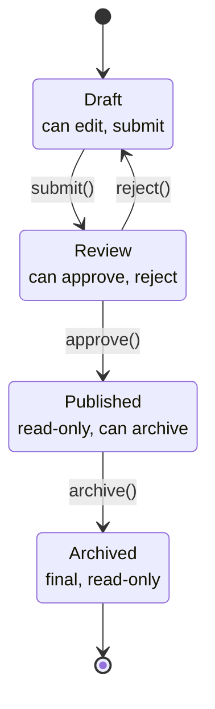

---
tags:
  - design-pattern
  - comp-sci
gardening: 🌿
date: 2026-06-08
reference:
---
## What & Why

The State pattern allows an object to change its behavior when its internal state changes. The object appears to change its class. It is a formalization of finite state machines in object-oriented code.

An object's behavior depends on its current state, and that behavior must change at runtime. The naive solution is to scatter conditional logic (`if`/`switch` on a status field) across every method. As states and transitions multiply, each method accumulates more branches. Adding a new state means auditing every method for a new conditional. The state logic is distributed rather than localized.

The State pattern solves this by representing each state as its own object. The context delegates all behavior to its current state object. Transitions happen by replacing the state object. All behavior for a given state lives in one place.

**Relationship to Strategy**: State and Strategy are structurally identical (both use a swappable delegate object), but their intent differs. In Strategy, the algorithm is chosen externally and is typically stable over the context's lifetime; strategies do not know about each other. In State, transitions are triggered by events inside the context or state itself; each state often knows which states it can transition to.

Classic real-world appearances include TCP connection lifecycle (`CLOSED`, `LISTEN`, `ESTABLISHED`, `CLOSE_WAIT`), media player controls (stopped, playing, paused, buffering), document workflows, vending machines, and UI form validation steps.

## Structure Diagram



Each state in this diagram maps to a concrete class. The context (`Document`) holds a reference to the current state and delegates all actions to it.

## Traditional Class-Based Implementation

```typescript
type DocumentContent = {
  readonly title: string;
  readonly body: string;
};

// State interface: every state must implement every action
// Invalid actions are handled at runtime inside the state class
type DocumentState = {
  edit(doc: Document, content: Partial<DocumentContent>): void;
  submit(doc: Document): void;
  approve(doc: Document): void;
  reject(doc: Document, reason: string): void;
  archive(doc: Document): void;
  getStatus(): string;
};

// Context: delegates all actions to the current state object
class Document {
  private content: DocumentContent;
  private state: DocumentState;

  constructor(title: string, body: string) {
    this.content = { title, body };
    this.state = new DraftState();
  }

  edit(content: Partial<DocumentContent>): void { this.state.edit(this, content); }
  submit(): void { this.state.submit(this); }
  approve(): void { this.state.approve(this); }
  reject(reason: string): void { this.state.reject(this, reason); }
  archive(): void { this.state.archive(this); }
  getStatus(): string { return this.state.getStatus(); }
  getContent(): DocumentContent { return { ...this.content }; }

  // Internal: only state classes should call these
  _setState(state: DocumentState): void { this.state = state; }
  _setContent(c: Partial<DocumentContent>): void { this.content = { ...this.content, ...c }; }
}

class DraftState implements DocumentState {
  edit(doc: Document, content: Partial<DocumentContent>): void {
    doc._setContent(content);
    console.log('[Draft] Content updated');
  }
  submit(doc: Document): void {
    doc._setState(new ReviewState());
    console.log('[Draft] Submitted for review');
  }
  approve(_doc: Document): void { console.log('[Draft] Cannot approve: not under review'); }
  reject(_doc: Document, _r: string): void { console.log('[Draft] Cannot reject: not under review'); }
  archive(_doc: Document): void { console.log('[Draft] Cannot archive: not published'); }
  getStatus(): string { return 'Draft'; }
}

class ReviewState implements DocumentState {
  edit(_doc: Document, _c: Partial<DocumentContent>): void {
    console.log('[Review] Cannot edit: document is under review');
  }
  submit(_doc: Document): void {
    console.log('[Review] Already submitted');
  }
  approve(doc: Document): void {
    doc._setState(new PublishedState());
    console.log('[Review] Approved and published');
  }
  reject(doc: Document, reason: string): void {
    doc._setState(new DraftState());
    console.log(`[Review] Rejected: "${reason}". Returned to draft`);
  }
  archive(_doc: Document): void { console.log('[Review] Cannot archive: not published'); }
  getStatus(): string { return 'Review'; }
}

class PublishedState implements DocumentState {
  edit(_doc: Document, _c: Partial<DocumentContent>): void {
    console.log('[Published] Cannot edit: document is published');
  }
  submit(_doc: Document): void { console.log('[Published] Already published'); }
  approve(_doc: Document): void { console.log('[Published] Already approved'); }
  reject(_doc: Document, _r: string): void { console.log('[Published] Cannot reject: published'); }
  archive(doc: Document): void {
    doc._setState(new ArchivedState());
    console.log('[Published] Archived');
  }
  getStatus(): string { return 'Published'; }
}

class ArchivedState implements DocumentState {
  edit(_d: Document, _c: Partial<DocumentContent>): void { console.log('[Archived] Read-only'); }
  submit(_d: Document): void { console.log('[Archived] Read-only'); }
  approve(_d: Document): void { console.log('[Archived] Read-only'); }
  reject(_d: Document, _r: string): void { console.log('[Archived] Read-only'); }
  archive(_d: Document): void { console.log('[Archived] Already archived'); }
  getStatus(): string { return 'Archived'; }
}

// Usage
const doc = new Document('Architecture RFC', 'Initial draft content');

doc.approve();                                   // [Draft] Cannot approve: not under review
doc.edit({ body: 'Revised content' });           // [Draft] Content updated
doc.submit();                                    // [Draft] Submitted for review
doc.edit({ body: 'Trying to edit in review' });  // [Review] Cannot edit: document is under review
doc.reject('Needs more detail');                 // [Review] Rejected: "Needs more detail". Returned to draft
doc.submit();                                    // [Draft] Submitted for review
doc.approve();                                   // [Review] Approved and published
doc.archive();                                   // [Published] Archived

console.log(doc.getStatus());                    // Archived
```

**Key Characteristics**:

- **Behavior localized per state**: All logic for the Draft state lives in `DraftState`; adding or changing Draft behavior touches only that class
- **Transitions owned by state classes**: State classes call `doc._setState(new NextState())` internally, so the context class has no conditional transition logic
- **Every state implements every action**: Valid actions perform meaningful work; invalid actions log a message and return. This is required by the interface contract but produces significant boilerplate
- **Context's `_setState` is semi-public**: State classes need to call it, but it should not be part of the external API. TypeScript provides no way to restrict visibility to "sibling classes only"
- **Runtime-only transition enforcement**: Calling `doc.approve()` on a draft document compiles successfully and fails only at runtime with a log message

## Function-Based Alternative

We achieve State behavior through:

1. **Discriminated union as the state type**: Each state variant is a named member of a union, carrying only the data relevant to that state. `DraftDoc`, `ReviewDoc`, `PublishedDoc`, and `ArchivedDoc` are distinct types, not runtime labels on a shared class.
2. **Type-state pattern for compile-time enforcement**: Transition functions are typed to accept only the source state from which they are valid. `approve` accepts a `ReviewDoc`. Calling it with a `DraftDoc` is a type error. Invalid transitions are not possible to express, eliminating runtime "cannot do that" branches entirely.
3. **Transitions as pure functions**: Each transition returns a new state value. No mutation, no `setState()` call, no shared mutable object. The previous state is preserved for free.
4. **Exhaustive `switch` for runtime dispatch**: When the exact state is unknown (arriving from an API or user event), a `switch` on `kind` with TypeScript's narrowing enforces that all cases are handled. Adding a new state variant without a corresponding case is a compile error.
5. **No invalid-transition boilerplate**: Because a function that does not accept a given input type simply cannot be called with it, there is nothing to implement for invalid transitions. The impossible cases do not exist in the type system.

```typescript
type DocumentContent = {
  readonly title: string;
  readonly body:  string;
};

// Each state carries only what is relevant to it
// These are distinct types, not runtime labels
type DraftDoc = { readonly kind: 'draft'; readonly content: DocumentContent };
type ReviewDoc = { readonly kind: 'review'; readonly content: DocumentContent };
type PublishedDoc = { readonly kind: 'published'; readonly content: DocumentContent };
type ArchivedDoc = { readonly kind: 'archived'; readonly content: DocumentContent };

type DocumentState = DraftDoc | ReviewDoc | PublishedDoc | ArchivedDoc;

// Smart constructors
const createDraft = (title: string, body: string): DraftDoc =>
  ({ kind: 'draft', content: { title, body } });

// --- Typed transitions: only valid source states are accepted ---
// Calling approve(draftDoc) is a COMPILE ERROR, not a runtime message

const edit = (doc: DraftDoc, content: Partial<DocumentContent>): DraftDoc => ({
  ...doc, content: { ...doc.content, ...content },
});

const submit = (doc: DraftDoc): ReviewDoc => ({ kind: 'review', content: doc.content });
const approve = (doc: ReviewDoc): PublishedDoc => ({ kind: 'published', content: doc.content });
const reject = (doc: ReviewDoc): DraftDoc => ({ kind: 'draft', content: doc.content });
const archive = (doc: PublishedDoc): ArchivedDoc  => ({ kind: 'archived', content: doc.content });

// --- Runtime dispatch: when state is unknown (from API, events, user input) ---

const getStatus = (doc: DocumentState): string => {
  switch (doc.kind) {
    case 'draft':
	    return 'Draft';
    case 'review':
			return 'In Review';
    case 'published':
	    return 'Published';
    case 'archived':
	    return 'Archived';
  }
};

type TransitionResult<T extends DocumentState> =
  | { readonly ok: true;  readonly state: T }
  | { readonly ok: false; readonly error: string };

// Runtime-safe submit: gracefully handles any DocumentState as input
const trySubmit = (doc: DocumentState): TransitionResult<ReviewDoc> =>
  doc.kind === 'draft'
    ? { ok: true,  state: submit(doc) }
    : { ok: false, error: `Cannot submit from state: ${doc.kind}` };

// Usage: compile-time path (exact types known)
const d1 = createDraft('Architecture RFC', 'Initial draft content');
const d2 = edit(d1, { body: 'Revised content' });
const d3 = submit(d2);
const d4 = approve(d3);
const d5 = archive(d4);

console.log(getStatus(d5)); // Archived

// These are COMPILE ERRORS, not runtime messages:
// const bad1 = approve(d1);  // Argument of type 'DraftDoc' not assignable to 'ReviewDoc'
// const bad2 = archive(d3);  // Argument of type 'ReviewDoc' not assignable to 'PublishedDoc'
// const bad3 = edit(d3, {});  // Argument of type 'ReviewDoc' not assignable to 'DraftDoc'

// Usage: runtime path (DocumentState received from external source)
const fromApi: DocumentState = d3; // simulating an API response

const result = trySubmit(fromApi);
if (result.ok) {
  console.log(`Submitted: ${getStatus(result.state)}`); // In Review
} else {
  console.log(result.error);
}
```

## Comparison: Class vs Function

| Aspect | Class-based | Function-based |
| --- | --- | --- |
| State representation | Concrete class per state | Discriminated union variant |
| Invalid transition handling | Runtime: log message and return | Compile-time: calling with wrong type is a type error |
| Invalid transition boilerplate | Must be implemented in every state class | Does not exist in the type system |
| Transition enforcement | None at compile time | Compiler rejects invalid calls |
| Context mutability | `Document` instance mutated in place | Each transition returns a new immutable value |
| `setState` visibility | Must be accessible to state classes; not truly private | No equivalent; transitions return new values |
| Adding a new state | New class and update all other state classes for transitions | New union variant; compiler flags missing `switch` cases |
| History / time travel | Requires extra infrastructure | Previous states are preserved values; keep any reference |

### Problems with Traditional Class-Based State

1. **Invalid transition boilerplate across every state**: Every state must implement every method in the interface. A four-state machine with six actions produces 24 method implementations, roughly half of which are "cannot do that" stubs. The type-state pattern eliminates these entirely.
2. **No compile-time transition enforcement**: `doc.approve()` on a draft document compiles and executes without error. The incorrect call is caught only at runtime, only if the logging path is reached, and only if someone notices the output.
3. **`_setState` encapsulation break**: State classes must call `doc._setState(new NextState())` to trigger transitions, which means the context must expose a method that mutates its core internal structure. There is no TypeScript mechanism to restrict this to state classes only.
4. **State classes are coupled to each other by name**: `ReviewState.reject()` calls `new DraftState()`. `ReviewState.approve()` calls `new PublishedState()`. State classes depend on each other by name for transition targets. Adding an intermediate state (e.g., `LegalReviewState` between `Review` and `Published`) requires modifying existing state classes.
5. **Shared mutable context makes history difficult**: The same `Document` object is mutated through every transition. Snapshots, undo, debugging the transition sequence, or branching to explore alternative paths all require extra infrastructure on top of the pattern.
