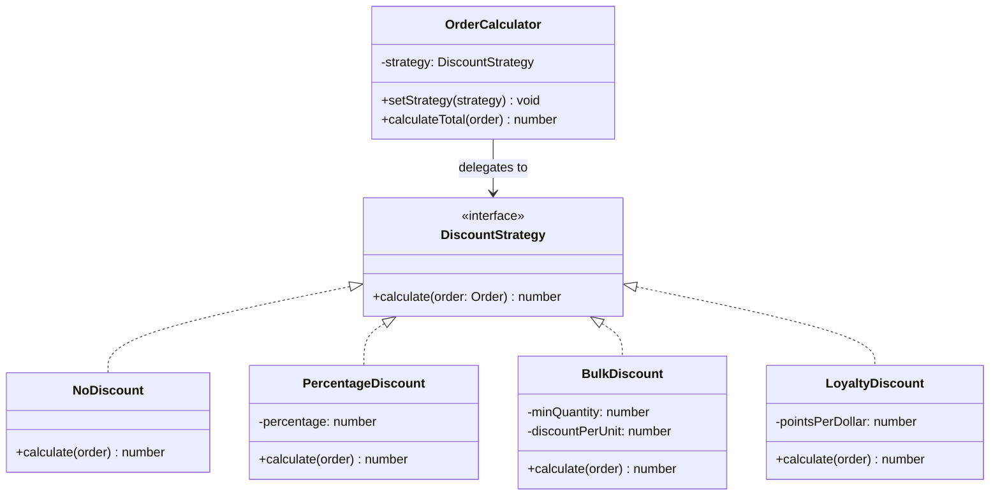

---
tags:
  - design-pattern
  - comp-sci
gardening: 🌿
date: 2026-06-08
reference:
  - https://github.com/deepakkum21/Books/blob/master/Design%20Patterns%20-%20Elements%20of%20Reusable%20Object%20Oriented%20Software%20-%20GOF.pdf
  - https://refactoring.guru/design-patterns/strategy
  - https://en.wikipedia.org/wiki/Strategy_pattern
---
## What & Why

The Strategy pattern defines a family of algorithms, encapsulates each one, and makes them interchangeable. The algorithm can vary independently from the clients that use it.

An operation needs to be performed in different ways depending on context. The naive solution is to embed conditional logic (`if`/`switch`) inside the method to select the algorithm. As variations grow, the method becomes bloated with conditionals. Adding a new variation requires modifying the existing code. Testing any single variation requires navigating the entire conditional structure.

The Strategy pattern solves this by extracting each algorithm into its own class. The context holds a reference to a strategy and delegates the operation to it. Strategies can be swapped at runtime.

**Relationship to State**: Strategy and State are structurally nearly identical, both using a swappable delegate object. The key difference is who drives the swap and whether variants know about each other. In Strategy, the client selects the algorithm externally and strategies are independent. In State, transitions are triggered internally and states typically know about each other. Strategy answers "how to do this." State answers "what to do given where we are."

**The FP connection**: GoF introduced Strategy in 1994 to work around the absence of first-class functions in C++. The entire pattern exists to represent "a thing that can be called with specific arguments and returns a value." That is the definition of a function. In TypeScript, every higher-order function in the standard library is the Strategy pattern: `Array.sort(compareFn)`, `Array.filter(predicate)`, `Array.reduce(accumulator)`. Passing a function as an argument IS the Strategy pattern.

Real-world appearances include payment processors (card, PayPal, crypto), compression algorithms (gzip, brotli, zstd), authentication strategies (JWT, OAuth, session), route finders (fastest, shortest, scenic), and render pipelines (HTML, PDF, plain text).

## Structure Diagram



## Traditional Class-Based Implementation

```typescript
type OrderItem = { readonly price: number; readonly quantity: number };

type Order = {
  readonly items: ReadonlyArray<OrderItem>;
  readonly customerId: string;
  readonly loyaltyPoints: number;
};

const orderSubtotal = (order: Order): number =>
  order.items.reduce((sum, item) => sum + item.price * item.quantity, 0);

// Strategy interface: every algorithm implements this contract
type DiscountStrategy = {
  calculate(order: Order): number;
};

// Concrete strategies: each encapsulates one algorithm
class NoDiscount implements DiscountStrategy {
  calculate(_order: Order): number { return 0; }
}

class PercentageDiscount implements DiscountStrategy {
  constructor(private readonly percentage: number) {}

  calculate(order: Order): number {
    return orderSubtotal(order) * (this.percentage / 100);
  }
}

class BulkDiscount implements DiscountStrategy {
  constructor(
    private readonly minQuantity:    number,
    private readonly discountPerUnit: number,
  ) {}

  calculate(order: Order): number {
    return order.items.reduce((total, item) =>
      item.quantity >= this.minQuantity
        ? total + item.quantity * this.discountPerUnit
        : total,
      0,
    );
  }
}

class LoyaltyDiscount implements DiscountStrategy {
  constructor(private readonly pointsPerDollar: number) {}

  calculate(order: Order): number {
    return order.loyaltyPoints / this.pointsPerDollar;
  }
}

// Context: delegates calculation to the current strategy
class OrderCalculator {
  private strategy: DiscountStrategy;

  constructor(strategy: DiscountStrategy = new NoDiscount()) {
    this.strategy = strategy;
  }

  setStrategy(strategy: DiscountStrategy): void {
    this.strategy = strategy;
  }

  calculateTotal(order: Order): number {
    const discount = this.strategy.calculate(order);
    return Math.max(0, orderSubtotal(order) - discount);
  }
}

// Usage
const order: Order = {
  items: [{ price: 50, quantity: 3 }, { price: 100, quantity: 1 }],
  customerId: 'user-123',
  loyaltyPoints: 500,
};
// subtotal = (50 * 3) + (100 * 1) = 250

const calculator = new OrderCalculator();
console.log(calculator.calculateTotal(order));   // 250 (no discount)

calculator.setStrategy(new PercentageDiscount(10));
console.log(calculator.calculateTotal(order));   // 225 (250 - 25)

calculator.setStrategy(new BulkDiscount(3, 5));
console.log(calculator.calculateTotal(order));   // 235 (250 - 15, only first item qualifies)

calculator.setStrategy(new LoyaltyDiscount(10));
console.log(calculator.calculateTotal(order));   // 200 (250 - 50, 500 points / 10)
```

**Key Characteristics**:

- **Algorithm isolated per class**: Each strategy class contains one algorithm and nothing else; changing `PercentageDiscount` does not touch `BulkDiscount`
- **Runtime swapping via `setStrategy()`**: The context holds a mutable strategy reference that can be replaced at any time during execution
- **Context decoupled from algorithm**: `OrderCalculator` has no knowledge of how any discount is computed; it only knows the contract (`calculate` returns a number)
- **Constructor captures configuration**: Parameterized strategies (`PercentageDiscount(10)`) use constructor injection to capture algorithm parameters
- **Strategy is a one-method interface**: When the strategy interface has exactly one method, as it does here, the entire class structure exists solely to wrap a single function call

## Function-Based Alternative

We achieve Strategy behavior through:

1. **Strategies are functions**: `DiscountStrategy` is a function type `(order: Order) => number`. No interface, no class, no `implements`. Any function with the right signature IS a strategy.
2. **Factory functions replace constructors**: `percentageDiscount(10)` returns a `DiscountStrategy` with the percentage captured in a closure. This replaces `new PercentageDiscount(10)` with no loss of expressiveness.
3. **Context takes the strategy as a parameter**: `calculateTotal(order, strategy)` accepts the strategy as a direct argument. There is no `setStrategy()` method and no mutable reference to manage; the strategy is selected at the call site.
4. **Strategy composition is higher-order functions**: Combining strategies (take the maximum, stack multiple discounts) is expressed as higher-order functions over the `DiscountStrategy` type. No new strategy class is needed for composed behavior.
5. **HOF is the Strategy pattern**: This is not an analogy. `Array.sort(compareFn)`, `Array.filter(predicate)`, and `Array.reduce(fn)` are all Strategy pattern implementations in the language standard library. Every time a function is passed as a parameter to control an algorithm, Strategy is in use.

```typescript
type OrderItem = { readonly price: number; readonly quantity: number };

type Order = {
  readonly items: ReadonlyArray<OrderItem>;
  readonly customerId: string;
  readonly loyaltyPoints: number;
};

// Strategy IS a function type: no interface, no class hierarchy
type DiscountStrategy = (order: Order) => number;

const orderSubtotal = (order: Order): number =>
  order.items.reduce((sum, item) => sum + item.price * item.quantity, 0);

// Strategy implementations: plain functions and factory functions (closures)
const noDiscount: DiscountStrategy = () => 0;

const percentageDiscount = (percentage: number): DiscountStrategy =>
  (order) => orderSubtotal(order) * (percentage / 100);

const bulkDiscount = (minQuantity: number, discountPerUnit: number): DiscountStrategy =>
  (order) =>
    order.items.reduce((total, item) =>
      item.quantity >= minQuantity
        ? total + item.quantity * discountPerUnit
        : total,
      0,
    );

const loyaltyDiscount = (pointsPerDollar: number): DiscountStrategy =>
  (order) => order.loyaltyPoints / pointsPerDollar;

// Context: a function that accepts a strategy as a parameter
const calculateTotal = (order: Order, strategy: DiscountStrategy): number =>
  Math.max(0, orderSubtotal(order) - strategy(order));

// Strategy composition: higher-order functions over DiscountStrategy
// No new class required for combined behavior

// Apply the largest discount from a set of strategies
const maxStrategy = (...strategies: DiscountStrategy[]): DiscountStrategy =>
  (order) => Math.max(0, ...strategies.map(s => s(order)));

// Stack multiple discounts additively
const stackedStrategy = (...strategies: DiscountStrategy[]): DiscountStrategy =>
  (order) => strategies.reduce((total, s) => total + s(order), 0);

// Usage
const order: Order = {
  items: [{ price: 50, quantity: 3 }, { price: 100, quantity: 1 }],
  customerId: 'user-123',
  loyaltyPoints: 500,
};
// subtotal = 250

console.log(calculateTotal(order, noDiscount));              // 250
console.log(calculateTotal(order, percentageDiscount(10)));  // 225 (250 - 25)
console.log(calculateTotal(order, bulkDiscount(3, 5)));      // 235 (250 - 15)
console.log(calculateTotal(order, loyaltyDiscount(10)));     // 200 (250 - 50)

// Composition: apply the best available discount for this customer
const bestDeal = maxStrategy(
  percentageDiscount(10),  // 25 off
  loyaltyDiscount(10),     // 50 off
);
console.log(calculateTotal(order, bestDeal));        // 200 (takes the larger 50)

// Composition: stack a promotion-day bundle
const promotionDay = stackedStrategy(
  percentageDiscount(5),  // 12.50 off
  bulkDiscount(3, 2),     // 6 off
);
console.log(calculateTotal(order, promotionDay));    // 231.50 (250 - 18.50)

// Inline strategy: no class or named function required
const flatFiveOff: DiscountStrategy = () => 5;
console.log(calculateTotal(order, flatFiveOff));     // 245
```

## Comparison: Class vs Function

| Aspect | Class-based | Function-based |
| --- | --- | --- |
| Strategy unit | Class implementing `DiscountStrategy` interface | Function satisfying `DiscountStrategy` type |
| Parameterized strategy | Constructor arguments | Closure (factory function) |
| Strategy selection | `calculator.setStrategy(new Strategy(...))` | Pass function directly to `calculateTotal` |
| Context mutability | Mutable `strategy` field via `setStrategy()` | No mutable state; strategy is a parameter |
| Strategy composition | New class holding references to other strategies | Higher-order function: `maxStrategy(s1, s2)` |
| Inline / anonymous strategy | Requires anonymous class syntax | Plain arrow function |
| Language analog | No direct equivalent in the standard library | `Array.sort`, `Array.filter`, `Array.reduce` |
| Testability | Requires class instantiation | Direct function call, no setup |

### Problems with Traditional Class-Based Strategy

1. **Classes for trivial algorithms**: `NoDiscount` is a class that exists to return `0`. `PercentageDiscount` is a class that exists to multiply two numbers. The infrastructure (class declaration, constructor, method) vastly outweighs the logic. A function requires none of that structure.
2. **Composition requires new classes**: To take the maximum of two discounts, you write a new `MaxDiscountStrategy` class with a constructor that takes two `DiscountStrategy` references and delegates to both. The functional version is a two-line higher-order function that works for any number of strategies.
3. **`setStrategy()` introduces mutable state**: The context stores the current strategy as a mutable field. Any code with access to the `OrderCalculator` instance can change the strategy at any time, making it harder to reason about which algorithm is active at a given point in execution.
4. **One-method interfaces are function wrappers**: When the strategy interface has exactly one method, as nearly all strategy interfaces do, the entire class hierarchy exists solely to approximate first-class functions. TypeScript has first-class functions. The approximation is unnecessary.
5. **Verbose call sites**: Selecting a strategy requires `calculator.setStrategy(new PercentageDiscount(10))` followed by `calculator.calculateTotal(order)`. The functional version is `calculateTotal(order, percentageDiscount(10))`: the strategy selection and invocation are expressed together at one call site.
