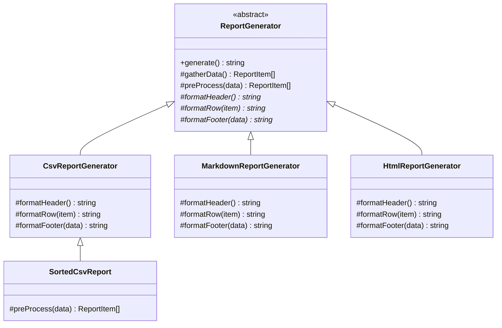

---
tags:
  - design-pattern
  - comp-sci
gardening: 🌿
date: 2026-06-08
reference:
  - https://github.com/deepakkum21/Books/blob/master/Design%20Patterns%20-%20Elements%20of%20Reusable%20Object%20Oriented%20Software%20-%20GOF.pdf
  - https://refactoring.guru/design-patterns/template-method
  - https://en.wikipedia.org/wiki/Template_method_pattern
---
## What & Why

The Template Method pattern defines the skeleton of an algorithm in a base class, deferring certain steps to subclasses. Subclasses can redefine specific steps without changing the algorithm's overall structure or sequence.

You have an algorithm composed of several steps where the sequence is invariant but individual steps vary between implementations. Without the pattern, each implementation repeats the fixed skeleton alongside its specific logic. Changing the skeleton means updating every implementation. Adding a new implementation means re-implementing the entire skeleton.

The Template Method pattern solves this by placing the sequence in a single base class method (the template method) and declaring the variable steps as abstract methods. The base class calls the abstract steps in the correct order. Subclasses fill in the implementation details.

GoF introduce two categories of steps:

**Abstract methods**: Steps with no default implementation; subclasses must provide them. These are the primary extension points.

**Hooks**: Steps with a default implementation (often a no-op) that subclasses may optionally override. Hooks let subclasses extend behavior at specific points in the algorithm without being required to.

**Relationship to Strategy**: Template Method achieves variation through inheritance at design time; the variant is baked in at compile time. Strategy achieves variation through composition at runtime; the algorithm is injected and can be swapped. GoF note that Strategy is more flexible but requires more objects. Template Method is simpler but locks in the algorithm structure through the class hierarchy.

The Hollywood Principle applies here: "Don't call us, we'll call you." The base class calls the subclass methods, not the other way around. The inversion of control lives in the class hierarchy.

Real-world appearances include JUnit/test framework lifecycles (`setUp`, test body, `tearDown`), HTTP middleware pipelines, build tool phases (compile, test, package, deploy), and virtually every abstract base class in Java or C# that defines a processing sequence.

## Structure Diagram



## Traditional Class-Based Implementation

```typescript
type ReportItem = {
  readonly name: string;
  readonly value: number;
  readonly category: string;
};

abstract class ReportGenerator {
  // Template method: defines and owns the algorithm sequence
  // Should not be overridden; TypeScript has no `final` keyword to enforce this
  generate(): string {
    const data = this.gatherData();
    const processed = this.preProcess(data);    // hook: optional override
    const rows = processed.map(item => this.formatRow(item));
    return [
      this.formatHeader(),
      ...rows,
      this.formatFooter(processed),
    ].join('\n');
  }

  // Common step: shared by all subclasses, not overridable by convention
  protected gatherData(): ReadonlyArray<ReportItem> {
    return [
      { name: 'Widget A', value: 1500, category: 'Hardware' },
      { name: 'Widget B', value: 2300, category: 'Software' },
      { name: 'Widget C', value: 800,  category: 'Hardware' },
    ];
  }

  // Hook: default is identity; subclasses may override to add sorting, filtering, etc.
  protected preProcess(data: ReadonlyArray<ReportItem>): ReadonlyArray<ReportItem> {
    return data;
  }

  // Abstract steps: subclasses must provide these
  protected abstract formatHeader(): string;
  protected abstract formatRow(item: ReportItem): string;
  protected abstract formatFooter(data: ReadonlyArray<ReportItem>): string;
}

class CsvReportGenerator extends ReportGenerator {
  protected formatHeader(): string {
    return 'Name,Value,Category';
  }

  protected formatRow(item: ReportItem): string {
    return `${item.name},${item.value},${item.category}`;
  }

  protected formatFooter(data: ReadonlyArray<ReportItem>): string {
    const total = data.reduce((sum, item) => sum + item.value, 0);
    return `Total,,${total}`;
  }
}

class MarkdownReportGenerator extends ReportGenerator {
  protected formatHeader(): string {
    return '| Name | Value | Category |\n|------|-------|----------|';
  }

  protected formatRow(item: ReportItem): string {
    return `| ${item.name} | ${item.value} | ${item.category} |`;
  }

  protected formatFooter(data: ReadonlyArray<ReportItem>): string {
    const total = data.reduce((sum, item) => sum + item.value, 0);
    return `| **Total** | **${total}** | |`;
  }
}

class HtmlReportGenerator extends ReportGenerator {
  protected formatHeader(): string {
    return [
      '<table>',
      '  <thead><tr><th>Name</th><th>Value</th><th>Category</th></tr></thead>',
      '  <tbody>',
    ].join('\n');
  }

  protected formatRow(item: ReportItem): string {
    return `    <tr><td>${item.name}</td><td>${item.value}</td><td>${item.category}</td></tr>`;
  }

  protected formatFooter(data: ReadonlyArray<ReportItem>): string {
    const total = data.reduce((sum, item) => sum + item.value, 0);
    return [
      '  </tbody>',
      `  <tfoot><tr><td>Total</td><td>${total}</td><td></td></tr></tfoot>`,
      '</table>',
    ].join('\n');
  }
}

// Hook usage: override preProcess to sort before rendering
class SortedCsvReport extends CsvReportGenerator {
  protected override preProcess(data: ReadonlyArray<ReportItem>): ReadonlyArray<ReportItem> {
    return [...data].sort((a, b) => b.value - a.value);
  }
}

// Usage
const csv = new CsvReportGenerator();
const md = new MarkdownReportGenerator();
const html = new HtmlReportGenerator();
const sorted = new SortedCsvReport();

console.log(csv.generate());
// Name,Value,Category
// Widget A,1500,Hardware
// Widget B,2300,Software
// Widget C,800,Hardware
// Total,,4600

console.log(sorted.generate());
// Name,Value,Category
// Widget B,2300,Software      <- sorted by value descending
// Widget A,1500,Hardware
// Widget C,800,Hardware
// Total,,4600
```

**Key Characteristics**:

- **Skeleton owned by base class**: `generate()` defines the sequence once; all subclasses inherit it and cannot change the order of steps without overriding the entire method
- **Abstract methods enforce the extension contract**: TypeScript's `abstract` keyword ensures every concrete subclass provides `formatHeader`, `formatRow`, and `formatFooter`; missing any is a compile error
- **Hooks provide optional extension points**: `preProcess` has a default (identity) that subclasses may override without being required to; `SortedCsvReport` uses this to add sorting without touching the skeleton
- **Hollywood Principle via inheritance**: The base class calls the subclass methods in the correct order; the subclass never calls `super.generate()` to trigger the sequence
- **No `final` in TypeScript**: The constraint that `generate()` should not be overridden is documentation only; TypeScript has no mechanism to seal individual methods

## Function-Based Alternative

We achieve Template Method behavior through:

1. **Algorithm skeleton as a higher-order function**: The template method becomes a plain function that accepts a record of step functions. The sequence is fixed inside the HOF; the variable steps come from the passed record.
2. **Variable steps as record properties**: Each overridable step is a property of a `ReportTemplate` object literal. A "subclass" is just an object literal that provides implementations for each required property.
3. **Hooks as optional fields**: GoF's hook concept maps directly to optional properties with `?`. If the field is absent, the HOF applies a default. If present, the provided function is used.
4. **Sharing steps across templates via object spread**: Because steps are plain function values, any template can reuse any step from any other template with `{ ...baseTemplate, formatHeader: customHeader }`. Inheritance hierarchies make this require intermediate base classes.
5. **No base class and no inheritance**: A template is a data structure, not a type hierarchy. Any code can construct one anywhere without extending a class.

```typescript
type ReportItem = {
  readonly name: string;
  readonly value: number;
  readonly category: string;
};

type ReportTemplate = {
  // Required steps: must be provided
  readonly formatHeader: () => string;
  readonly formatRow: (item: ReportItem) => string;
  readonly formatFooter: (data: ReadonlyArray<ReportItem>) => string;
  // Hook: optional step with default behavior
  readonly preProcess?: (data: ReadonlyArray<ReportItem>) => ReadonlyArray<ReportItem>;
};

// Shared step: extracted as a plain function, reusable across any template
const gatherData = (): ReadonlyArray<ReportItem> => [
  { name: 'Widget A', value: 1500, category: 'Hardware' },
  { name: 'Widget B', value: 2300, category: 'Software' },
  { name: 'Widget C', value: 800,  category: 'Hardware' },
];

// The template method is a higher-order function over ReportTemplate
const generateReport = (template: ReportTemplate): string => {
  const raw = gatherData();
  const data = template.preProcess ? template.preProcess(raw) : raw;
  const rows = data.map(template.formatRow);
  return [
    template.formatHeader(),
    ...rows,
    template.formatFooter(data),
  ].join('\n');
};

// Shared utility: reusable across any template
const totalValue = (data: ReadonlyArray<ReportItem>): number =>
  data.reduce((sum, item) => sum + item.value, 0);

// "Subclasses" are plain object literals; no class, no extends
const csvTemplate: ReportTemplate = {
  formatHeader: () => 'Name,Value,Category',
  formatRow: (item) => `${item.name},${item.value},${item.category}`,
  formatFooter: (data) => `Total,,${totalValue(data)}`,
};

const markdownTemplate: ReportTemplate = {
  formatHeader: () => '| Name | Value | Category |\n|------|-------|----------|',
  formatRow: (item) => `| ${item.name} | ${item.value} | ${item.category} |`,
  formatFooter: (data) => `| **Total** | **${totalValue(data)}** | |`,
};

const htmlTemplate: ReportTemplate = {
  formatHeader: () => [
    '<table>',
    '  <thead><tr><th>Name</th><th>Value</th><th>Category</th></tr></thead>',
    '  <tbody>',
  ].join('\n'),
  formatRow: (item) =>
    `    <tr><td>${item.name}</td><td>${item.value}</td><td>${item.category}</td></tr>`,
  formatFooter: (data) => [
    '  </tbody>',
    `  <tfoot><tr><td>Total</td><td>${totalValue(data)}</td><td></td></tr></tfoot>`,
    '</table>',
  ].join('\n'),
};

// Hook usage: extend csvTemplate with a preProcess step via object spread
// No new class, no inheritance; just override the one property that differs
const sortedCsvTemplate: ReportTemplate = {
  ...csvTemplate,
  preProcess: (data) => [...data].sort((a, b) => b.value - a.value),
};

// Usage
console.log(generateReport(csvTemplate));
// Name,Value,Category
// Widget A,1500,Hardware
// Widget B,2300,Software
// Widget C,800,Hardware
// Total,,4600

console.log(generateReport(sortedCsvTemplate));
// Name,Value,Category
// Widget B,2300,Software
// Widget A,1500,Hardware
// Widget C,800,Hardware
// Total,,4600

// Inline template: no class declaration required
console.log(generateReport({
  formatHeader: () => 'REPORT',
  formatRow: (item) => `  ${item.name}: ${item.value}`,
  formatFooter: (data) => `TOTAL: ${totalValue(data)}`,
}));
```

## Comparison: Class vs Function

| Aspect | Class-based | Function-based |
| --- | --- | --- |
| Skeleton definition | Abstract base class method | Higher-order function |
| Variable steps | Abstract methods | Required properties of a record type |
| Hooks | Protected method with default in base class | Optional `?` property with HOF default |
| "Subclass" unit | Class extending abstract base | Plain object literal |
| Preventing skeleton override | Convention only (no `final` in TypeScript) | Not applicable; no class to inherit from |
| Sharing a step across templates | Requires intermediate base class or duplication | Direct function reference or object spread |
| Extending one step | Subclass overriding one method | Object spread: `{ ...base, formatRow: custom }` |
| Inline / anonymous variant | Requires anonymous class or separate declaration | Inline object literal at call site |

### Problems with Traditional Class-Based Template Method

1. **No `final` in TypeScript**: The template method (`generate()`) should not be overridden by subclasses. TypeScript has no mechanism to seal individual methods. A subclass can override `generate()` and silently break the algorithm sequence with no compiler warning.
2. **Fragile base class**: Any change to the base class (adding a step, changing a parameter, splitting a method) potentially breaks all subclasses. The class hierarchy creates tight coupling between the skeleton and every variant, even when the intent is the opposite.
3. **Sharing steps requires a new class**: If `CsvReportGenerator` and `MarkdownReportGenerator` produce identical footers, extracting that shared logic requires either a new intermediate base class between `ReportGenerator` and the two concrete classes, or duplicating the method. Object spread eliminates this entirely.
4. **Extending one step requires a full subclass**: `SortedCsvReport` adds only sorting. It must extend `CsvReportGenerator`, name a new class, declare an `override` method, and write the sort. The functional version is `{ ...csvTemplate, preProcess: sortFn }`: one property added to an existing object.
5. **Constructor coupling**: If the base class constructor requires arguments, every subclass constructor must call `super(...)` with compatible arguments. Changing the base constructor signature ripples through the entire inheritance tree.
