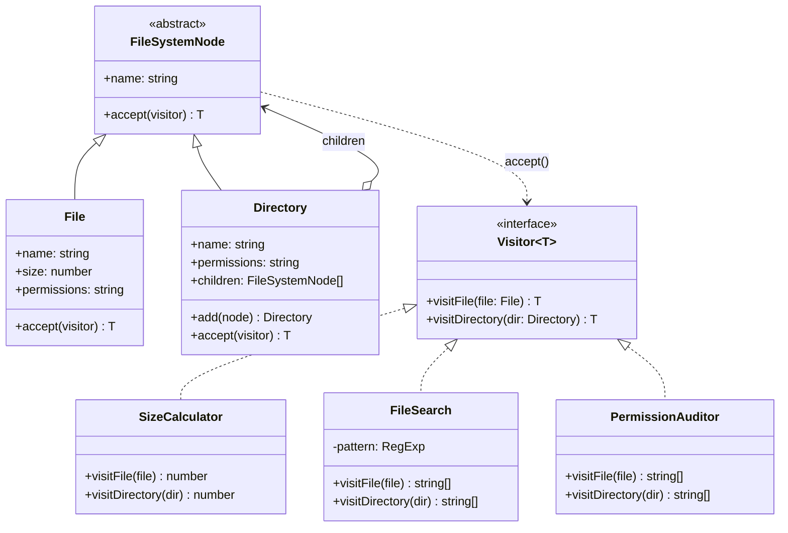

---
tags:
  - design-pattern
  - comp-sci
gardening: 🌿
date: 2026-06-08
reference:
---
## What & Why

The Visitor pattern lets you add new operations to an object structure without modifying the objects themselves. A visitor represents an operation to be performed on the elements of a structure, and new operations can be defined by writing new visitors rather than changing the element classes.

You have a stable class hierarchy (an AST, a file system tree, a UI component tree) and you need to perform many different, unrelated operations on it. Without Visitor, each operation is implemented as a method on each class. Adding a new operation means modifying every class. The classes accumulate methods that have nothing to do with their core responsibility.

Visitor solves this by extracting operations out of the element classes entirely. Each operation becomes a separate Visitor class with one method per element type. The elements only need a single `accept(visitor)` method each.

**The Expression Problem**: Visitor is a direct response to one side of the Expression Problem: a system that must support both new types and new operations on those types. The two approaches make opposite trade-offs:

- **OOP without Visitor**: Adding a new element type is easy (new class). Adding a new operation is hard (modify all classes).
- **Visitor**: Adding a new operation is easy (new Visitor class). Adding a new element type is hard (update all Visitors).
- **FP with discriminated unions**: Adding a new operation is easy (new function with a `switch`). Adding a new element type is hard (update all functions). Same trade-off as Visitor, different mechanism.

Neither approach eliminates the tension. Visitor and the FP pattern-match approach are dual encodings of the same problem.

**Connection to Interpreter**: In the Interpreter lesson (Pattern 15), the FP version showed two interpreter functions (`evaluate` and `prettyPrint`) over the same discriminated union AST without touching the node types. That was the Visitor pattern expressed in functional style. The `switch` over `kind` in each function IS the visitor dispatch mechanism.

Real-world appearances include compilers (type checking, optimization, code generation as visitors over an AST), document object models, file system traversals, serialization pipelines, and financial instrument processors.

## Structure Diagram



## Traditional Class-Based Implementation

```typescript
// Visitor contract: one method per element type in the hierarchy
type Visitor<T> = {
  visitFile(file: File): T;
  visitDirectory(dir: Directory): T;
};

// Element base: the only thing element classes need to implement for the pattern
abstract class FileSystemNode {
  abstract readonly name: string;
  abstract readonly permissions: string;
  abstract accept<T>(visitor: Visitor<T>): T;
}

// Leaf element
class File extends FileSystemNode {
  constructor(
    readonly name: string,
    readonly size: number,
    readonly permissions: string,
  ) { super(); }

  accept<T>(visitor: Visitor<T>): T {
    return visitor.visitFile(this);    // first dispatch: to the element type
  }
}

// Composite element
class Directory extends FileSystemNode {
  private readonly _children: FileSystemNode[] = [];

  constructor(
    readonly name: string,
    readonly permissions: string,
  ) { super(); }

  get children(): ReadonlyArray<FileSystemNode> { return this._children; }

  add(node: FileSystemNode): this {
    this._children.push(node);
    return this;
  }

  accept<T>(visitor: Visitor<T>): T {
    return visitor.visitDirectory(this); // first dispatch: to the element type
  }
}

// Visitor 1: compute total size of the tree
class SizeCalculator implements Visitor<number> {
  visitFile(file: File): number {
    return file.size;
  }

  visitDirectory(dir: Directory): number {
    return dir.children.reduce((total, child) => total + child.accept(this), 0);
  }
}

// Visitor 2: collect all filenames matching a pattern
class FileSearch implements Visitor<ReadonlyArray<string>> {
  constructor(private readonly pattern: RegExp) {}

  visitFile(file: File): ReadonlyArray<string> {
    return this.pattern.test(file.name) ? [file.name] : [];
  }

  visitDirectory(dir: Directory): ReadonlyArray<string> {
    return dir.children.flatMap(child => child.accept(this));
  }
}

// Visitor 3: audit for world-writable permissions
class PermissionAuditor implements Visitor<ReadonlyArray<string>> {
  private readonly insecure = /w.$/;  // world-writable (last triplet has 'w')

  visitFile(file: File): ReadonlyArray<string> {
    return this.insecure.test(file.permissions)
      ? [`INSECURE FILE: ${file.name} (${file.permissions})`]
      : [];
  }

  visitDirectory(dir: Directory): ReadonlyArray<string> {
    const own   = this.insecure.test(dir.permissions)
      ? [`INSECURE DIR: ${dir.name} (${dir.permissions})`]
      : [];
    const child = dir.children.flatMap(c => c.accept(this));
    return [...own, ...child];
  }
}

// Usage
const root = new Directory('/', 'rwxr-xr-x');
root
  .add(new File('readme.txt',  1024, 'rw-r--r--'))
  .add(new File('config.json',  512, 'rw-rw-rw-'))  // world-writable
  .add(
    new Directory('src', 'rwxr-xr-x')
      .add(new File('index.ts', 4096, 'rw-r--r--'))
      .add(new File('utils.ts', 2048, 'rw-r--r--')),
  );

console.log(root.accept(new SizeCalculator()));
// 7680

console.log(root.accept(new FileSearch(/\.ts$/)));
// ['index.ts', 'utils.ts']

console.log(root.accept(new PermissionAuditor()));
// ['INSECURE FILE: config.json (rw-rw-rw-)']

// Adding a fourth visitor requires no changes to File or Directory
class PathLister implements Visitor<ReadonlyArray<string>> {
  constructor(private readonly prefix = '') {}

  visitFile(file: File): ReadonlyArray<string> {
    return [`${this.prefix}/${file.name}`];
  }

  visitDirectory(dir: Directory): ReadonlyArray<string> {
    const nested = new PathLister(`${this.prefix}/${dir.name}`);
    return dir.children.flatMap(c => c.accept(nested));
  }
}

console.log(root.accept(new PathLister()));
// ['//readme.txt', '//config.json', '//src/index.ts', '//src/utils.ts']
```

**Key Characteristics**:

- **Double dispatch**: `element.accept(visitor)` is the first dispatch (to the element type); inside `accept`, `visitor.visitX(this)` is the second dispatch (to the visitor operation). Double dispatch is the mechanism OOP uses to select behavior based on two types simultaneously.
- **`accept()` is pure boilerplate**: Every element class implements `accept` as `return visitor.visitX(this)`. It does nothing except dispatch to the visitor. It is required structural overhead with no domain logic.
- **Operations live outside element classes**: `SizeCalculator`, `FileSearch`, and `PermissionAuditor` can be added without touching `File` or `Directory`.
- **Visitor interface enumerates all element types**: Adding a new element type (`SymlinkNode`) requires adding `visitSymlink` to the `Visitor<T>` interface and implementing it in every concrete visitor.
- **Generic return type**: Making `Visitor<T>` generic allows different visitors to return different types (`number`, `string[]`) from the same `accept` call.

## Function-Based Alternative

We achieve Visitor behavior through:

1. **Visitor functions over discriminated unions**: Each operation is a standalone function that `switch`es on the `kind` field of the `FSNode` union. The `switch` IS the dispatch mechanism. No `accept()` method is needed on any element.
2. **Exhaustive dispatch enforced by the compiler**: TypeScript's narrowing ensures all union variants are handled in every visitor function. Adding a new element type (`SymlinkNode`) without updating a visitor function is a compile error, not a missed runtime case.
3. **No `accept()` boilerplate**: The discriminated union carries its own type tag in `kind`. Every visitor dispatches on it directly. The double-dispatch ceremony of the OOP version simply does not exist.
4. **Visitors are pure functions**: Each visitor is a function from `FSNode` to some result type with no mutable accumulator fields. Results flow through return values, not `this.results.push(...)` side effects.
5. **The same trade-off, better ergonomics**: Both Visitor (OOP) and pattern-matching functions (FP) make adding new operations easy and adding new element types hard. The FP version catches the "hard" case (missing switch arm for a new variant) at compile time rather than silently at runtime.

```typescript
// Element types: discriminated union
type FileNode = {
  readonly kind: 'file';
  readonly name: string;
  readonly size: number;
  readonly permissions: string;
};

type DirectoryNode = {
  readonly kind: 'directory';
  readonly name: string;
  readonly permissions: string;
  readonly children: ReadonlyArray<FSNode>;
};

type FSNode = FileNode | DirectoryNode;

// Smart constructors
const file = (name: string, size: number, permissions: string): FileNode =>
  ({ kind: 'file', name, size, permissions });

const dir = (
  name: string,
  permissions: string,
  children: ReadonlyArray<FSNode> = [],
): DirectoryNode => ({ kind: 'directory', name, permissions, children });

// Visitor 1: total size
// switch on kind = visitor dispatch; no accept() required
const calculateSize = (node: FSNode): number => {
  switch (node.kind) {
    case 'file':
	    return node.size;
    case 'directory':
	    return node.children.reduce((n, child) => n + calculateSize(child), 0);
  }
};

// Visitor 2: filename search
const searchFiles = (node: FSNode, pattern: RegExp): ReadonlyArray<string> => {
  switch (node.kind) {
    case 'file':
	    return pattern.test(node.name) ? [node.name] : [];
    case 'directory':
	    return node.children.flatMap(child => searchFiles(child, pattern));
  }
};

// Visitor 3: permission audit
const INSECURE = /w.$/;

const auditPermissions = (node: FSNode): ReadonlyArray<string> => {
  switch (node.kind) {
    case 'file':
      return INSECURE.test(node.permissions)
        ? [`INSECURE FILE: ${node.name} (${node.permissions})`]
        : [];
    case 'directory':
      return [
        ...(INSECURE.test(node.permissions)
          ? [`INSECURE DIR: ${node.name} (${node.permissions})`]
          : []),
        ...node.children.flatMap(auditPermissions),
      ];
  }
};

// Visitor 4: path listing (adding a new operation = new function, no element changes)
const listPaths = (node: FSNode, prefix = ''): ReadonlyArray<string> => {
  switch (node.kind) {
    case 'file':
      return [`${prefix}/${node.name}`];
    case 'directory':
      return node.children.flatMap(child =>
        listPaths(child, `${prefix}/${node.name}`),
      );
  }
};

// Usage
const root: FSNode = dir('/', 'rwxr-xr-x', [
  file('readme.txt',   1024, 'rw-r--r--'),
  file('config.json',   512, 'rw-rw-rw-'),  // world-writable
  dir('src', 'rwxr-xr-x', [
    file('index.ts', 4096, 'rw-r--r--'),
    file('utils.ts', 2048, 'rw-r--r--'),
  ]),
]);

console.log(calculateSize(root));              // 7680
console.log(searchFiles(root, /\.ts$/));       // ['index.ts', 'utils.ts']
console.log(auditPermissions(root));           // ['INSECURE FILE: config.json (rw-rw-rw-)']
console.log(listPaths(root));
// ['//readme.txt', '//config.json', '//src/index.ts', '//src/utils.ts']

// Adding a new element type shows the trade-off:
// Add 'symlink' to FSNode and TypeScript immediately flags every
// visitor function's switch as non-exhaustive. Each must be updated.
// This is the same requirement as updating every OOP Visitor class,
// but the compiler catches every missed case automatically.
```

## Comparison: Class vs Function

| Aspect | Class-based | Function-based |
| --- | --- | --- |
| Visitor unit | Class with one method per element type | Function with `switch` per union variant |
| Dispatch mechanism | Double dispatch via `accept(visitor)` | Single dispatch via `switch(node.kind)` |
| `accept()` boilerplate | Required on every element class | Not needed |
| New operation | New Visitor class | New function |
| New element type | Add to `Visitor<T>` interface and every concrete Visitor | Add to union type; compiler flags every function missing the case |
| Exhaustiveness checking | Not enforced by compiler | TypeScript narrows to `never` for unhandled variants |
| Accumulating results | Often requires mutable `this.results` field | Pure return values, no mutable state |
| Element type coupling | `Visitor<T>` interface enumerates all element types | Each function handles only what it needs |

### Problems with Traditional Class-Based Visitor

1. **`accept()` is pure ceremony**: Every element class implements `accept` as a one-liner that calls `visitor.visitX(this)`. This is structural overhead demanded by the double-dispatch mechanism with no domain logic involved. The discriminated union eliminates it entirely.
2. **Double dispatch complexity**: The pattern requires two levels of virtual dispatch to select the right `visit` method for the right element type. This is a workaround for a limitation of single-dispatch OOP languages. TypeScript's `switch` over a `kind` field achieves the same result in one step.
3. **New element type silently breaks visitors**: Adding `SymlinkNode` to the hierarchy means adding `visitSymlink` to the `Visitor<T>` interface. Existing visitors now fail to compile only if the interface update is made correctly. If a team member adds the node type but forgets the interface update, the omission is not caught until runtime. The discriminated union flags every missing case immediately.
4. **Mutable accumulation anti-pattern**: Visitors that collect results (search, audit) often accumulate them in a mutable field (`this.results.push(...)`) because the `visit` methods may return `void` in simpler implementations. The functional versions return results directly, making the data flow explicit and the functions pure.
5. **Visitor interface couples to the full element set**: `Visitor<T>` must enumerate every element type even if a particular visitor only cares about one. A visitor that only processes `File` nodes must still implement `visitDirectory` to satisfy the interface, typically as a no-op that returns an empty value. The functional version implements only a `switch` with the cases it needs.
