---
tags:
  - design-pattern
  - comp-sci
gardening: 🌳
date: 2025-12-21
reference:
  - https://softwaredesignpatterns.azurewebsites.net/eBooks/Design%20Patterns%20Elements%20of%20Reusable%20Object-Oriented%20Software.pdf
  - https://refactoring.guru/design-patterns/abstract-factory
---
## What & Why

You need to create families of related or dependent objects without specifying their concrete classes. The objects created must be compatible with each other.

- Ensure that products from the same family are used together (e.g., Windows UI components work with Windows theme, not mixed with macOS components)
- Isolate concrete product classes from client code
- Support multiple product families through a common interface
- Enforce constraints across related objects (e.g., dark theme uses dark buttons, dark scrollbars, etc.)

**Difference from Factory Method**: 
- Factory Method: Creates **one** product type through inheritance
- Abstract Factory: Creates **families** of related products through composition

## Structure Diagram

```mermaid
classDiagram
    direction TB

    %% =======================
    %% Tier 1 — Factory Root
    %% =======================
    class AbstractFactory {
        <<interface>>
        +createButton() Button
        +createCheckbox() Checkbox
    }

    %% =======================
    %% Tier 2 — Concrete Factories
    %% =======================
    class WindowsFactory {
        +createButton() Button
        +createCheckbox() Checkbox
    }

    class MacFactory {
        +createButton() Button
        +createCheckbox() Checkbox
    }

    AbstractFactory <|.. WindowsFactory
    AbstractFactory <|.. MacFactory

    %% =======================
    %% Tier 3 — Abstract Products
    %% =======================
    class Button {
        <<interface>>
        +render() void
    }

    class Checkbox {
        <<interface>>
        +toggle() void
    }

    %% =======================
    %% Tier 4 — Concrete Products
    %% =======================
    class WindowsButton { +render() void }
    class WindowsCheckbox { +toggle() void }
    class MacButton { +render() void }
    class MacCheckbox { +toggle() void }

    Button <|.. WindowsButton
    Button <|.. MacButton
    Checkbox <|.. WindowsCheckbox
    Checkbox <|.. MacCheckbox

    %% Factory creation flow
    WindowsFactory --> Button
    WindowsFactory --> Checkbox
    MacFactory --> Button
    MacFactory --> Checkbox

```



## Traditional Implementation

```typescript
// Abstract Product interfaces - define types in the family
interface Button {
  render(): void;
  onClick(handler: () => void): void;
  getStyle(): string;
}

interface Checkbox {
  render(): void;
  toggle(): void;
  isChecked(): boolean;
  getStyle(): string;
}

interface Scrollbar {
  render(): void;
  scroll(position: number): void;
  getStyle(): string;
}

// Concrete Products - Windows family
class WindowsButton implements Button {
  private clickHandler: (() => void) | null = null;

  public render(): void {
    console.log('Rendering Windows Metro button');
  }

  public onClick(handler: () => void): void {
    this.clickHandler = handler;
  }

  public getStyle(): string {
    return 'Windows Metro';
  }
}

class WindowsCheckbox implements Checkbox {
  private checked = false;

  public render(): void {
    console.log('Rendering Windows Metro checkbox');
  }

  public toggle(): void {
    this.checked = !this.checked;
    console.log(`Windows checkbox: ${this.checked ? 'checked' : 'unchecked'}`);
  }

  public isChecked(): boolean {
    return this.checked;
  }

  public getStyle(): string {
    return 'Windows Metro';
  }
}

class WindowsScrollbar implements Scrollbar {
  private position = 0;

  public render(): void {
    console.log('Rendering Windows Metro scrollbar');
  }

  public scroll(position: number): void {
    this.position = position;
    console.log(`Windows scrollbar at position: ${position}`);
  }

  public getStyle(): string {
    return 'Windows Metro';
  }
}

// Concrete Products - macOS family
class MacButton implements Button {
  private clickHandler: (() => void) | null = null;

  public render(): void {
    console.log('Rendering macOS Aqua button');
  }

  public onClick(handler: () => void): void {
    this.clickHandler = handler;
  }

  public getStyle(): string {
    return 'macOS Aqua';
  }
}

class MacCheckbox implements Checkbox {
  private checked = false;

  public render(): void {
    console.log('Rendering macOS Aqua checkbox');
  }

  public toggle(): void {
    this.checked = !this.checked;
    console.log(`macOS checkbox: ${this.checked ? 'checked' : 'unchecked'}`);
  }

  public isChecked(): boolean {
    return this.checked;
  }

  public getStyle(): string {
    return 'macOS Aqua';
  }
}

class MacScrollbar implements Scrollbar {
  private position = 0;

  public render(): void {
    console.log('Rendering macOS Aqua scrollbar');
  }

  public scroll(position: number): void {
    this.position = position;
    console.log(`macOS scrollbar at position: ${position}`);
  }

  public getStyle(): string {
    return 'macOS Aqua';
  }
}

// Abstract Factory interface
// Declares creation methods for each product type
interface GUIFactory {
  createButton(): Button;
  createCheckbox(): Checkbox;
  createScrollbar(): Scrollbar;
}

// Concrete Factories - create families of related products
class WindowsFactory implements GUIFactory {
  public createButton(): Button {
    return new WindowsButton();
  }

  public createCheckbox(): Checkbox {
    return new WindowsCheckbox();
  }

  public createScrollbar(): Scrollbar {
    return new WindowsScrollbar();
  }
}

class MacFactory implements GUIFactory {
  public createButton(): Button {
    return new MacButton();
  }

  public createCheckbox(): Checkbox {
    return new MacCheckbox();
  }

  public createScrollbar(): Scrollbar {
    return new MacScrollbar();
  }
}

// Client code works with factories and products through abstract interfaces
// Doesn't know about concrete classes
class Application {
  private button: Button;
  private checkbox: Checkbox;
  private scrollbar: Scrollbar;

  constructor(factory: GUIFactory) {
    this.button = factory.createButton();
    this.checkbox = factory.createCheckbox();
    this.scrollbar = factory.createScrollbar();
  }

  public render(): void {
    this.button.render();
    this.checkbox.render();
    this.scrollbar.render();
  }

  public demonstrateCompatibility(): void {
    console.log(`All components use ${this.button.getStyle()} theme`);
    console.log(`Button: ${this.button.getStyle()}`);
    console.log(`Checkbox: ${this.checkbox.getStyle()}`);
    console.log(`Scrollbar: ${this.scrollbar.getStyle()}`);
  }
}

// Usage - factory selection determines the entire product family
const getFactory = (): GUIFactory => {
  const platform = process.platform;

  if (platform === 'win32') {
    return new WindowsFactory();
  } else if (platform === 'darwin') {
    return new MacFactory();
  }

  return new WindowsFactory(); // default
};

const factory = getFactory();
const app = new Application(factory);

app.render();
app.demonstrateCompatibility();
```

**Key Characteristics**:
- Abstract factory interface with multiple creation methods
- Each concrete factory creates a complete family
- Products from same family are guaranteed compatible
- Client depends only on abstract interfaces

## Modern Alternative

We achieve the same guarantees through:
1. **Factory objects/records** - Plain objects with factory functions
2. **Discriminated unions** - Type-safe product families
3. **Higher-order functions** - Composing factory behavior

```typescript
// Product types as discriminated unions
type ButtonStyle = 'Windows Metro' | 'macOS Aqua' | 'Linux GTK';

type Button = {
  readonly kind: 'button';
  readonly style: ButtonStyle;
  readonly label: string;
};

type Checkbox = {
  readonly kind: 'checkbox';
  readonly style: ButtonStyle;
  readonly checked: boolean;
};

type Scrollbar = {
  readonly kind: 'scrollbar';
  readonly style: ButtonStyle;
  readonly position: number;
};

// Factory type - just a record of functions
type GUIFactory = {
  readonly style: ButtonStyle;
  readonly createButton: (label: string) => Button;
  readonly createCheckbox: () => Checkbox;
  readonly createScrollbar: () => Scrollbar;
};

// Concrete factories - plain objects with closures
const windowsFactory: GUIFactory = {
  style: 'Windows Metro',
  
  createButton: (label: string): Button => ({
    kind: 'button',
    style: 'Windows Metro',
    label
  }),
  
  createCheckbox: (): Checkbox => ({
    kind: 'checkbox',
    style: 'Windows Metro',
    checked: false
  }),
  
  createScrollbar: (): Scrollbar => ({
    kind: 'scrollbar',
    style: 'Windows Metro',
    position: 0
  })
};

const macFactory: GUIFactory = {
  style: 'macOS Aqua',
  
  createButton: (label: string): Button => ({
    kind: 'button',
    style: 'macOS Aqua',
    label
  }),
  
  createCheckbox: (): Checkbox => ({
    kind: 'checkbox',
    style: 'macOS Aqua',
    checked: false
  }),
  
  createScrollbar: (): Scrollbar => ({
    kind: 'scrollbar',
    style: 'macOS Aqua',
    position: 0
  })
};

// Operations on products (separate from data)
const renderButton = (button: Button): void => {
  console.log(`Rendering ${button.style} button`);
};

const renderCheckbox = (checkbox: Checkbox): void => {
  console.log(`Rendering ${checkbox.style} checkbox`);
};

const renderScrollbar = (scrollbar: Scrollbar): void => {
  console.log(`Rendering ${scrollbar.style} scrollbar`);
};

// Pure functions for state updates
const toggleCheckbox = (checkbox: Checkbox): Checkbox => ({
  ...checkbox,
  checked: !checkbox.checked
});

const scrollScrollbar = (scrollbar: Scrollbar, position: number): Scrollbar => ({
  ...scrollbar,
  position
});

// Application using the factory
// Returns immutable state and operations
type ApplicationState = {
  readonly button: Button;
  readonly checkbox: Checkbox;
  readonly scrollbar: Scrollbar;
};

const createApplication = (factory: GUIFactory): ApplicationState => ({
  button: factory.createButton('Click Me'),
  checkbox: factory.createCheckbox(),
  scrollbar: factory.createScrollbar()
});

const renderApplication = (state: ApplicationState): void => {
  renderButton(state.button);
  renderCheckbox(state.checkbox);
  renderScrollbar(state.scrollbar);
};

const demonstrateCompatibility = (state: ApplicationState): void => {
  console.log(`All components use ${state.button.style} theme`);
  console.log(`Button: ${state.button.style}`);
  console.log(`Checkbox: ${state.checkbox.style}`);
  console.log(`Scrollbar: ${state.scrollbar.style}`);
};

// Usage
const factory = process.platform === 'darwin' ? macFactory : windowsFactory;
const app = createApplication(factory);
renderApplication(app);
demonstrateCompatibility(app);

// Immutable updates
const updatedApp = {
  ...app,
  checkbox: toggleCheckbox(app.checkbox),
  scrollbar: scrollScrollbar(app.scrollbar, 50)
};

renderApplication(updatedApp);
```

## Comparison: Traditional vs Modern

| Aspect           | Classes              | Functions/Data       |
| ---------------- |--------------------- | -------------------- |
| Family Guarantee | Runtime via classes  | Compile-time types   |
| Extensibility    | New factory class    | New factory object   |
| Type Safety      | Interface contracts  | Phantom types/unions |
| State Management | Instance variables   | Immutable data       |
| Coupling         | Class dependencies   | Function composition |
| Testing          | Mock factory classes | Inject factory funcs |
| Code Size        | Larger (classes)     | Smaller (functions)  |
| Runtime Overhead | Object allocation    | Minimal closures     |
| Complexity       | Inheritance trees    | Type parameters      |

### Stackblitz Link

[Abstract Factory Pattern](https://stackblitz.com/edit/vitejs-vite-2mnzrutc?file=src%2Fmain.ts)