---
tags:
  - design-pattern
  - comp-sci
gardening: 🌳
date: 2026-01-02
reference:
  - https://softwaredesignpatterns.azurewebsites.net/eBooks/Design%20Patterns%20Elements%20of%20Reusable%20Object-Oriented%20Software.pdf
  - https://refactoring.guru/design-patterns/builder
---
## What & Why

You need to construct complex objects step-by-step, where the construction process should be independent of the parts that make up the object. The same construction process should be able to create different representations.

- Avoid "telescoping constructor" anti-pattern (constructors with many parameters)
- Construct objects that require multiple steps or complex initialization
- Create different representations of an object using the same construction code
- Make object construction more readable and maintainable
- Separate construction logic from the object's representation

## Structure Diagram

```mermaid
classDiagram
    direction TB

    %% =======================
    %% Tier 1 — Director
    %% =======================
    class Director {
        +construct() void
    }

    %% =======================
    %% Tier 2 — Abstract Builder
    %% =======================
    class Builder {
        <<interface>>
        +buildPartA() void
        +buildPartB() void
        +getResult() Product
    }

    Director --> Builder : orchestrates

    %% =======================
    %% Tier 3 — Concrete Builders
    %% =======================
    class ConcreteBuilderA {
        +buildPartA() void
        +buildPartB() void
        +getResult() Product
    }

    class ConcreteBuilderB {
        +buildPartA() void
        +buildPartB() void
        +getResult() Product
    }

    Builder <|.. ConcreteBuilderA
    Builder <|.. ConcreteBuilderB

    %% =======================
    %% Tier 4 — Product
    %% =======================
    class Product {
        +addPartA() void
        +addPartB() void
    }

    ConcreteBuilderA --> Product : creates
    ConcreteBuilderB --> Product : creates

```




## Traditional Implementation

```typescript
// Product - complex object being built
class Computer {
  public cpu?: string;
  public ram?: number;
  public storage?: number;
  public gpu?: string;
  public motherboard?: string;
  public powerSupply?: number;
  public coolingSystem?: string;
  public case?: string;

  public specifications(): string {
    return `Computer Specifications:
- CPU: ${this.cpu ?? 'Not specified'}
- RAM: ${this.ram ?? 0}GB
- Storage: ${this.storage ?? 0}GB
- GPU: ${this.gpu ?? 'Integrated'}
- Motherboard: ${this.motherboard ?? 'Standard'}
- Power Supply: ${this.powerSupply ?? 0}W
- Cooling: ${this.coolingSystem ?? 'Stock'}
- Case: ${this.case ?? 'Standard'}`;
  }
}

// Builder interface - defines construction steps
interface ComputerBuilder {
  setCPU(cpu: string): this;
  setRAM(ram: number): this;
  setStorage(storage: number): this;
  setGPU(gpu: string): this;
  setMotherboard(motherboard: string): this;
  setPowerSupply(watts: number): this;
  setCoolingSystem(cooling: string): this;
  setCase(caseType: string): this;
  build(): Computer;
}

// Concrete Builder - implements construction steps
// Uses fluent interface (method chaining)
class GamingComputerBuilder implements ComputerBuilder {
  private computer: Computer;

  constructor() {
    this.computer = new Computer();
  }

  public setCPU(cpu: string): this {
    this.computer.cpu = cpu;
    return this;
  }

  public setRAM(ram: number): this {
    this.computer.ram = ram;
    return this;
  }

  public setStorage(storage: number): this {
    this.computer.storage = storage;
    return this;
  }

  public setGPU(gpu: string): this {
    this.computer.gpu = gpu;
    return this;
  }

  public setMotherboard(motherboard: string): this {
    this.computer.motherboard = motherboard;
    return this;
  }

  public setPowerSupply(watts: number): this {
    this.computer.powerSupply = watts;
    return this;
  }

  public setCoolingSystem(cooling: string): this {
    this.computer.coolingSystem = cooling;
    return this;
  }

  public setCase(caseType: string): this {
    this.computer.case = caseType;
    return this;
  }

  public build(): Computer {
    return this.computer;
  }
}

class OfficeComputerBuilder implements ComputerBuilder {
  private computer: Computer;

  constructor() {
    this.computer = new Computer();
  }

  public setCPU(cpu: string): this {
    this.computer.cpu = cpu;
    return this;
  }

  public setRAM(ram: number): this {
    this.computer.ram = ram;
    return this;
  }

  public setStorage(storage: number): this {
    this.computer.storage = storage;
    return this;
  }

  public setGPU(gpu: string): this {
    this.computer.gpu = gpu;
    return this;
  }

  public setMotherboard(motherboard: string): this {
    this.computer.motherboard = motherboard;
    return this;
  }

  public setPowerSupply(watts: number): this {
    this.computer.powerSupply = watts;
    return this;
  }

  public setCoolingSystem(cooling: string): this {
    this.computer.coolingSystem = cooling;
    return this;
  }

  public setCase(caseType: string): this {
    this.computer.case = caseType;
    return this;
  }

  public build(): Computer {
    return this.computer;
  }
}

// Director (optional) - knows how to build specific configurations
class ComputerDirector {
  public constructGamingPC(builder: ComputerBuilder): Computer {
    return builder
      .setCPU('Intel i9-13900K')
      .setRAM(32)
      .setStorage(2000)
      .setGPU('NVIDIA RTX 4090')
      .setMotherboard('ASUS ROG Maximus')
      .setPowerSupply(1000)
      .setCoolingSystem('Liquid Cooling')
      .setCase('Full Tower RGB')
      .build();
  }

  public constructOfficePC(builder: ComputerBuilder): Computer {
    return builder
      .setCPU('Intel i5-13400')
      .setRAM(16)
      .setStorage(512)
      .setMotherboard('Standard ATX')
      .setPowerSupply(450)
      .setCoolingSystem('Stock Air Cooling')
      .setCase('Mid Tower')
      .build();
  }

  public constructBudgetPC(builder: ComputerBuilder): Computer {
    return builder
      .setCPU('AMD Ryzen 5 5600')
      .setRAM(8)
      .setStorage(256)
      .setPowerSupply(400)
      .build();
  }
}

// Usage - with Director
const director = new ComputerDirector();
const gamingBuilder = new GamingComputerBuilder();
const gamingPC = director.constructGamingPC(gamingBuilder);
console.log(gamingPC.specifications());

// Usage - without Director (manual construction)
const customPC = new GamingComputerBuilder()
  .setCPU('AMD Ryzen 9 7950X')
  .setRAM(64)
  .setStorage(4000)
  .setGPU('AMD Radeon RX 7900 XTX')
  .setPowerSupply(850)
  .build();

console.log(customPC.specifications());
```

**Key Characteristics**:
- Fluent interface (method chaining with `return this`)
- Step-by-step construction
- Director (optional) encapsulates common build sequences
- Final `build()` method returns the product

## Modern Alternative

We achieve builder-like behavior through:
1. **Function composition** - Composing transformation functions
2. **Partial application** - Building up configuration incrementally
3. **Immutable updates** - Each step returns new state
4. **Lenses/Setters** - Updates to nested structures

```typescript
type Computer = {
  readonly cpu: string;
  readonly ram: number;
  readonly storage: number;
  readonly gpu: string;
  readonly motherboard: string;
  readonly powerSupply: number;
  readonly coolingSystem: string;
  readonly case: string;
};

const specifications = (comp: Computer) => {
  return `Computer Specifications:
- CPU: ${comp.cpu ?? 'Not specified'}
- RAM: ${comp.ram ?? 0}GB
- Storage: ${comp.storage ?? 0}GB
- GPU: ${comp.gpu ?? 'Integrated'}
- Motherboard: ${comp.motherboard ?? 'Standard'}
- Power Supply: ${comp.powerSupply ?? 0}W
- Cooling: ${comp.coolingSystem ?? 'Stock'}
- Case: ${comp.case ?? 'Standard'}`;
};

// Default/empty computer
const emptyComputer: Computer = {
  cpu: 'Not specified',
  ram: 0,
  storage: 0,
  gpu: 'Integrated',
  motherboard: 'Standard',
  powerSupply: 0,
  coolingSystem: 'Stock',
  case: 'Standard'
};

// Builder functions - each returns a new Computer
// Type: Computer -> Computer
type ComputerUpdater = (computer: Computer) => Computer;

const setCPU = (cpu: string): ComputerUpdater =>
  (computer: Computer): Computer => ({ ...computer, cpu });

const setRAM = (ram: number): ComputerUpdater =>
  (computer: Computer): Computer => ({ ...computer, ram });

const setStorage = (storage: number): ComputerUpdater =>
  (computer: Computer): Computer => ({ ...computer, storage });

const setGPU = (gpu: string): ComputerUpdater =>
  (computer: Computer): Computer => ({ ...computer, gpu });

const setMotherboard = (motherboard: string): ComputerUpdater =>
  (computer: Computer): Computer => ({ ...computer, motherboard });

const setPowerSupply = (powerSupply: number): ComputerUpdater =>
  (computer: Computer): Computer => ({ ...computer, powerSupply });

const setCoolingSystem = (coolingSystem: string): ComputerUpdater =>
  (computer: Computer): Computer => ({ ...computer, coolingSystem });

const setCase = (caseType: string): ComputerUpdater =>
  (computer: Computer): Computer => ({ ...computer, case: caseType });

// Compose multiple updates into single builder
// This is function composition: f ∘ g ∘ h
const compose = <T>(...fns: Array<(arg: T) => T>) =>
  (initial: T): T =>
    fns.reduce((acc, fn) => fn(acc), initial);

// Similarly can be done using pipe
// f |> g |> h instead of f ∘ g ∘ h
const pipe = <T>(...fns: Array<(arg: T) => T>) =>
  (initial: T): T =>
    fns.reduce((acc, fn) => fn(acc), initial);

const buildGamingPC = compose(
  setCPU('Intel i9-13900K'),
  setRAM(32),
  setStorage(2000),
  setGPU('NVIDIA RTX 4090'),
  setMotherboard('ASUS ROG Maximus'),
  setPowerSupply(1000),
  setCoolingSystem('Liquid Cooling'),
  setCase('Full Tower RGB')
);

const buildOfficePC = compose(
  setCPU('Intel i5-13400'),
  setRAM(16),
  setStorage(512),
  setMotherboard('Standard ATX'),
  setPowerSupply(450)
);

// Usage - builder function
const gamingPC = buildGamingPC(emptyComputer);
console.log(specifications(gamingPC));

// Usage - manual construction
const customPC = compose<Computer>(
  setCPU('AMD Ryzen 9 7950X'),
  setRAM(64),
  setStorage(1000),
  setGPU('AMD Radeon RX 7900 XTX'),
  setPowerSupply(1000)
)(emptyComputer);
```

## Alternative: Lens-Based

```typescript
// ...setup from previous example

type Lens<S, A> = {
  get: (s: S) => A;
  set: (a: A) => (s: S) => S;
};

const lens = <S, K extends keyof S>(key: K): Lens<S, S[K]> => ({
  get: (s: S): S[K] => s[key],
  set: (value: S[K]) => (s: S): S => ({ ...s, [key]: value })
});

// Create lenses for each property
const cpuLens = lens<Computer, 'cpu'>('cpu');
const ramLens = lens<Computer, 'ram'>('ram');
const storageLens = lens<Computer, 'storage'>('storage');

// Set using lens
const setWithLens = <S, A>(lens: Lens<S, A>, value: A) =>
  (s: S): S => lens.set(value)(s);

// Usage
const pc = pipe(
  setWithLens(cpuLens, 'Intel i9-13900K'),
  setWithLens(ramLens, 32),
  setWithLens(storageLens, 2000)
)(emptyComputer);
```

## Comparison: Traditional vs Modern

| Aspect           | Classes              | Functions             |
| ---------------- | -------------------- | --------------------- |
| Mutation         | Mutable state        | Immutable transforms  |
| Chaining         | `return this`        | Function composition  |
| Readability      | Fluent interface     | Pipe/compose          |
| Reusability      | Director class       | Preset functions      |
| Type Safety      | Interface contract   | Type inference        |
| State Management | Hidden in builder    | Explicit transforms   |
| Testing          | Mock builder         | Test pure functions   |
| Complexity       | Classes + interfaces | Functions only        |
| Partial Builds   | Call build() anytime | Compose incrementally |

### Stackblitz Link

[Builder Pattern](https://stackblitz.com/edit/vitejs-vite-qibk61ex?file=src%2Fmain.ts,src%2Fmain.ts)
