---
tags:
  - design-pattern
  - comp-sci
gardening: 🌳
date: 2026-01-02
reference:
  - https://softwaredesignpatterns.azurewebsites.net/eBooks/Design%20Patterns%20Elements%20of%20Reusable%20Object-Oriented%20Software.pdf
  - https://refactoring.guru/design-patterns/prototype
---
## What & Why

You need to create new objects by copying existing objects (prototypes) rather than constructing them from scratch. The exact class of the object to be created is determined at runtime.

- Create objects when the concrete class is unknown until runtime
- Reduce the number of subclasses (avoid Factory/Builder class explosion)
- Preserve object state when creating new instances
- Support dynamic configuration of objects

## Structure Diagram

```mermaid
classDiagram
    direction TB

    %% =======================
    %% Tier 1 — Client
    %% =======================
    class Client {
        +operation(p: Prototype) Prototype
    }

    %% =======================
    %% Tier 2 — Prototype Root
    %% =======================
    class Prototype {
        <<interface>>
        +clone() Prototype
    }

    Client --> Prototype : uses

    %% =======================
    %% Tier 3 — Concrete Prototypes
    %% =======================
    class ConcretePrototypeA {
        +clone() Prototype
    }

    class ConcretePrototypeB {
        +clone() Prototype
    }

    Prototype <|.. ConcretePrototypeA
    Prototype <|.. ConcretePrototypeB

```




## Traditional Implementation

```typescript
// Prototype interface - declares clone method
interface Cloneable<T> {
  clone(): T;
}

// Complex object with nested structure
class Address {
  constructor(
    public street: string,
    public city: string,
    public country: string,
    public zipCode: string
  ) {}

  public clone(): Address {
    return new Address(this.street, this.city, this.country, this.zipCode);
  }
}

class ContactInfo {
  constructor(
    public email: string,
    public phone: string,
    public address: Address
  ) {}

  public clone(): ContactInfo {
    return new ContactInfo(
      this.email,
      this.phone,
      this.address.clone() // Deep clone nested object
    );
  }
}

// Concrete Prototype - implements cloning
class Employee implements Cloneable<Employee> {
  constructor(
    public name: string,
    public role: string,
    public salary: number,
    public contact: ContactInfo,
    public skills: string[]
  ) {}

  // Deep clone - creates independent copy
  public clone(): Employee {
    return new Employee(
      this.name,
      this.role,
      this.salary,
      this.contact.clone(), // Deep clone nested object
      [...this.skills] // Clone array
    );
  }

  public displayInfo(): string {
    return `${this.name} - ${this.role} ($${this.salary})
Skills: ${this.skills.join(', ')}
Contact: ${this.contact.email} | ${this.contact.phone}
Address: ${this.contact.address.street}, ${this.contact.address.city}`;
  }
}

// Another concrete prototype with different structure
class Project implements Cloneable<Project> {
  constructor(
    public name: string,
    public budget: number,
    public deadline: Date,
    public team: Employee[],
    public technologies: Set<string>
  ) {}

  public clone(): Project {
    return new Project(
      this.name,
      this.budget,
      new Date(this.deadline.getTime()), // Clone date
      this.team.map(emp => emp.clone()), // Deep clone array of objects
      new Set(this.technologies) // Clone set
    );
  }

  public displayInfo(): string {
    return `Project: ${this.name}
Budget: $${this.budget}
Deadline: ${this.deadline.toDateString()}
Team size: ${this.team.length}
Technologies: ${Array.from(this.technologies).join(', ')}`;
  }
}

// Usage
const mainOfficeAddress = new Address('123 Main St', 'San Francisco', 'USA', '94102');
const mainContact = new ContactInfo('john@example.com', '555-0100', mainOfficeAddress);

const seniorDev = new Employee(
  'John Doe',
  'Senior Developer',
  120000,
  mainContact,
  ['TypeScript', 'React', 'Node.js']
);

// Clone to create new employee with similar profile
const juniorDev = seniorDev.clone();
juniorDev.name = 'Jane Smith';
juniorDev.role = 'Junior Developer';
juniorDev.salary = 80000;
juniorDev.contact.email = 'jane@example.com';
juniorDev.skills.push('Learning');

console.log('Original:', seniorDev.displayInfo());
console.log('\nCloned and modified:', juniorDev.displayInfo());

// Verify independence
console.log('\nOriginal email:', seniorDev.contact.email); // john@example.com
console.log('Clone email:', juniorDev.contact.email); // jane@example.com
```

## Modern Alternative

We achieve singleton behavior through:
- **Immutable data structures** - Copying is built-in
- **Structural sharing** - Efficient deep copies
- **Pure functions** - No mutation, always return new values

```typescript
type DeepPartial<T> = T extends object ? {
  [P in keyof T]?: DeepPartial<T[P]>;
} : T;

type Address = {
  readonly street: string;
  readonly city: string;
  readonly country: string;
  readonly zipCode: string;
};

type ContactInfo = {
  readonly email: string;
  readonly phone: string;
  readonly address: Address;
};

type Employee = {
  readonly name: string;
  readonly role: string;
  readonly salary: number;
  readonly contact: ContactInfo;
  readonly skills: readonly string[];
};

// Clone function
// Creates independent copy
const cloneEmployee = (employee: Employee): Employee => ({
  ...employee,
  contact: {
    ...employee.contact,
    address: { ...employee.contact.address }
  },
  skills: [...employee.skills]
});

// Create new employee from prototype with modifications
export const createEmployee = (
  prototype: Employee,
  overrides: DeepPartial<Employee>
): Employee => ({
  ...cloneEmployee(prototype),
  ...overrides,
  // Merge nested objects carefully
  contact: overrides.contact
    ? { ...prototype.contact, ...overrides.contact } as ContactInfo
    : prototype.contact,
  skills: overrides.skills
    ? [ ...prototype.skills, ...overrides.skills ] as readonly string[]
    : prototype.skills
});

const displayInfo = (employee: Employee): string => {
  return `${employee.name} - ${employee.role} ($${employee.salary})
Skills: ${employee.skills.join(', ')}
Contact: ${employee.contact.email}`;
};

// Usage
const mainOfficeAddress: Address = {
  street: '123 Main St',
  city: 'San Francisco',
  country: 'USA',
  zipCode: '94102'
};

const mainContact: ContactInfo = {
  email: 'john@example.com',
  phone: '555-0100',
  address: mainOfficeAddress
};

const seniorDev: Employee = {
  name: 'John Doe',
  role: 'Senior Developer',
  salary: 120000,
  contact: mainContact,
  skills: ['TypeScript', 'React', 'Node.js']
};

const juniorDev = createEmployee(seniorDev, {
  name: 'Jane Smith',
  role: 'Junior Developer',
  salary: 80000,
  contact: { email: 'jane@example.com' },
  skills: ['Learning']
});

console.log('Original:', seniorDev.displayInfo());
console.log('\nCloned and modified:', juniorDev.displayInfo());

// Verify independence
console.log('\nOriginal email:', seniorDev.contact.email); // john@example.com
console.log('Clone email:', juniorDev.contact.email); // jane@example.com
```

## Alternative: Factory Function with Closure

```typescript
// Prototype as factory function
// Captures prototype state in closure
const createEmployeeFactory = (prototype: Employee) => {
  return (overrides: Partial<Employee>): Employee => {
    return deepClone({ ...prototype, ...overrides });
  };
};

// Create specialized factories
const seniorDevFactory = createEmployeeFactory(seniorDevPrototype);

const juniorDevPrototype: Employee = {
  ...seniorDevPrototype,
  role: 'Junior Developer',
  salary: 80000
};

const juniorDevFactory = createEmployeeFactory(juniorDevPrototype);

// Usage
const senior1 = seniorDevFactory({
  name: 'Alice',
  contact: { ...seniorDevPrototype.contact, email: 'alice@example.com' }
});

const junior1 = juniorDevFactory({
  name: 'Bob',
  contact: { ...juniorDevPrototype.contact, email: 'bob@example.com' }
});
```

## Alternative: Lens-Based Cloning

```typescript
type Lens<S, A> = {
  get: (s: S) => A;
  set: (a: A) => (s: S) => S;
};

const lens = <S, K extends keyof S>(key: K): Lens<S, S[K]> => ({
  get: (s: S): S[K] => s[key],
  set: (value: S[K]) => (s: S): S => ({ ...s, [key]: value })
});

// Compose lenses for nested access
const composeLens = <S, A, B>(
  outer: Lens<S, A>,
  inner: Lens<A, B>
): Lens<S, B> => ({
  get: (s: S): B => inner.get(outer.get(s)),
  set: (b: B) => (s: S): S => outer.set(inner.set(b)(outer.get(s)))(s)
});

// Lenses for Employee
const contactLens = lens<Employee, 'contact'>('contact');
const emailLens = lens<ContactInfo, 'email'>('email');
const addressLens = lens<ContactInfo, 'address'>('address');
const cityLens = lens<Address, 'city'>('city');

// Compose to access nested properties
const employeeEmailLens = composeLens(contactLens, emailLens);
const employeeCityLens = composeLens(
  contactLens,
  composeLens(addressLens, cityLens)
);

// Clone with specific updates using lenses
const cloneAndUpdate = <S>(prototype: S) => (
  ...updates: Array<(s: S) => S>
): S => {
  let result = deepClone(prototype);
  for (const update of updates) {
    result = update(result);
  }
  return result;
};

// Usage
const newEmployee = cloneAndUpdate(seniorDevPrototype)(
  employeeEmailLens.set('newperson@example.com'),
  employeeCityLens.set('New York'),
  lens<Employee, 'name'>('name').set('New Person')
);
```

## Comparison: Traditional vs Modern

| Aspect          | Classes             | Functions           |
| --------------- | ------------------- | ------------------- |
| Clone Mechanism | Explicit method     | Spread/structural   |
| Deep Copy       | Manual recursion    | Auto with immutable |
| Mutation Risk   | High (shared refs)  | None (immutable)    |
| Performance     | Manual optimization | Structural sharing  |
| Type Safety     | Runtime errors      | Compile-time check  |
| Complexity      | Clone all nested    | Spread operators    |
| Testing         | Verify deep clone   | Test pure functions |
| Memory          | Full copies         | Shared structure    |

### Stackblitz Link

[Prototype Pattern](https://stackblitz.com/edit/vitejs-vite-ttojrfwz?file=src%2Fmain.ts)