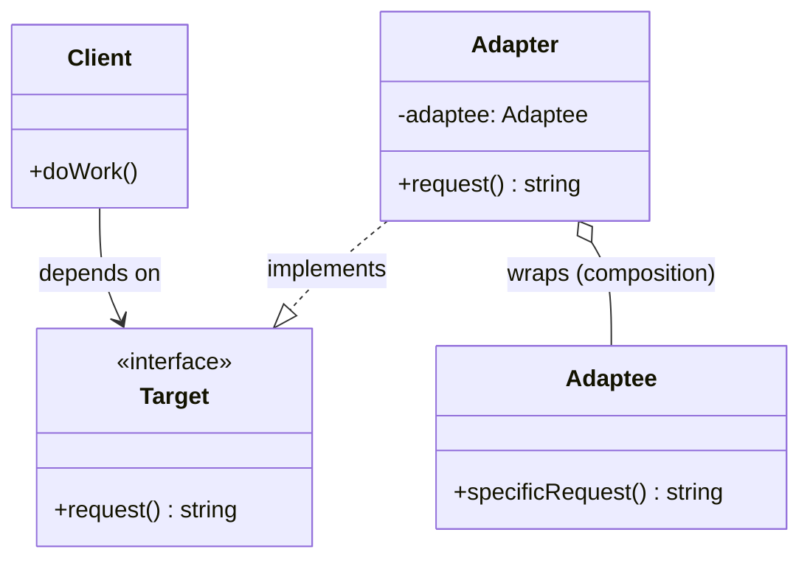

---
tags:
  - design-pattern
  - comp-sci
gardening: 🌿
date: 2026-06-06
reference:
---
## What & Why

The Adapter (also called "Wrapper") solves a fundamental incompatibility problem: **you have two things that need to work together, but their interfaces don't match** — and you can't or shouldn't modify either of them.

The canonical triggers for reaching for Adapter are:

- **Third-party library integration**: A library you depend on has a different API shape than the rest of your codebase.
- **Legacy code modernization**: Old code has an entrenched interface you can't refactor without breaking everything.
- **Parallel interface evolution**: Two teams built compatible functionality with different API contracts; you need to unify them without coordinating a rewrite.

**Two structural variants exist:**

1. **Object Adapter**: wraps an *instance* of the adaptee via composition. This is the practical TypeScript version since TS doesn't support multiple class inheritance.
2. **Class Adapter**: inherits from both the target interface and the adaptee simultaneously via multiple inheritance. Only possible in languages like C++ that permit it.

## Structure Diagram



The `Client` only ever sees the `Target` interface. The `Adapter` bridges the gap by satisfying `Target` while delegating to the `Adaptee` internally. The `Adaptee` is completely unmodified.

## Traditional Class-Based Implementation

The scenario: your application has standardized on a `Logger` interface with `info()`, `warn()`, and `error()` methods. You're integrating a third-party legacy library whose logger has a completely different signature.

```typescript
// Target Interface
// What the rest of our codebase expects.
interface Logger {
  info(message: string): void;
  warn(message: string): void;
  error(message: string): void;
}

// Adaptee
// The third-party / legacy logger we cannot modify.
// Its interface is fundamentally different from Logger.
class LegacyLogger {
  log(
    level: 'INFO' | 'WARN' | 'ERROR',
    message: string,
    timestamp: Date
  ): void {
    console.log(`[${timestamp.toISOString()}] ${level}: ${message}`);
  }

  flush(): void {
    console.log('Flushing legacy log buffer...');
  }
}

// Adapter
// Wraps LegacyLogger and satisfies the Logger interface.
// The client never knows a LegacyLogger is involved.
class LegacyLoggerAdapter implements Logger {
  private readonly adaptee: LegacyLogger;

  constructor(adaptee: LegacyLogger) {
    this.adaptee = adaptee;
  }

  info(message: string): void {
    this.adaptee.log('INFO', message, new Date());
  }

  warn(message: string): void {
    this.adaptee.log('WARN', message, new Date());
  }

  error(message: string): void {
    this.adaptee.log('ERROR', message, new Date());
  }
}

// Client code
// Client only depends on Logger. Has zero knowledge of LegacyLogger.
const initializeApp = (logger: Logger): void => {
  logger.info('Application starting');
  logger.warn('Config file missing, using defaults');
  logger.error('Failed to connect to cache');
};

// Usage
const legacy = new LegacyLogger();
const logger: Logger = new LegacyLoggerAdapter(legacy);

initializeApp(logger);
// [2026-01-02T19:00:00.000Z] INFO: Application starting
// [2026-01-02T19:00:00.000Z] WARN: Config file missing, using defaults
// [2026-01-02T19:00:00.000Z] ERROR: Failed to connect to cache
```

**Key Characteristics**:
- The `Adapter` stores the `Adaptee` instance via composition (field injection)
- The `Client` (`initializeApp`) only knows about `Logger`, the adaptation is invisible
- The `LegacyLogger` is completely unmodified
- Each method on the `Adapter` translates the call signature into what the `Adaptee` understands
- The adapter can also consolidate behavioral differences (e.g., it generates the `timestamp` so the caller doesn't have to)

## Function-Based Alternative

In a functional approach, an adapter is simply a **factory function that takes the adaptee's function(s) as arguments and returns an object that satisfies the target shape**. There are no classes, no `this`, no constructors.

We achieve adapter behavior through:

1. **Structural typing**: TypeScript's type system checks shape, not class lineage, so any object with the right methods satisfies `Logger`
2. **Function composition via object literals**: Return a plain object whose methods close over the adaptee function
3. **Dependency injection by parameter**: The adaptee is passed as a function argument, not a class instance stored in `this`

```typescript
// Target type
type Logger = {
  readonly info: (message: string) => void;
  readonly warn: (message: string) => void;
  readonly error: (message: string) => void;
};

// Adaptee
// Modeled as a function type rather than a class instance.
// This is what the legacy library actually exposes.
type LegacyLogFn = (
  level: 'INFO' | 'WARN' | 'ERROR',
  message: string,
  timestamp: Date
) => void;

// Adapter factory
// A pure function: takes the incompatible function, returns a Logger.
// No class, no constructor, no `this`.
const adaptLegacyLogger = (log: LegacyLogFn): Logger => ({
  info:  (message) => log('INFO',  message, new Date()),
  warn:  (message) => log('WARN',  message, new Date()),
  error: (message) => log('ERROR', message, new Date()),
});

// The actual legacy implementation
const legacyLog: LegacyLogFn = (level, message, timestamp) => {
  console.log(`[${timestamp.toISOString()}] ${level}: ${message}`);
};

// Client code
// Identical to the OOP version — the client is unchanged.
const initializeApp = (logger: Logger): void => {
  logger.info('Application starting');
  logger.warn('Config file missing, using defaults');
  logger.error('Failed to connect to cache');
};

// Usage
const logger: Logger = adaptLegacyLogger(legacyLog);
initializeApp(logger);

// Adapter composability: trivially swap to a test double
const silentLog: LegacyLogFn = () => { /* no-op for tests */ };
const testLogger: Logger = adaptLegacyLogger(silentLog);
initializeApp(testLogger); // no output — perfectly isolated
```

## Comparison: Class vs Function

| Aspect            | Class-based                                | Function-based                                    |
| ----------------- | ------------------------------------------ | ------------------------------------------------- |
| Mechanism         | Class implements interface, wraps instance | Factory function returns object literal           |
| Adaptee coupling  | Bound to a specific class type             | Bound to a function signature (more general)      |
| Testability       | Must instantiate or mock the adaptee class | Pass any matching function, trivially mockable    |
| Verbosity         | Constructor + field + 3 delegating methods | Single expression factory                         |
| Composability     | Subclass adapter to extend                 | Compose with other functions or HOFs              |
| Type checking     | Nominal via `implements`                   | Structural via shape compatibility                |
| Stacking adapters | Adapter wrapping an Adapter                | `adaptB(adaptA(fn))` natural function composition |

### Problems with Traditional Class-Based Adapter

1. **Constructor boilerplate**: Every adapter needs a constructor that stores the adaptee reference. In a functional version this is the function's parameter, no ceremony required.
2. **Rigid coupling to class identity**: The OOP adapter is tied to a specific class (`LegacyLogger`). If a different library happens to have the same `log()` signature, you still need a new adapter subclass. The functional adapter accepts anything with a matching function signature.
3. **Difficult stacking**: To chain two adapters in OOP you nest class instantiations, which is structurally noisy. In FP it is just function composition.
4. **Test friction**: To test an OOP adapter in isolation you need to either mock the adaptee class or construct a real one. In the functional version, substituting a no-op function is one line.
5. **Misleading abstraction weight**: The Adapter pattern in its OOP form looks heavier than it is; developers often shy away from creating one for simple cases. The functional version is so lightweight it encourages correct use at any granularity.
