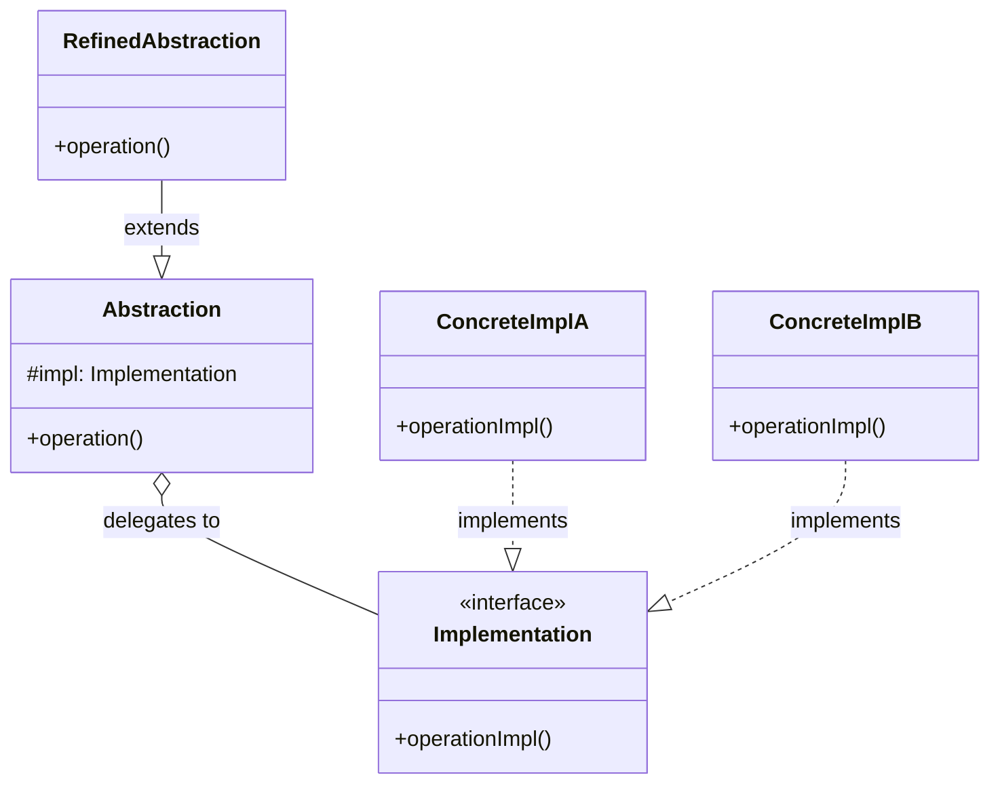

---
tags:
  - design-pattern
  - comp-sci
gardening: 🌿
date: 2026-06-06
reference:
  - https://github.com/deepakkum21/Books/blob/master/Design%20Patterns%20-%20Elements%20of%20Reusable%20Object%20Oriented%20Software%20-%20GOF.pdf
  - https://refactoring.guru/design-patterns/bridge
  - https://en.wikipedia.org/wiki/Bridge_pattern
---
## What & Why

The Bridge pattern solves the **combinatorial class explosion** that occurs when you have two independent dimensions of variation in a hierarchy.

Consider a notification system with three delivery channels (Email, SMS, Slack) and two notification types (Alert, Status). Without Bridge, you need every combination as its own class: `AlertEmail`, `AlertSms`, `AlertSlack`, `StatusEmail`, `StatusSms`, `StatusSlack`. Add a fourth channel and you need three more classes. Add a third notification type and you need three more on top of that. The hierarchy grows as $O(m \times n)$ where $m$ is the number of abstractions and $n$ is the number of implementations.

Bridge breaks this by **separating the abstraction from its implementation**, allowing both to vary independently. Growth becomes $O(m + n)$ instead.

The distinction that matters most here:
- **Abstraction** represents the "what" and the higher-level control logic (notification type)
- **Implementation** represents the "how" and the low-level operational detail (delivery channel)

The abstraction holds a reference to an implementation object and delegates platform-specific work to it. Neither knows the concrete details of the other.

Bridge is often confused with Adapter. The key difference: **Adapter reconciles two incompatible existing interfaces after the fact; Bridge designs both sides upfront so they can evolve independently.**

## Structure Diagram



The aggregation ("delegates to") arrow is the bridge itself. The abstraction holds a reference to the implementation interface, not to any concrete class.

## Traditional Class-Based Implementation

```typescript
// Implementation interface
// The "how": low-level delivery channel concern.
interface MessageSender {
  send(recipient: string, subject: string, body: string): void;
}

// Concrete Implementations
class EmailSender implements MessageSender {
  send(recipient: string, subject: string, body: string): void {
    console.log(`Email  -> ${recipient} | [${subject}] ${body}`);
  }
}

class SmsSender implements MessageSender {
  send(recipient: string, _subject: string, body: string): void {
    // SMS has no subject concept and enforces a 160-char limit.
    console.log(`SMS    -> ${recipient} | ${body.slice(0, 160)}`);
  }
}

class SlackSender implements MessageSender {
  send(recipient: string, subject: string, body: string): void {
    console.log(`Slack  -> @${recipient} | *${subject}* ${body}`);
  }
}

// Abstraction
// The "what": high-level notification logic.
// Abstract because we never instantiate a raw Notification.
abstract class Notification {
  protected readonly sender: MessageSender;

  constructor(sender: MessageSender) {
    this.sender = sender;
  }

  abstract notify(recipient: string): void;
}

// Refined Abstractions
// Each adds domain logic on top of whatever sender is injected.
class AlertNotification extends Notification {
  private readonly message: string;

  constructor(sender: MessageSender, message: string) {
    super(sender);
    this.message = message;
  }

  notify(recipient: string): void {
    this.sender.send(recipient, 'ALERT', `[URGENT] ${this.message}`);
  }
}

class StatusNotification extends Notification {
  private readonly status: string;

  constructor(sender: MessageSender, status: string) {
    super(sender);
    this.status = status;
  }

  notify(recipient: string): void {
    this.sender.send(recipient, 'Status Update', this.status);
  }
}

// Usage
// Mix and match freely: 2 abstractions x 3 implementations = 6 combos,
// zero additional classes required.
const alert = new AlertNotification(new EmailSender(), 'CPU at 99%');
const alertSms = new AlertNotification(new SmsSender(), 'CPU at 99%');
const status = new StatusNotification(new SlackSender(), 'Deploy complete');

alert.notify('ops@company.com');
alertSms.notify('+15551234567');
status.notify('devops-team');
// Email  -> ops@company.com | [ALERT] [URGENT] CPU at 99%
// SMS    -> +15551234567 | [URGENT] CPU at 99%
// Slack  -> @devops-team | *Status Update* Deploy complete
```

**Key Characteristics**:
- The `Notification` abstract class holds a `protected sender: MessageSender` reference (the bridge)
- Concrete senders are injected at construction time, not hard-coded
- `AlertNotification` and `StatusNotification` know nothing about Email, SMS, or Slack
- `EmailSender`, `SmsSender`, and `SlackSender` know nothing about notification types
- Adding a `PushSender` requires one new class, not three

## Function-Based Alternative

We achieve Bridge behavior through:

1. **Function types as the implementation contract**: `SendFn` replaces the `MessageSender` interface with no class machinery
2. **Higher-order factory functions as refined abstractions**: `createAlertNotification` returns a `NotifyFn` that closes over the injected `SendFn`
3. **Structural compatibility**: Any function that matches `SendFn` is a valid implementation; no `implements` keyword, no class hierarchy

```typescript
// Implementation type
type SendFn = (recipient: string, subject: string, body: string) => void;

// Concrete implementations as plain functions
const sendEmail: SendFn = (recipient, subject, body) => {
  console.log(`Email  -> ${recipient} | [${subject}] ${body}`);
};

const sendSms: SendFn = (recipient, _subject, body) => {
  console.log(`SMS    -> ${recipient} | ${body.slice(0, 160)}`);
};

const sendSlack: SendFn = (recipient, subject, body) => {
  console.log(`Slack  -> @${recipient} | *${subject}* ${body}`);
};

// Abstraction type
type NotifyFn = (recipient: string) => void;

// Refined abstractions as HOF factories
// Each factory takes a SendFn (the bridge) and returns a NotifyFn.
// The "bridge" is just a function parameter.
const createAlertNotification = (send: SendFn, message: string): NotifyFn =>
  (recipient) => send(recipient, 'ALERT', `[URGENT] ${message}`);

const createStatusNotification = (send: SendFn, status: string): NotifyFn =>
  (recipient) => send(recipient, 'Status Update', status);

// Usage
const alert     = createAlertNotification(sendEmail, 'CPU at 99%');
const alertSms  = createAlertNotification(sendSms,   'CPU at 99%');
const status    = createStatusNotification(sendSlack, 'Deploy complete');

alert('ops@company.com');
alertSms('+15551234567');
status('devops-team');

// Trivial test double: any function with the right signature works.
const capturedCalls: string[] = [];
const spySend: SendFn = (r, s, b) => capturedCalls.push(`${r}:${s}:${b}`);
const testAlert = createAlertNotification(spySend, 'Test message');
testAlert('test-user');
// capturedCalls = ['test-user:ALERT:[URGENT] Test message']
```

## Comparison: Class vs Function

| Aspect | Class-based | Function-based |
|---|---|---|
| Abstraction mechanism | Abstract class with `protected` field | Factory function closing over `SendFn` |
| Implementation contract | `interface` + `implements` | Function type signature |
| Adding a new abstraction | New subclass of `Notification` | New factory function |
| Adding a new implementation | New class implementing `MessageSender` | New function matching `SendFn` |
| Constructor chaining | Required (`super(sender)` in each subclass) | None |
| Partial application | Requires object construction | Natural: store the factory result |
| Test doubles | Stub/mock class required | Any matching function literal |
| Pattern visibility | Explicit class hierarchy | The pattern disappears into HOFs |

### Problems with Traditional Class-Based Bridge

1. **Mandatory constructor chaining**: Every refined abstraction calls `super(sender)`. This is pure ceremony with no semantic value; the functional version has no equivalent cost.
2. **The hierarchy persists even when you don't need polymorphism**: You inherit the full abstract class machinery even for cases where a single concrete notification type is used.
3. **Partial application is awkward**: Pre-binding the sender requires constructing an object first. In the functional version `createAlertNotification(sendEmail, message)` is already partial application.
4. **The pattern disappears in idiomatic FP**: Higher-order functions separate "what" from "how" by design. Bridge in functional code is not a special pattern; it is just passing a function as an argument. The formal pattern only becomes visible in OOP because the language's inheritance mechanism creates the explosion problem in the first place.
