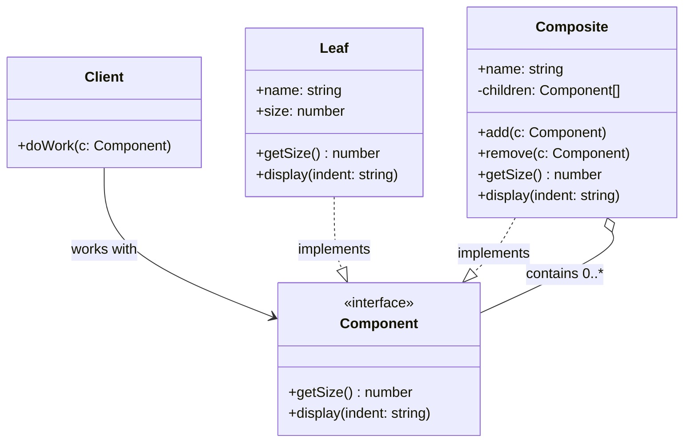

---
tags:
  - design-pattern
  - comp-sci
gardening: 🌿
date: 2026-06-06
reference:
---
## What & Why

The Composite pattern lets you compose objects into **tree structures** and then work with those trees as if all nodes were the same kind of thing. Specifically, it lets client code treat a single object (a leaf) and a group of objects (a composite) through a unified interface, without type-checking or branching on what kind of node it is dealing with.

Trees naturally have two kinds of nodes, and without Composite you end up writing code like this everywhere:

```typescript
if (item instanceof File) {
  return item.size;
} else if (item instanceof Directory) {
  return item.children.reduce((t, c) => t + getSize(c), 0);
}
```

That conditional spreads across every operation, every caller. The Composite pattern pushes that discrimination down into the type system so callers never need to know.

Real-world domains where this structure appears naturally:
- **File systems**: files (leaves) and directories (composites)
- **UI component trees**: buttons (leaves) and panels/containers (composites)
- **Organization charts**: individual contributors (leaves) and departments (composites)
- **Expression trees**: literals (leaves) and operators with operands (composites)
- **The DOM**: text nodes (leaves) and element nodes (composites)

One key design tension exists in the original GoF formulation: should child management (`add`, `remove`) live on the `Component` interface, or only on `Composite`? Putting it on `Component` gives uniformity but forces `Leaf` to implement meaningless operations. Putting it only on `Composite` is safer but requires callers to downcast when they need to modify the tree. Neither is ideal in OOP; the functional approach sidesteps this entirely.

## Structure Diagram



The recursive (`contains 0..`) self-reference on `Composite` is the structural heart of the pattern. A `Composite` contains `Component` references, which may themselves be `Composite` nodes.

## Traditional Class-Based Implementation

```typescript
// Component interface
// Both Leaf and Composite satisfy this.
// Callers only ever hold Component references.
interface FileSystemItem {
  readonly name: string;
  getSize(): number;
  display(indent: string): void;
}

// Leaf
class File implements FileSystemItem {
  readonly name: string;
  private readonly size: number;

  constructor(name: string, size: number) {
    this.name = name;
    this.size = size;
  }

  getSize(): number {
    return this.size;
  }

  display(indent: string): void {
    console.log(`${indent}${this.name} (${this.size} bytes)`);
  }
}

// Composite
class Directory implements FileSystemItem {
  readonly name: string;
  private readonly children: FileSystemItem[] = [];

  constructor(name: string) {
    this.name = name;
  }

  add(item: FileSystemItem): void {
    this.children.push(item);
  }

  remove(item: FileSystemItem): void {
    const index = this.children.indexOf(item);
    if (index !== -1) this.children.splice(index, 1);
  }

  getSize(): number {
    return this.children.reduce((total, child) => total + child.getSize(), 0);
  }

  display(indent: string): void {
    console.log(`${indent}${this.name}/`);
    this.children.forEach((child) => child.display(`${indent}  `));
  }
}

// Usage
const root = new Directory('root');
const src  = new Directory('src');
const dist = new Directory('dist');

src.add(new File('index.ts', 1024));
src.add(new File('utils.ts', 2048));
dist.add(new File('index.js', 3072));
dist.add(new File('utils.js', 4096));
root.add(src);
root.add(dist);
root.add(new File('package.json', 512));

root.display('');
// root/
//   src/
//     index.ts (1024 bytes)
//     utils.ts (2048 bytes)
//   dist/
//     index.js (3072 bytes)
//     utils.js (4096 bytes)
//   package.json (512 bytes)

console.log(`Total: ${root.getSize()} bytes`);
// Total: 10752 bytes
```

**Key Characteristics**:
- `display()` and `getSize()` on `Directory` recurse into `children` without knowing whether each child is a `File` or another `Directory`
- `add` and `remove` are on `Directory` only, not on the `FileSystemItem` interface (the safer GoF variant)
- Mutation is internal: `children.push()` is hidden behind `add()`, but the array is still mutable in place

## Function-Based Alternative

We achieve Composite behavior through:

1. **Discriminated union (ADT)**: A `FileSystemItem` is *either* a `FileNode` or a `DirectoryNode`, encoded with a `kind` tag. This is a recursive algebraic data type.
2. **Exhaustive `switch` dispatch**: Operations pattern-match on `kind`. TypeScript's control-flow analysis guarantees at compile time that every case is handled.
3. **Immutable structural updates**: Adding a child returns a new `DirectoryNode` via spread. The original tree is never mutated.

```typescript
// Discriminated union (ADT)
type FileNode = {
  readonly kind: 'file';
  readonly name: string;
  readonly size: number;
};

type DirectoryNode = {
  readonly kind: 'directory';
  readonly name: string;
  readonly children: readonly FileSystemItem[];
};

type FileSystemItem = FileNode | DirectoryNode;

// Smart constructors
const createFile = (name: string, size: number): FileNode => ({
  kind: 'file', name, size,
});

const createDirectory = (
  name: string,
  children: readonly FileSystemItem[] = [],
): DirectoryNode => ({
  kind: 'directory', name, children,
});

// Operations as pure recursive functions
// TypeScript enforces exhaustiveness: forget a case and it won't compile.
const getSize = (item: FileSystemItem): number => {
  switch (item.kind) {
    case 'file':      return item.size;
    case 'directory': return item.children.reduce(
      (total, child) => total + getSize(child),
      0,
    );
  }
};

const display = (item: FileSystemItem, indent = ''): void => {
  switch (item.kind) {
    case 'file':
      console.log(`${indent}${item.name} (${item.size} bytes)`);
      return;
    case 'directory':
      console.log(`${indent}${item.name}/`);
      item.children.forEach((child) => display(child, `${indent}  `));
      return;
  }
};

// Immutable add: returns a new DirectoryNode, original untouched.
const addChild = (dir: DirectoryNode, child: FileSystemItem): DirectoryNode => ({
  ...dir,
  children: [...dir.children, child],
});

// Usage
// Tree is declared in one expression. No mutation after construction.
const root = createDirectory('root', [
  createDirectory('src', [
    createFile('index.ts', 1024),
    createFile('utils.ts', 2048),
  ]),
  createDirectory('dist', [
    createFile('index.js', 3072),
    createFile('utils.js', 4096),
  ]),
  createFile('package.json', 512),
]);

display(root);
console.log(`Total: ${getSize(root)} bytes`);

// Immutable update: add a file to dist without touching the original.
const updatedRoot = addChild(
  root.children.find((c) => c.name === 'dist') as DirectoryNode,
  createFile('styles.css', 256),
);
```

## Comparison: Class vs Function

| Aspect | Class-based | Function-based (ADT) |
|---|---|---|
| Tree node representation | Abstract interface + concrete subclasses | Discriminated union with `kind` tag |
| Leaf vs. composite distinction | Polymorphic method dispatch | Exhaustive `switch` on `kind` |
| Operations | Methods defined on each class | Pure functions pattern-matching the union |
| Mutation | `add()`/`remove()` mutate `children` in place | `addChild()` returns a new node |
| Exhaustiveness guarantee | None. Missing a case is a silent runtime bug | Compiler error if a union member is unhandled |
| Adding a new operation | Modify every class that implements the interface | Add one new function |
| Adding a new node type | New subclass | New union member, plus update every `switch` |
| Shared reference safety | Mutable children array can be aliased | Readonly by construction, safe to share |

### Problems with Traditional Class-Based Composite

1. **Silent missing cases**: If you add a new node type (`SymlinkNode`) and forget to update a method in a subclass, nothing stops you at compile time. The functional ADT approach forces you to handle every union member in every `switch` or the code will not compile.
2. **Mutation through shared references**: The `children` array is mutable. If two pieces of code hold a reference to the same `Directory`, one can mutate the tree under the other. The immutable ADT approach makes this class of bug structurally impossible.
3. **Operations scattered across classes**: `getSize` logic lives in `File` and also in `Directory`. Adding a `search(query: string)` operation requires opening both files and modifying both classes. In FP, you write one function.
4. **The child management problem**: GoF acknowledges the tension: put `add`/`remove` on `Component` and `Leaf` must implement meaningless stubs or throw. Leave them only on `Composite` and callers must downcast. The ADT version sidesteps this entirely because adding a child is just a pure function on `DirectoryNode` with no involvement from `FileNode` at all.
