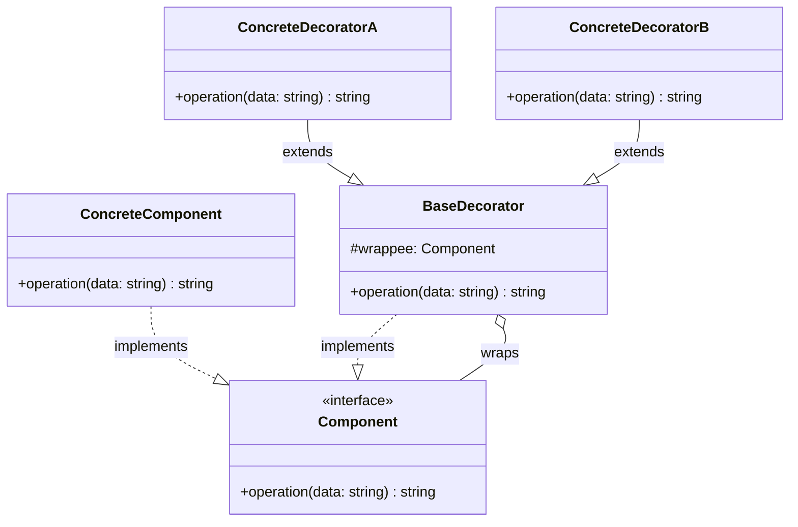

---
tags:
  - design-pattern
  - comp-sci
gardening: 🌿
date: 2026-06-06
reference:
---
## What & Why

The Decorator pattern attaches additional behavior to an object **dynamically and transparently**, without modifying the object itself or any of its siblings. It is the runtime, per-instance alternative to sub-classing.

The problem with sub-classing for extension is if you have a `DataTransformer` and you want versions with logging, encryption, and compression, sub-classing produces `LoggingTransformer`, `EncryptingTransformer`, `CompressingTransformer`, and then `LoggingEncryptingTransformer`, `LoggingCompressingTransformer`, and so on. Every combination needs its own class. Worse, the combination is fixed at compile time.

Decorator solves this by making each capability its own wrapper that implements the same interface as the thing it wraps. Wrappers stack. You choose the stack at runtime.

The structural trick is that **a Decorator both satisfies and consumes the component interface**. It passes calls down the chain, adding behavior before, after, or around each call. This is how Java I/O streams work (`BufferedInputStream` wrapping `FileInputStream` wrapping a file descriptor), and it is the underlying model for middleware chains in Express, Koa, and similar frameworks.

Key distinctions from related patterns:
- **Adapter** changes an interface. Decorator preserves it.
- **Composite** assembles a tree of equal-weight nodes. Decorator assembles a chain where each layer adds behavior around one inner component.
- **Proxy** controls access to one specific wrapped object. Decorator is about augmenting behavior and is designed to stack.

## Structure Diagram



The self-reference ("wraps") is the key. `BaseDecorator` satisfies `Component` AND holds a `Component` reference, enabling arbitrary chain depth.

## Traditional Class-Based Implementation

```typescript
// Component interface
// Every node in the chain, base and decorator, satisfies this.
interface DataTransformer {
  transform(data: string): string;
}

// Concrete component (the base, inner-most layer)
class RawTransformer implements DataTransformer {
  transform(data: string): string {
    return data;
  }
}

// Base decorator
// Holds the wrappee reference and delegates by default.
// Concrete decorators extend this and override transform().
abstract class TransformerDecorator implements DataTransformer {
  protected readonly wrappee: DataTransformer;

  constructor(wrappee: DataTransformer) {
    this.wrappee = wrappee;
  }

  transform(data: string): string {
    return this.wrappee.transform(data);
  }
}

// Concrete decorators
class CompressionDecorator extends TransformerDecorator {
  transform(data: string): string {
    const inner = super.transform(data);
    // Simulated compression for illustration purposes.
    return `compressed(${inner})`;
  }
}

class EncryptionDecorator extends TransformerDecorator {
  private readonly key: string;

  constructor(wrappee: DataTransformer, key: string) {
    super(wrappee);
    this.key = key;
  }

  transform(data: string): string {
    const inner = super.transform(data);
    return `encrypted[key=${this.key}](${inner})`;
  }
}

class LoggingDecorator extends TransformerDecorator {
  transform(data: string): string {
    console.log(`[LOG] Before: "${data.slice(0, 30)}"`);
    const result = super.transform(data);
    console.log(`[LOG] After:  "${result.slice(0, 30)}"`);
    return result;
  }
}

// Usage
// Stack is assembled at runtime, in any order, to any depth.
const transformer: DataTransformer = new LoggingDecorator(
  new EncryptionDecorator(
    new CompressionDecorator(
      new RawTransformer()
    ),
    'secret-key',
  ),
);

const result = transformer.transform('Hello, World!');
// [LOG] Before: "Hello, World!"
// [LOG] After:  "encrypted[key=secret-key](comp"
console.log(result);
// encrypted[key=secret-key](compressed(Hello, World!))

// A different stack, no recompilation needed.
const compressOnly: DataTransformer = new CompressionDecorator(new RawTransformer());
compressOnly.transform('Hello, World!');
// compressed(Hello, World!)
```

**Key Characteristics**:
- `TransformerDecorator` satisfies `DataTransformer` AND wraps a `DataTransformer` reference
- Each concrete decorator calls `super.transform()` to delegate inward before or after its own logic
- The caller holds a `DataTransformer` reference and has no knowledge of how deep the chain is
- `EncryptionDecorator` demonstrates that decorators can carry their own configuration (`key`)
- Stack composition happens at the call site with no class modifications

## Function-Based Alternative

We achieve decorator behavior through:

1. **Function types as the component contract**: `TransformFn` replaces the interface, requiring no `implements`
2. **Higher-order functions as decorators**: Each decorator is a `(TransformFn) => TransformFn`. It takes the inner function and returns a new one that adds behavior around it
3. **Decorator composition**: A `composeDecorators` utility lets you declare a pipeline as a list rather than deeply nested calls

```typescript
// Component type
type TransformFn = (data: string) => string;

// Decorator type
// A decorator wraps a TransformFn and returns a new TransformFn.
type Decorator = (fn: TransformFn) => TransformFn;

// Base component
const identity: TransformFn = (data) => data;

// Concrete decorators as HOFs
const withCompression: Decorator = (transform) => (data) =>
  `compressed(${transform(data)})`;

const withEncryption = (key: string): Decorator => (transform) => (data) =>
  `encrypted[key=${key}](${transform(data)})`;

const withLogging: Decorator = (transform) => (data) => {
  console.log(`[LOG] Before: "${data.slice(0, 30)}"`);
  const result = transform(data);
  console.log(`[LOG] After:  "${result.slice(0, 30)}"`);
  return result;
};

// Decorator composition utility
// Applies decorators right-to-left so the first in the list is outermost.
// composeDecorators(A, B, C)(fn) = A(B(C(fn)))
const composeDecorators = (...decorators: Decorator[]): Decorator =>
  (fn) => decorators.reduceRight((acc, dec) => dec(acc), fn);

// Usage
const transformer: TransformFn = composeDecorators(
  withLogging,
  withEncryption('secret-key'),
  withCompression,
)(identity);

const result = transformer('Hello, World!');
// [LOG] Before: "Hello, World!"
// [LOG] After:  "encrypted[key=secret-key](comp"
console.log(result);
// encrypted[key=secret-key](compressed(Hello, World!))

// Recombine without touching any existing code.
const compressOnly: TransformFn = withCompression(identity);
compressOnly('Hello, World!');
// compressed(Hello, World!)

// Decorators are first-class values, storable and reusable.
const secureAuditedPipeline: Decorator = composeDecorators(
  withLogging,
  withEncryption('prod-key'),
);

const pipelineA = secureAuditedPipeline(identity);
const pipelineB = secureAuditedPipeline(withCompression(identity));
```

## Comparison: Class vs Function

| Aspect | Class-based | Function-based |
|---|---|---|
| Component contract | Interface with `implements` | Function type, structural compatibility |
| Decorator mechanism | Subclass stores wrappee, calls `super` | HOF closes over the inner function |
| Configuration per decorator | Constructor parameters stored as fields | Function parameters captured by closure |
| Chain construction | Nested `new` calls | `composeDecorators(...)` or manual nesting |
| Decorator as a value | Requires instantiation | A `Decorator` is already a first-class value |
| Order of application | Outermost `new` call is outermost wrapper | Leftmost argument to `composeDecorators` is outermost |
| Testability | Must construct full chain to test a layer | Pass any `TransformFn` stub as the inner function |
| Reusable pipelines | Requires factory or builder overhead | Compose a `Decorator` once, apply to many functions |

### Problems with Traditional Class-Based Decorator

1. **Constructor nesting is visually inverted**: The outermost behavior (logging) appears at the top of the nesting, but it is the last wrapper constructed. Reading the chain requires working inside-out, which does not match how you think about the data flow.
2. **`super.transform()` as a contract**: Forgetting to call `super` in a concrete decorator silently breaks the chain. The function version has no equivalent footgun; you simply call the inner function or you do not, and the compiler will tell you if the return type is wrong.
3. **Decorators are not composable without objects**: Storing a "compression and encryption" combination for reuse requires either a factory method, a builder, or another class. In the functional version, `composeDecorators(withEncryption('key'), withCompression)` is a reusable `Decorator` value with no overhead.
4. **Configuration requires subclass state**: `EncryptionDecorator` needs a field for `key`. In the functional version, `withEncryption('secret-key')` uses a closure, which is both simpler and avoids any possibility of the field being mutated after construction.
