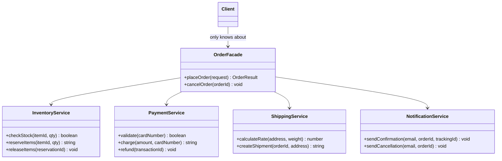

---
tags:
  - design-pattern
  - comp-sci
gardening: 🌿
date: 2026-06-06
reference:
  - https://github.com/deepakkum21/Books/blob/master/Design%20Patterns%20-%20Elements%20of%20Reusable%20Object%20Oriented%20Software%20-%20GOF.pdf
  - https://refactoring.guru/design-patterns/facade
  - https://en.wikipedia.org/wiki/Facade_pattern
---
## What & Why

The Facade pattern provides a **simplified, unified interface to a complex subsystem**. Where the subsystem may consist of many classes with intricate interdependencies and a specific order of operations, the Facade exposes just the operations that callers actually need in the form they need them.

A client that needs to place an order should not need to know about inventory reservation IDs, payment transaction lifecycles, shipment tracking handles, and the exact sequence in which to call them. Without a Facade, every call site must replicate that coordination logic, and when the sequence changes, every call site must change with it.

Facade differs from similar patterns in important ways:

- **Adapter** solves interface incompatibility. Facade solves interface complexity.
- **Mediator** centralizes communication between subsystem components so they do not reference each other directly. Facade does not change how subsystem components communicate. It only provides a simpler surface to the outside.
- **Facade does not lock out the subsystem**. Clients that need fine-grained control can still access subsystem components directly. Facade is an on-ramp, not a gate.

Real-world examples where this pattern appears:

- A `VideoEncoder` facade hiding codec selection, container format, bitrate configuration, and buffer management
- A compiler API hiding lexing, parsing, semantic analysis, optimization passes, and code generation
- An `OrderService` hiding inventory, payment, shipping, and notification coordination
- A browser's `fetch` API hiding TCP connections, HTTP framing, redirect handling, and response buffering

## Structure Diagram



The `Client` arrow terminates at `OrderFacade`. The subsystem classes are invisible to the client.

## Traditional Class-Based Implementation

```typescript
// Shared types
type OrderRequest = {
  readonly itemId: string;
  readonly quantity: number;
  readonly weightKg: number;
  readonly cardNumber: string;
  readonly shippingAddress: string;
  readonly email: string;
};

type OrderResult = {
  readonly orderId: string;
  readonly transactionId: string;
  readonly trackingId: string;
  readonly shippingCost: number;
};

// Subsystem classes
// Each handles one well-defined concern. Clients should not use these directly.

class InventoryService {
  checkStock(itemId: string, quantity: number): boolean {
    console.log(`[Inventory] Checking ${itemId} x${quantity}`);
    return true;
  }

  reserveItems(itemId: string, quantity: number): string {
    const id = `res-${Date.now()}`;
    console.log(`[Inventory] Reserved ${itemId} x${quantity} -> ${id}`);
    return id;
  }

  releaseItems(reservationId: string): void {
    console.log(`[Inventory] Released ${reservationId}`);
  }
}

class PaymentService {
  validate(cardNumber: string): boolean {
    console.log(`[Payment] Validating ...${cardNumber.slice(-4)}`);
    return true;
  }

  charge(amount: number, cardNumber: string): string {
    const id = `txn-${Date.now()}`;
    console.log(`[Payment] Charged $${amount.toFixed(2)} to ...${cardNumber.slice(-4)} -> ${id}`);
    return id;
  }

  refund(transactionId: string): void {
    console.log(`[Payment] Refunded ${transactionId}`);
  }
}

class ShippingService {
  calculateRate(address: string, weightKg: number): number {
    const rate = parseFloat((weightKg * 2.5).toFixed(2));
    console.log(`[Shipping] Rate for "${address}": $${rate}`);
    return rate;
  }

  createShipment(orderId: string, address: string): string {
    const id = `trk-${Date.now()}`;
    console.log(`[Shipping] Shipment for ${orderId} to "${address}" -> ${id}`);
    return id;
  }
}

class NotificationService {
  sendConfirmation(email: string, orderId: string, trackingId: string): void {
    console.log(`[Notification] Confirmation -> ${email} | order ${orderId} | tracking ${trackingId}`);
  }

  sendCancellation(email: string, orderId: string): void {
    console.log(`[Notification] Cancellation -> ${email} | order ${orderId}`);
  }
}

// Facade
// Owns the subsystem instances and hides coordination logic.
// The client never touches InventoryService, PaymentService, etc. directly.
class OrderFacade {
  private readonly inventory = new InventoryService();
  private readonly payment   = new PaymentService();
  private readonly shipping  = new ShippingService();
  private readonly notifier  = new NotificationService();

  placeOrder(request: OrderRequest): OrderResult {
    // Step 1: Reserve inventory.
    const inStock = this.inventory.checkStock(request.itemId, request.quantity);
    if (!inStock) throw new Error(`${request.itemId} is out of stock`);
    const reservationId = this.inventory.reserveItems(request.itemId, request.quantity);

    // Step 2: Validate and charge payment, rolling back reservation on failure.
    if (!this.payment.validate(request.cardNumber)) {
      this.inventory.releaseItems(reservationId);
      throw new Error('Payment validation failed');
    }

    const shippingCost = this.shipping.calculateRate(
      request.shippingAddress,
      request.weightKg,
    );
    const transactionId = this.payment.charge(shippingCost, request.cardNumber);

    // Step 3: Create shipment and notify.
    const orderId    = `ord-${Date.now()}`;
    const trackingId = this.shipping.createShipment(orderId, request.shippingAddress);
    this.notifier.sendConfirmation(request.email, orderId, trackingId);

    return { orderId, transactionId, trackingId, shippingCost };
  }

  cancelOrder(orderId: string, transactionId: string, email: string): void {
    this.payment.refund(transactionId);
    this.notifier.sendCancellation(email, orderId);
  }
}

// Usage
// The client knows only OrderFacade. All subsystem complexity is hidden.
const orders = new OrderFacade();

const result = orders.placeOrder({
  itemId:          'PROD-001',
  quantity:        2,
  weightKg:        1.5,
  cardNumber:      '4111111111111111',
  shippingAddress: '123 Main St, Springfield',
  email:           'customer@example.com',
});

console.log('Placed:', result);
// [Inventory] Checking PROD-001 x2
// [Inventory] Reserved PROD-001 x2 -> res-...
// [Payment]   Validating ...1111
// [Shipping]  Rate for "123 Main St, Springfield": $3.75
// [Payment]   Charged $3.75 to ...1111 -> txn-...
// [Shipping]  Shipment for ord-... to "123 Main St, Springfield" -> trk-...
// [Notification] Confirmation -> customer@example.com | ...
```

**Key Characteristics**:

- The facade owns and constructs all subsystem instances. No client ever calls `new InventoryService()`.
- Rollback logic (`releaseItems` on payment failure) lives in one place, not scattered across callers.
- The order of operations is enforced by the facade. Clients cannot accidentally charge before reserving.
- The facade exposes only two methods (`placeOrder`, `cancelOrder`) regardless of subsystem depth.

## Function-Based Alternative

We achieve Facade behavior through:

1. **Module-level functions as the public surface**: The facade is a set of plain functions rather than a class with methods. JavaScript modules provide the natural boundary.
2. **Subsystem as injected dependencies**: Subsystem functions are passed in as a `services` parameter object, making the facade trivially testable without any class mocking.
3. **Types for subsystem contracts**: Each subsystem is described by a function type, not a class. Any object matching the shape is a valid subsystem.

```typescript
// Shared types
type OrderRequest = {
  readonly itemId: string;
  readonly quantity: number;
  readonly weightKg: number;
  readonly cardNumber: string;
  readonly shippingAddress: string;
  readonly email: string;
};

type OrderResult = {
  readonly orderId: string;
  readonly transactionId: string;
  readonly trackingId: string;
  readonly shippingCost: number;
};

// Subsystem contracts as function-object types
type InventoryService = {
  readonly checkStock: (itemId: string, qty: number) => boolean;
  readonly reserveItems: (itemId: string, qty: number) => string;
  readonly releaseItems: (reservationId: string) => void;
};

type PaymentService = {
  readonly validate: (cardNumber: string) => boolean;
  readonly charge: (amount: number, cardNumber: string) => string;
  readonly refund: (transactionId: string) => void;
};

type ShippingService = {
  readonly calculateRate: (address: string, weightKg: number) => number;
  readonly createShipment: (orderId: string, address: string) => string;
};

type NotificationService = {
  readonly sendConfirmation: (email: string, orderId: string, trackingId: string) => void;
  readonly sendCancellation: (email: string, orderId: string) => void;
};

type OrderServices = {
  readonly inventory: InventoryService;
  readonly payment: PaymentService;
  readonly shipping: ShippingService;
  readonly notifier: NotificationService;
};

// Concrete subsystem implementations (plain objects)
const inventoryService: InventoryService = {
  checkStock: (itemId, qty) => {
    console.log(`[Inventory] Checking ${itemId} x${qty}`);
    return true;
  },
  reserveItems: (itemId, qty) => {
    const id = `res-${Date.now()}`;
    console.log(`[Inventory] Reserved ${itemId} x${qty} -> ${id}`);
    return id;
  },
  releaseItems: (reservationId) => {
    console.log(`[Inventory] Released ${reservationId}`);
  },
};

const paymentService: PaymentService = {
  validate: (cardNumber) => {
	  console.log(`[Payment] Validating ...${cardNumber.slice(-4)}`);
	  return true;  
	},
  charge: (amount, cardNumber) => {
	  const id = `txn-${Date.now()}`;
	  console.log(`[Payment] Charged $${amount.toFixed(2)} -> ${id}`);
	  return id;
	},
  refund: (transactionId) => {
	  console.log(`[Payment] Refunded ${transactionId}`);
	},
};

const shippingService: ShippingService = {
  calculateRate:  (address, kg) => {
	  const r = parseFloat((kg * 2.5).toFixed(2));
	  console.log(`[Shipping] Rate: $${r}`);
	  return r;
	},
  createShipment: (orderId, addr) => {
	  const id = `trk-${Date.now()}`;
	  console.log(`[Shipping] Shipment ${orderId} -> ${id}`);
	  return id;
	},
};

const notificationService: NotificationService = {
  sendConfirmation: (email, orderId, trackingId) => console.log(`[Notification] Confirmation -> ${email} | ${orderId} | ${trackingId}`),
  sendCancellation: (email, orderId) => console.log(`[Notification] Cancellation -> ${email} | ${orderId}`),
};

// Facade as pure functions with injected services
const placeOrder = (request: OrderRequest, services: OrderServices): OrderResult => {
  const { inventory, payment, shipping, notifier } = services;

  const inStock = inventory.checkStock(request.itemId, request.quantity);
  if (!inStock) throw new Error(`${request.itemId} is out of stock`);

  const reservationId = inventory.reserveItems(request.itemId, request.quantity);

  if (!payment.validate(request.cardNumber)) {
    inventory.releaseItems(reservationId);
    throw new Error('Payment validation failed');
  }

  const shippingCost = shipping.calculateRate(request.shippingAddress, request.weightKg);
  const transactionId = payment.charge(shippingCost, request.cardNumber);
  const orderId = `ord-${Date.now()}`;
  const trackingId = shipping.createShipment(orderId, request.shippingAddress);

  notifier.sendConfirmation(request.email, orderId, trackingId);

  return { orderId, transactionId, trackingId, shippingCost };
};

const cancelOrder = (
  orderId: string,
  transactionId: string,
  email: string,
  services: OrderServices,
): void => {
  services.payment.refund(transactionId);
  services.notifier.sendCancellation(email, orderId);
};

// Usage
const services: OrderServices = {
  inventory:  inventoryService,
  payment:    paymentService,
  shipping:   shippingService,
  notifier:   notificationService,
};

const result = placeOrder(
  {
    itemId:          'PROD-001',
    quantity:        2,
    weightKg:        1.5,
    cardNumber:      '4111111111111111',
    shippingAddress: '123 Main St, Springfield',
    email:           'customer@example.com',
  },
  services,
);

console.log('Placed:', result);

// Test substitute: swap any subsystem with a no-op double.
const testServices: OrderServices = {
  ...services,
  notifier: {
    sendConfirmation: () => {},
    sendCancellation: () => {},
  },
};

placeOrder({ ...result, itemId: 'PROD-002' } as OrderRequest, testServices);
```

## Function-Based (Module) Alternative

```typescript
// ── inventory.ts ──────────────────────────────────────────────────
export const checkStock = (itemId: string, qty: number): boolean => {
  console.log(`[Inventory] Checking ${itemId} x${qty}`);
  return true;
};

export const reserveItems = (itemId: string, qty: number): string => {
  const id = `res-${Date.now()}`;
  console.log(`[Inventory] Reserved ${itemId} x${qty} -> ${id}`);
  return id;
};

export const releaseItems = (reservationId: string): void => {
  console.log(`[Inventory] Released ${reservationId}`);
};

// ── payment.ts ────────────────────────────────────────────────────
export const validate = (cardNumber: string): boolean => {
  console.log(`[Payment] Validating ...${cardNumber.slice(-4)}`);
  return true;
};

export const charge = (amount: number, cardNumber: string): string => {
  const id = `txn-${Date.now()}`;
  console.log(`[Payment] Charged $${amount.toFixed(2)} -> ${id}`);
  return id;
};

export const refund = (transactionId: string): void => {
  console.log(`[Payment] Refunded ${transactionId}`);
};

// ── shipping.ts ───────────────────────────────────────────────────
export const calculateRate = (address: string, weightKg: number): number => {
  const rate = parseFloat((weightKg * 2.5).toFixed(2));
  console.log(`[Shipping] Rate for "${address}": $${rate}`);
  return rate;
};

export const createShipment = (orderId: string, address: string): string => {
  const id = `trk-${Date.now()}`;
  console.log(`[Shipping] Shipment ${orderId} to "${address}" -> ${id}`);
  return id;
};

// ── notification.ts ───────────────────────────────────────────────
export const sendConfirmation = (
  email: string,
  orderId: string,
  trackingId: string,
): void => {
  console.log(`[Notification] Confirmation -> ${email} | ${orderId} | ${trackingId}`);
};

export const sendCancellation = (email: string, orderId: string): void => {
  console.log(`[Notification] Cancellation -> ${email} | ${orderId}`);
};

// ── order.ts (the facade module) ──────────────────────────────────
// The namespace imports produce objects whose shapes are structurally
// compatible with the PaymentService, InventoryService, etc. types
// from the previous example. No explicit annotation is required.
import * as inventory from './inventory';
import * as payment   from './payment';
import * as shipping  from './shipping';
import * as notifier  from './notification';

type OrderRequest = {
  readonly itemId: string;
  readonly quantity: number;
  readonly weightKg: number;
  readonly cardNumber: string;
  readonly shippingAddress: string;
  readonly email: string;
};

type OrderResult = {
  readonly orderId: string;
  readonly transactionId: string;
  readonly trackingId: string;
  readonly shippingCost: number;
};

export const placeOrder = (request: OrderRequest): OrderResult => {
  const inStock = inventory.checkStock(request.itemId, request.quantity);
  if (!inStock) throw new Error(`${request.itemId} is out of stock`);

  const reservationId = inventory.reserveItems(request.itemId, request.quantity);

  if (!payment.validate(request.cardNumber)) {
    inventory.releaseItems(reservationId);
    throw new Error('Payment validation failed');
  }

  const shippingCost  = shipping.calculateRate(request.shippingAddress, request.weightKg);
  const transactionId = payment.charge(shippingCost, request.cardNumber);
  const orderId       = `ord-${Date.now()}`;
  const trackingId    = shipping.createShipment(orderId, request.shippingAddress);

  notifier.sendConfirmation(request.email, orderId, trackingId);

  return { orderId, transactionId, trackingId, shippingCost };
};

export const cancelOrder = (
  orderId: string,
  transactionId: string,
  email: string,
): void => {
  payment.refund(transactionId);
  notifier.sendCancellation(email, orderId);
};

// ── Usage (consumer.ts) ───────────────────────────────────────────
import { placeOrder, cancelOrder } from './order';

const result = placeOrder({
  itemId:          'PROD-001',
  quantity:        2,
  weightKg:        1.5,
  cardNumber:      '4111111111111111',
  shippingAddress: '123 Main St, Springfield',
  email:           'customer@example.com',
});

console.log('Placed:', result);
```

### Notes: Module Pattern vs. Explicit Injection

The `import * as` namespace form is the more idiomatic functional approach. The module boundary itself is the facade: each subsystem file exports plain functions, and the facade module composes them. No objects or service containers are required.

The tradeoff is testability. With hardwired module imports, test substitution requires a module mocking framework (`vi.mock('./payment')` in Vitest, `jest.mock` in Jest). The explicit `services` parameter form from the earlier example gives you a seam for free: pass a stub object at the call site without any mocking infrastructure.

A practical rule of thumb:

| Situation                                     | Prefer                          |
| --------------------------------------------- | ------------------------------- |
| App code, real services always used           | `import * as` module namespaces |
| Library code, caller supplies implementations | `services` parameter injection  |
| Unit testing without a mocking framework      | `services` parameter injection  |
| Integration tests against real subsystems     | `import * as` module namespaces |

In most production TypeScript codebases the module namespace form is the default. The `services` injection form appears more often in framework and library code where the caller needs to own the subsystem implementations.

## Comparison: Class vs Function

| Aspect | Class-based | Function-based |
|---|---|---|
| Public surface | Methods on a class instance | Module-level functions |
| Subsystem ownership | Class constructs and stores subsystem instances | Subsystem objects injected as parameters |
| Testability | Requires mocking private class fields | Pass stub objects matching the service types |
| Rollback and coordination | Lives in class methods | Lives in the same functions, same location |
| Subsystem contracts | Implicit (class knows the concrete types) | Explicit function-object types |
| Multiple configurations | Requires subclassing or factory | Pass a different `services` object |
| Statefulness | Facade instance holds subsystem references | Stateless functions, dependencies explicit |

### Problems with Traditional Class-Based Facade

1. **Subsystems are hardwired at construction**: `new InventoryService()` inside the facade constructor creates a tight dependency. Swapping the inventory service for a test double requires sub-classing the facade or introducing a separate factory. In the functional version, you pass a different object at the call site.
2. **Hidden dependencies**: When you instantiate `new OrderFacade()`, nothing in the type tells you what it depends on. The functional version makes all dependencies visible in the function signature.
3. **The class adds no meaningful state**: `OrderFacade` stores references to subsystem instances, but those instances do not change after construction. There is no lifecycle here that justifies a class. The functional version is honest about being stateless.
4. **Partial test substitution is awkward**: To silence notifications in a test you must either subclass `OrderFacade` and override its notification behavior, or inject a mock at construction. The functional version lets you spread the real `services` object and override only the keys you need, as shown in the test example above.
