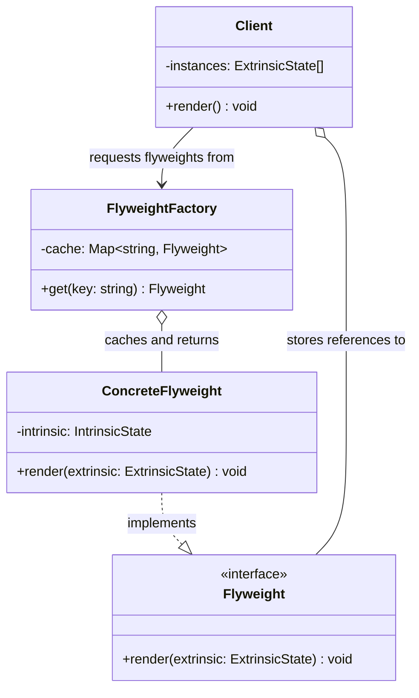

---
tags:
  - design-pattern
  - comp-sci
gardening: 🌿
date: 2026-06-06
reference:
  - https://github.com/deepakkum21/Books/blob/master/Design%20Patterns%20-%20Elements%20of%20Reusable%20Object%20Oriented%20Software%20-%20GOF.pdf
  - https://refactoring.guru/design-patterns/flyweight
  - https://en.wikipedia.org/wiki/Flyweight_pattern
---
## What & Why

The Flyweight pattern is an **explicit memory optimization**. It applies when you need to create a very large number of objects that share significant amounts of data, and the memory cost of storing that data per-instance becomes prohibitive.

The insight is that object state can be split into two categories:

- **Intrinsic state**: data that is identical across many instances. It is context-independent and immutable. Safe to share. Examples: a tree species' texture and color, a glyph's shape data in a font renderer, a particle's color scheme.
- **Extrinsic state**: data that is unique to each instance. It varies by context and cannot be shared. Examples: a tree's position on a map, a glyph's position in a document, a particle's current velocity.

Without Flyweight, a forest of 100,000 trees each stores its own copy of the species texture. With Flyweight, all oak trees share a single texture object. The per-instance storage drops from:

$$\text{100,000} \times (\text{texture} + \text{position} + \text{health})$$

to:

$$\underbrace{N_{\text{species}} \times \text{texture}}_{\text{flyweights}} + \underbrace{\text{100,000} \times (\text{position} + \text{health})}_{\text{instances}}$$

Where $N_{\text{species}}$ is typically a small constant (3 to 20), regardless of forest size.

GoF are explicit that this is a conditional pattern. Apply it only when all of the following are true:
- The application uses a large number of objects
- Storage costs are high due to sheer object count
- Most object state can be made extrinsic
- Many groups of objects can be replaced by a small number of shared objects once extrinsic state is removed
- The application does not depend on object identity for correctness

This last point matters: flyweights are shared, so two trees of the same species are strictly equal on their type object. If your logic ever compares tree type references for identity-based uniqueness, the pattern breaks that assumption.

## Structure Diagram



The `Client` holds a list of extrinsic state records, each with a reference to its flyweight. The flyweight itself stores only the intrinsic state.

## Traditional Class-Based Implementation

```typescript
// Intrinsic state (shared, immutable)
// In a real renderer this would include texture buffers, shader handles,
// LOD meshes, etc. Expensive to duplicate per instance.
type TreeSpecies = {
  readonly name: string;
  readonly color: string;
  readonly texture: string;
};

// Flyweight interface
// Accepts extrinsic state at call time rather than storing it.
interface TreeFlyweight {
  render(x: number, y: number, health: number): void;
}

// Concrete flyweight
// Stores intrinsic state only. Stateless with respect to any one tree.
class ConcreteTreeFlyweight implements TreeFlyweight {
  private readonly species: TreeSpecies;

  constructor(species: TreeSpecies) {
    this.species = species;
  }

  render(x: number, y: number, health: number): void {
    console.log(
      `[${this.species.name}] tex=${this.species.texture}` +
      ` color=${this.species.color} pos=(${x},${y}) hp=${health}`,
    );
  }
}

// Flyweight factory
// Cache keyed on intrinsic state. Returns existing flyweight if one
// already exists for that species combination.
class TreeFlyweightFactory {
  private readonly cache = new Map<string, ConcreteTreeFlyweight>();

  get(species: TreeSpecies): ConcreteTreeFlyweight {
    const key = `${species.name}:${species.color}:${species.texture}`;

    if (!this.cache.has(key)) {
      console.log(`[Factory] Allocating flyweight for "${species.name}"`);
      this.cache.set(key, new ConcreteTreeFlyweight(species));
    }

    return this.cache.get(key) as ConcreteTreeFlyweight;
  }

  get size(): number { return this.cache.size; }
}

// Extrinsic state (unique per tree)
type TreeInstance = {
  readonly x: number;
  readonly y: number;
  readonly health: number;
  readonly flyweight: TreeFlyweight;
};

// Forest (client that manages extrinsic state)
class Forest {
  private readonly instances: TreeInstance[] = [];
  private readonly factory = new TreeFlyweightFactory();

  plant(x: number, y: number, health: number, species: TreeSpecies): void {
    const flyweight = this.factory.get(species);
    this.instances.push({ x, y, health, flyweight });
  }

  render(): void {
    this.instances.forEach((t) => t.flyweight.render(t.x, t.y, t.health));
  }

  printStats(): void {
    console.log(
      `Instances: ${this.instances.length} | Flyweights allocated: ${this.factory.size}`,
    );
  }
}

// Usage
const OAK:   TreeSpecies = { name: 'Oak',   color: 'dark-green',  texture: 'oak-bark'   };
const PINE:  TreeSpecies = { name: 'Pine',  color: 'green',       texture: 'pine-bark'  };
const BIRCH: TreeSpecies = { name: 'Birch', color: 'light-green', texture: 'birch-bark' };

const forest = new Forest();

forest.plant(10, 20, 100, OAK);
forest.plant(30, 40,  80, OAK);   // reuses Oak flyweight
forest.plant(50, 60,  90, PINE);
forest.plant(70, 80,  70, PINE);  // reuses Pine flyweight
forest.plant(90, 10, 100, BIRCH);
forest.plant(20, 50,  60, OAK);   // reuses Oak flyweight again

forest.render();
forest.printStats();
// [Factory] Allocating flyweight for "Oak"
// [Factory] Allocating flyweight for "Pine"
// [Factory] Allocating flyweight for "Birch"
// ...render output for 6 trees...
// Instances: 6 | Flyweights allocated: 3
```

**Key Characteristics**:

- `ConcreteTreeFlyweight` holds only `TreeSpecies` (intrinsic). Position and health are never stored on it.
- `TreeFlyweightFactory` guarantees at most one flyweight per species, regardless of how many trees use it.
- `Forest` owns the extrinsic state list and passes those values to `render()` at draw time.
- Scaling to 100,000 trees of 3 species: 3 flyweight allocations, 100,000 lightweight extrinsic records.

## Function-Based Alternative

We achieve Flyweight behavior through:

1. **Immutable data objects as flyweights**: A frozen object is inherently shareable. No class required to enforce this.
2. **Memoization as the factory**: A closure over a `Map` returns the same reference for the same key. This is structurally identical to the factory class but with far less ceremony.
3. **Pure render functions accepting extrinsic state**: No method dispatch. The render logic is a function that takes both intrinsic and extrinsic data directly.

```typescript
// Intrinsic state
type TreeSpecies = {
  readonly name: string;
  readonly color: string;
  readonly texture: string;
};

// Extrinsic state
type TreeInstance = {
  readonly x: number;
  readonly y: number;
  readonly health: number;
  readonly species: TreeSpecies; // reference to shared object, not a copy
};

// Memoized flyweight factory
// The closure is the factory. Object.freeze enforces immutability on
// the shared object so no caller can mutate intrinsic state.
const createSpeciesCache = () => {
  const cache = new Map<string, TreeSpecies>();

  return (name: string, color: string, texture: string): TreeSpecies => {
    const key = `${name}:${color}:${texture}`;

    if (!cache.has(key)) {
      console.log(`[Cache] Allocating species "${name}"`);
      cache.set(key, Object.freeze({ name, color, texture }));
    }

    return cache.get(key) as TreeSpecies;
  };
};

const getSpecies = createSpeciesCache();

// Pure render functions
const renderTree = (tree: TreeInstance): void => {
  console.log(
    `[${tree.species.name}] tex=${tree.species.texture}` +
    ` color=${tree.species.color} pos=(${tree.x},${tree.y}) hp=${tree.health}`,
  );
};

const renderForest = (trees: readonly TreeInstance[]): void =>
  trees.forEach(renderTree);

// Immutable forest construction
const plantTree = (
  forest: readonly TreeInstance[],
  x: number,
  y: number,
  health: number,
  species: TreeSpecies,
): readonly TreeInstance[] => [...forest, { x, y, health, species }];

// Usage
const OAK   = getSpecies('Oak',   'dark-green',  'oak-bark');
const PINE  = getSpecies('Pine',  'green',        'pine-bark');
const BIRCH = getSpecies('Birch', 'light-green',  'birch-bark');

// Same arguments return the same frozen reference.
console.log(OAK === getSpecies('Oak', 'dark-green', 'oak-bark')); // true

const forest: readonly TreeInstance[] = [
  { x: 10, y: 20, health: 100, species: OAK   },
  { x: 30, y: 40, health:  80, species: OAK   },
  { x: 50, y: 60, health:  90, species: PINE  },
  { x: 70, y: 80, health:  70, species: PINE  },
  { x: 90, y: 10, health: 100, species: BIRCH },
  { x: 20, y: 50, health:  60, species: OAK   },
];

renderForest(forest);
console.log(`Instances: ${forest.length} | Species objects: 3`);
// [Cache] Allocating species "Oak"
// [Cache] Allocating species "Pine"
// [Cache] Allocating species "Birch"
// ...render output...
// Instances: 6 | Species objects: 3
```

## Comparison: Class vs Function

| Aspect                        | Class-based                                 | Function-based                                     |
| ----------------------------- | ------------------------------------------- | -------------------------------------------------- |
| Flyweight storage             | Class instance with private field           | Frozen plain object                                |
| Factory mechanism             | Factory class with `Map` and `get()` method | Closure over a `Map`, returns memoized value       |
| Immutability enforcement      | Convention only, no runtime guarantee       | `Object.freeze` prevents mutation at runtime       |
| Render dispatch               | Polymorphic method on flyweight instance    | Pure function accepting both state components      |
| Extrinsic state owner         | `Forest` class with mutable array           | Immutable `readonly TreeInstance[]`                |
| Shared reference verification | Not directly testable                       | Strict equality check on two `getSpecies()` calls  |
| Factory as a value            | Requires instantiation                      | `createSpeciesCache()` returns a reusable function |

### Problems with Traditional Class-Based Flyweight

1. **Mutable extrinsic array**: `this.instances.push()` in `Forest` mutates internal state. Two references to the same `Forest` can disagree on what trees exist if one caller adds trees while another is iterating. The functional version builds an immutable array.
2. **No runtime immutability on flyweights**: `ConcreteTreeFlyweight` stores `private readonly species`, but `readonly` in TypeScript is a compile-time constraint only. At runtime, nothing stops a caller from casting to `any` and mutating the species data, which would silently corrupt every tree sharing that flyweight. `Object.freeze` provides an actual runtime barrier.
3. **Factory class is just a memoized function with extra steps**: `TreeFlyweightFactory` is a class with one method and one field. The closure version expresses the same thing in four lines with no instantiation cost and no need to thread an instance through the system.
4. **Non-null assertion on `cache.get()`**: The `cache.get(key) as ConcreteTreeFlyweight` cast after a `has()` check is a well-known TypeScript pattern that still requires the developer to maintain the invariant manually. A functional implementation that sets and gets in one consistent path avoids the split.
