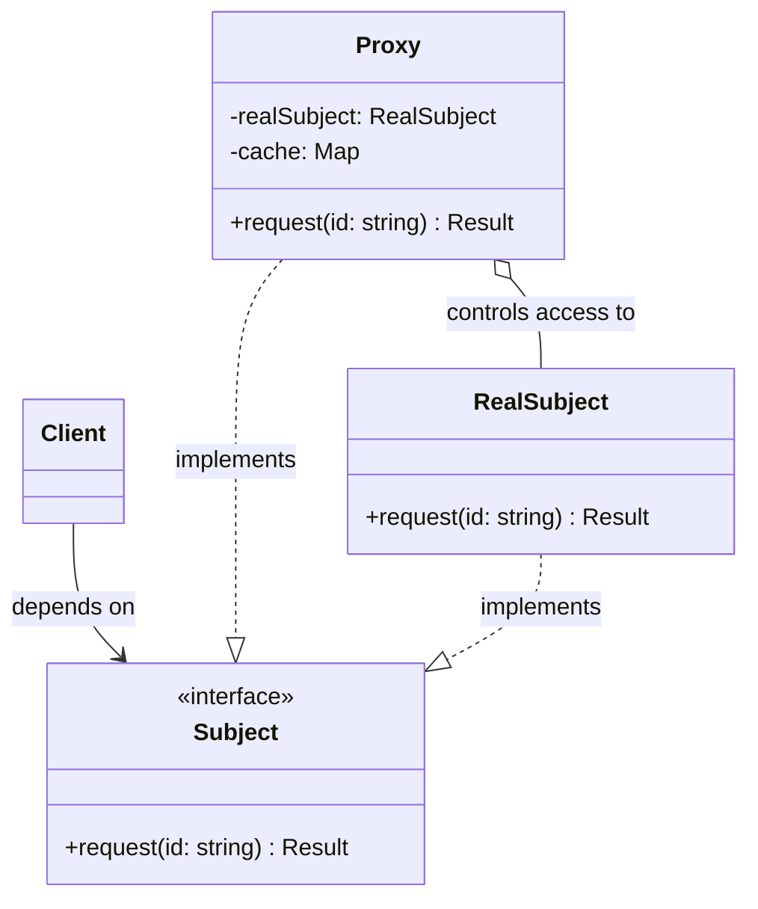

---
tags:
  - design-pattern
  - comp-sci
gardening: 🌿
date: 2026-06-06
reference:
  - https://github.com/deepakkum21/Books/blob/master/Design%20Patterns%20-%20Elements%20of%20Reusable%20Object%20Oriented%20Software%20-%20GOF.pdf
  - https://refactoring.guru/design-patterns/proxy
  - https://en.wikipedia.org/wiki/Proxy_pattern
---
## What & Why

The Proxy pattern places a **surrogate object in front of a real subject** to control access to it. The proxy and the real subject share the same interface, so callers cannot distinguish between them. All calls pass through the proxy first, which decides what to do: forward the call, short-circuit it, log it, delay it, or augment it.

This sounds similar to Decorator, and the structure is nearly identical. The intent is what separates them:

- **Decorator** adds behavior. It is designed to stack. The caller knows (or doesn't care) that decoration is happening.
- **Proxy** controls access. It typically wraps a single subject. The goal is transparency: the caller should not know or care that a proxy is involved.

GoF identify four common Proxy variants:

- **Virtual Proxy**: delays expensive construction or computation until actually needed (lazy initialization)
- **Protection Proxy**: gates access based on permissions or authentication state
- **Remote Proxy**: represents an object that lives in a different process or machine (gRPC stubs, REST clients)
- **Caching Proxy**: stores results of expensive calls and returns cached copies on repeat requests

Real-world occurrences:
- ORM lazy-loaded relationships (virtual proxy)
- API authorization middleware (protection proxy)
- gRPC and tRPC generated client stubs (remote proxy)
- HTTP reverse proxies and CDN edge caches (caching proxy)
- JavaScript's native `Proxy` object (language-level implementation of this exact pattern)

## Structure Diagram



The client holds a `Subject` reference. It may be pointing at a `Proxy` or directly at the `RealSubject`. The distinction is invisible to the client.

## Traditional Class-Based Implementation

This example combines two proxy concerns that frequently appear together in practice: **virtual proxy** (lazy instantiation of an expensive service) and **caching proxy** (memoize results to avoid redundant work).

```typescript
// Domain type
type Report = {
  readonly id: string;
  readonly title: string;
  readonly data: readonly number[];
  readonly generatedAt: Date;
};

// Subject interface
// Both the real service and the proxy implement this.
interface ReportService {
  generate(reportId: string): Report;
}

// Real subject
// Expensive to construct (opens DB connections, loads config).
// Expensive to call (runs complex aggregations).
class RealReportService implements ReportService {
  constructor() {
    // Simulate costly initialization.
    console.log('[RealReportService] Initializing connections...');
  }

  generate(reportId: string): Report {
    console.log(`[RealReportService] Running aggregation for "${reportId}"...`);
    return {
      id:          reportId,
      title:       `Report: ${reportId}`,
      data:        [42, 17, 93, 8, 55],
      generatedAt: new Date(),
    };
  }
}

// Proxy (virtual + caching)
// Defers construction of RealReportService until the first call.
// Caches results so subsequent calls with the same ID are free.
class ReportServiceProxy implements ReportService {
  private real: RealReportService | null = null;
  private readonly cache = new Map<string, Report>();

  private getReal(): RealReportService {
    if (!this.real) {
      this.real = new RealReportService();
    }
    return this.real;
  }

  generate(reportId: string): Report {
    const cached = this.cache.get(reportId);
    if (cached) {
      console.log(`[Proxy] Cache hit for "${reportId}"`);
      return cached;
    }

    const report = this.getReal().generate(reportId);
    this.cache.set(reportId, report);
    return report;
  }
}

// Usage
// Client only knows about ReportService. Proxy is invisible.
const initDashboard = (service: ReportService): void => {
  console.log('\n-- First load --');
  service.generate('q1-summary');  // cold: init + compute
  service.generate('annual');      // cold: compute (init already done)

  console.log('\n-- Second load --');
  service.generate('q1-summary');  // warm: cache hit
  service.generate('annual');      // warm: cache hit

  console.log('\n-- New report --');
  service.generate('q2-summary');  // cold: compute
};

const service: ReportService = new ReportServiceProxy();
initDashboard(service);

// -- First load --
// [RealReportService] Initializing connections...
// [RealReportService] Running aggregation for "q1-summary"...
// [RealReportService] Running aggregation for "annual"...
//
// -- Second load --
// [Proxy] Cache hit for "q1-summary"
// [Proxy] Cache hit for "annual"
//
// -- New report --
// [RealReportService] Running aggregation for "q2-summary"...
```

**Key Characteristics**:
- `RealReportService` is not constructed until `generate()` is first called (virtual proxy)
- Subsequent calls with the same ID skip the real service entirely (caching proxy)
- `initDashboard` accepts `ReportService` and works identically whether it receives a proxy or the real thing
- The `null` guard in `getReal()` is the lazy initialization gate

## Function-Based Alternative

We achieve Proxy behavior through:

1. **HOF wrappers as proxy layers**: Each proxy concern (caching, lazy init) is a function that takes a function and returns a function. The same structural composition as Decorator, but scoped to controlling access rather than adding behavior.
2. **Closure-based lazy initialization**: A `let` binding inside a closure holds the deferred real service reference. The first call initializes it; subsequent calls reuse it.
3. **Composable proxy factories**: Individual proxy concerns (`withCache`, `withLazyInit`) can be applied independently or combined, making the layers explicit and separable.

```typescript
// Domain type
type Report = {
  readonly id: string;
  readonly title: string;
  readonly data: readonly number[];
  readonly generatedAt: Date;
};

// Subject type
type GenerateFn = (reportId: string) => Report;

// Real subject as a factory
// Wrapped in a factory so construction can be deferred.
const createRealReportService = (): GenerateFn => {
  console.log('[RealReportService] Initializing connections...');

  return (reportId) => {
    console.log(`[RealReportService] Running aggregation for "${reportId}"...`);
    return {
      id:          reportId,
      title:       `Report: ${reportId}`,
      data:        [42, 17, 93, 8, 55],
      generatedAt: new Date(),
    };
  };
};

// Caching proxy
// Wraps any GenerateFn and short-circuits on cache hits.
const withCache = (generate: GenerateFn): GenerateFn => {
  const cache = new Map<string, Report>();

  return (reportId) => {
    const cached = cache.get(reportId);
    if (cached) {
      console.log(`[Cache] Hit for "${reportId}"`);
      return cached;
    }

    const report = generate(reportId);
    cache.set(reportId, report);
    return report;
  };
};

// Virtual proxy (lazy init)
// Defers calling the factory until the first generate() call.
// Note: this is one of the few justified uses of `let` in FP TS.
// The mutable binding IS the lazy state; there is no immutable
// equivalent that preserves the deferred-init contract.
const withLazyInit = (factory: () => GenerateFn): GenerateFn => {
  let service: GenerateFn | null = null;

  return (reportId) => {
    if (!service) service = factory();
    return service(reportId);
  };
};

// Compose proxy layers
// Order matters: cache check happens before lazy init.
// A cache hit never touches the real service or triggers init.
const generate: GenerateFn = withCache(
  withLazyInit(createRealReportService),
);

// Usage
const initDashboard = (gen: GenerateFn): void => {
  console.log('\n-- First load --');
  gen('q1-summary');
  gen('annual');

  console.log('\n-- Second load --');
  gen('q1-summary');
  gen('annual');

  console.log('\n-- New report --');
  gen('q2-summary');
};

initDashboard(generate);
```

### JavaScript Native Proxy

JavaScript provides a built-in `Proxy` object that is a direct language-level implementation of this pattern. It intercepts any operation on an object (property access, assignment, function calls, `in` checks, etc.) via handler traps.

```typescript
// Native Proxy: add logging to any object without touching it.
const createLoggingProxy = <T extends object>(target: T, label: string): T =>
  new Proxy(target, {
    get(obj, prop, receiver) {
      const value = Reflect.get(obj, prop, receiver);
      if (typeof value === 'function') {
        return (...args: unknown[]) => {
          console.log(`[${label}] ${String(prop)}(${args.map(String).join(', ')})`);
          return (value as Function).apply(obj, args);
        };
      }
      return value;
    },
  });

const realService = { generate: (id: string): Report => ({
  id, title: `Report: ${id}`, data: [1, 2, 3], generatedAt: new Date(),
})};

const loggedService = createLoggingProxy(realService, 'ReportService');
loggedService.generate('q1-summary');
// [ReportService] generate(q1-summary)
```

The native `Proxy` is the most powerful form: it requires no interface definition and can intercept operations that class-based proxies cannot (property reads, `delete`, `instanceof`, iteration). The tradeoff is that it is harder to type precisely in TypeScript and the handler indirection adds a small runtime cost.

## Comparison: Class vs Function

| Aspect | Class-based | Function-based |
|---|---|---|
| Proxy mechanism | Class implements interface, delegates to real instance | HOF wraps a function, closes over state |
| Lazy initialization state | `private real: T \| null` on the proxy class | `let service: T \| null` inside closure |
| Caching state | `private readonly cache: Map` on the proxy class | `const cache: Map` inside `withCache` closure |
| Composing proxy concerns | Nest class wrappers or add logic to one proxy class | Chain HOFs: `withCache(withLazyInit(factory))` |
| Separation of concerns | Single proxy class handles all concerns | Each concern is a separate composable function |
| Native language support | N/A | JS `Proxy` object intercepts at the language level |
| Typing | Interface contract enforced by `implements` | Function type enforced structurally |

### Problems with Traditional Class-Based Proxy

1. **Multiple concerns in one class**: When both caching and lazy initialization live in `ReportServiceProxy`, they cannot be applied independently. You cannot get caching without lazy init, or lazy init without caching, without sub-classing or splitting the class. The functional version makes each concern an independent, reusable layer.

2. **Non-null assertion**: `this.cache.get(reportId)` returns `Report | undefined`, requiring either a non-null assertion or a redundant second `get()` after `has()`. This is a recurring friction point in class-based caching. The functional version uses a `cached` binding that TypeScript narrows correctly.

3. **Lazy state is hidden inside the class**: The `private real: RealReportService | null` field is invisible to callers. There is no way to inspect or reset the proxy's initialization state from outside without additional methods. In the functional version, the closure is explicit about what state it holds.

4. **Proxy concerns cannot be reused across subjects**: `ReportServiceProxy` is hardwired to `ReportService`. To add caching to a `UserService`, you write another proxy class. The `withCache` HOF works on any `(id: string) => T` function with no modification.
