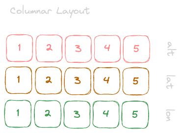

---
tags:
  - parquet
gardening: 🌱
reference:
  - https://sympathetic.ink/2024/01/24/Chapter-1-The-birth-of-Parquet.html
  - https://sympathetic.ink/2013/09/11/Dremel-made-simple-with-Parquet.html
  - https://github.com/apache/parquet-format
---
## Motivation

The goal is to keep I/O to a minimum by reading from a disk only the data required for the query. When you think of a table representation, it is two dimensional with columns and rows. However when it’s physically stored on a disc it has to be arranged as a linear, one dimensional succession of bits.




Organizing the table in a row layout means writing each row one after another. This interleaves data of different types, as you write a value for the first column in the first row, followed by the value of the second column of a different type in the first row.


In a column layout, you write all the values of the first column for all the rows first, then the values for the second column, and so on.


There are several advantages to columnar formats.

- Organizing by column allows for better compression, as data is more homogenous.
- I/O will be reduced as we can efficiently scan only a subset of the columns while reading the data. Better compression also reduces the bandwidth required to read the input.
- As we store data of the same type in each column, we can use encodings better suited to the modern processors’ pipeline by making instruction branching more predictable.


## Model

To store in a columnar format we first need to describe the data structures using a schema. This is done using a model similar to [Protocol Buffers](Protocol%20Buffers.md). This model is minimalistic in that it represents nesting using groups of fields and repetition using repeated fields. There is no need for any other complex types like Maps, List or Sets as they all can be mapped to a combination of repeated fields and groups.

The root of the schema is a group of fields called a message. Each field has three attributes: 
a repetition, a type and a name.

The type of a field is either a group or a primitive type (e.g., int, float, boolean, string) and the repetition can be one of the three following cases:

- **required**: exactly one occurrence
- **optional**: 0 or 1 occurrence
- **repeated**: 0 or more occurrences

```
message AddressBook {
  required string owner;
  repeated string ownerPhoneNumbers;
  repeated group contacts {
    required string name;
    optional string phoneNumber;
  }
}
```

Lists (or Sets) can be represented by a repeating field.

```
// schema
message ExList {
  repeated string list;
}
```

```
// data
{
  list: "a",
  list: "b",
  list: "c",
  ...
}
```

A Map is equivalent to a repeating field containing groups of key-value pairs where the key is required.

```
// schema
message ExMap {
  repeated group map {
    required string key;
    optional string value;
  }
}
```

```
// data
{
  map: {
    key: "AL",
    value: "Alabama"
  },
  map: {
    key: "AK",
    value: "Alaska"
  },
  ...
}
```
