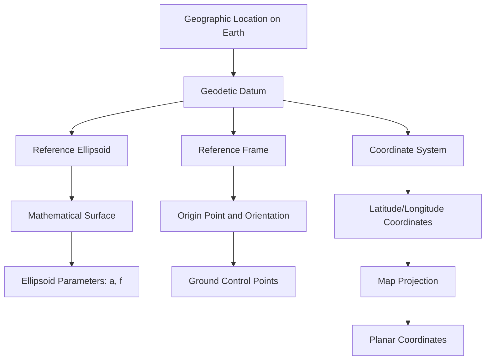

---
tags:
  - gis
gardening: 🌿
date: 2025-08-24
reference:
  - https://support.esri.com/en-us/gis-dictionary/datum
  - https://desktop.arcgis.com/en/arcmap/latest/map/projections/datums.htm
  - https://en.wikipedia.org/wiki/Geodetic_datum
  - https://colorado.pressbooks.pub/makingmaps/chapter/chapter-9-datums-coordinate-systems-and-map-projections/
---
In the field of Geographic Information Systems (GIS), a **geodetic datum** is a crucial reference point for the entire planet. A geodetic datum, also known as a reference frame, is an abstract coordinate system that includes a reference surface (such as sea level) to provide known locations for starting surveys and creating maps.

The Earth is not a perfect sphere or even a perfect ellipsoid. Instead, it has an irregular, complex shape that changes over time due to tectonic activity, ocean tides, and variations in gravity. To create accurate maps, navigate effectively, conduct surveys, or develop GIS applications, we need mathematically defined reference systems that approximate the Earth's shape and offer a consistent framework for describing locations.

## Earth's Irregular Shape

### Earth's True Shape vs. Mathematical Models

Earth's actual shape is incredibly complex. Scientists call the true shape of Earth the **geoid**—an equipotential surface of Earth's gravity field that would coincide with mean sea level if extended through all continents. The geoid is essentially the figure of the Earth abstracted from its topographic features. It is an idealized equilibrium surface of sea water, the mean sea level surface in the absence of currents, air pressure variations etc.

The problem is that the geoid is mathematically intractable. Its surface undulates by up to 100 meters compared to a smooth ellipsoid due to variations in Earth's density, mountain ranges, ocean trenches, and other geological features. You cannot easily perform calculations on such an irregular surface.

### The Ellipsoid Solution

To solve this problem, geodesists use [reference ellipsoids](./Ellipsoid.md)—mathematically defined surfaces that approximate Earth's shape. The ellipsoid provides a standardized model for determining locations on the Earth's surface, making it convenient for fast and efficient calculations.

## Coordinate Systems and Reference Frames

### Understanding the Relationship

Before diving deeper into datums, it's crucial to understand how datums relate to coordinate systems. These terms are often confused but serve different purposes:

- **Coordinate Reference System (CRS)**: A coordinate-based system that provides a standardized framework for describing and locating points on the Earth's surface.
- **Geodetic Datum**: A mathematical model that defines the shape and size of the Earth's surface, as well as the location of a reference point.

A complete coordinate reference system consists of:

1. A geodetic datum (including its reference ellipsoid)
2. A coordinate system (defining axes, units, and origin)
3. A map projection (if converting to a flat surface)

## Types of Geodetic Datums

### Horizontal vs. Vertical Datums

**Horizontal Datums** serve as the reference surface for measuring latitude and longitude. A horizontal datum is essential for accurately determining these coordinates. It does this by fixing the ellipsoid's center and orientation relative to a set of precisely measured points on the Earth's surface.

**Vertical Datums** establish the reference surface for measuring elevation or depth. Similar to horizontal datums, vertical datums are defined by specific points on the Earth with known heights, which can be either above or below a nationally defined reference surface, such as mean sea level.

### Global vs. Regional Datums

#### Global Datums

Global datums have their ellipsoids sized and positioned to best represent the surface of the Earth on a global scale. Modern global datums are geocentric—their origins coincide with Earth's center of mass.

**Examples:**
- **WGS84**: The WGS84 datum (reference frame) has been used by the U.S. Military since January 21, 1987.
- **ITRF (International Terrestrial Reference Frame)**: The International Terrestrial Reference Frame (ITRF) is a global reference system that enables accurate and consistent positioning for a wide range of applications.

#### Regional Datums  

Local datums have their ellipsoids sized and positioned to better match a particular region of the Earth. These were developed before satellite technology allowed global measurements.

**Examples:**
- **NAD27 (North American Datum 1927)**: The latitude and longitude of a point in the ITRF2014 (2010.0) reference frame is different than the latitude and longitude for the same point in NAD83 2011 (2010.0).
- **ED50 (European Datum 1950)**: ED50 was defined in 1950 over Europe and differs from WGS 84 by a few hundred meters depending on where in Europe you look.

## Major Datum Systems

### World Geodetic System 1984 (WGS84)

WGS84 is arguably the most important datum system today. The Global Positioning System (GPS) uses the World Geodetic System 1984 (WGS 84) to determine the location of a point near the surface of Earth.

**Key Parameters:**
- Semi-major axis: $a = 6,378,137$ m
- Flattening: $f = 1/298.257223563$
- Geocentric gravitational constant: $GM = 3.986004418 × 10^{14}$ m³/s²

There have been six incarnations of WGS84 since then. While WGS84 has always been the basis for the GPS Navigation message, the particular version of the datum has changed. The latest version of WGS84 is WGS84 (G1762).

### North American Datum 1983 (NAD83)

NAD83 was designed specifically for North America and uses the GRS80 ellipsoid. For example, the Australian national geodetic datum is the Geocentric Datum of Australia 2020 (GDA2020). GDA2020 is based on a realisation of the ITRF2014 at epoch 2020.0, or 1 January 2020. NAD83 follows similar principles but for North America.

### International Terrestrial Reference Frame (ITRF)

The ITRF is the most accurate global reference frame, maintained by the International Earth Rotation and Reference Systems Service (IERS). International Terrestrial Reference Frame 2020 (ITRF2020) World Geodetic System 1984 (WGS84) An important feature of a geodetic datum is the reference surface.

## The Mathematics of Datum Transformations

### Why Transformations Are Necessary

All geographic coordinates (latitude and longitude) are derived from an ellipsoid. And since the ellipsoids have different numerical values, a latitude and longitude value for a particular datum will not have the same value in a different datum.

For example, the same physical point might have coordinates:
- NAD27: 40° 06' 28.8210" N, 75° 16' 54.1230" W  
- NAD83: 40° 06' 28.6294" N, 75° 16' 54.0124" W
- WGS84: 40° 06' 28.6295" N, 75° 16' 54.0125" W

## Time-Dependent Datums and Plate Tectonics

Modern datums must account for the fact that Earth's surface is constantly moving due to plate tectonics. For accurate work, it is therefore necessary to define a reference time (date) or epoch for positions established using the Ellipsoid ⁄ Spheroid and reference frame.

### Epoch and Reference Time

For example, if the date of a survey is not known and could be anytime over the past 10 years, there is an uncertainty in the location of the point of 7cm per year or up to 0.7 of a meter over 10 years.

This is why modern datum definitions include an **epoch**—a specific reference date:

- **NAD83(2011)** epoch 2010.0
- **GDA2020** epoch 2020.0 
- **ITRF2014** epoch 2010.0

### Velocity Fields

To account for ongoing crustal motion, geodetic agencies maintain **velocity fields**—models of how positions change over time. These allow coordinates to be transformed between different epochs:

$$Position(t) = Position(t_0) + Velocity \times (t - t_0)$$

## Common Datum Transformation Errors

### Null Transformations

The most dangerous error is applying a "null transformation" (no transformation) between significantly different datums. This can cause errors of hundreds of meters.

### Wrong Transformation Direction

If there is any ambiguity about which convention applies it is best, for safety, to always include a test point with coordinates in systems A and B when stating a transformation.

### Ignoring Time Dependency  

Using coordinates without considering their epoch can introduce errors in tectonically active regions or when high accuracy is required.

### Grid Shift vs. Parameter Transformations

Some datum transformations require grid files (like NADCON for NAD27/NAD83) rather than simple parameter transformations. Originally this was implemented as a means to transform coordinates between the North American datums NAD27 and NAD83, but corrections can be applied for any datum for which a correction grid exists.