---
tags:
  - gis
gardening: 🌿
date: 2025-08-24
reference:
  - https://www.caliper.com/glossary/what-is-an-ellipsoid.htm
  - https://www.numberanalytics.com/blog/ellipsoid-backbone-of-gis-and-remote-sensing
  - https://www.numberanalytics.com/blog/ultimate-guide-to-ellipsoid-in-gis
  - https://gisgeography.com/ellipsoid-oblate-spheroid-earth/
  - https://www.propelleraero.com/blog/geoids-vs-ellipsoids-whats-the-difference/
---
The Earth is not a sphere, nor is it a perfect ellipsoid. Its true shape, known as the **geoid**, is an irregular, bumpy surface that follows the planet's gravitational field. Since working with irregular shapes is nearly impossible from a mathematical standpoint, geodesists—scientists who study the shape of the Earth—use a more manageable approximation: the ellipsoid.

An ellipsoid is essentially a three-dimensional oval; imagine taking a football, stretching it slightly at the ends, and compressing it in the middle. This shape closely approximates the Earth's overall form and provides the mathematical foundation for nearly all modern mapping, GPS navigation, and geographic analysis.

## The Mathematical Foundation of Ellipsoids

### Basic Geometry and Definition

An ellipsoid is a quadric surface defined by the equation:

$$\frac{x^2}{a^2} + \frac{y^2}{b^2} + \frac{z^2}{c^2} = 1$$

Where $a$, $b$, and $c$ are the semi-axes lengths. For representing Earth, we use a special case called an **ellipsoid of revolution** (or oblate spheroid), where two of the axes are equal. Specifically:

- $a = b$ (equatorial radius - the "width" at the equator)
- $c < a$ (polar radius - the "height" from pole to pole)

This gives us the simplified equation:

$$\frac{x^2 + y^2}{a^2} + \frac{z^2}{c^2} = 1$$

The ellipsoid is "oblate" because it's flattened at the poles - exactly like Earth, which bulges at the equator due to its rotation.

### Key Parameters

Every ellipsoid used in GIS is defined by two fundamental parameters:

1. **Semi-major axis (a)**: The equatorial radius, typically around 6.378 million meters for Earth
2. **Semi-minor axis (b)**: The polar radius, typically around 6.357 million meters for Earth

From these, we derive several important parameters:

**Flattening (f)**:
$$f = \frac{a - b}{a}$$

**First Eccentricity ($e$)**:
$$e = \sqrt{1 - \frac{b^2}{a^2}}$$

**Second Eccentricity ($e'$)**:
$$e' = \sqrt{\frac{a^2 - b^2}{b^2}}$$

Let's visualize these relationships:

```mermaid
graph TB
    subgraph "Ellipsoid Cross-Section"
        A[Semi-major axis a<br/>~6,378,137 m]
        B[Semi-minor axis b<br/>~6,356,752 m]
        C[Flattening f<br/>≈ 1/298.257]
        D[First Eccentricity e<br/>≈ 0.0818]
    end
    
    A --> C
    B --> C
    A --> D
    B --> D
```

### Why These Parameters Matter

The flattening factor of the Earth may seem minor—its flattening is approximately 1/298, meaning the difference between the equatorial and polar radii is less than 0.34% of the total radius. However, this seemingly small difference has significant practical implications:

- **Navigation errors**: Using a spherical model instead of an ellipsoidal one can lead to positional errors of several hundred meters.
- **Distance calculations**: Great circle calculations based on a sphere can result in inaccuracies of kilometers for long distances.
- **Area measurements**: Countries located near the poles could have significantly incorrect area calculations when using a spherical model.

## Common Ellipsoids in Modern GIS

### WGS84 (World Geodetic System 1984)

The most important ellipsoid in modern GIS, WGS84 is the foundation of GPS and most web mapping services:

- Semi-major axis: 6,378,137.0 m
- Flattening: 1/298.257223563
- Used by: GPS, Google Maps, OpenStreetMap, most modern applications

### GRS80 (Geodetic Reference System 1980)

Nearly identical to WGS84, used primarily in North American surveying:

- Semi-major axis: 6,378,137.0 m  
- Flattening: 1/298.257222101
- Used by: NAD83, many national coordinate systems

### Historical Ellipsoids

Different regions historically used different ellipsoids optimized for their local area:

- **Clarke 1866**: Used in older US mapping (NAD27)
- **Airy 1830**: Used in Great Britain
- **Bessel 1841**: Used in central Europe and parts of Asia

## The Relationship Between Ellipsoids and Coordinate Systems

Understanding ellipsoids is crucial because they form the foundation of [coordinate reference systems](./Coordinate%20Systems.md). Here's how the pieces fit together:

### Datum Transformation

When working with different ellipsoids, you often need to transform coordinates between [datums](./Datum.md). This is a complex process that can involve:

1. **Translation**: Shifting the origin point
2. **Rotation**: Adjusting the orientation of axes
3. **Scaling**: Accounting for different ellipsoid sizes

## Accuracy Considerations and Best Practices

### When Ellipsoid Choice Matters

The choice of ellipsoid significantly impacts accuracy depending on your application:

**High-precision surveying**: Differences of centimeters matter
- Use the most accurate local ellipsoid for your region
- Consider the datum age and measurement techniques used

**Navigation and mapping**: Differences of meters matter
- WGS84 is almost always the correct choice
- Ensure all your data uses consistent ellipsoids

**Large-scale analysis**: Differences of kilometers matter
- Any modern ellipsoid (WGS84, GRS80) will suffice
- Focus on projection choice instead

### Common Pitfalls

1. **Mixed ellipsoids**: Combining data from different ellipsoids without transformation
2. **Ignoring vertical datums**: Ellipsoid heights ≠ orthometric heights (sea level)
3. **Precision vs accuracy**: Using high-precision calculations with low-accuracy ellipsoids

## Earth's Changing Shape

Earth's ellipsoid parameters aren't constant. Factors affecting our planet's shape include:

- **Glacial isostatic adjustment**: Land rebounds after ice melts
- **Tectonic motion**: Continents drift and rotate
- **Sea level rise**: Changes the reference surface
- **Core dynamics**: Affects the planet's rotation and bulge