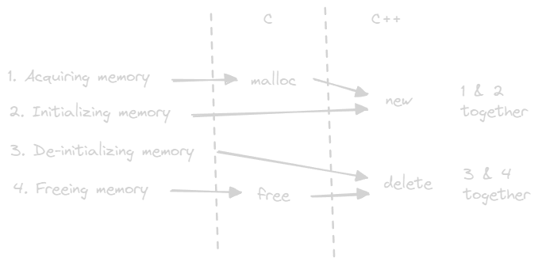
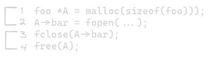

---
tags:
  - language
  - c
  - memory
gardening: 🌱
date: 2025-02-22
reference:
  - https://www.youtube.com/watch?v=zjkuXtiG1og
---
Memory steps
1. getting the memory
2. initializing the memory
3. de-initializing memory
4. freeing memory



If you want to make one that is not on the stack, that is going to be dynamically allocated onto the heap. C std lib provides #1 & #4. Which is malloc and free. What they do is go to the heap and reserve something of the size of the struct and return it.

```cpp
struct foo {
  FILE *bar;
}

foo *A = malloc(sizeof(foo)));
```

You are asking to reserve a place in the computers memory for a `foo`. But the memory that you get back is just garbage. Since #2 was not done. So you do this then you do whatever you want to do to initialize the object.

```cpp
A->bar = fopen(...);
```

There is the initialization. Which is #2. When you are done with it, you then need to close it.

```cpp
fclose(A->bar);
```

Before freeing the memory. Which is #3.

```cpp
free(A);
```

So C++ tried to standardized these.



So if we expand on the struct to have a constructor `foo` and a destructor `~foo`. But `struct` and `class` have no difference between them in memory.

```cpp
struct foo {
  FILE *bar;
  foo();
  ~foo();
}
```

The only difference is whether things are declared public or private by default. So don't let that confuse you. `class` is a meaningless keyword.

So the constructor and destructor are designed to move #2 and #3 into the class. But inside them you are still doing the same things.

```cpp
foo::foo() {
  bar = fopen(...);
}

foo::~foo() {
  fclose(bar);
}
```

So in order to be able to do step #1 & #2 C++ needed a way to signal that. This is where `new` came in. And similarly, to be symmetric, they needed a way to do steps #3 & #4. And that is where `delete` came from.