---
tags:
  - cql
  - gis
reference:
  - https://portal.ogc.org/files/96288
  - https://portal.ogc.org/files/96288#cql-bnf
  - https://docs.geoserver.org/latest/en/user/filter/function_reference.html#filter-function-reference
  - https://docs.geoserver.org/latest/en/user/tutorials/cql/cql_tutorial.html
gardening: 🌳
---
The Common Query Language (CQL) is a generic filter grammar that can be used to specify how resource instances in a source collection of any item type, including features, can be filtered to identify a results set.

## Expressions

A CQL filter expression is an expression that defines a logically connected set of predicates that are evaluated for each item of a collection.

A predicate is an expression that evaluates to the Boolean values of `TRUE` or `FALSE` or that evaluates to the value `NULL` when dealing with unknown values.

If a predicate evaluates to `TRUE` for an item, the item qualifies for further processing such as presentation in the result set, being passed on to the next predicate in the filter for further evaluation, and so forth.

## Literal Values and Property References

A literal value is any part of a CQL filter expression that is used exactly as it is specified in the expression. Character strings, numbers, booleans, spatial geometries or temporal geometries.

```
'This is a literal string.'

-100
3.14159

true
false
t
f

POLYGON((43.5845 -79.5442, 43.6079 -79.4893, ...))

{
  "type": "Polygon",
  "coordinates": [
    [
      [43.5845,-79.5442],
      [43.6079,-79.4893],
      ...
    ]
  ]
}

1969-07-20
1969-07-20T20:17:40Z
```

Properties in an object being evaluated in the CQL filter expression can be referenced by their name. The data type of the literal value needs match the expected data type for the expression within which the property name reference appears. For example, a property name used in a scalar expression has to be a queryable of type `string`, `number`, `integer` or `boolean`.

```cql
filter=prop1=10 AND prop2>45
```

## Binary Comparison

A binary comparison predicate evaluates two scalar expressions to determine if the expressions satisfy the specified comparison operator. Both scalar expressions need to evaluate to the same type of literal.

```cql
city='Toronto'

avg(windSpeed) < 4

balance-150.0 > 0
```

## Logical Operators

Sub-expressions can be put together with logical operators to form more complex expressions.

- AND
- OR
- NOT

## Binary Comparison Operators

- equal to ($=$) 
- less than ($<$)
- less than or equal to ($<=$)
- greater than ($>$)
- greater than or equal to ($>=$)

## Like

The `LIKE` predicate tests whether a string value matches the specified pattern.

The character specified using the `WILDCARD` modifier matches zero of more characters in the test value. The `WILDCARD` character does not match the `NULL` value. If the `WILDCHAR` modifier is not specified, the default wildcard character is `%`.

The character specified using the `SINGLECHAR` modifier matches exactly one characters in the test value. If the `SINGLECHAR` modifier is not specified, the default `SINGLECHAR` character is `_`.

The character specified using the `ESCAPECHAR` modifier can be used to escape the `WILDCHAR` and/or `SINGLECAHR` characters in the pattern string. If the `ESCAPECHAR` modifier is not specified, the default `escapechar` character is `\`.

If `NOCASE` is `TRUE`, the comparison is case insensitive, if it is `FALSE` it is case sensitive. The default is `TRUE`.

```cql
name LIKE 'Smith.' SINGLECHAR '.' NOCASE true

STATE_NAME LIKE 'N%'
```

## Between

The `BETWEEN` predicate tests whether a numeric value lies within the specified range. The between operator is inclusive.

```cql
depth BETWEEN 100.0 and 150.0
```

## In

The `IN` list predicate tests, for equality, the value of a scalar expression against a list of values of the same type.

The items in the list of an in-list predicate (i.e., the items on the right hand side of the predicate) should be of the same literal type as the value being tested by the predicate.

```cql
cityName IN ('Toronto','Franfurt','Tokyo','New York') NOCASE false

category NOT IN (1,2,3,4)
```

## Null

The `NULL` predicate tests whether the value of a scalar expression is null.

```cql
geometry IS NOT NULL
```

## Spatial

A _spatial predicate_ evaluates two geometry-valued expressions to determine if the expressions satisfy the requirements of the specified spatial operator.

> [!note]
> The spatial predicates currently use a different pattern than the comparison and temporal predicates and are written like function calls. This difference is inherited from previous versions of CQL.

CQL uses Well-Known-Text (WKT) to encode geometry literals. Since WKT does not provide a capability to specify the CRS (Coordinate Reference System) of a geometry literal, the server has to determine the CRS of the geometry literals in a filter expression through another mechanism. In this standard, the `filter-crs` query parameter is used to pass the CRS information to the server.

```
  filter-crs=http://www.opengis.net/def/crs/EPSG/0/32635&
  filter=INTERSECTS(geometry,POLYGON((1379213.867288 3610774.164192,1379233.837424 3610769.696029,1379246.149564 3610812.389132,1379226.494235 3610816.884823,1379213.867288 3610774.164192)))
```

## Temporal

A temporal predicate evaluates two time-valued expressions to determine if the expressions satisfy the requirements of the specified temporal operator.

```
event_date ANYINTERACTS 1969-07-16T05:32:00Z/1969-07-24T16:50:35Z
```

## Enhanced Spatial

- ∩ - intersection; operation on two or more sets
- ∧ - and; logical intersection
- ∅ - empty set; the set having no members
- ≠ - not equal
- ⟺ - if and only if; logical equivalence between statements
- ⊆ - is a subset of
- dim(x) - returns the maximum dimension (-1, 0, 1, or 2) of the geometric object x

| Spatial operator | Definition                                                                             |
| ---------------- | -------------------------------------------------------------------------------------- |
| EQUALS           | EQUALS(a,b) ⟺ a ⊆ b ∧ b ⊆ a                                                            |
| DISJOINT         | DISJOINT(a,b) ⟺ a ∩ b = ∅                                                              |
| TOUCHES          | TOUCHES(a,b) ⟺ (I(a) ∩ I(b) = ∅) ∧ (a ∩ b) ≠ ∅                                         |
| WITHIN           | WITHIN(a,b) ⟺ (a ∩ b = a) ∧ (I(a) ∩ E(b) ≠ ∅)                                          |
| OVERLAPS         | OVERLAPS(a,b) ⟺ (dim(I(a)) = dim(I(b)) = dim(I(a) ∩ I(b))) ∧ (a ∩ b ≠ a) ∧ (a ∩ b ≠ b) |
| CROSSES          | CROSSES(a,b) ⟺ [I(a) ∩ I(b) = ∅) ∧ (a ∩ b ≠ a) ∧ (a ∩ b ≠ b)]                          |
| INTERSECTS       | INTERSECTS(a,b) ⟺ ! a DISJOINT b                                                       |
| CONTAINS         | CONTAINS(a,b) ⟺ b CONTAINS a                                                           |

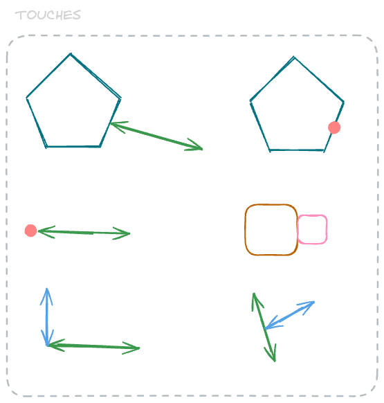

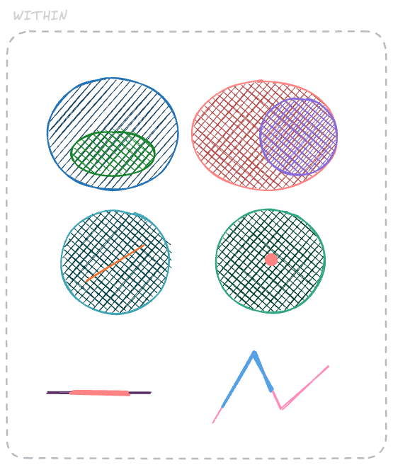

> [!note]
> If geometry **_a_** `CONTAINS` geometry **_b_**, then geometry **_b_** is `WITHIN` geometry **_a_**.

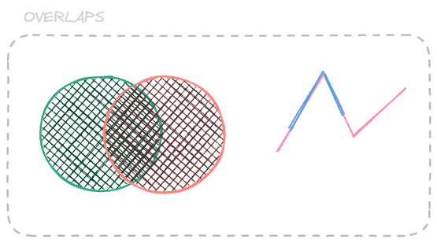

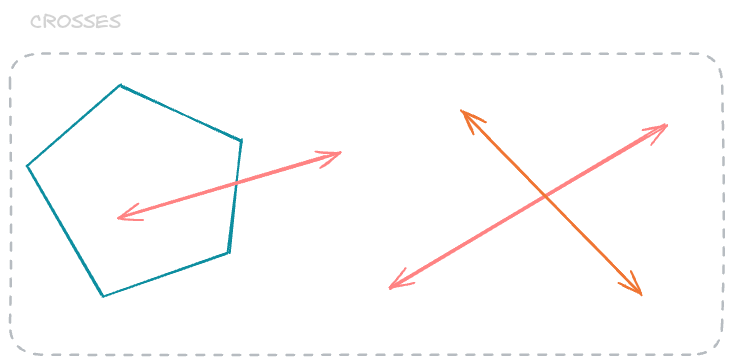

## Enhanced Temporal

CQL supports date and timestamps as time instants, but even the smallest "instant" has a duration and can also be evaluated as an interval. For the purposes of determining the temporal relationship between two temporal expressions, an instant is treated as the interval from the beginning to the end of the instant.

- `AFTER`: If a interval T₁ is `AFTER` another temporal entity T₂, then the beginning of T₁ is after the end of T₂.

	

- `BEFORE`: If a interval T₁ is `BEFORE` another temporal entity T₂, then the end of T₁ is before the beginning of T₂.


	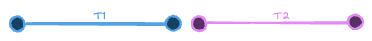

- `BEGINS`: If an interval T₁ `BEGINS` another interval T₂, then the beginning of T₁ is coincident with the beginning of T₂, and the end of T₁ is before the end of T₂.


	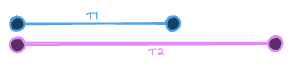

- `BEGUNBY`: If an interval T₁ is `BEGUNBY` another interval T₂, then the beginning of T₁ is coincident with the beginning of T₂, and the end of T₁ is after the end of T₂.


	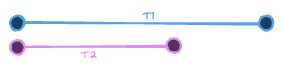

- `TCONTAINS`: If an interval T₁ `TCONTAINS` another interval T₂, then the beginning of T₁ is before the beginning of T₂, and the end of T₁ is after the end of T₂.


	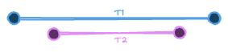

- `DURING`: If an interval T₁ is `DURING` another interval T₂, then the beginning of T₁ is after the beginning of T₂, and the end of T₁ is before the end of T₂.


	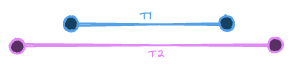

- `ENDS`: If an interval T₁ `ENDS` another interval T₂, then the beginning of T₁ is after the beginning of T₂, and the end of T₁ is coincident with the end of T₂.


	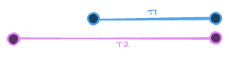

- `ENDEDBY`: If an interval T₁ is `ENDEDBY` another interval T₂, then the beginning of T₁ is before the beginning of T₂, and the end of T₁ is coincident with the end of T₂.


	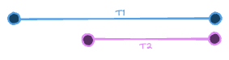

- `TEQUALS`: If an interval T₁ is `TEQUALS` another interval T₂, then the beginning of T₁ is coincident with the beginning of T₂, and the end of T₁ is coincident with the end of T₂.


	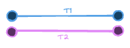

- `MEETS`: If an interval T₁ `MEETS` another interval T₂, then the end of T₁ is coincident with the beginning of T₂. 


	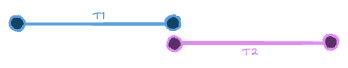

- `METBY`: If a interval T₁ is `METBY` another interval T₂, then the beginning of T₁ is coincident with the end of T₂.


	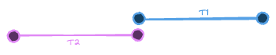

- `TOVERLAPS`: If an interval T₁ `TOVERLAPS` another interval T₂, then the beginning of T₁ is before the beginning of T₂, the end of T₁ is after the beginning of T₂, and the end of T₁ is before the end of T₂.


	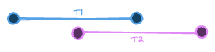

- `OVERLAPPEDBY`: If an interval T₁ is `OVERLAPPEDBY` another interval T₂, then the beginning of T₁ is after the beginning of T₂, the beginning of T₁ is before the end of T₂, and the end of T₁ is after the end of T₂.


	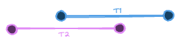

> [!note]
> Reference: https://www.w3.org/TR/owl-time/#properties

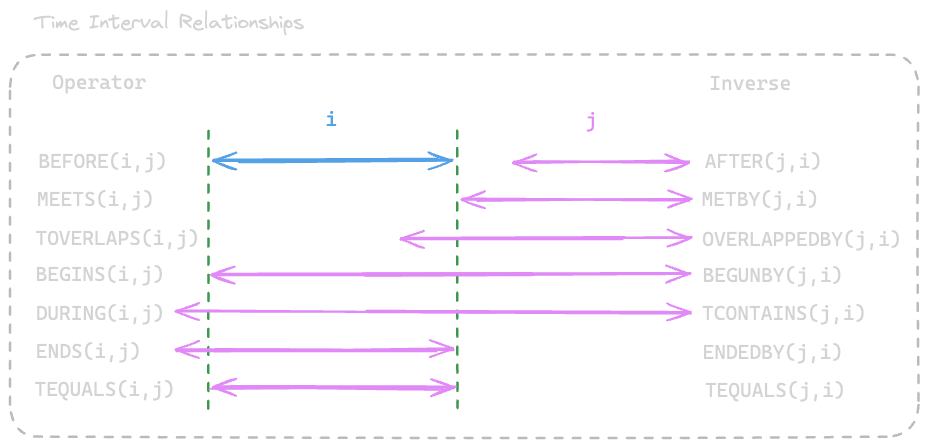

```
1969-07-20T20:17:40Z DURING 1969-07-16T13:32:00Z/1969-07-24T16:50:35Z

touchdown DURING 1969-07-16T13:32:00Z/1969-07-24T16:50:35Z
```

## Arithmetic Expressions

An arithmetic expression is an expression composed of an arithmetic operand (a property name, a number or a function that returns a number), an arithmetic operator (i.e. one of `+`,`-`,`*`,`/`) and another arithmetic operand.

```cql
vehicle_height > (bridge_height-1)
```

## Arrays

Both array expressions are evaluated as sets. No inherent order is implied in a array of values.

- `AEQUALS` evaluates to `TRUE`, if both sets are identical; otherwise the predicate evaluates to `FALSE`.
- `ACONTAINS` evaluates to `TRUE`, if the first set is a superset of the second set; otherwise the predicate evaluates to `FALSE`.
- `CONTAINED BY` evaluates to `TRUE`, if the first set is a subset of the second set; otherwise the predicate evaluates to `FALSE`.
- `AOVERLAPS` evaluates to `TRUE`, if both sets share at least one common element; otherwise the predicate evaluates to `FALSE`.

```cql
layer:ids ACONTAINS ["layers-ca","layers-us"]
```

