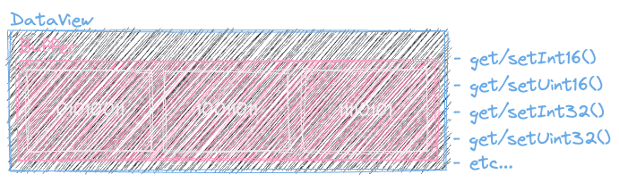
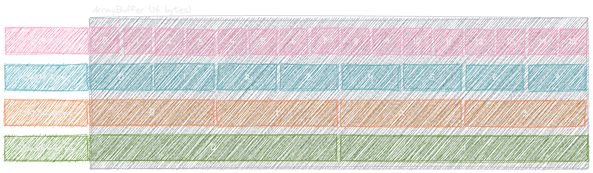

---
tags:
  - typed-array
gardening: 🌳
---
## ArrayBuffer

Fixed length array of bytes, called a "byte array" in other languages.
ArrayBuffers have no type assigned to them. They are simply chunks of memory (in bytes).
They also cannot be altered directly. A View or TypedArray needs to be created first.

```js
const buffer = new ArrayBuffer(3);
// -> [bin] 00000000 00000000 00000000 
// -> [hex] 00 00 00
```


## DataView

The DataView view provides a low-level interface for reading and writing number types in a binary ArrayBuffer.
It wraps the given ArrayBuffer in an object and provides a number of `get<Type>()` / `set<Type>()` methods. 
Each takes a byte offset and, in the case of `set`, a value. Each of the above `<Type>` methods reads and writes the 
appropriate number of bytes based on that type. I.e. `getInt32()` reads 4 bytes.

```js
const colorBuffer = new ArrayBuffer(3);
const colorView = new DataView(colorBuffer);

colorView.setUint8(0, 83);
colorView.getUint8(0);
// -> 83

colorView.setUint8(1, 155);
colorView.getUint8(1)
// -> 155

colorView.setUint8(2, 245);
colorView.getUint8(2);
// -> 245
```




## TypedArray

A TypedArray is kind of like a specialized DataView. It allows you to work with the buffer in a common, abstracted way.
When creating a subclass of TypedArray, a buffer is automatically created using the byte length supplied. 
Unless you supply it with a buffer, then it just uses that. 
A TypedArray, coupled with the underlying buffer, results in the array types that you have in other, strongly typed, languages.

_Note: TypedArray isn't usable directly. It's more of an abstract class. You need to use the specific type version of it. I.e. Uint8Array_

```rs
// Rust

let mut color: [u8; 3] = [0; 3];
```

```cpp
// C++

uint8_t color[3] {};
```

```js
// Javascript

const color = new Uint8Array(3);
```


TypedArray's have a lot of the array methods you would normally use such as `find`, `filter` and `map`. Which will return a new TypedArray with the results.

https://developer.mozilla.org/en-US/docs/Web/JavaScript/Reference/Global_Objects/TypedArray#instance_methods

Once a buffer is wrapped in a TypedArray, you no longer have to use the DataView `get<Type>()`/`set<Type>()` methods. And, instead, you can access and set values via normal array `[n]` syntax.

```js
const buffer = new ArrayBuffer(3);
const view = new Uint8Array(buffer);

view[0] = 83;
view[1] = 155;
view[2] = 245;

// -> Uint8Array(3) [8, 155, 245, buffer: ArrayBuffer(3), byteLength: 3, byteOffset: 0, length: 3]

const str = view.reduce((acc, curr) =>
  [ ...acc, curr.toString(2).padStart(8, '0')], []).join(' ');

console.log(str);

// -> 01010011 10011011 11110101
```


If the values are known before creation, you can use an array directly in the constructor
```js
const view = new Uint8Array([83, 155, 245]);

// -> Uint8Array(3) [8, 155, 245, buffer: ArrayBuffer(3), byteLength: 3, byteOffset: 0, length: 3]
```

## TypedArray vs DataView

One of the biggest differences between them is that DataViews have no type associated with them. So you can efficiently pack 
multiple data types together so long as you have the space for them. With TypedArrays, everything takes up the given "block"
of bytes regardless if it could fit into a smaller type.

```js
const data = [
  { color: [108, 105, 96], position: [25.61246, 60.56871] },
  { color: [0, 114, 51], position: [4.35324, -51.61505] },
  { color: [211, 110, 112], position: [37.68581, -73.97829] },
];

/* Interleaved buffer layout:
   | attribute  | size       |
   | ---------- | ---------- |
   | color.R    | 1 byte     |
   | color.G    | 1 byte     |
   | color.B    | 1 byte     |
   | position.x | 4 byte     |
   | position.y | 4 byte     |
   | ---------- | ---------- |
   | total      | 11 bytes   |
 */

const bytesPerDatum = 11;
const arrayBuffer = new ArrayBuffer(data.length * bytesPerDatum);
const view = new DataView(arrayBuffer);

for (let i = 0; i < data.length; i++) {
  const { color, position } = data[i];
  const offset = i * bytesPerDatum;

  view.setUint8(offset + 0, color[0]);
  view.setUint8(offset + 1, color[1]);
  view.setUint8(offset + 2, color[2]);
  view.setFloat32(offset + 4, position[0], true);
  view.setFloat32(offset + 8, position[1], true);
}
```

**VS.**

```js
const data = [
  { color: [108, 105, 96], position: [25.61246, 60.56871] },
  { color: [0, 114, 51], position: [4.35324, -51.61505] },
  { color: [211, 110, 112], position: [37.68581, -73.97829] },
];

/* Data columns:
   | attribute  | size       |
   | ---------- | ---------- |
   | color.R    | 4 byte     |
   | color.G    | 4 byte     |
   | color.B    | 4 byte     |
   | position.x | 4 byte     |
   | position.y | 4 byte     |
   | ---------- | ---------- |
   | total      | 20 bytes   |
 */
const columnsPerDatum = 5;
// Have to use the size of the largest data type
const dataArray = new Float32Array(data.length * columnsPerDatum);

for (let i = 0; i < data.length; i++) {
  const { color, position } = data[i];
  const offset = i * columnsPerDatum;

  dataArray[offset + 0] = color[0];
  dataArray[offset + 1] = color[1];
  dataArray[offset + 2] = color[2];
  dataArray[offset + 3] = position[0];
  dataArray[offset + 4] = position[1];
}
```

_There is also the difference in object methods but, that should go without saying_

## Data Types and Ranges

| Type   | Bytes  | Bits (Binary)                      | Exponent Range           | Human Range                  |
| ------ | ------ | ---------------------------------- | ------------------------ | ---------------------------- |
| Uint8  | 1 byte | `11111111`                         | $0 \to 2^8 - 1$          | $0 \to 255$                  |
| Int8   | 1 byte | `11111111`                         | $-2^7 \to 2^7 - 1$       | $-128 \to 127$               |
| Uint16 | 2 byte | `1111111111111111`                 | $0 \to 2^{16} - 1$       | $0 \to 65535$                |
| Int16  | 2 byte | `1111111111111111`                 | $-2^{15} \to 2^{15} - 1$ | $-32768 \to 32767$           |
| Uint32 | 4 byte | `11111111111111111111111111111111` | $0 \to 2^{32} - 1$       | $0 \to 4294967295$           |
| Int32  | 4 byte | `11111111111111111111111111111111` | $-2^{31} \to 2^{31} - 1$ | $-2147483648 \to 2147483647$ |

There is also Float32Array, Float64Array, BigUint64Array and BigInt64Array that match the pattern above.

_All JavaScript numbers are stored in a a 64-bit floating-point format.
number (the fraction) is stored in bits 0 to 51, the exponent in bits 52 to 62, and the sign in bit 63_



## Strings

It is also possible to pack characters by converting to the character value.
Javascript uses UTF-16 for string encoding. So an `Uint16` would suffice.
Though if you are only concerned with latin characers, `Uint8` will work.

_(https://stackoverflow.com/questions/11141136/what-is-the-default-javascript-character-encoding#11141331)_
_(https://www-archive.mozilla.org/js/language/e262-3.pdf)_


```js
'a'.charCodeAt(0);

// -> 97

'a'.charCodeAt(0).toString(2).padStart(16, '0');

// -> '0000000001100001


'🚀'.charCodeAt(0).toString(2);

// -> '1101100000111101'


'𤭢'.charCodeAt(0).toString(2);

// -> 1101100001010010


const text = new Uint8Array(Array.from('Hello world').map(char => char.charCodeAt(0)));

// -> Uint8Array(11) [72, 101, 108, 108, 111, 32, 119, 111, 114, 108, 100, buffer: ArrayBuffer(11) ...]
```

Though, thankfully, JS already has a standard way of doing this. We can use `TextEncoder` and `TextDecoder` to go back and forth.

```js
const text = new TextEncoder().encode('Hello world');

// -> Uint8Array(11) [72, 101, 108, 108, 111, 32, 119, 111, 114, 108, 100, buffer: ArrayBuffer(11) ...]

const str = new TextDecoder().decode(text);

// -> Hello world
```