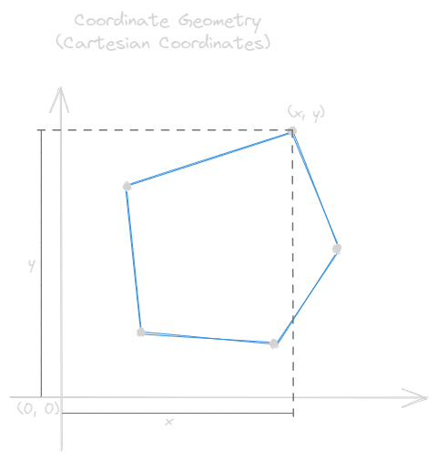
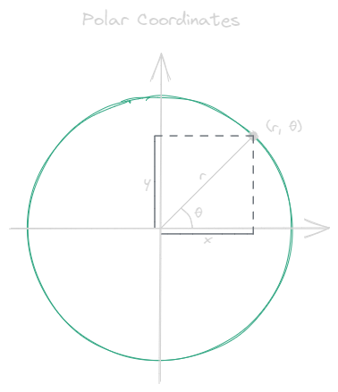
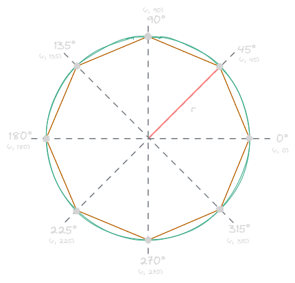
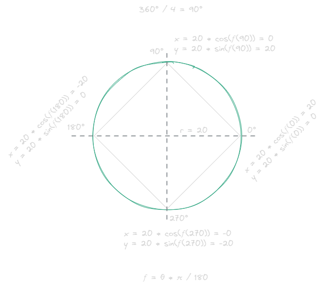

---
tags:
  - drawing
  - math
gardening: 🌱
category: geometry
---
## Cartesian Coordinates

Allows you to plot a point based on it's distance from the origin. Points are expressed as $(x, y)$.



## Polar Coordinates

Allows you to plot a point based on its distance and angle from a center point. Points are expressed as $(r, \theta)$.



It is usually easier to think about a shape in polar coordinates and then convert it to Cartesian when are visualizing it.

For regular polygons, all points can be located on a circle. And all slices are symmetrical, which means that the angles can be calculated using:

$\theta = 360\degree / n\smash-sides$

$360\degree / 8 = 45\degree$



So, if we know $r$ (how large we want it) and we can calculate $\theta$, then we can convert it back to cartesian.


## Conversion

When going between the two, the conversions to go between radians and degrees is also necessary.

$radians = n\degree \cdot \pi/180\degree$

```js
const radians = degree => degree * Math.PI / 180;
```

$degrees = n \cdot 180\degree/\pi$

```js
const degrees = radians => radians * 180 / Math.PI;
```

#### Cartesian to Polar

In order to convert to Polar from Cartesian, we need to find the radius $r$ and the angle $\theta$.

$r = \sqrt{(x^{2} + y^{2})}$

$\theta = \tan^{-1}(y/x)$

```js
const round = (number, decimals = 5) => 
  Math.round(number * Math.pow(10, decimals)) / Math.pow(10, decimals);

const degrees = radians => radians * 180 / Math.PI;
const radius = (x, y) => Math.sqrt(Math.pow(x, 2) + Math.pow(y, 2));

// To ensure that the angle theta is between 0 and 2π (0 to 360 degrees), 
// we add 2π to the angle if it's negative. This step makes sure the angle 
// is measured counterclockwise from the positive x-axis.
const theta = (x, y) => {
  const theta =  Math.atan2(y, x);
  return theta < 0 ? degrees(theta + 2 * Math.PI) : degrees(theta);
}

const cartesianToPolar = (x, y) => [
  radius(x, y),
  round(theta(x, y), 1),
];
```

#### Polar to Cartesian

$x = r \cdot \cos(\theta)$

$y = r \cdot \sin(\theta)$

```js
const round = (number, decimals = 5) => 
  Math.round(number * Math.pow(10, decimals)) / Math.pow(10, decimals);

const radians = degree => degree * Math.PI / 180;
const x = (radius, radian) => radius * Math.cos(radian);
const y = (radius, radian) => radius * Math.sin(radian);
const polarToCart = (radius, degree) => [
  round(x(radius, radians(degree)), 2), 
  round(y(radius, radians(degree)), 2)
];
```



For the above, we get: $[20, 0]$, $[0, 20]$, $[-20, 0]$, $[0, -20]$,

```js
polarToCart(20, 0); // [20, 0]
polarToCart(20, 90); // [0, 20]
polarToCart(20, 180); // [-20, 0]
polarToCart(20, 270); // [-0, -20]
```