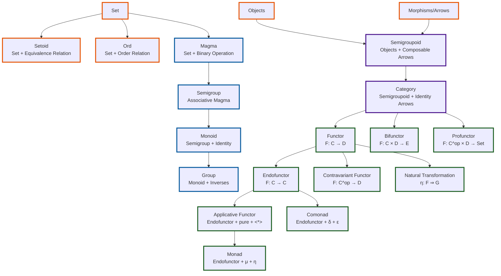

## Foundational Level (Orange)
- **Set**: The basic collection of elements
- **Setoid**: A set equipped with an equivalence relation (~)
- **Ord**: A set with a partial or total order relation (≤)
- **Objects** and **Morphisms**: The basic components of categories

## Algebraic Structures (Blue)
These form a chain of increasingly structured algebraic objects:
- **Magma**: Set with a binary operation (no requirements)
- **Semigroup**: Magma where the operation is associative: $(a \cdot b) \cdot c = a \cdot (b \cdot c)$
- **Monoid**: Semigroup with identity element $e$: $a \cdot e = e \cdot a = a$
- **Group**: Monoid where every element has an inverse: $a \cdot a^{-1} = e$

## Categorical Structures (Purple)
- **Semigroupoid**: Has objects and composable morphisms (but no identity morphisms)
- **Category**: Semigroupoid with identity morphism for each object

## Functorial Level (Green)
These represent mappings between categories:
- **Functor**: Maps objects to objects and morphisms to morphisms, preserving composition
- **Endofunctor**: $F: C \to C$ (maps a category to itself)
- **Contravariant Functor**: Reverses the direction of morphisms
- **Bifunctor**: $F: C \times D \to E$ (takes pairs of objects/morphisms)
- **Profunctor**: $F: C^\text{op} \times D \to Set$ (contravariant in first argument, covariant in second)
- **Natural Transformation**: A family of morphisms $\eta_X: F(X) \to G(X)$ satisfying naturality
- **Applicative Functor**: Endofunctor with $\text{pure}: a \to F a$  and $\langle * \rangle: F (a \to b) \to F a \to F b$ 
- **Monad**: Endofunctor with $\text{return}: a \to T a$ and $\text{join}: T (T a) \to T a$  (or equivalently `bind`)
- **Comonad**: Dual of monad with $\text{extract}: W a \to a$ and $\text{duplicate}: W a \to W (W a)$ 

## Key Relationships Not Shown
Some relationships are too complex for a simple hierarchy:
- Every monoid can be viewed as a single-object category
- Functors compose, forming a category of categories (Cat)
- Monads form a category with monad morphisms
- The Kleisli category and Eilenberg-Moore category are derived from monads

The diagram uses color coding to distinguish between different levels of abstraction in the theory.



## Basic Foundational Structures

### Set

**Definition**: A collection of distinct elements with no additional structure.

```typescript
type Set<T> = T[]  // simplified representation
```

**Laws**: None (it's the most basic structure)
**Notes**: In category theory, we often work in the category **Set** where objects are sets and morphisms are functions.

### Setoid

**Definition**: A set equipped with an equivalence relation ($\sim$).

```typescript
type Setoid<T> = {
  carrier: Set<T>
  equals: (x: T, y: T) => boolean  // equivalence relation
}
```

**Laws**:

- Reflexivity: $x \sim x$
- Symmetry: $x \sim y \Rightarrow y \sim x$ 
- Transitivity: $x \sim y \wedge y \sim z \Rightarrow x \sim z$

**Example**: Rational numbers where $\frac{p}{q} \sim \frac{r}{s} \text{ if } ps = qr$

### Ord

**Definition**: A set with a partial or total order relation ($\leq$).

```typescript
type Ord<T> = {
  carrier: Set<T>
  leq: (x: T, y: T) => boolean  // order relation
}
```

**Laws**:

- Reflexivity: $x \leq x$
- Antisymmetry: $x \leq y \wedge y \leq x \Rightarrow x = y$
- Transitivity: $x \leq y \wedge y \leq z \Rightarrow x \leq z$
- (Total order adds): $\forall x, y. x \leq y \vee y \leq x$

**Example**: Natural numbers with usual ordering

### Objects and Morphisms

**Definition**: The basic components of a category.

- **Objects**: Abstract entities (can be sets, types, spaces, etc.)
- **Morphisms**: Arrows between objects representing relationships

```typescript
type Morphism<A, B> = {
  source: A
  target: B
  // abstract arrow, could be function, relation, etc.
}
```

## Algebraic Structures

### Magma

**Definition**: A set with a binary operation.

```typescript
type Magma<T> = {
  carrier: Set<T>
  op: (x: T, y: T) => T
}
```

**Laws**: None (just closure under operation)
**Example**: Subtraction on integers (not associative)

### Semigroup

**Definition**: An associative magma.

```typescript
type Semigroup<T> = {
  carrier: Set<T>
  concat: (x: T, y: T) => T
}
```

**Laws**:

- Associativity: $(x \cdot y) \cdot z = x \cdot (y \cdot z)$

**Examples**:
- String concatenation: `"a" + ("b" + "c") = ("a" + "b") + "c"`
- Maximum/minimum operations
- First/Last for non-empty lists

### Monoid

**Definition**: A semigroup with an identity element.

```typescript
type Monoid<T> = {
  carrier: Set<T>
  concat: (x: T, y: T) => T
  empty: T  // identity element
}
```

**Laws**:

- Associativity: $(x \cdot y) \cdot z = x \cdot (y \cdot z)$
- Left identity: $\text{empty} \cdot x = x$
- Right identity: $x \cdot \text{empty} = x$

**Examples**:
- (`String`, `+`, `""`): string concatenation
- (`Number`, `*`, `1`): multiplication
- (`Boolean`, `&&`, `true`): logical AND
- (`List<T>`, `append`, `[]`): list concatenation

### Group

**Definition**: A monoid where every element has an inverse.

```typescript
type Group<T> = {
  carrier: Set<T>
  concat: (x: T, y: T) => T
  empty: T
  inverse: (x: T) => T
}
```

**Laws**:

- (monoid) Associativity: $(x \cdot y) \cdot z = x \cdot (y \cdot z)$
- (monoid) Left identity: $\text{empty} \cdot x = x$
- (monoid) Right identity: $x \cdot \text{empty} = x$
- Inverse: $x \cdot x^{-1} = \text{empty} = x^{-1} \cdot x$

**Examples**:
- (`Integer`, `+`, `0`, `-`): addition with negation
- (Non-zero rationals, `*`, `1`, `1/x`): multiplication with reciprocal
- Permutation groups

## Categorical Structures

### Semigroupoid

**Definition**: Has objects and composable morphisms, but no identity morphisms.

```typescript
type Semigroupoid = {
  objects: Set<Object>
  morphisms: Set<Morphism>
  compose: <A,B,C>(f: Morphism<B,C>, g: Morphism<A,B>) => Morphism<A,C>
}
```

**Laws**:

- Associativity: $(f \circ g) \circ h = f \circ (g \circ h)$
- Domain/codomain matching: Can only compose $f: B \to C$ with $g: A \to B$

**Example**: Partial functions with restricted domains

### Category

**Definition**: A semigroupoid with identity morphism for each object.

```typescript
type Category = {
  objects: Set<Object>
  morphisms: Set<Morphism>
  compose: <A,B,C>(f: Morphism<B,C>, g: Morphism<A,B>) => Morphism<A,C>
  id: <A>(a: A) => Morphism<A,A>
}
```

**Laws**:

- Associativity: $(f \circ g) \circ h = f \circ (g \circ h)$
- Left identity: $id_B \circ f = f$ for $f: A \to B$
- Right identity: $f \circ id_A = f$ for $f: A \to B$

**Examples**:
- **Set**: sets and functions
- **Rel**: sets and relations
- **Vect**: vector spaces and linear maps
- Every monoid as a one-object category

## Functorial Structures

### Functor

**Definition**: A mapping between categories preserving structure.

```typescript
type Functor<C, D> = {
  mapObject: (x: C.Object) => D.Object
  mapMorphism: <A,B>(f: C.Morphism<A,B>) => D.Morphism<F(A),F(B)>
}
```

**Laws**:

- Identity: $F(id_A) = id_{F(A)}$
- Composition: $F(f \circ g) = F(f) \circ F(g)$

**Examples**:
- List functor: `List: Set → Set`
- Forgetful functors (forget structure)
- Free functors (add structure)

### Endofunctor

**Definition**: A functor from a category to itself.

```typescript
type Endofunctor<C> = Functor<C, C>
```

**Examples**:

- `Maybe<T> = T | null`
- `List<T>`
- `Tree<T>`
- `State<S,T> = S => (T, S)`

### Contravariant Functor

**Definition**: Reverses the direction of morphisms.

```typescript
type ContraFunctor<C, D> = {
  mapObject: (x: C.Object) => D.Object
  contramap: <A,B>(f: C.Morphism<A,B>) => D.Morphism<F(B),F(A)>
}
```

**Laws**:

- Identity: $F(id) = id$
- Composition: $F(f \circ g) = F(g) \circ F(f)$ (reversed!)

**Example**:

```typescript
type Predicate<T> = (t: T) => boolean
// contramap: (f: A => B) => (Predicate<B> => Predicate<A>)
```

### Bifunctor

**Definition**: A functor of two arguments, covariant in both.

```typescript
type Bifunctor<C, D, E> = {
  bimap: <A,B,C,D>(
    f: C.Morphism<A,C>, 
    g: D.Morphism<B,D>
  ) => E.Morphism<F(A,B), F(C,D)>
}
```

**Laws**:

- $\text{bimap}(id, id) = id$
- $\text{bimap}(f \circ g, h \circ i) = \text{bimap}(f, h) \circ \text{bimap}(g, i)$

**Examples**:
- `Either<A,B>`
- `Tuple<A,B>`
- `Function<A,B>` (contravariant in A, covariant in B)

### Profunctor

**Definition**: A bifunctor contravariant in first argument, covariant in second.

```typescript
type Profunctor<C, D> = Bifunctor<C^op, D, Set>
// Equivalent to:
type Profunctor<A, B> = {
  dimap: <C,D>(f: C => A, g: B => D) => P<A,B> => P<C,D>
}
```

**Laws**:

- $\text{dimap}(id, id) = id$
- `dimap(f ∘ g, h ∘ i) = dimap(g, h) ∘ dimap(f, i)` 
- $\text{dimap}(f \circ g, h \circ i) = \text{dimap}(g, h) \circ \text{dimap}(f, i)$

**Example**: Function types `A => B`

### Natural Transformation

**Definition**: A family of morphisms between functors.

```typescript
type NatTrans<F, G> = {
  component: <A>(a: A) => Morphism<F(A), G(A)>
}
```

**Laws**:

- Naturality: For $f: A \to B$, we have $G(f) \circ n_A = n_B \circ F(f)$

```tikz
\usepackage{tikz-cd}

\begin{document}
\begin{tikzcd}
F(A) \arrow[d, "\eta_A"] \arrow[r, "F(f)"] & F(B) \arrow[d, "\eta_B"] \\
G(A) \arrow[r, "G(f)"]                     & G(B)                    
\end{tikzcd}
\end{document}
```

**Examples**:

- `singleton: A => List<A>`
- `head: List<A> => Maybe<A>`

### Applicative Functor

**Definition**: An endofunctor with additional structure for lifting values and functions.

```typescript
type Applicative<F> = {
  pure: <A>(a: A) => F<A>
  apply: <A,B>(fab: F<(a: A) => B>) => (fa: F<A>) => F<B>
}
```

**Laws**:

- Identity: $\text{apply}(\text{pure}(id)) = id$
- Composition: $\text{apply}(\text{apply}(\text{apply}(\text{pure}(\text{compose}))(f))(g)) = \text{compose}(\text{apply}(f))(\text{apply}(g))$
- Homomorphism: $\text{apply}(\text{pure}(f))(\text{pure}(x)) = \text{pure}(f(x))$
- Interchange: $\text{apply}(f)(\text{pure}(x)) = \text{apply}(\text{pure}(\$ \Rightarrow \$(x)))(f)$

**Examples**: List (zip application), Maybe, Either, Parser

### Monad

**Definition**: An endofunctor with join (or bind) and return.

```typescript
type Monad<T> = {
  return: <A>(a: A) => T<A>
  bind: <A,B>(ta: T<A>) => (f: A => T<B>) => T<B>
  // Alternatively:
  join: <A>(tta: T<T<A>>) => T<A>
}
```

**Laws**:

- Left identity: $\text{bind}(\text{return}(a))(f) = f(a)$
- Right identity: $\text{bind}(m)(\text{return}) = m$
- Associativity: $\text{bind}(\text{bind}(m)(f))(g) = \text{bind}(m)(x \Rightarrow \text{bind}(f(x))(g))$

**Examples**:
- Maybe (null handling)
- List (non-determinism)
- IO (effects)
- State (stateful computation)
- Reader (dependency injection)

### Comonad

**Definition**: The dual of a monad.

```typescript
type Comonad<W> = {
  extract: <A>(wa: W<A>) => A
  duplicate: <A>(wa: W<A>) => W<W<A>>
  // or extend: <A,B>(wa: W<A>) => (f: W<A> => B) => W<B>
}
```

**Laws**:

- $\text{extract} \circ \text{duplicate} = id$
- $\text{fmap } \text{extract} \circ \text{duplicate} = id$
- $\text{duplicate} \circ \text{duplicate} = \text{fmap } \text{duplicate} \circ \text{duplicate}$

**Examples**:
- Non-empty list with focus
- Zipper (list with cursor)
- Store comonad (for lenses)
- Stream comonad