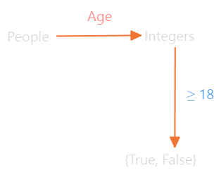
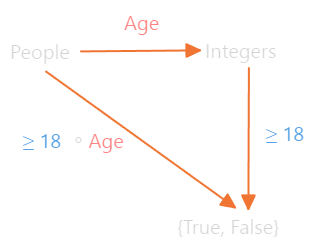

---
tags:
  - math
  - category-theory
date: 2025-11-08
gardening: 🌳
reference:
  - https://www.youtube.com/watch?v=DrldYpmwN5s
---
## Introduction

Mathematics is fundamentally the **art of abstraction** — stripping away irrelevant details to reveal the *shared structure* underlying different objects or concepts.
Henri Poincaré’s quote anchors this idea:

> “Mathematics is the art of giving the same name to different things.”

## Abstraction Illustrated: From People to Structure

* Alice and Bob are distinct, yet we can both call them “people”.
* This is possible because we ignore irrelevant personal details and focus on their *shared internal structure* — what makes something a *person*.
* This process — **removing unnecessary details to find what’s essential** — is **abstraction**.

## Abstraction in Arithmetic: Rational Numbers

To demonstrate abstraction mathematically:
* Many numbers can be expressed as ratios of integers — the **rational numbers**.
- But some can’t (irrationals).
- The video focuses on rationals and asks:  
    _Why is the sum of two rational numbers also rational?_

To prove that the **sum of two rational numbers is also rational**, we:

1. Represent rationals abstractly as $\frac{a}{b}$, where $a, b \in \mathbb{Z}$. We aren't specifying which integers they are, since these are details that are completely irrelevant to us.
2. Add two rationals: $$\frac{a}{b} + \frac{c}{d} = \frac{ad + cb}{bd}$$
3. Use abstraction again:
   * Replace $ad + cb$ with a new integer $p$,
   * Replace $bd$ with a new integer $q$,
     yielding $\frac{p}{q}$, another rational.

Hence, **closure under addition** is proven *abstractly*.

This demonstrates that **elementary algebra** is itself abstraction applied to numbers.

## Abstraction Across Mathematics

Mathematical fields can be viewed as abstraction layers:

* **Group Theory** → abstraction of *symmetry*.
* **Ring Theory** → abstraction of *arithmetic*.
* **Graph Theory** → abstraction of *relationships*.

These all arise by identifying a shared structure and ignoring implementation details.

## Category Theory — Abstraction of Composition

### Composition in Set Theory

* **Sets** are collections of objects.
  Examples: `People` contains every person, `Integers` contains every whole number.

* **Functions** are how we relate sets. They map each element of one set to another set:

  * The function $\text{Age}$ could assign each person in the set $\text{People}$ to a number: $\text{Age}: \text{Person} \rightarrow \text{Integer}$
  * Another function $\ge 18$ could assign each integer to either true or false depending on if it is greater than or equal to 18: $\ge 18: \text{Integer} \rightarrow \{\text{True}, \text{False}\}$

If we wanted to see if someone was able to vote, we could run the functions in series:

But there is a faster way. Whenever we have two functions where the end of one is the same set as the start of the other, we can create a new function that chains them together. This is the _composition_ of $\text{Age}$ and $\ge 18$.

$$(≥18) \circ \text{Age} : \text{Person} \to \{\text{True}, \text{False}\}$$

### The Identity Function

* `id: Person → Person` maps every element to itself.
* Composing any function with `id` yields the same function. $$id \circ f = f \quad \text{and} \quad f \circ id = f$$
* Identity acts as the *neutral element* of composition.

## Abstracting Composition Itself → Category Theory

We now abstract away all specifics of sets and functions:

| Concrete Concept         | Abstract Name             |
| ------------------------ | ------------------------- |
| Set                      | **Object**                |
| Function                 | **Arrow (Morphisms)**     |
| Composition of functions | **Composition of arrows** |
| Identity function        | **Identity arrow**        |

A **Category** consists of:

1. **Objects** ($A$, $B$, $C$, $…$)
2. **Arrows** between them ($f$, $g$, $…$)
3. **Composition rule** (if $f: A \to B$ and $g: B \to C$, then $g \circ f: A \to C$)
4. **Associativity**: $h \circ (g \circ f) = (h \circ g) \circ f$
5. **Identity law**:
   Each object has an identity arrow $id_A$, such that $f \circ id_A = f = id_B \circ f$

## Examples of Categories

1. **Linear Algebra**:
   * Objects: Vector spaces
   * Arrows: Matrices
   * Composition: Matrix multiplication
   * Identity: Identity matrix

2. **Functional Programming**:
   * Objects: Data types
   * Arrows: Functions
   * Composition: Function composition
   * Identity: Identity function

   Example:
   `isInteger ∘ sqrt` — returns whether the square root of an input is an integer.

3. **Order Theory (≤ relation)**:
   * Objects: Integers
   * Arrow from `a` to `b` if $a \le b$
   * Composition: Transitivity of $\le$
   * Identity: Reflexivity $( a \le a )$

## Universal Proofs: Example with Identity Arrows

Category theory allows one proof to apply universally across fields.

**Proof:** Each object in a category has exactly one identity arrow.

1. Suppose an object has two identities, $id$ and $\bar{id}$.
2. By the identity law: $$f \circ id = f \quad \text{and} \quad id \circ f = f$$
3. Substitute $f = \bar{id}$ and rearrange: $$id = \bar{id}$$
   Thus, identities must be unique.

This single proof simultaneously shows:

* Only one identity matrix per dimension.
* Only one identity function per data type.
* Only one identity mapping per set.

## Why Category Theory Matters

Category theory **unifies** mathematics by identifying and reasoning about shared structures like composition, identity, and relationships — independent of their domain (algebra, topology, programming, etc.).

It allows proofs and insights to transfer across disciplines with minimal redefinition.
