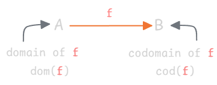
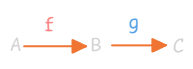
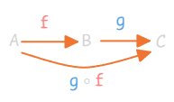
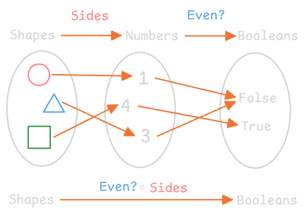
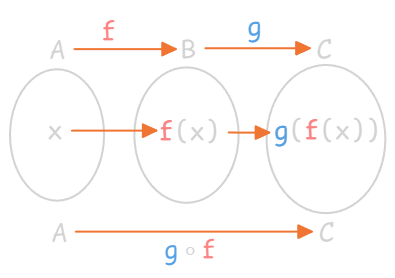

---
tags:
  - math
  - category-theory
date: 2025-11-08
gardening: 🌳
reference:
  - https://www.youtube.com/watch?v=5Ykrfqrxc8o
---
## Formal Definition of a Category

A **category** $\mathcal{C}$ consists of:

* A **collection of objects**
  (denoted typically $A, B, C, \dots$)

* A **collection of arrows (morphisms)**
  (denoted $f, g, h, \dots$)

Each arrow $f$ has:

* A **domain**: $\text{dom}(f)$
* A **codomain**: $\text{cod}(f)$



We denote arrows as: $$f : A \to B$$
where $A = \text{dom}(f)$ and $B = \text{cod}(f)$.

### Composition

If two arrows are *composable* (i.e. codomain of $f$ equals domain of $g$):

$$
f : A \to B, \quad g : B \to C
$$



then there must exist a **composite arrow**

$$
g \circ f : A \to C
$$



Composition is **not defined** when domains/codomains don’t align.

### Associativity

Composition must be **associative**.

For all arrows:

$$
f : A \to B, \quad g : B \to C, \quad h : C \to D
$$

then

$$
h \circ (g \circ f) = (h \circ g) \circ f
$$

### Identity

For every object $A$, there exists an **identity arrow**

$$
\text{id}_A : A \to A
$$

which acts as a **unit for composition** or more generally, a "do nothing" operation:

$$
f \circ \text{id}_A = f = \text{id}_B \circ f
$$

for any arrow $f : A \to B$.

> [!NOTE]
> The *order of composition* matters — only one of these compositions is valid depending on domain/codomain alignment. 

## "Collections" vs "Sets"

Not all collections of objects/arrows can be formalized as **sets** due to **Russell’s paradox** — constructing "the set of all sets that do not contain themselves" leads to contradiction.

$$
S = \{x \,\vert\, x \notin x\}
$$

Hence, mathematicians distinguish:

* **Sets** (ordinary, small collections)
* **Classes** (larger, well-defined collections avoiding paradoxes)

So, a category technically consists of **classes** of objects and morphisms.

## Example 1 — The Category $\text{Set}$

| Component       | Definition                                       |
| --------------- | ------------------------------------------------ |
| **Objects**     | All sets (e.g., ℕ, shapes, etc.)                 |
| **Arrows**      | All functions between sets                       |
| **Composition** | Function composition: $(g \circ f)(x) = g(f(x))$ |
| **Identity**    | $\text{id}_A(x) = x$                             |






**Verification:**

* **Associativity:** Function composition is inherently associative.
* **Identity laws:** For any $f: A \to B$,

$$
f \circ \text{id}_A = f, \quad \text{id}_B \circ f = f
$$

proven by direct substitution:

$$(f \circ \text{id}_A)(x) = f(\text{id}_A(x)) = f(x)$$

$$(\text{id}_B \circ f)(x) = \text{id}_B(f(x)) = f(x)$$

Thus, $\text{Set}$ satisfies all categorical axioms.

## Example 2 — The Category of $\text{Proofs / Logic}$

| Component       | Definition                                                        |
| --------------- | ----------------------------------------------------------------- |
| **Objects**     | Logical propositions (true/false statements)                      |
| **Arrows**      | Proofs or deductions showing one proposition follows from another |
| **Composition** | Chaining deductions together (logical inference)                  |
| **Identity**    | Trivial proof: “Given P, therefore P”                             |

You can combine "It is sunny" and "Bob is wearing a hat".  $\text{if}$ "it is sunny" $\text{then}$ "Bob is wearing a hat". This is denoted using **implication**.

$$
\text{It is sunny} \Rightarrow \text{Bob is wearing a hat}
$$

In general, for any two propositions $P$ and $Q$ we write "if $P$ is $\text{True}$ then $Q$ is also $\text{True}$" as "$P$ implies $Q$" or just $P \Rightarrow Q$.

**Explanation:**

* Composition corresponds to combining proofs via **rules of inference**.
  Example: Suppose $A \land B \land C$ is $\text{True}$. We can infer $A \land B$ is also $\text{True}$. Then we can infer $A$ is $\text{True}$; composing gives a deduction $A \land B \land C \Rightarrow A$.
* **Identity proof:** Every proposition $P$ trivially entails itself $(P \Rightarrow P)$.

This forms a valid category, often denoted as $\text{Prop}$ or $\text{Proof}$, closely tied to *intuitionistic logic* and *type theory*.

## Example 3 — Category from **Functional Programming**

| Component       | Definition                                              |
| --------------- | ------------------------------------------------------- |
| **Objects**     | Data types (e.g., `Boolean`, `Integer`, `String`, etc.) |
| **Arrows**      | Functions between types                                 |
| **Composition** | Function composition: `g ∘ f = x => g(f(x))`            |
| **Identity**    | `x => x` for any type                                   |

Parallel to $\text{Set}$, but interpreted in programming semantics:

* Data types correspond to objects.
* Pure (side-effect-free) functions correspond to morphisms.
* Function composition models category composition.

### Example (TypeScript-like):

```ts
type Bool = boolean;
type Int = number;

const isEven: (x: Int) => Bool = x => x % 2 === 0;
const toString: (b: Bool) => string = b => b ? 'true' : 'false';

const composed = (x: Int) => toString(isEven(x)) // g ∘ f
```

## Conceptual Unification

**Categories** emerge in multiple domains:

| Discipline  | Objects      | Arrows    |
| ----------- | ------------ | --------- |
| Mathematics | Sets         | Functions |
| Logic       | Propositions | Proofs    |
| Programming | Data types   | Functions |

These examples are **structurally analogous**, showcasing category theory’s role as a **unifying language** connecting different fields.
