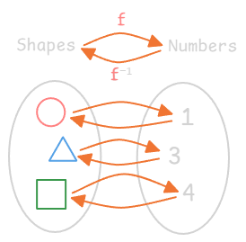
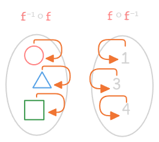
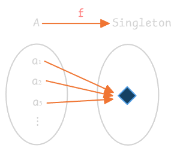
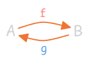
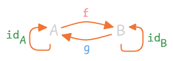
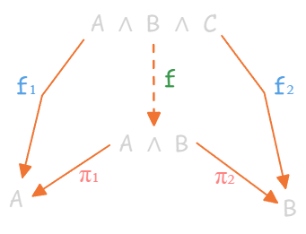
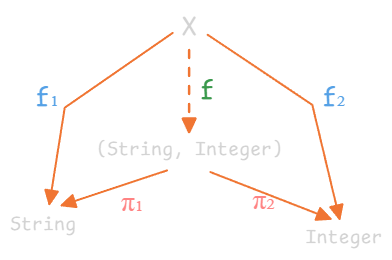

---
tags:
  - math
  - category-theory
date: 2025-11-11
gardening: 🌳
reference:
  - https://www.youtube.com/watch?v=HJ9-yvZ-Toc
---
## Reasoning Without “Looking Inside” Objects

* A group of people (Alice, Bob, Charlie, Eve) with friendship arrows.
* Even without knowing “what’s inside” Alice, we can tell she’s the most popular by **how others relate to her** — everyone has an arrow pointing to her.

This introduces a **core idea in category theory**:

> We study objects **by their relationships (morphisms)** rather than internal structure.

Because category theory abstracts over many fields (sets, types, propositions, etc.), we can’t inspect what’s “inside” objects — **we can only reason in terms of arrows.**

## Example: Isomorphisms in $\text{Set}$

In the category $\text{Set}$:

* **Objects:** sets
* **Arrows:** functions

Two sets $A$ and $B$ are said to have the same structure (same number of elements) if there exist functions:

$f: A \to B \quad \text{and} \quad f^{-1}: B \to A$

($f^{-1}$ is read as "the inverse of $f$")

That is, if there is one function from a unique shape to a unique number, we can define another function in the opposite direction. From each number to each shape.

If we start at any shape and find it's corresponding number and then find which shape it corresponds to, $f^{-1} \circ f$, we'll arrive at the same shape we started at. So $f^{-1} \circ f = id$. And this works the other way around for the $id$ of the set of numbers.

$f^{-1} \circ f = \mathrm{id}_A \quad \text{and} \quad f \circ f^{-1} = \mathrm{id}_B$

This defines **isomorphism**: $A \cong B$.

$A \cong B$ if there exists arrows $f : A \rightarrow B$ and $f^{-1} : B \rightarrow A$ such that $f^{-1} \circ f = id_A$ and $f \circ f^{-1} = id_B$

An **isomorphism** expresses “sameness” of structure *purely in terms of morphisms*, not internal data.
Thus, **isomorphic objects are indistinguishable categorically**.

## Example: Terminal Objects via Functions

A **singleton set** (a set with one element, $\{1\}$). This object is just like any other object in $Set$. $\{1\} \, \{1,2\} \rightarrow A \, B$. But this can be characterized *categorically*:

* For any set $A$, there exists exactly **one function** $f: A \to 1$.

* This uniqueness defines a **terminal object** in $\text{Set}$.

For any object $A$ there exists a _unique_ arrow $f \,:\, A \rightarrow 1$.

### Properties

* In $\text{Set}$, all singleton sets are terminal and **isomorphic** to each other.
* In any category, **all terminal objects are isomorphic** (proof by uniqueness of arrows).

### Proof

Take any two terminal objects, $A$ and $B$ in an arbitrary category. There must be a unique arrow $f$ from $A$ to $B$, since $B$ is terminal. And there must be a unique arrow $g$ from $B$ to $A$ since $A$ is terminal. 

There must also be a unique arrow from $A$ to itself and from $B$ to itself. As there must be a unique incoming arrow from every object in the category to each terminal object, including itself. And since every category must have an $id$ arrow, these looped arrows must be the $id$ arrows.

This shows $g \circ f = id_A$ and $f \circ g = id_B$. This is the requirement for these two arrows to be isomorphisms. So any two terminal objects in any category are isomorphic $A \cong B$.

## Examples of Terminal Objects in Other Categories

| Category                           | Objects      | Arrows    | Terminal Object     | Reason                                              |
| ---------------------------------- | ------------ | --------- | ------------------- | --------------------------------------------------- |
| **Set**                            | Sets         | Functions | Any singleton set   | Exactly one function from any set to it             |
| **Proofs / Logic**                 | Propositions | Proofs    | **True** $\top$     | There’s exactly one proof from any proposition to ⊤ |
| **Functional Programming (Types)** | Types        | Functions | Singleton type `()` | Only one term `()` of that type                     |

Terminal objects are denoted $1$ because of their role as a categorical "unit".

## Universal Constructions

The **method of universal construction**, which defines mathematical structures by *how they uniquely relate to others*.

### Process

1. **Define a construction** (e.g., an object with certain arrows).
2. **Find a universal property** — a unique mapping that every other candidate must factor through.
3. The resulting object is **unique up to isomorphism**.

Such definitions are **portable** across categories (e.g., same definition of singleton applies to sets, types, propositions, etc.).

## Universal Construction of **Conjunction (Product)**

### In Logic (Proof Category)

* **Objects:** Propositions
* **Arrows:** Proofs
* **Goal:** Define the conjunction $A \land B$.

#### Step 1: The Construction

We want an object $A \land B$ with arrows:

$\pi_1: A \land B \to A, \quad \pi_2: A \land B \to B$

representing that from a proof of $A \land B$, we can extract proofs of both $A$ and $B$.

#### Step 2: The Universal Property

For any other proposition $C$ with proofs:

$f_1: C \to A, \quad f_2: C \to B$

there must exist a **unique** arrow $f: C \to A \land B$ such that:

$\pi_1 \circ f = f_1 \quad \text{and} \quad \pi_2 \circ f = f_2$

This makes the following diagram **commute**:

When all paths from top to bottom yield the same result, we say the diagram **commutes**. And the diagram is called a **commutative diagram**.

#### Step 3: Generalization

Instead of calling this object "the conjunction of two objects" it is called the **product** of two objects, and write it as $A \times B$ in any category.

## The Product in Functional Programming

In the **category of types and functions**, the **product type** is defined via the same universal property.

Let:
* $A = \text{String}$
* $B = \text{Integer}$

We know that:

$\pi_1 \,:\, \text{String} \,\times\, \text{Integer} \rightarrow \text{String}$

and

$\pi_2 \,:\, \text{String} \,\times\, \text{Integer} \rightarrow \text{Integer}$

the most natural guess of a term is the pair $(\text{String},\text{Integer})$. Since the projection $\pi_1$ takes a pair and returns a $\text{String}$, it would be the function that returns the first element of the pair. And since the projection $\pi_2$ takes a pair and returns an $\text{Integer}$, it would be the function that returns the second element of the pair.

So the pair type $(\text{String},\text{Integer})$ is a valid candidate for the product.

#### Proof

For any type $X$ with:

$f_1: X \to \text{String}, \quad f_2: X \to \text{Integer}$

there exists a **unique function**:

$f(x) = (f_1(x), f_2(x))$

satisfying:

$\pi_1 \circ f = f_1, \quad \pi_2 \circ f = f_2$

Thus, $(\text{String},\text{Integer})$ is the **categorical product** of $\text{String}$ and $\text{Integer}$.

By symmetry, $(B, A)$ is **isomorphic** to $(A, B)$ via the swap function.

