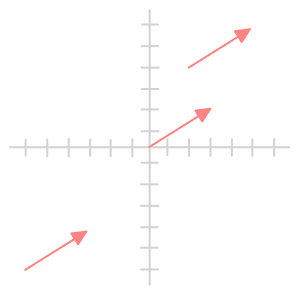
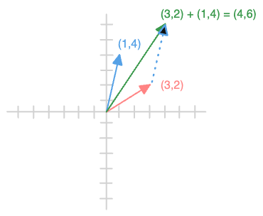
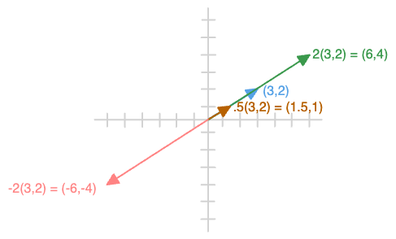
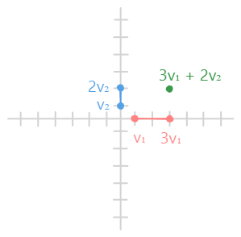
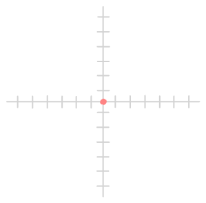
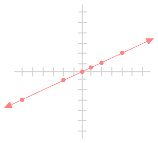
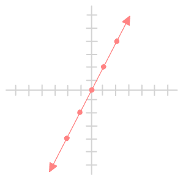

---
tags:
  - math
date: 2025-10-27
gardening: 🌱
reference:
---
## Part 1: Vectors & Vector Spaces

### Lesson 1.1: Scalars, Vectors and Geometric Interpretation

#### Scalar

A scalar is just a quantity that has magnitude but no direction.

Examples:

Temperature: $25^{\circ}C$
Mass: $5kg$
A number like $7$ or $-3.2$

You can think of a scalar as a single “unit” of information — something you can stretch, shrink, or flip in sign.

#### Vector

A **vector** is fundamentally an object that has both *magnitude* (length) and *direction*. We can think of it in multiple equivalent ways:

**Three perspectives on vectors:**

1. **Geometric:** An arrow in space pointing from one location to another
2. **Algebraic:** An ordered list of numbers called **components*
3. **Abstract:** An element of a vector space 

Additionally, the Computer Science perspective.
- An ordered list, tuple

#### Notation and Representation

In $\mathbb{R}^n$ (n-dimensional real space), we write vectors as:

$$\vec{v} = \begin{bmatrix} v_1 \\ v_2 \\ \vdots \\ v_n \end{bmatrix}$$

**Example in $\mathbb{R}^2$ (2D):**
$$\vec{v} = \begin{bmatrix} 3 \\ 4 \end{bmatrix}$$

This means: starting from the origin $(0,0)$, move 3 units right and 4 units up. Its **magnitude** is $\| \vec{v} \| = \sqrt{3^2 + 4^2} = 5$

**Example in $\mathbb{R}^3$ (3D):**
$$\vec{w} = \begin{bmatrix} 1 \\ -2 \\ 4 \end{bmatrix}$$

This means: from origin, move 1 unit along x-axis, -2 units along y-axis, 4 units along z-axis.

#### Real-World Connections

- **ML/Data Science:** A data point with features `[age, income, credit_score]`
- **Graphics:** Position of a vertex, or direction of light/surface normal
- **Physics:** Velocity, force, displacement
- **Programming:** RGB color values `[255, 128, 0]`

#### Questions

**Q1:** If I have a vector $\mathbf{p} = \begin{bmatrix} 5 \\ 5 \end{bmatrix}$ representing a position, and I draw it starting from the origin, what direction does it point? 

**A:** 45° northeast. The components are equal, so it bisects the angle.

**Q2:** Are these two vectors the same?
- Vector A: Arrow from point (1,1) to point (4,3)
- Vector B: Arrow from point (0,0) to point (3,2)

**A:** Vectors represent *displacement* (direction + magnitude), not absolute position. Both arrows have the same "movement" of 3 right, 2 up. We say vectors are **translation-invariant** - they can "slide" anywhere while remaining the same vector.



**Q3:** In machine learning, if you have a data point representing a house as $\begin{bmatrix} 2000 \\ 3 \\ 2 \end{bmatrix}$ (square feet, bedrooms, bathrooms), what does each component represent and why is the vector representation useful?

**A:** Vector representation enables **computation**. Once data is in vector form:
- We can measure *distance* between houses (similarity)
- We can perform *operations* (averaging prices across regions)
- We can apply *transformations* (normalize features for ML)
- We can use *geometric intuition* (houses cluster in feature space)
The vector form makes the data **computable** rather than just descriptive.

#### Exercise

Consider a game where a character is at position $(10, 5)$ and needs to move to position $(13, 9)$.

**Tasks:**
1. Write the displacement vector $\mathbf{d}$ that represents this movement

- $\begin{bmatrix} 13 \\ 9 \end{bmatrix} - \begin{bmatrix} 10 \\ 5 \end{bmatrix} = \begin{bmatrix} 3 \\ 4 \end{bmatrix} = \mathbf{d}$

2. If the character starts at (0, 0) instead, what position would this same displacement vector $\mathbf{d}$ take them to?

- $(3, 4)$

3. What does this tell you about the difference between *position* and *displacement*?

- **Displacement** is *always* a vector (direction + magnitude of movement)
- **Position** is a *point* in space
- **Position vector** is the displacement from origin to that point

```
Position = "where you are" (a point)
Displacement = "how you moved" (a vector)
Position vector = displacement from origin to a point
```

## Lesson 1.2: Vector Operations and Properties

We can perform two fundamental operations on vectors:

#### 1. Vector Addition

Adding vectors means placing them **tip-to-tail**. Algebraically, you just add the corresponding components.

Given $\mathbf{u} = \begin{bmatrix} u_1 \\ u_2 \\ \vdots \\ u_n \end{bmatrix}$ and $\mathbf{v} = \begin{bmatrix} v_1 \\ v_2 \\ \vdots \\ v_n \end{bmatrix}$

$$\mathbf{u} + \mathbf{v} = \begin{bmatrix} u_1 + v_1 \\ u_2 + v_2 \\ \vdots \\ u_n + v_n \end{bmatrix}$$

**Example:**
$$\begin{bmatrix} 3 \\ 2 \end{bmatrix} + \begin{bmatrix} 1 \\ 4 \end{bmatrix} = \begin{bmatrix} 4 \\ 6 \end{bmatrix}$$

**Geometric interpretation:** Place the tail of $\mathbf{v}$ at the head of $\mathbf{u}$. The sum is the vector from the tail of $\mathbf{u}$ to the head of $\mathbf{v}$ (tip-to-tail method).



A vector tells you _how to move._ You can think of them as arrows or as instructions from your starting point. Add them is just chaining a series of moves.

#### 2. Scalar Multiplication

A **scalar** is just a single number that scales a vector. Multiplying a vector by a scalar $c$ changes its magnitude (length) and potentially its direction (if $c$ is negative). Algebraically, you multiply every component by the scalar.

Given scalar $c \in \mathbb{R}$ and vector $\vec{v}$:

$$c\mathbf{v} = \begin{bmatrix} cv_1 \\ cv_2 \\ \vdots \\ cv_n \end{bmatrix}$$

**Example:**
$$3 \begin{bmatrix} 2 \\ -1 \end{bmatrix} = \begin{bmatrix} 3 \times 2 \\ 3 \times -1 \end{bmatrix} = \begin{bmatrix} 6 \\ -3 \end{bmatrix}$$

**Geometric interpretation:** 
- If $c > 1$: stretches the vector
- If $0 < c < 1$: shrinks the vector
- If $c < 0$: flips direction and scales
- If $c = 0$: produces the zero vector $\mathbf{0}$



A scalar is how much you _stretch or shrink_ a movement. It changes _how far_ or _in which direction_ you go, but not the kind of movement you're making.

#### Algebraic Properties

These operations satisfy important properties:

**Commutativity of addition:**
$$\mathbf{u} + \mathbf{v} = \mathbf{v} + \mathbf{u}$$

**Associativity of addition:**
$$(\mathbf{u} + \mathbf{v}) + \mathbf{w} = \mathbf{u} + (\mathbf{v} + \mathbf{w})$$

**Distributivity (scalar over addition):**
$$c(\mathbf{u} + \mathbf{v}) = c\mathbf{u} + c\mathbf{v}$$

**Distributivity (addition over scalar):**
$$(c + d)\mathbf{v} = c\mathbf{v} + d\mathbf{v}$$

**Associativity of scalar multiplication:**
$$c(d\mathbf{v}) = (cd)\mathbf{v}$$

**Identity elements:**
- Additive identity: $\mathbf{v} + \mathbf{0} = \mathbf{v}$
- Multiplicative identity: $1\mathbf{v} = \mathbf{v}$

#### Real-World Applications

**Graphics:** Combining transformations

```typescript
type Vec3 = [number, number, number];

const position: Vec3 = [10, 5, 0];
const velocity: Vec3 = [2, -1, 0];  // units per frame
const gravity: Vec3 = [0, -0.5, 0];

// Update position after one frame
const acceleration = gravity;
const newVelocity: Vec3 = [
  velocity[0] + acceleration[0],
  velocity[1] + acceleration[1],
  velocity[2] + acceleration[2]
];
const newPosition: Vec3 = [
  position[0] + newVelocity[0],
  position[1] + newVelocity[1],
  position[2] + newVelocity[2]
];
```

#### Questions

**Q1:** Compute: $2\begin{bmatrix} 1 \\ 3 \\ -2 \end{bmatrix} + 3\begin{bmatrix} 0 \\ 1 \\ 1 \end{bmatrix}$

**A:** $2\begin{bmatrix} 1 \\ 3 \\ -2 \end{bmatrix} + 3\begin{bmatrix} 0 \\ 1 \\ 1 \end{bmatrix} = \begin{bmatrix} 2 \\ 6 \\ -4 \end{bmatrix} + \begin{bmatrix} 0 \\ 3 \\ 3 \end{bmatrix} = \begin{bmatrix} 2 \\ 9 \\ -1 \end{bmatrix}$

**Q2:** If $\mathbf{u}$ represents velocity "5 m/s east, 3 m/s north" and you double it ($2\mathbf{u}$), what does that mean physically? What about $-1\mathbf{u}$?

**A:** 
- $2\begin{bmatrix} 5 \\ 3 \end{bmatrix} = \begin{bmatrix} 10 \\ 6 \end{bmatrix}$ : It is moving twice as fast.
- $-1\begin{bmatrix} 5 \\ 3 \end{bmatrix} = \begin{bmatrix} -5 \\ -3 \end{bmatrix}$ : It's direction is reversed.

Scalar multiplication scales magnitude and (if negative) reverses direction.

**Q3:** In graphics, if you apply transformation $\mathbf{T_1}$ then $\mathbf{T_2}$ to a vertex, is that the same as applying $\mathbf{T_2}$ then $\mathbf{T_1}$?

**A:** If $\mathbf{T_1}$ and $\mathbf{T_2}$ are **translations** (pure vector additions), then YES, order doesn't matter:

```
vertex + T₁ + T₂ = vertex + T₂ + T₁  ✓ (commutative)
```

BUT if they're general transformations (rotations, scaling, shearing), order DOES matter. Rotate a rectangle 45°, then scale by 2× horizontally gives a different result than scaling first, then rotating. Vector addition is commutative, but **transformation composition** (which uses matrix multiplication, coming later) is NOT commutative.

#### Exercise

Given vectors:
$$\mathbf{a} = \begin{bmatrix} 2 \\ -1 \\ 3 \end{bmatrix}, \quad \mathbf{b} = \begin{bmatrix} 1 \\ 2 \\ 0 \end{bmatrix}, \quad \mathbf{c} = \begin{bmatrix} -1 \\ 1 \\ 2 \end{bmatrix}$$

**Compute:**
1. $3\mathbf{a} - 2\mathbf{b}$

**A:** $3a - 2b = 3\begin{bmatrix} 2 \\ -1 \\ 3 \end{bmatrix} - 2\begin{bmatrix} 1 \\ 2 \\ 0 \end{bmatrix} = \begin{bmatrix} 6 \\ -3 \\ 9 \end{bmatrix} - \begin{bmatrix} 2 \\ 4 \\ 0 \end{bmatrix} = \begin{bmatrix} 4 \\ -7 \\ 9 \end{bmatrix}$

2. $\mathbf{a} + \mathbf{b} + \mathbf{c}$

**A:** $a + b + c = \begin{bmatrix} 2 \\ -1 \\ 3 \end{bmatrix} + \begin{bmatrix} 1 \\ 2 \\ 0 \end{bmatrix} + \begin{bmatrix} -1 \\ 1 \\ 2 \end{bmatrix} = \begin{bmatrix} 3 \\ 1 \\ 3 \end{bmatrix} + \begin{bmatrix} -1 \\ 1 \\ 2 \end{bmatrix} = \begin{bmatrix} 2 \\ 2 \\ 5 \end{bmatrix}$

3. Is there a scalar $k$ such that $k\mathbf{a} = \mathbf{b}$? Why or why not?

**A:** No. For one vector to be a scalar multiple of another, all components must scale by the same factor. When this is true, we say the vectors are parallel or collinear (lie on the same line through the origin).

4. In a physics simulation, you have forces $\mathbf{F_1}$, $\mathbf{F_2}$, $\mathbf{F_3}$ acting on an object. The net force is $\mathbf{F_{net}} = \mathbf{F_1} + \mathbf{F_2} + \mathbf{F_3}$. Why does vector addition model this correctly?

**A:** Forces are vectors because they have:
- **Magnitude** (strength of force)
- **Direction** (which way they push)

Vector addition correctly models force combination because of the **principle of superposition**: the effect of multiple forces acting simultaneously equals the sum of their individual effects. 

Geometrically, the tip-to-tail method shows this: if force $\mathbf{F_1}$ would move the object to point A, and then force $\mathbf{F_2}$ would move it from A to point B, the net effect is moving directly to point B - which is exactly $\mathbf{F_1} + \mathbf{F_2}$.

Component-wise addition works because forces in perpendicular directions don't interfere:

$\begin{bmatrix} 10 \\ 0 \\ 0 \end{bmatrix} + \begin{bmatrix} 0 \\ 5 \\ 0 \end{bmatrix} = \begin{bmatrix} 10 \\ 5 \\ 0 \end{bmatrix}$

The x-forces combine independently from y-forces. This **independence of components** is why vector addition models physical reality correctly.

## Lesson 1.3: Vector Spaces

A **vector space** (or linear space) is a collection of objects called vectors that can be added together and multiplied by scalars (numbers), following specific rules.

**Formal Definition**: A vector space $V$ over a field $\mathbb{F}$ (typically $\mathbb{R}$ or $\mathbb{C}$) consists of:
- A set of vectors
- Two operations: vector addition $(+)$ and scalar multiplication $(\cdot)$

These operations must satisfy **8 axioms** for all vectors $\mathbf{u}, \mathbf{v}, \mathbf{w} \in V$ and scalars $a, b \in \mathbb{F}$:

#### Addition Axioms

These define the algebraic structure of vectors under _addition_ — specifically, they make $(V, +)$ into an **abelian (commutative) group**.

**Closure:** Adding any two vectors in $V$ produces another vector that is _also_ in $V$. This guarantees the operation $+$ is _well-defined_ — you never “leave” the space by adding its elements.
$$u + v \in V$$

**Commutativity:** Order of addition doesn’t matter; the result is the same. This gives us flexibility in algebraic manipulation and geometric interpretation.
$$u + v = v + u$$

**Associativity:** Grouping of vectors doesn’t affect the outcome. This ensures that “sum of several vectors” is unambiguous regardless of how we parenthesize.
$$(u + v) + w = u + (v + w)$$

**Identity:** There exists a special vector (the **zero vector**) that leaves any vector unchanged when added. The zero vector serves as the **neutral element** under addition.
$$\exists \mathbf{0} \text{ such that } v + \mathbf{0} = v$$

**Inverse:** Every vector has a corresponding **negative** that cancels it under addition. The inverse ensures that “subtraction” is possible within $V$.
$$\exists -v \text{ such that } v + (-v) = \mathbf{0}$$

#### Scalar Multiplication Axioms

**Closure:** Multiplying a vector by any scalar from the field produces another vector in $V$.
$$a \cdot v \in V$$

**Distributivity:** These are **two separate distributive properties** that link vector addition and scalar addition with scalar multiplication. The first distributes scalar multiplication over **vector addition**. The second distributes scalar addition over **scalar multiplication**.
$$a \cdot (u + v) = a \cdot u + a \cdot v \\ (a + b) \cdot v = a \cdot v + b \cdot v$$

**Compatibility:** Scalar multiplication should respect the multiplication in the underlying field. “Scaling twice” by $a$ and $b$ is equivalent to scaling once by $ab$. The scalar $1$ (multiplicative identity in $F$) acts neutrally.
$$a \cdot (b \cdot v) = (ab) \cdot v \\ 1 \cdot v = v$$

#### The $\mathbb{R}^n$ Notation

##### What It Means

$\mathbb{R}$ = the set of all real numbers: $\{\ldots, -2.5, -1, 0, 1, \pi, 3.7, \ldots\}$

$\mathbb{R}^n$ = the set of all **ordered n-tuples** of real numbers

More formally:

$$\mathbb{R}^n = \left\{ \begin{bmatrix} x_1 \\ x_2 \\ \vdots \\ x_n \end{bmatrix} \mid x_1, x_2, \ldots, x_n \in \mathbb{R} \right\}$$

##### Concrete Examples

**$\mathbb{R}^1$**: Just the real number line
- Elements: $5$, $-3.2$, $\pi$, etc.
- Dimension: 1

**$\mathbb{R}^2$**: The plane (ordered pairs)
- Elements: $\begin{bmatrix} 3 \\ -2 \end{bmatrix}$, $\begin{bmatrix} 0 \\ 5.7 \end{bmatrix}$, $\begin{bmatrix} \pi \\ 1 \end{bmatrix}$
- Dimension: 2
- Visual: Cartesian coordinate system (x, y)

**$\mathbb{R}^3$**: Three-dimensional space (ordered triples)
- Elements: $\begin{bmatrix} 1 \\ 2 \\ 3 \end{bmatrix}$, $\begin{bmatrix} -5 \\ 0 \\ 2.8 \end{bmatrix}$
- Dimension: 3
- Visual: 3D coordinates (x, y, z)

**$\mathbb{R}^4$**: Four-dimensional space (can't visualize easily, but mathematically valid!)
- Elements: $\begin{bmatrix} 1 \\ 2 \\ 3 \\ 4 \end{bmatrix}$
- Dimension: 4
- Used in: spacetime in physics, machine learning feature vectors

##### Key Insight

The superscript $n$ tells you:
1. **How many components** each vector has
2. **The dimension** of the space
3. **How many coordinates** you need to specify a point

##### Why "Ordered" Matters

In $\mathbb{R}^2$:
- $\begin{bmatrix} 3 \\ 5 \end{bmatrix} \neq \begin{bmatrix} 5 \\ 3 \end{bmatrix}$

The position (order) of each number matters! The first is point (3, 5), the second is point (5, 3).

#### Real-World Example

**Example 1**: $\mathbb{R}^3$ - Three-dimensional Euclidean space

Vectors: $\mathbf{v} = \begin{bmatrix} x \\ y \\ z \end{bmatrix}$ where $x, y, z \in \mathbb{R}$

Addition: $\begin{bmatrix} x_1 \\ y_1 \\ z_1 \end{bmatrix} + \begin{bmatrix} x_2 \\ y_2 \\ z_2 \end{bmatrix} = \begin{bmatrix} x_1 + x_2 \\ y_1 + y_2 \\ z_1 + z_2 \end{bmatrix}$

Scalar multiplication: $c \cdot \begin{bmatrix} x \\ y \\ z \end{bmatrix} = \begin{bmatrix} cx \\ cy \\ cz \end{bmatrix}$

This represents physical space, forces, velocities, etc.

**Example 2**: $P_2$ - Polynomials of degree ≤ 2

Vectors are polynomials like $p(x) = ax^2 + bx + c$

Addition: $(2x^2 + 3x + 1) + (x^2 - x + 4) = 3x^2 + 2x + 5$

Scalar multiplication: $3(x^2 + 2x) = 3x^2 + 6x$

This is used in curve fitting, approximation theory, etc.

##### Exercises

**Q1**: Consider the set of all $2 \times 2$ matrices with real entries, with standard matrix addition and scalar multiplication. Is this a vector space? Why or why not?

Yes, the set of all $2 \times 2$ matrices forms a vector space. All 8 axioms hold with standard matrix addition and scalar multiplication. The zero matrix $\begin{bmatrix} 0 & 0 \\ 0 & 0 \end{bmatrix}$ serves as the identity.

**Q2**: What about the set of all positive real numbers with operations $a \oplus b = ab$ (multiplication as "addition") and $c \odot a = a^c$ (exponentiation as "scalar multiplication")? Does the identity axiom hold?

Yes, the identity axiom holds! The identity element is $1$ because $a \oplus 1 = a \cdot 1 = a$. (Fun fact: this actually *is* a valid vector space - it's isomorphic to $\mathbb{R}$ with normal operations via the logarithm map!)

**Exercise**: Verify that the zero vector axiom (axiom 4) holds for $\mathbb{R}^2$.

Specifically, show that $\mathbf{0} = \begin{bmatrix} 0 \\ 0 \end{bmatrix}$ satisfies $\mathbf{v} + \mathbf{0} = \mathbf{v}$ for any $\mathbf{v} = \begin{bmatrix} x \\ y \end{bmatrix}$.

$\begin{bmatrix} x \\ y \end{bmatrix} + \begin{bmatrix} 0 \\ 0 \end{bmatrix} = \begin{bmatrix} x+0 \\ y+0 \end{bmatrix} = \begin{bmatrix} x \\ y \end{bmatrix}$

## Lesson 1.4: Linear Combinations and Span

#### Linear Combinations

A **linear combination** of vectors $\mathbf{v_1}, \mathbf{v_2}, \ldots, \mathbf{v_k}$ is any expression of the form:

$$c_1\mathbf{v_1} + c_2\mathbf{v_2} + \cdots + c_k\mathbf{v_k}$$

where $c_1, c_2, \ldots, c_k$ are scalars (called **coefficients**).

**Example:** Given $\mathbf{v_1} = \begin{bmatrix} 1 \\ 0 \end{bmatrix}$ and $\mathbf{v_2} = \begin{bmatrix} 0 \\ 1 \end{bmatrix}$

These are all linear combinations:
- $2\mathbf{v_1} + 3\mathbf{v_2} = \begin{bmatrix} 2 \\ 3 \end{bmatrix}$
- $-1\mathbf{v_1} + 5\mathbf{v_2} = \begin{bmatrix} -1 \\ 5 \end{bmatrix}$
- $0\mathbf{v_1} + 0\mathbf{v_2} = \begin{bmatrix} 0 \\ 0 \end{bmatrix}$ (the zero vector)

Think of vectors as **ingredients** and scalars as **amounts**. A linear combination is a **recipe**:

$$\text{Recipe} = (\text{amount}_1 \times \text{ingredient}_1) + (\text{amount}_2 \times \text{ingredient}_2) + \cdots$$

**Example in $\mathbb{R}^2$:**

Let's say we have:
- $\mathbf{v_1} = \begin{bmatrix} 1 \\ 0 \end{bmatrix}$ (move 1 unit right)
- $\mathbf{v_2} = \begin{bmatrix} 0 \\ 1 \end{bmatrix}$ (move 1 unit up)

Now we make a linear combination: $3\mathbf{v_1} + 2\mathbf{v_2}$

$$3\begin{bmatrix} 1 \\ 0 \end{bmatrix} + 2\begin{bmatrix} 0 \\ 1 \end{bmatrix} = \begin{bmatrix} 3 \\ 0 \end{bmatrix} + \begin{bmatrix} 0 \\ 2 \end{bmatrix} = \begin{bmatrix} 3 \\ 2 \end{bmatrix}$$

**What happened geometrically?**
1. Scale $\mathbf{v_1}$ by 3: go 3 units right
2. Scale $\mathbf{v_2}$ by 2: go 2 units up
3. Add them: end up at position (3, 2)



#### More Examples

**Example 1:** Different coefficients, same vectors

Using $\mathbf{v_1} = \begin{bmatrix} 1 \\ 0 \end{bmatrix}$, $\mathbf{v_2} = \begin{bmatrix} 0 \\ 1 \end{bmatrix}$:

- $1\mathbf{v_1} + 1\mathbf{v_2} = \begin{bmatrix} 1 \\ 1 \end{bmatrix}$
- $-2\mathbf{v_1} + 3\mathbf{v_2} = \begin{bmatrix} -2 \\ 3 \end{bmatrix}$
- $0\mathbf{v_1} + 5\mathbf{v_2} = \begin{bmatrix} 0 \\ 5 \end{bmatrix}$
- $0\mathbf{v_1} + 0\mathbf{v_2} = \begin{bmatrix} 0 \\ 0 \end{bmatrix}$ (zero vector always in span)

**Example 2:** Three vectors in $\mathbb{R}^3$

Let:
- $\mathbf{u} = \begin{bmatrix} 1 \\ 0 \\ 0 \end{bmatrix}$ (x-direction)
- $\mathbf{v} = \begin{bmatrix} 0 \\ 1 \\ 0 \end{bmatrix}$ (y-direction)  
- $\mathbf{w} = \begin{bmatrix} 0 \\ 0 \\ 1 \end{bmatrix}$ (z-direction)

A linear combination: $2\mathbf{u} - 3\mathbf{v} + 4\mathbf{w}$

$$2\begin{bmatrix} 1 \\ 0 \\ 0 \end{bmatrix} - 3\begin{bmatrix} 0 \\ 1 \\ 0 \end{bmatrix} + 4\begin{bmatrix} 0 \\ 0 \\ 1 \end{bmatrix} = \begin{bmatrix} 2 \\ -3 \\ 4 \end{bmatrix}$$

**Example 3:** What if vectors aren't perpendicular?

Let:
- $\mathbf{v_1} = \begin{bmatrix} 2 \\ 1 \end{bmatrix}$
- $\mathbf{v_2} = \begin{bmatrix} 1 \\ 3 \end{bmatrix}$

Compute: $2\mathbf{v_1} + 1\mathbf{v_2}$

$$2\begin{bmatrix} 2 \\ 1 \end{bmatrix} + 1\begin{bmatrix} 1 \\ 3 \end{bmatrix} = \begin{bmatrix} 4 \\ 2 \end{bmatrix} + \begin{bmatrix} 1 \\ 3 \end{bmatrix} = \begin{bmatrix} 5 \\ 5 \end{bmatrix}$$

The process is identical! Scale each vector, then add component-wise.

### The Span

The **span** of a set of vectors is the set of ALL possible linear combinations of those vectors.

$$\text{span}\{\mathbf{v_1}, \mathbf{v_2}, \ldots, \mathbf{v_k}\} = \{c_1\mathbf{v_1} + c_2\mathbf{v_2} + \cdots + c_k\mathbf{v_k} \mid c_i \in \mathbb{R}\}$$

**In plain English:** "The set of all vectors you can create by taking ANY real number coefficients and making a linear combination."

#### Key Word: ALL

The span includes **every possible choice** of coefficients:
- $c_1 = 0, c_2 = 0$ ✓
- $c_1 = 1, c_2 = 1$ ✓
- $c_1 = \pi, c_2 = -\sqrt{2}$ ✓
- $c_1 = 10^{100}, c_2 = -10^{-100}$ ✓

This is typically an **infinite set** of vectors.

#### Geometric Intuition

##### Case 1: Span of the Zero Vector in $\mathbb{R}^2$

$$\text{span}\left\{\begin{bmatrix} 0 \\ 0 \end{bmatrix}\right\} = \left\{c\begin{bmatrix} 0 \\ 0 \end{bmatrix} \;\middle|\; c \in \mathbb{R}\right\} = \left\{\begin{bmatrix} 0 \\ 0 \end{bmatrix}\right\}$$

No matter what scalar you multiply by, you get the zero vector. 

**Result:** Just a single point (the origin).



##### Case 2: Span of One Non-Zero Vector in $\mathbb{R}^2$

$$\text{span}\left\{\begin{bmatrix} 2 \\ 1 \end{bmatrix}\right\} = \left\{c\begin{bmatrix} 2 \\ 1 \end{bmatrix} \;\middle|\; c \in \mathbb{R}\right\}$$

What does this look like?

- $c = 0$: $\begin{bmatrix} 0 \\ 0 \end{bmatrix}$ (origin)
- $c = 1$: $\begin{bmatrix} 2 \\ 1 \end{bmatrix}$
- $c = 2$: $\begin{bmatrix} 4 \\ 2 \end{bmatrix}$
- $c = 0.5$: $\begin{bmatrix} 1 \\ 0.5 \end{bmatrix}$
- $c = -1$: $\begin{bmatrix} -2 \\ -1 \end{bmatrix}$
- $c = -3$: $\begin{bmatrix} -6 \\ -3 \end{bmatrix}$

All these points lie on a **line** through the origin in the direction of $\mathbf{v}$.

**Result:** A 1-dimensional subspace (a line through origin).



##### Case 3: Span of Two Vectors (Non-Parallel) in $\mathbb{R}^2$

Let:
- $\mathbf{v_1} = \begin{bmatrix} 1 \\ 0 \end{bmatrix}$
- $\mathbf{v_2} = \begin{bmatrix} 0 \\ 1 \end{bmatrix}$

$$\text{span}\{\mathbf{v_1}, \mathbf{v_2}\} = \left\{c_1\begin{bmatrix} 1 \\ 0 \end{bmatrix} + c_2\begin{bmatrix} 0 \\ 1 \end{bmatrix} \;\middle|\; c_1, c_2 \in \mathbb{R}\right\}$$

This equals:
$$\left\{\begin{bmatrix} c_1 \\ c_2 \end{bmatrix} \;\middle|\; c_1, c_2 \in \mathbb{R}\right\}$$

Since $c_1$ and $c_2$ can be ANY real numbers, this is **every point** in the plane!

**Result:** The entire 2D space $\mathbb{R}^2$.

**Why?** Because $\mathbf{v_1}$ and $\mathbf{v_2}$ point in different (non-parallel) directions. You can "slide" along $\mathbf{v_1}$ to control the x-coordinate and "slide" along $\mathbf{v_2}$ to control the y-coordinate independently.

##### Case 4: Span of Two Vectors (Parallel) in $\mathbb{R}^2$

Let:
- $\mathbf{v_1} = \begin{bmatrix} 1 \\ 2 \end{bmatrix}$
- $\mathbf{v_2} = \begin{bmatrix} 2 \\ 4 \end{bmatrix}$ (note: $\mathbf{v_2} = 2\mathbf{v_1}$)

$$c_1\mathbf{v_1} + c_2\mathbf{v_2} = c_1\begin{bmatrix} 1 \\ 2 \end{bmatrix} + c_2\begin{bmatrix} 2 \\ 4 \end{bmatrix}$$

But since $\mathbf{v_2} = 2\mathbf{v_1}$:

$$= c_1\mathbf{v_1} + c_2(2\mathbf{v_1}) = (c_1 + 2c_2)\mathbf{v_1}$$

Let $k = c_1 + 2c_2$. Then this is just $k\mathbf{v_1}$ for some scalar $k$.

**Result:** Still just a line (same as span of $\mathbf{v_1}$ alone). The second vector adds no "new directions."




**Key insight:** $\mathbf{v_2}$ is **redundant** - it doesn't expand the span because it's already reachable using just $\mathbf{v_1}$.

##### Case 5: Span of Two Vectors (Non-Perpendicular but Non-Parallel) in $\mathbb{R}^2$

Let:
- $\mathbf{v_1} = \begin{bmatrix} 1 \\ 0 \end{bmatrix}$
- $\mathbf{v_2} = \begin{bmatrix} 1 \\ 1 \end{bmatrix}$

These aren't perpendicular (angle ≠ 90°) and aren't parallel. Can we still span the plane?

Try to reach $\begin{bmatrix} 3 \\ 2 \end{bmatrix}$:

$$c_1\begin{bmatrix} 1 \\ 0 \end{bmatrix} + c_2\begin{bmatrix} 1 \\ 1 \end{bmatrix} = \begin{bmatrix} 3 \\ 2 \end{bmatrix}$$

$$\begin{bmatrix} c_1 + c_2 \\ c_2 \end{bmatrix} = \begin{bmatrix} 3 \\ 2 \end{bmatrix}$$

From second component: $c_2 = 2$  
From first component: $c_1 + 2 = 3 \Rightarrow c_1 = 1$

We can reach it: $1\mathbf{v_1} + 2\mathbf{v_2} = \begin{bmatrix} 3 \\ 2 \end{bmatrix}$

In fact, we can reach ANY point in $\mathbb{R}^2$ this way.

**Result:** Still the entire plane! Vectors don't need to be perpendicular to span a space - they just need to point in **non-parallel directions**.

#### Key Insight

The span tells us the **dimensionality of the space we can reach**:

In $\mathbb{R}^2$:
- 0 non-zero vectors → just origin (0D)
- 1 non-zero vector → line through origin (1D)
- 2 non-parallel vectors → entire plane (2D)

In $\mathbb{R}^3$:
- 0 non-zero vectors → just origin (0D)
- 1 non-zero vector → line through origin (1D)
- 2 non-parallel vectors → plane through origin (2D)
- 3 non-coplanar vectors → entire 3D space (3D)

#### Real-World Applications

**Computer Graphics - Color Mixing:**

```typescript
type RGB = [number, number, number];

const red: RGB = [1, 0, 0];
const green: RGB = [0, 1, 0];
const blue: RGB = [0, 0, 1];

// Any RGB color is a linear combination
const purple: RGB = [0.5 * 1 + 0 * 0 + 0.5 * 1, 
                      0.5 * 0 + 0 * 1 + 0.5 * 0,
                      0.5 * 0 + 0 * 0 + 0.5 * 1];
// = [0.5, 0, 0.5]

// span{red, green, blue} = all possible RGB colors
```

#### Questions

**Q1:** Given $\mathbf{v_1} = \begin{bmatrix} 1 \\ 2 \end{bmatrix}$ and $\mathbf{v_2} = \begin{bmatrix} 3 \\ 1 \end{bmatrix}$
Can you express $\mathbf{b} = \begin{bmatrix} 7 \\ 5 \end{bmatrix}$ as a linear combination of $\mathbf{v_1}$ and $\mathbf{v_2}$?
In other words, find $c_1$ and $c_2$ such that: $c_1\mathbf{v_1} + c_2\mathbf{v_2} = \mathbf{b}$

**A1:** We want: $c_1\begin{bmatrix} 1 \\ 2 \end{bmatrix} + c_2\begin{bmatrix} 3 \\ 1 \end{bmatrix} = \begin{bmatrix} 7 \\ 5 \end{bmatrix}$

**Step 1:** Write the component equations:
$$c_1 + 3c_2 = 7 \quad \text{...(equation 1)}$$
$$2c_1 + c_2 = 5 \quad \text{...(equation 2)}$$

**Step 2:** Solve the system. From equation (1):
$$c_1 = 7 - 3c_2$$

**Step 3:** Substitute into equation (2):
$$2(7 - 3c_2) + c_2 = 5$$
$$14 - 6c_2 + c_2 = 5$$
$$14 - 5c_2 = 5$$
$$-5c_2 = -9$$
$$c_2 = \frac{9}{5}$$

**Step 4:** Find $c_1$:

$$c_1 = 7 - 3 \cdot \frac{9}{5} = 7 - \frac{27}{5} = \frac{35 - 27}{5} = \frac{8}{5}$$

**Verification:**
$$\frac{8}{5}\begin{bmatrix} 1 \\ 2 \end{bmatrix} + \frac{9}{5}\begin{bmatrix} 3 \\ 1 \end{bmatrix} = \begin{bmatrix} \frac{8}{5} + \frac{27}{5} \\ \frac{16}{5} + \frac{9}{5} \end{bmatrix} = \begin{bmatrix} 7 \\ 5 \end{bmatrix}$$

So $\mathbf{b}$ **is** in $\text{span}\{\mathbf{v_1}, \mathbf{v_2}\}$

**Q2:** What is $\text{span}\left\{\begin{bmatrix} 1 \\ 0 \\ 0 \end{bmatrix}\right\}$ in $\mathbb{R}^3$? Describe it geometrically.
**A2:** $$\text{span}\left\{\begin{bmatrix} 1 \\ 0 \\ 0 \end{bmatrix}\right\} = \left\{c\begin{bmatrix} 1 \\ 0 \\ 0 \end{bmatrix} \;\middle|\; c \in \mathbb{R}\right\} = \left\{\begin{bmatrix} c \\ 0 \\ 0 \end{bmatrix} \;\middle|\; c \in \mathbb{R}\right\}$$
This is the **x-axis** - a line through the origin where only the x-coordinate varies.

**Q3:** If $\text{span}\{\mathbf{v_1}, \mathbf{v_2}\} = \mathbb{R}^2$ (the entire plane), what can you conclude about the relationship between $\mathbf{v_1}$ and $\mathbf{v_2}$?

**A3:** If $\text{span}\{\mathbf{v_1}, \mathbf{v_2}\} = \mathbb{R}^2$, then $\mathbf{v_1}$ and $\mathbf{v_2}$ **cannot be parallel**. **Why?** If they were parallel, one would be a scalar multiple of the other (say $\mathbf{v_2} = k\mathbf{v_1}$). Then:
$$c_1\mathbf{v_1} + c_2\mathbf{v_2} = c_1\mathbf{v_1} + c_2(k\mathbf{v_1}) = (c_1 + kc_2)\mathbf{v_1}$$
This only gives multiples of $\mathbf{v_1}$ - just a line, not the whole plane!

So for two vectors to span $\mathbb{R}^2$, they must point in **different directions** (non-parallel). We'll formalize this as "linearly independent" in the next lesson.

**Q4:** In a 2D game, you have movement vectors:
- "forward": $\mathbf{f} = \begin{bmatrix} 0 \\ 1 \end{bmatrix}$ (north)
- "strafe-right": $\mathbf{r} = \begin{bmatrix} 1 \\ 0 \end{bmatrix}$ (east)

If you can only move using linear combinations of these two vectors (like $3\mathbf{f} + 2\mathbf{r}$), when might you have a problem reaching certain positions? What if instead your vectors were:

- "forward": $\mathbf{f} = \begin{bmatrix} 1 \\ 1 \end{bmatrix}$ (northeast)  
- "strafe-right": $\mathbf{r} = \begin{bmatrix} 2 \\ 2 \end{bmatrix}$ (also northeast, just scaled)

**A4:** With $\mathbf{f} = \begin{bmatrix} 0 \\ 1 \end{bmatrix}$ (north) and $\mathbf{r} = \begin{bmatrix} 1 \\ 0 \end{bmatrix}$ (east), you can reach **any position** in the 2D plane:
- Q1 (northeast): $c_1 > 0, c_2 > 0$
- Q2 (northwest): $c_1 > 0, c_2 < 0$
- Q3 (southwest): $c_1 < 0, c_2 < 0$
- Q4 (southeast): $c_1 < 0, c_2 > 0$

These vectors span $\mathbb{R}^2$.

**Part 2:**

With $\mathbf{f} = \begin{bmatrix} 1 \\ 1 \end{bmatrix}$ and $\mathbf{r} = \begin{bmatrix} 2 \\ 2 \end{bmatrix}$: Note that $\mathbf{r} = 2\mathbf{f}$ (parallel!), so:
$$c_1\mathbf{f} + c_2\mathbf{r} = c_1\begin{bmatrix} 1 \\ 1 \end{bmatrix} + c_2\begin{bmatrix} 2 \\ 2 \end{bmatrix} = (c_1 + 2c_2)\begin{bmatrix} 1 \\ 1 \end{bmatrix}$$
This is only multiples of $\begin{bmatrix} 1 \\ 1 \end{bmatrix}$ - a **diagonal line** through Q1 and Q3 at 45°. You can't reach positions like $\begin{bmatrix} 1 \\ 0 \end{bmatrix}$ (pure east) or $\begin{bmatrix} 0 \\ 1 \end{bmatrix}$ (pure north). Your movement is confined to that 45° line! In game terms: if "forward" and "strafe" both move you northeast, you can never go purely north or purely east - you're stuck on a diagonal.

#### Exercise

**Problem 1:** Determine if $\mathbf{b} = \begin{bmatrix} 4 \\ 7 \end{bmatrix}$ is in $\text{span}\left\{\begin{bmatrix} 1 \\ 1 \end{bmatrix}, \begin{bmatrix} 1 \\ 2 \end{bmatrix}\right\}$
Set up and solve the system of equations.

**A:**

**Problem 2:** What is $\text{span}\left\{\begin{bmatrix} 1 \\ 0 \\ 0 \end{bmatrix}, \begin{bmatrix} 0 \\ 1 \\ 0 \end{bmatrix}\right\}$ in $\mathbb{R}^3$? Describe geometrically.

**A:**

**Problem 3:** In machine learning, you're doing dimensionality reduction. You have data points in $\mathbb{R}^3$ but want to project them onto a 2D plane for visualization. You choose basis vectors:
$$\mathbf{b_1} = \begin{bmatrix} 1 \\ 0 \\ 0 \end{bmatrix}, \quad \mathbf{b_2} = \begin{bmatrix} 1 \\ 1 \\ 0 \end{bmatrix}$$

What points in 3D space can be represented using only these two basis vectors? (i.e., what is their span?)

**A:**