---
tags:
  - math
  - logic
gardening: 🌱
date: 2025-07-26
reference:
  - https://www.youtube.com/watch?v=5NGKbiA04Cw
---
## Introduction

Propositional logic, also known as the propositional calculus or Boolean logic, is the branch of logic that deals with propositions—statements that are either true or false—and the logical relationships between them. It serves as the foundation for more complex logical systems and has applications ranging from computer science and mathematics to philosophy and linguistics.

### What is a Proposition?

A proposition is a declarative statement that has exactly one truth value: either true ($\top$ or $T$) or false ($\bot$ or $F$). Think of propositions as simple factual claims about the world that we can definitively say are either correct or incorrect.

The key requirement is that a proposition must be unambiguous—there should be no doubt about whether it's true or false (even if we don't currently know which one it is).

**Examples of propositions:**

- "2 + 2 = 4" (true)
- "The sky is green" (false)
- "There are infinitely many prime numbers" (true)

**Examples of non-propositions:**

- "What time is it?" (question)
- "Close the door" (command)
- "This statement is false" (paradox)


## Syntax of Propositional Logic

The syntax of a logical system tells us what counts as a valid expression in that system—essentially, the "grammar rules" for writing logical statements. Just as natural languages have rules about how to form sentences, propositional logic has rules about how to combine symbols to create meaningful logical expressions.

### Atomic Propositions

An **atomic proposition** (or propositional variable) represents a basic, indivisible statement. We typically denote these with lowercase letters: $p, q, r, s, \ldots$

Think of atomic propositions as the "building blocks" of more complex statements. For example:

- $p$ might represent "It is raining"
- $q$ might represent "The ground is wet"
- $r$ might represent "I will carry an umbrella"

These are called "atomic" because we don't break them down further—we treat each one as a single unit that is either true or false.

### Logical Connectives

Logical connectives are symbols that allow us to combine propositions to form compound propositions. They work like conjunctions in English ("and", "or", "if...then") but with precise mathematical meanings.

| Symbol            | Name                  | Arity | Description      | English equivalent              |
| ----------------- | --------------------- | ----- | ---------------- | ------------------------------- |
| $\neg$            | Negation              | 1     | "not"            | "It is not the case that..."    |
| $\land$           | Conjunction           | 2     | "and"            | "...and..."                     |
| $\lor$            | Disjunction           | 2     | "or"             | "...or..." (inclusive)          |
| $\oplus$          | Exclusive Disjunction | 2     | "exclusive or"   | "either...or..." (but not both) |
| $\rightarrow$     | Implication           | 2     | "if...then"      | "If...then..."                  |
| $\leftrightarrow$ | Biconditional         | 2     | "if and only if" | "...if and only if..."          |

The "arity" tells us how many propositions each connective combines—negation only applies to one proposition, while the others connect two propositions.

### Well-Formed Formulas

The set of well-formed formulas (WFFs) in propositional logic is defined recursively. This recursive definition ensures that we can build complex expressions step by step from simple ones, and every expression we build will be meaningful.

**Base case**: Every propositional variable is a WFF. _This means that simple propositions like $p$, $q$, $r$ are automatically valid expressions._

**Recursive cases**: If $\phi$ and $\psi$ are WFFs, then:

- $\neg \phi$ is a WFF (if something is a valid expression, then its negation is also valid)
- $(\phi \land \psi)$ is a WFF (if two things are valid expressions, we can connect them with "and")
- $(\phi \lor \psi)$ is a WFF (if two things are valid expressions, we can connect them with "or")
- $(\phi \oplus \psi)$ is a WFF _(if two things are valid expressions, we can connect them with "exclusive or")_
- $(\phi \rightarrow \psi)$ is a WFF (if two things are valid expressions, we can form an implication)
- $(\phi \leftrightarrow \psi)$ is a WFF (if two things are valid expressions, we can form a biconditional)

This recursive approach means we can build arbitrarily complex expressions by starting simple and adding one connective at a time.

**Examples of WFFs:**

- $p$ _(atomic proposition)_
- $\neg q$ _(negation of an atomic proposition)_
- $(p \land q)$ _(conjunction of two atomic propositions)_
- $((p \lor q) \rightarrow r)$ _(implication where the antecedent is a disjunction)_
- $(\neg(p \land q) \leftrightarrow (\neg p \lor \neg q))$ _(biconditional expressing De Morgan's law)_

### Operator Precedence

Writing parentheses around every operation would make formulas very cluttered. To reduce parentheses, we establish precedence rules—just like in arithmetic where multiplication comes before addition.

1. $\neg$ (highest precedence) _—negation applies as tightly as possible_
2. $\land$, $\lor$, $\oplus$ (medium precedence) _—and/or operations_
3. $\rightarrow$, $\leftrightarrow$ (lowest precedence) _—implications and biconditionals_

Thus, $\neg p \land q \rightarrow r$ means $((\neg p) \land q) \rightarrow r$.

_Tip: Think of negation like a minus sign that sticks closely to what follows it, conjunctions and disjunctions like multiplication and addition, and implications like equals signs that connect larger chunks._

## Semantics of Propositional Logic

While syntax tells us how to write valid expressions, **semantics** tells us what those expressions mean—specifically, how to determine whether they are true or false. The semantics of propositional logic is built around the idea that the truth value of a complex formula depends entirely on the truth values of its atomic parts and how they're connected.

### Truth Assignments

A **truth assignment** (or valuation) $v$ is a function that assigns truth values to propositional variables: 

$$
v: {p, q, r, \ldots} \rightarrow {\top, \bot}
$$

Think of a truth assignment as a "possible world" or scenario. For example, one truth assignment might be:

- $v(p) = \top$ (it is raining)
- $v(q) = \top$ (the ground is wet)
- $v(r) = \bot$ (I am not carrying an umbrella)

Different truth assignments represent different possible scenarios we want to reason about.

### Truth Functions

Each logical connective corresponds to a truth function that tells us how to compute the truth value of a compound proposition from the truth values of its parts. 

#### Negation ($\neg$)

Negation simply flips the truth value: if something is true, its negation is false, and vice versa.

$$\neg \phi \text{ is true iff } \phi \text{ is false}$$

| $\phi$ | $\neg \phi$ |
| ------ | ----------- |
| $\top$ | $\bot$      |
| $\bot$ | $\top$      |

```typescript
const negation = (p: boolean) => !p;

negation(true) === false
```


_Example: If "It is raining" is true, then "It is not raining" is false._

#### Conjunction ($\land$)

Conjunction means "both things must be true." It's only true when both parts are true.

$$\phi \land \psi \text{ is true iff both } \phi \text{ and } \psi \text{ are true}$$

| $\phi$ | $\psi$ | $\phi \land \psi$ |
| ------ | ------ | ----------------- |
| $\top$ | $\top$ | $\top$            |
| $\top$ | $\bot$ | $\bot$            |
| $\bot$ | $\top$ | $\bot$            |
| $\bot$ | $\bot$ | $\bot$            |

```typescript
const conjunction = (p: boolean, q: boolean) => p && q;

conjunction(true, false) === false
conjunction(true, true) === true
```


_Example: "It is raining AND the ground is wet" is only true when both conditions hold._

#### Disjunction ($\lor$)

Disjunction means "at least one thing must be true." It's false only when both parts are false. Note that this is **inclusive or**—it's true even when both parts are true.

$$\phi \lor \psi \text{ is true iff at least one of } \phi \text{ or } \psi \text{ is true}$$

| $\phi$ | $\psi$ | $\phi \lor \psi$ |
| ------ | ------ | ---------------- |
| $\top$ | $\top$ | $\top$           |
| $\top$ | $\bot$ | $\top$           |
| $\bot$ | $\top$ | $\top$           |
| $\bot$ | $\bot$ | $\bot$           |

```typescript
const disjunction = (p: boolean, q: boolean) => p || q;

disjunction(true, false) === true
disjunction(true, true) === true
```


_Example: "It is raining OR it is sunny" is true if it's raining, or if it's sunny, or if somehow both are true._

#### Exclusive Disjunction ($\oplus$)

Exclusive disjunction (XOR) means "exactly one thing must be true, but not both." It's true when the two parts have different truth values. 
$$\phi \oplus \psi \text{ is true iff exactly one of } \phi \text{ or } \psi \text{ is true}$$

|$\phi$|$\psi$|$\phi \oplus \psi$|
|---|---|---|
|$\top$|$\top$|$\bot$|
|$\top$|$\bot$|$\top$|
|$\bot$|$\top$|$\top$|
|$\bot$|$\bot$|$\bot$|

```typescript
const xor = (p: boolean, q: boolean) => (p || q) && !(p && q);

xor(true, false) === true
xor(true, true) === false
```


_Example: "Either it is raining XOR it is sunny" (but not both simultaneously). This captures the everyday meaning of "either...or" where we exclude the possibility of both._

**Note**: Exclusive or can be expressed using other connectives: $\phi \oplus \psi \equiv (\phi \lor \psi) \land \neg(\phi \land \psi)$, or more simply: $\phi \oplus \psi \equiv \neg(\phi \leftrightarrow \psi)$.

#### Implication ($\rightarrow$)

Implication is perhaps the trickiest connective. $\phi \rightarrow \psi$ means "if $\phi$ then $\psi$." The key insight is that an implication is only false when the first part (antecedent) is true but the second part (consequent) is false. When the antecedent is false, the implication is considered **vacuously true**.

$$\phi \rightarrow \psi \text{ is false iff } \phi \text{ is true and } \psi \text{ is false}$$

| $\phi$ | $\psi$ | $\phi \rightarrow \psi$ |
| ------ | ------ | ----------------------- |
| $\top$ | $\top$ | $\top$                  |
| $\top$ | $\bot$ | $\bot$                  |
| $\bot$ | $\top$ | $\top$                  |
| $\bot$ | $\bot$ | $\top$                  |

```typescript
const implication = (p: boolean, q: boolean) => !p || q;

implication(true, false) === false
implication(true, true) === true
```


_Example: "If it rains, then the ground gets wet." This is false only if it rains but the ground doesn't get wet. If it doesn't rain, the statement is vacuously true regardless of whether the ground is wet._

**Note**: The implication $\phi \rightarrow \psi$ is equivalent to $\neg \phi \lor \psi$ (either the first thing is false, or the second thing is true).

#### Biconditional ($\leftrightarrow$)

Biconditional means "if and only if"—both parts must have the same truth value.

$$\phi \leftrightarrow \psi \text{ is true iff } \phi \text{ and } \psi \text{ have the same truth value}$$

|$\phi$|$\psi$|$\phi \leftrightarrow \psi$|
|---|---|---|
|$\top$|$\top$|$\top$|
|$\top$|$\bot$|$\bot$|
|$\bot$|$\top$|$\bot$|
|$\bot$|$\bot$|$\top$|

```typescript
const biconditional = (p: boolean, q: boolean) => p === q;

biconditional(true, false) === false
biconditional(true, true) === true
```


_Example: "It is raining if and only if the ground is wet" means these two conditions always occur together—when one is true, the other must be true, and when one is false, the other must be false._

### Evaluation of Complex Formulas

For a complex formula $\phi$ and truth assignment $v$, we define $v(\phi)$ recursively:

- $v(p) = v(p)$ for atomic propositions
- $v(\neg \phi) = \top$ iff $v(\phi) = \bot$
- $v(\phi \land \psi) = \top$ iff $v(\phi) = \top$ and $v(\psi) = \top$
- $v(\phi \lor \psi) = \top$ iff $v(\phi) = \top$ or $v(\psi) = \top$
- $v(\phi \rightarrow \psi) = \bot$ iff $v(\phi) = \top$ and $v(\psi) = \bot$
- $v(\phi \leftrightarrow \psi) = \top$ iff $v(\phi) = v(\psi)$

**Example**: Evaluate $(p \land q) \rightarrow \neg r$ under $v(p) = \top, v(q) = \bot, v(r) = \top$

$$
\begin{align}
v((p \land q) \rightarrow \neg r) &= v(p \land q) \rightarrow v(\neg r) \\
&= (v(p) \land v(q)) \rightarrow \neg v(r) \\
&= (\top \land \bot) \rightarrow \neg \top \\
&= \bot \rightarrow \bot \\
&= \top
\end{align}
$$

## Classification of Formulas

Once we understand how to evaluate formulas, we can classify them based on their truth behavior across all possible truth assignments. This classification helps us understand the logical strength and properties of different statements.

### Tautologies

A formula $\phi$ is a **tautology** (written $\models \phi$) if $v(\phi) = \top$ for every truth assignment $v$.

Tautologies are statements that are **always true**, regardless of the truth values of their atomic propositions. They represent logical truths that hold in every possible scenario.

**Example**: $p \lor \neg p$ is a tautology (the "law of excluded middle").

| $p$    | $\neg p$ | $p \lor \neg p$ |
| ------ | -------- | --------------- |
| $\top$ | $\bot$   | $\top$          |
| $\bot$ | $\top$   | $\top$          |

This makes intuitive sense: either a statement is true or it's false—there's no third option. This principle is fundamental to classical logic.

**Other examples of tautologies**:

- $p \rightarrow p$ (everything implies itself)
- $(p \land q) \rightarrow p$ (if both things are true, then the first is true)
- $\neg(p \land \neg p)$ (nothing can be both true and false simultaneously)

### Contradictions

A formula $\phi$ is a **contradiction** if $v(\phi) = \bot$ for every truth assignment $v$.

Contradictions are statements that are **always false**, no matter what. They represent logical impossibilities.

**Example**: $p \land \neg p$ is a contradiction.

| $p$    | $\neg p$ | $p \land \neg p$ |
| ------ | -------- | ---------------- |
| $\top$ | $\bot$   | $\bot$           |
| $\bot$ | $\top$   | $\bot$           |

This represents the principle of non-contradiction: nothing can be both true and false at the same time.

### Contingencies

A formula that is neither a tautology nor a contradiction is called a **contingency**.

Contingencies are statements whose truth value **depends on the specific circumstances**—they can be true in some situations and false in others.

**Example**: $p \rightarrow q$ is a contingency.

Whether "if p then q" is true depends on the specific truth values of p and q. In some scenarios it's true, in others it's false.

### Satisfiability

A formula $\phi$ is **satisfiable** if there exists at least one truth assignment $v$ such that $v(\phi) = \top$. A formula is **unsatisfiable** if no such assignment exists (i.e., it's a contradiction).

Think of satisfiability as asking: "Is there any possible scenario where this statement could be true?"

- Tautologies and contingencies are satisfiable (they're true in at least some scenarios)
- Contradictions are unsatisfiable (they're never true)

**Why this matters**: Satisfiability is crucial in many applications. For example, in software verification, we might ask whether there's any input that could cause our program to crash (satisfiability of a "bug condition").

## Logical Equivalence

Logical equivalence is one of the most important concepts in propositional logic. It allows us to recognize when different-looking formulas actually express the same logical content, and to transform formulas into more convenient forms.

### Definition

Two formulas $\phi$ and $\psi$ are **logically equivalent** (written $\phi \equiv \psi$) if they have the same truth value under every possible truth assignment: $\phi \equiv \psi \text{ iff } \forall v: v(\phi) = v(\psi)$

Equivalently, $\phi \equiv \psi$ iff $\phi \leftrightarrow \psi$ is a tautology.

Logically equivalent formulas are different ways of saying the same thing. They might look different syntactically, but they convey identical logical information.

**Example**: The formulas $\neg(p \land q)$ and $\neg p \lor \neg q$ are logically equivalent (De Morgan's law). Even though they use different connectives, they're true in exactly the same circumstances.


> [!note]
> This (De Morgan's law) is the idea behind Biome's [Use Simplified Logic](https://biomejs.dev/linter/rules/use-simplified-logic-expression/) rule.
> `- const r4 = !boolExpr1 || !boolExpr2;`
> `+ const r4 = !(boolExpr1 && boolExpr2);`

### Important Logical Equivalences

These equivalences are like "algebraic laws" for logic—they allow us to manipulate and simplify logical expressions systematically.

#### Commutativity

These laws say that the order of operands doesn't matter for AND and OR:

- $\phi \land \psi \equiv \psi \land \phi$
- $\phi \lor \psi \equiv \psi \lor \phi$

```typescript
const p = true, q = false;

p && q === q && p;
// true && false === false && true === false
p || q === q || p;
// true || false === false || true === true
```

#### Associativity

These laws say that grouping doesn't matter when we have multiple AND's or OR's:

- $(\phi \land \psi) \land \chi \equiv \phi \land (\psi \land \chi)$
- $(\phi \lor \psi) \lor \chi \equiv \phi \lor (\psi \lor \chi)$

```typescript
const p = true, q = false, r = true;

(p && q) && r === p && (q && r);
// (true && false) && true === true && (false && true) === false
(p || q) || r === p || (q || r);
// (true || false) || true === true || (false || true) === true
```

This is why we can write $p \land q \land r$ without worrying about parentheses.

#### Distributivity

These laws show how AND and OR interact with each other:

- $\phi \land (\psi \lor \chi) \equiv (\phi \land \psi) \lor (\phi \land \chi)$ _(AND distributes over OR)_
- $\phi \lor (\psi \land \chi) \equiv (\phi \lor \psi) \land (\phi \lor \chi)$ _(OR distributes over AND)_

```typescript
const p = true, q = false, r = true;

p && (q || r) === (p && q) || (p && r);
// true && (false || true) === (true && false) || (true && true) === true
```

#### De Morgan's Laws

These fundamental laws show how negation interacts with AND and OR:

- $\neg(\phi \land \psi) \equiv \neg\phi \lor \neg\psi$
- $\neg(\phi \lor \psi) \equiv \neg\phi \land \neg\psi$

```typescript
const p = true, q = false;

!(p && q) === (!p || !q);
// !(true && false) === (!true || !false) === true
!(p || q) === (!p && !q);
// !(true || false) === (!true && !false) === false
```

#### Double Negation

- $\neg\neg\phi \equiv \phi$

```typescript
const p = true;

!!p === p; // !!true === true
```

#### Identity Laws

These show the behavior of logical constants:

- $\phi \land \top \equiv \phi$ _(AND with "true" doesn't change anything)_
- $\phi \lor \bot \equiv \phi$ _(OR with "false" doesn't change anything)_

```typescript
const p = true, q = false;

p && true === p; // true && true === true
p || false === p; // true || false === true
```

#### Domination Laws

These show how logical constants can "dominate" expressions:

- $\phi \land \bot \equiv \bot$ _(AND with "false" always gives "false")_
- $\phi \lor \top \equiv \top$ _(OR with "true" always gives "true")_

```typescript
const p = true, q = false;

p && false === false;  // true && false === false
p || true === true;    // true || true === true
```

#### Idempotence

These laws say that repeating the same operation with identical operands doesn't change the result:

- $\phi \land \phi \equiv \phi$
- $\phi \lor \phi \equiv \phi$

```typescript
const p = true, q = false;

p && p === p;  // true && true === true
p || p === p;  // true || true === true
```

#### Material Implication

This equivalence shows how to eliminate implications:

- $\phi \rightarrow \psi \equiv \neg\phi \lor \psi$ _(implication can be rewritten using negation and OR)_

```typescript
const p = true, q = false;
const implies = (p: boolean, q: boolean) => !p || q;

implies(p, q) === (!p || q);
// implies(true, false) === (!true || false) === false
```

#### Exclusive Disjunction Equivalences

These show how to express exclusive or using other connectives:

- $\phi \oplus \psi \equiv (\phi \lor \psi) \land \neg(\phi \land \psi)$ _(XOR means "or but not both")_
- $\phi \oplus \psi \equiv \neg(\phi \leftrightarrow \psi)$ _(XOR is the opposite of equivalence)_

```typescript
const p = true, q = false;
const xor = (p: boolean, q: boolean) => (p || q) && !(p && q);

xor(p, q) === ((p || q) && !(p && q));
// xor(true, false) === ((true || false) && !(true && false)) === true
xor(p, q) === !(p === q);
// xor(true, false) === !(true === false) === true
```

#### Material Biconditional

This equivalence shows how to eliminate biconditionals:

- $\phi \leftrightarrow \psi \equiv (\phi \rightarrow \psi) \land (\psi \rightarrow \phi)$ _(biconditional means both directions of implication)_

```typescript
const p = true, q = false;
const biconditional = (p: boolean, q: boolean) =>
  (implies(p, q) && implies(q, p));

biconditional(p, q) === (p === q);
// biconditional(true, false) === (true === false) === false
```

## Normal Forms

### Literal

A **literal** is either an atomic proposition or its negation. For proposition $p$:

- $p$ is a positive literal
- $\neg p$ is a negative literal

### Conjunctive Normal Form (CNF)

A formula is in **Conjunctive Normal Form** if it's a conjunction of disjunctions of literals: $$\bigwedge_{i=1}^{m} \bigvee_{j=1}^{n_i} \ell_{i,j}$$
where each $\ell_{i,j}$ is a literal.

**Example**: $(p \lor \neg q \lor r) \land (\neg p \lor s) \land (q \lor \neg r \lor \neg s)$

```typescript
const p = true, q = false, r = true, s = false;

(p || !q || r) && (!p || s) && (q || !r || !s)
// (true || true || true) && (false || false) && (false || false || true)
//-> true && false && true === false
```

### Disjunctive Normal Form (DNF)

A formula is in **Disjunctive Normal Form** if it's a disjunction of conjunctions of literals: 

$$
\bigvee_{i=1}^{m} \bigwedge_{j=1}^{n_i} \ell_{i,j}
$$

**Example**: $(p \land \neg q \land r) \lor (\neg p \land s) \lor (q \land \neg r \land \neg s)$

```typescript
const p = true, q = false, r = true, s = false;

(p && !q && r) || (!p && s) || (q && !r && !s)
// (true && true && true) || (false && false) || (false && false && true)
//-> true || false || false === true
```

### Conversion Algorithm

Any propositional formula can be converted to CNF or DNF:

1. Eliminate $\rightarrow$ and $\leftrightarrow$ using material equivalences
2. Move negations inward using De Morgan's laws
3. Apply distributivity to achieve desired form

**Example**: Convert $(p \rightarrow q) \land r$ to CNF

$$
\begin{align}
(p \rightarrow q) \land r &\equiv (\neg p \lor q) \land r \quad \text{(material implication)} \\
&\equiv (\neg p \lor q) \land r \quad \text{(already in CNF)}
\end{align}$$

## Semantic Consequence and Valid Arguments

Semantic consequence is the foundation of logical reasoning. It formalizes what it means for a conclusion to "follow logically" from premises, bridging the gap between syntax (what we can write) and semantics (what statements mean).

### Semantic Consequence

A formula $\psi$ is a **semantic consequence** of formulas $\phi_1, \phi_2, \ldots, \phi_n$ (written $\phi_1, \phi_2, \ldots, \phi_n \models \psi$) if every truth assignment that makes all of $\phi_1, \phi_2, \ldots, \phi_n$ true also makes $\psi$ true.

Formally: 

$$
\phi_1, \phi_2, \ldots, \phi_n \models \psi \text{ iff } \forall v: (v(\phi_1) = \top \land \cdots \land v(\phi_n) = \top) \rightarrow v(\psi) = \top
$$

If we know the premises are true, then the conclusion _must_ be true. There's no possible scenario where all premises hold but the conclusion fails.

Semantic consequence is about **preservation of truth**. If we start with true premises and apply valid reasoning, we're guaranteed to reach true conclusions.

### Valid Arguments

An argument with premises $\phi_1, \phi_2, \ldots, \phi_n$ and conclusion $\psi$ is **valid** iff $\phi_1, \phi_2, \ldots, \phi_n \models \psi$.

**Important distinction**:

- **Validity** concerns the logical structure—whether the conclusion follows from the premises
- **Soundness** requires both validity AND true premises

**Examples of valid arguments**:

**Modus Ponens**: $p \rightarrow q, p \models q$

- Premise 1: "If it rains, the ground gets wet"
- Premise 2: "It is raining"
- Conclusion: "The ground is wet"

| $p$    | $q$    | $p \rightarrow q$ | Premises True? | $q$ (conclusion) |
| ------ | ------ | ----------------- | -------------- | ---------------- |
| $\top$ | $\top$ | $\top$            | ✓              | $\top$           |
| $\top$ | $\bot$ | $\bot$            | ✗              | $\bot$           |
| $\bot$ | $\top$ | $\top$            | ✗              | $\top$           |
| $\bot$ | $\bot$ | $\top$            | ✗              | $\bot$           |

In the only row where both premises are true, the conclusion is also true. ✓

**Modus Tollens**: $p \rightarrow q, \neg q \models \neg p$

- Premise 1: "If it rains, the ground gets wet"
- Premise 2: "The ground is not wet"
- Conclusion: "It is not raining"

**Hypothetical Syllogism**: $p \rightarrow q, q \rightarrow r \models p \rightarrow r$

- Premise 1: "If it rains, the ground gets wet"
- Premise 2: "If the ground gets wet, I'll slip"
- Conclusion: "If it rains, I'll slip"

### Invalid Arguments (Common Fallacies)

**Affirming the Consequent**: $p \rightarrow q, q \not\models p$ (INVALID)

- Premise 1: "If it rains, the ground gets wet"
- Premise 2: "The ground is wet"
- Conclusion: "It is raining" ← This doesn't follow! (Maybe the sprinklers ran)

**Denying the Antecedent**: $p \rightarrow q, \neg p \not\models \neg q$ (INVALID)

- Premise 1: "If it rains, the ground gets wet"
- Premise 2: "It is not raining"
- Conclusion: "The ground is not wet" ← This doesn't follow! (Maybe the sprinklers ran)

### Testing Validity

**Method 1: Truth Tables**

1. List all possible truth assignments
2. Identify rows where all premises are true
3. Check if conclusion is true in all such rows

**Method 2: Counterexample Method**

1. Assume premises are true and conclusion is false
2. Try to find a consistent truth assignment
3. If found → argument is invalid; if impossible → argument is valid

**Example**: Test whether $p \lor q, \neg p \models q$ is valid

**Counterexample attempt**: Assume $p \lor q = \top$, $\neg p = \top$, and $q = \bot$

- From $\neg p = \top$, we get $p = \bot$
- From $p \lor q = \top$ and $p = \bot$, we need $q = \top$
- But we assumed $q = \bot$ — contradiction!

Since no counterexample exists, the argument is valid.

### Properties of Semantic Consequence

**Reflexivity**: $\phi \models \phi$ _(every formula is a consequence of itself)_

**Monotonicity**: If $\Gamma \models \phi$, then $\Gamma, \psi \models \phi$ _(adding premises doesn't invalidate conclusions)_

**Transitivity**: If $\Gamma \models \phi$ and $\Gamma, \phi \models \psi$, then $\Gamma \models \psi$ _(consequence chains)_

**Compactness**: If $\Gamma \models \phi$, then some finite subset of $\Gamma$ entails $\phi$ _(for propositional logic)_

### Semantic Consequence vs. Material Implication

**Critical distinction**:

- $\phi \models \psi$ means: "In every model where $\phi$ is true, $\psi$ is also true"
- $\phi \rightarrow \psi$ is a formula that can be true or false

**Relationship**: $\phi \models \psi$ iff $\models \phi \rightarrow \psi$ (the implication is a tautology)

**Example**:

- $p \land q \models p$ (semantic consequence) — TRUE
- $\models (p \land q) \rightarrow p$ (tautology) — TRUE
- $(p \land q) \rightarrow p$ (material implication) — can be true or false depending on truth values

### Applications in Computer Science

**Program Verification**:

- Premises = program preconditions + program statements
- Conclusion = program postconditions
- Validity = program correctness

**Database Query Optimization**:

- Use semantic consequence to determine when queries are equivalent
- Transform expensive queries into cheaper equivalent forms

**Artificial Intelligence**:

- Knowledge representation: facts and rules as premises
- Inference: deriving new knowledge as semantic consequences
- Expert systems: encoding domain expertise as logical implications

## Proof Systems

While semantic consequence tells us _what_ follows logically from premises, proof systems give us _mechanical procedures_ for deriving conclusions. They provide syntactic methods for manipulating formulas according to precise rules, allowing us to construct formal proofs.

### What is a Proof System?

A **proof system** consists of:

1. **Axioms**: Basic formulas accepted as true without proof
2. **Inference rules**: Rules for deriving new formulas from existing ones
3. **Proof**: A finite sequence of formulas, each either an axiom or derived by an inference rule

**Key Properties**:

- **Soundness**: Everything provable is semantically valid
- **Completeness**: Everything semantically valid is provable
- **Decidability**: There's an algorithm to determine if a formula is provable

### Natural Deduction

Natural deduction, developed by Gerhard Gentzen, mirrors human reasoning patterns. It uses introduction and elimination rules for each logical connective.

#### Basic Rules Structure

**Introduction rules**: How to derive a formula with a specific main connective
**Elimination rules**: How to use a formula with a specific main connective

#### Conjunction Rules

**Conjunction Introduction** ($\land I$): $\frac{\phi \quad \psi}{\phi \land \psi}$ _If we can prove both $\phi$ and $\psi$, then we can prove $\phi \land \psi$_

**Conjunction Elimination** ($\land E$): $\frac{\phi \land \psi}{\phi} \quad \frac{\phi \land \psi}{\psi}$ _If we have $\phi \land \psi$, we can derive either component_

#### Disjunction Rules

**Disjunction Introduction** ($\lor I$): $\frac{\phi}{\phi \lor \psi} \quad \frac{\psi}{\phi \lor \psi}$ _If we have either component, we can derive the disjunction_

**Disjunction Elimination** ($\lor E$): $\frac{\phi \lor \psi \quad \begin{array}{c} [\phi] \ \vdots \ \chi \end{array} \quad \begin{array}{c} [\psi] \ \vdots \ \chi \end{array}}{\chi}$ _To use a disjunction, show that both alternatives lead to the same conclusion_

#### Implication Rules

**Implication Introduction** ($\rightarrow I$): $\frac{\begin{array}{c} [\phi] \ \vdots \ \psi \end{array}}{\phi \rightarrow \psi}$ _To prove an implication, assume the antecedent and derive the consequent_

**Implication Elimination** ($\rightarrow E$ / Modus Ponens): $\frac{\phi \rightarrow \psi \quad \phi}{\psi}$ _If we have an implication and its antecedent, we can derive the consequent_

#### Negation Rules

**Negation Introduction** ($\neg I$): $\frac{\begin{array}{c} [\phi] \ \vdots \ \bot \end{array}}{\neg \phi}$ _To prove a negation, assume the positive and derive a contradiction_

**Negation Elimination** ($\neg E$): $\frac{\phi \quad \neg \phi}{\bot}$ _A formula and its negation together yield contradiction_

**Ex Falso Quodlibet** ($\bot E$): $\frac{\bot}{\phi}$ _From a contradiction, anything follows_

#### Detailed Proof Examples

**Example 1**: Prove $p \land q, r \rightarrow \neg q \vdash \neg r$

```
1. p ∧ q         Premise
2. r → ¬q        Premise  
3. q             ∧E from 1
4. | [r]         Assumption (for ¬I)
5. | ¬q          →E from 2,4
6. | ⊥           ¬E from 3,5
7. ¬r            ¬I from 4-6
```

**Line-by-line explanation**:

- Lines 1-2: Our given premises
- Line 3: From "p and q", we can conclude q
- Line 4: Assume r (to prove ¬r by contradiction)
- Line 5: From "if r then ¬q" and r, we get ¬q
- Line 6: We have both q (line 3) and ¬q (line 5) — contradiction!
- Line 7: Since assuming r led to contradiction, ¬r must be true

**Example 2**: Prove $\vdash (p \rightarrow q) \rightarrow ((q \rightarrow r) \rightarrow (p \rightarrow r))$ (Hypothetical Syllogism)

```
1. | [p → q]            Assumption (for →I)
2. | | [q → r]          Assumption (for →I)  
3. | | | [p]            Assumption (for →I)
4. | | | q              →E from 1,3
5. | | | r              →E from 2,4  
6. | | p → r            →I from 3-5
7. | (q → r) → (p → r)  →I from 2-6
8. (p → q) → ((q → r) → (p → r))  →I from 1-7
```

This proves that implication is transitive!

### Resolution

Resolution is a powerful proof technique especially suited for automated theorem proving. It works by deriving contradictions from sets of clauses.

#### Resolution Rule

**Basic Resolution**: From clauses $C_1 \lor p$ and $C_2 \lor \neg p$, infer $C_1 \lor C_2$.

**Example**:

- From $(a \lor b \lor c)$ and $(\neg b \lor d)$
- Resolve on $b$ to get $(a \lor c \lor d)$

#### Resolution Algorithm for Satisfiability

**Input**: Set of clauses $S$ **Goal**: Determine if $S$ is satisfiable

1. Convert all formulas to CNF
2. Repeatedly apply resolution to derive new clauses
3. Add new clauses to the set
4. If we derive the empty clause $\square$, the set is unsatisfiable
5. If no new clauses can be derived, the set is satisfiable

#### Resolution Example

**Problem**: Is ${p \lor q, \neg p \lor r, \neg q, \neg r}$ satisfiable?

**Resolution derivation**:

```
1. p ∨ q          Given
2. ¬p ∨ r         Given  
3. ¬q             Given
4. ¬r             Given
5. p              Resolve 1,3 on q
6. r              Resolve 2,5 on p  
7. □              Resolve 4,6 on r
```

Since we derived the empty clause, the set is **unsatisfiable**.

#### Unit Resolution and Unit Propagation

**Unit clause**: A clause with only one literal (e.g., $p$ or $\neg q$)

**Unit resolution**: When resolving with a unit clause, the result is often simpler

**Unit propagation**: Systematically apply unit resolution to simplify clause sets

**Example**:

- Clauses: ${p, \neg p \lor q, \neg q \lor r}$
- From unit clause $p$ and $\neg p \lor q$, derive $q$
- From unit clause $q$ and $\neg q \lor r$, derive $r$
- Result: All variables determined: $p = \top, q = \top, r = \top$

### Tableaux Method

The **tableaux method** (also called analytic tableaux) systematically searches for contradictions by breaking down formulas into their components.

#### Basic Idea

1. Start with the negation of what you want to prove
2. Systematically break down complex formulas using decomposition rules
3. If all branches lead to contradictions, the original formula is a tautology

#### Decomposition Rules

**Conjunction**: $\phi \land \psi$ ⟹ Both $\phi$ and $\psi$ must be true
**Disjunction**: $\phi \lor \psi$ ⟹ Branch: either $\phi$ or $\psi$ (or both)
**Negation**: $\neg\neg\phi$ ⟹ $\phi$; $\neg(\phi \land \psi)$ ⟹ $\neg\phi \lor \neg\psi$

#### Example: Prove $(p \rightarrow q) \rightarrow ((q \rightarrow r) \rightarrow (p \rightarrow r))$

Start with the negation: $\neg((p \rightarrow q) \rightarrow ((q \rightarrow r) \rightarrow (p \rightarrow r)))$

This decomposes to: $(p \rightarrow q) \land \neg((q \rightarrow r) \rightarrow (p \rightarrow r))$

Further: $(p \rightarrow q) \land (q \rightarrow r) \land \neg(p \rightarrow r)$

Finally: $(p \rightarrow q) \land (q \rightarrow r) \land p \land \neg r$

Now systematically break down the implications and check for contradictions in all branches.

### Axiomatic Systems

**Axiomatic systems** start with a small set of axioms and derive everything else using modus ponens.

#### Hilbert-Style System

**Axioms** (one possible set):

1. $\phi \rightarrow (\psi \rightarrow \phi)$
2. $(\phi \rightarrow (\psi \rightarrow \chi)) \rightarrow ((\phi \rightarrow \psi) \rightarrow (\phi \rightarrow \chi))$
3. $(\neg\psi \rightarrow \neg\phi) \rightarrow (\phi \rightarrow \psi)$

**Inference rule**: Modus Ponens only

**Example derivation**: Prove $\phi \rightarrow \phi$

1. $\phi \rightarrow ((\phi \rightarrow \phi) \rightarrow \phi)$ (Axiom 1, $\psi := \phi \rightarrow \phi$)
2. $(\phi \rightarrow ((\phi \rightarrow \phi) \rightarrow \phi)) \rightarrow ((\phi \rightarrow (\phi \rightarrow \phi)) \rightarrow (\phi \rightarrow \phi))$ (Axiom 2)
3. $(\phi \rightarrow (\phi \rightarrow \phi)) \rightarrow (\phi \rightarrow \phi)$ (MP from 1,2)
4. $\phi \rightarrow (\phi \rightarrow \phi)$ (Axiom 1, $\psi := \phi$)
5. $\phi \rightarrow \phi$ (MP from 4,3)

### Soundness and Completeness

**Soundness Theorem**: If $\Gamma \vdash \phi$ (derivable), then $\Gamma \models \phi$ (valid) _Everything we can prove is actually true_

**Completeness Theorem**: If $\Gamma \models \phi$ (valid), then $\Gamma \vdash \phi$ (derivable)  
_Everything that's true can actually be proven_

**Significance**: These theorems establish that syntactic derivability and semantic validity coincide — our proof systems capture exactly the right notion of logical consequence.

### Comparison of Proof Systems

| System            | Strengths                             | Weaknesses              | Best for                  |
| ----------------- | ------------------------------------- | ----------------------- | ------------------------- |
| Natural Deduction | Intuitive, matches human reasoning    | Can be verbose          | Teaching, understanding   |
| Resolution        | Efficient automation, complete        | Requires CNF conversion | Automated theorem proving |
| Tableaux          | Systematic search, decision procedure | Can be exponential      | Model finding             |
| Hilbert System    | Minimal axioms, theoretical elegance  | Proofs can be very long | Foundational studies      |

## Decidability and Complexity

Understanding the computational complexity of logical problems is crucial for both theoretical computer science and practical applications. This section explores fundamental questions about the difficulty of reasoning with propositional logic.

### The Decision Problem

The **satisfiability problem** (SAT) is the central decision problem in propositional logic:

**Input**: A propositional formula $\phi$ 

**Question**: Is there a truth assignment that makes $\phi$ true?

**Equivalent formulations**:

- **Validity**: Is $\phi$ a tautology? (Equivalent: Is $\neg\phi$ unsatisfiable?)
- **Logical consequence**: Do premises $\Gamma$ entail conclusion $\psi$? (Equivalent: Is $\Gamma \cup {\neg\psi}$ unsatisfiable?)
- **Logical equivalence**: Are $\phi$ and $\psi$ equivalent? (Equivalent: Is $\phi \leftrightarrow \psi$ a tautology?)

### Decidability of Propositional Logic

**Theorem**: Propositional logic is decidable—there exists an algorithm that determines satisfiability in finite time.

**Proof idea**: Truth table method provides a brute-force decision procedure:

1. For formula with $n$ variables, enumerate all $2^n$ truth assignments
2. Evaluate formula under each assignment
3. If any assignment makes the formula true, return "satisfiable"
4. If no assignment works, return "unsatisfiable"

**Why this works**:

- Propositional logic has finite models (finite truth assignments)
- Every formula involves only finitely many variables
- Evaluation terminates for each assignment

### Computational Complexity

While propositional logic is decidable, the algorithms can be extremely slow.

#### The SAT Problem

**Theorem** (Cook, 1971): **SAT is NP-complete**.

**What this means**:

- **SAT is in NP**: Given a satisfying assignment, we can verify it efficiently (polynomial time)
- **SAT is NP-hard**: Every problem in NP can be reduced to SAT in polynomial time
- **Consequence**: If SAT has a polynomial-time algorithm, then P = NP

#### Complexity Classes

**P**: Problems solvable in polynomial time

- **Example**: 2-SAT (satisfiability with clauses of length ≤ 2)

**NP**: Problems verifiable in polynomial time

- **Example**: SAT, 3-SAT, Hamiltonian Path

**coNP**: Complements of NP problems

- **Example**: TAUTOLOGY (checking if formula is always true)

**PSPACE**: Problems solvable using polynomial space

- **Example**: QBF (Quantified Boolean Formulas)

#### Restricted SAT Problems

Different restrictions of SAT have different complexities:

**2-SAT**: Satisfiability with clauses of length ≤ 2

- **Complexity**: P (polynomial time)
- **Algorithm**: Build implication graph and check for strongly connected components

**3-SAT**: Satisfiability with clauses of length exactly 3

- **Complexity**: NP-complete
- **Significance**: First problem proven NP-complete (Karp, 1972)

**Horn-SAT**: Satisfiability where each clause has at most one positive literal

- **Complexity**: P (polynomial time)
- **Algorithm**: Unit propagation

**Monotone SAT**: Satisfiability with no negated variables

- **Complexity**: NP-complete

#### Phase Transitions

**Random SAT**: Generate random 3-SAT formulas with $n$ variables and $m$ clauses

**Empirical observations**:

- **Ratio $r = m/n$**: Critical parameter
- **$r < 4.2$**: Most formulas are satisfiable, easy to solve
- **$r > 4.2$**: Most formulas are unsatisfiable, easy to prove unsatisfiable
- **$r \approx 4.2$**: Sharp transition, hardest instances occur here

**Theoretical significance**: Suggests relationship between computational difficulty and structural properties.

### Practical SAT Solving

Despite NP-completeness, modern SAT solvers can handle formulas with millions of variables.

#### DPLL Algorithm (Davis-Putnam-Logemann-Loveland)

**Basic idea**: Systematic search with intelligent pruning

```
DPLL(formula F):
  if F contains empty clause: return UNSAT
  if F has no clauses: return SAT
  
  if F contains unit clause {l}:
    return DPLL(F with l assigned true)
  
  if F contains pure literal l:
    return DPLL(F with l assigned true)
  
  choose variable x from F
  if DPLL(F with x = true) = SAT: return SAT
  else: return DPLL(F with x = false)
```

**Key optimizations**:

- **Unit propagation**: If clause has only one unassigned literal, that literal must be true
- **Pure literal elimination**: If variable appears with only one polarity, assign it to satisfy all those clauses

#### Conflict-Driven Clause Learning (CDCL)

Modern SAT solvers use CDCL, which learns from conflicts:

**Main innovations**:

1. **Conflict analysis**: When contradiction found, analyze why it occurred
2. **Clause learning**: Add new clauses to prevent similar conflicts
3. **Non-chronological backtracking**: Jump back further when possible
4. **Restart strategies**: Periodically restart search with learned clauses

**Example of clause learning**:

- Suppose we have clauses: $(p \lor q)$, $(\neg p \lor r)$, $(\neg q \lor r)$, $(\neg r)$
- Assigning $r = \bot$ forces $p = \top$ and $q = \top$ (unit propagation)
- But then $(p \lor q)$ is satisfied while we need both $p$ and $q$ to be true
- Learn conflict clause: $(\neg p \lor \neg q)$ to prevent this situation

#### Modern SAT Solver Features

**Preprocessing**:

- **Variable elimination**: Remove variables that appear in few clauses
- **Clause subsumption**: Remove clauses implied by others
- **Vivification**: Simplify clauses by partial assignment

**Heuristics**:

- **Variable selection**: Choose variables likely to lead to quick resolution (e.g., VSIDS - Variable State Independent Decaying Sum)
- **Restart strategies**: Balance exploration vs. exploitation
- **Clause deletion**: Remove learned clauses that are no longer useful

### Applications and Impact

#### Hardware and Software Verification

**Model checking**: Verify that hardware/software models satisfy specifications

- State space exploration reduces to SAT solving
- Bounded model checking: Check properties up to depth $k$

**Example**: Verify that traffic light controller never shows green in both directions

- Model system as boolean formulas
- Express safety property as logical constraint
- Use SAT solver to find counterexamples

#### Automated Planning

**Planning problems**: Find sequence of actions to reach goal state

- Encode actions and states as boolean variables
- Express planning constraints as logical formulas
- SAT solver finds satisfying assignment = valid plan

#### Cryptanalysis

**Breaking cryptographic systems**:

- Express encryption algorithm as boolean circuit
- Known plaintext/ciphertext pairs as constraints
- SAT solver searches for key values

**Example**: Attacking block ciphers by expressing them as CNF formulas

#### Bioinformatics

**Phylogenetic reconstruction**: Determine evolutionary relationships

- Express tree constraints as logical formulas
- Use SAT solving to find consistent phylogenies

### Beyond Propositional SAT

#### Satisfiability Modulo Theories (SMT)

**Extension**: SAT solving over richer theories (arithmetic, arrays, bit-vectors)

- **Example**: $(x + y = 5) \land (x > 0) \land (y > 0)$ over integers
- **Approach**: Combine SAT solver with specialized theory solvers

#### Quantified Boolean Formulas (QBF)

**Extension**: Add quantifiers to propositional logic

- **Example**: $\exists x \forall y (x \lor y) \land (\neg x \lor \neg y)$
- **Complexity**: PSPACE-complete (harder than NP)
- **Applications**: Game playing, verification of reactive systems

#### Maximum Satisfiability (MaxSAT)

**Problem**: Find assignment satisfying maximum number of clauses

- **Motivation**: When formula is unsatisfiable, find "best" approximation
- **Applications**: Optimization problems, machine learning

### Theoretical Implications

#### P vs. NP

The satisfiability problem sits at the heart of computational complexity theory:

**If P = NP**: Efficient algorithms exist for all NP problems, including SAT **If P ≠ NP**: No polynomial-time algorithm for SAT (unless P = NP)

**Current status**: Despite decades of research, P vs. NP remains unsolved

#### Proof Complexity

**Question**: How long must proofs be in different proof systems?

**Results**:

- Resolution proofs can require exponential length for some formulas
- Some tautologies have short proofs in natural deduction but require long resolution proofs
- No known proof system has polynomial-length proofs for all tautologies (assuming NP ≠ coNP)

**Practical significance**: Understanding proof length helps design better SAT solvers

### Current Research Directions

#### Parallel SAT Solving

**Challenge**: Effectively use multiple processors for SAT solving **Approaches**:

- Portfolio methods: Run different solvers in parallel
- Divide-and-conquer: Split search space among processors
- Clause sharing: Share learned clauses between parallel solvers

#### Machine Learning for SAT

**Applications**:

- **Heuristic learning**: Use ML to improve variable selection, restart strategies
- **Feature extraction**: Identify structural properties that predict difficulty
- **Algorithm selection**: Choose best solver for given instance

#### Approximate and Probabilistic Methods

**When exact solutions are too expensive**:

- **Approximate SAT**: Find solutions satisfying most clauses
- **Probabilistic SAT**: Work with distributions over truth assignments
- **Sampling**: Generate random satisfying assignments

## Applications

### Digital Circuit Design

Boolean algebra (propositional logic with ${0,1}$ truth values) directly models digital circuits:

- Variables represent signal lines
- Connectives represent logic gates ($\land$ = AND, $\lor$ = OR, $\neg$ = NOT)

```mermaid
graph LR
    A[p] --> AND{∧}
    B[q] --> AND
    AND --> OR{∨}
    C[r] --> NOT{¬}
    NOT --> OR
    OR --> D["Output: (p ∧ q) ∨ ¬r"]
```



### Program Verification

Propositional logic helps verify program correctness:

- Preconditions and postconditions as formulas
- Program paths as logical implications
- Loop invariants as logical constraints

### Knowledge Representation

In AI systems, propositional logic represents facts and rules:

- Facts: atomic propositions
- Rules: implications
- Inference: semantic consequence

**Example**: Medical diagnosis system

- $\text{fever} \land \text{headache} \rightarrow \text{flu}$
- $\text{fever} \land \text{rash} \rightarrow \text{measles}$

## Limitations and Extensions

### Limitations of Propositional Logic

1. **No quantification**: Cannot express "all" or "some"
2. **No relations**: Cannot represent relationships between objects
3. **No functions**: Cannot model mathematical functions
4. **Fixed vocabulary**: Cannot reason about infinite domains

### Extensions

- **First-order logic**: Adds quantifiers and predicates
- **Modal logic**: Adds necessity and possibility operators
- **Temporal logic**: Adds time-based operators
- **Probabilistic logic**: Incorporates uncertainty

## References

1. Shoenfield, J. R. (2001). _Mathematical Logic_. A K Peters/CRC Press.
2. Mendelson, E. (2015). _Mathematical Logic_ (4th ed.). Chapman and Hall/CRC.
3. van Dalen, D. (2013). _Logic and Structure_ (5th ed.). Springer.
4. Huth, M., & Ryan, M. (2004). _Logic in Computer Science: Modelling and Reasoning about Systems_ (2nd ed.). Cambridge University Press.
5. Rosen, K. H. (2018). _Discrete Mathematics and Its Applications_ (8th ed.). McGraw-Hill Education.