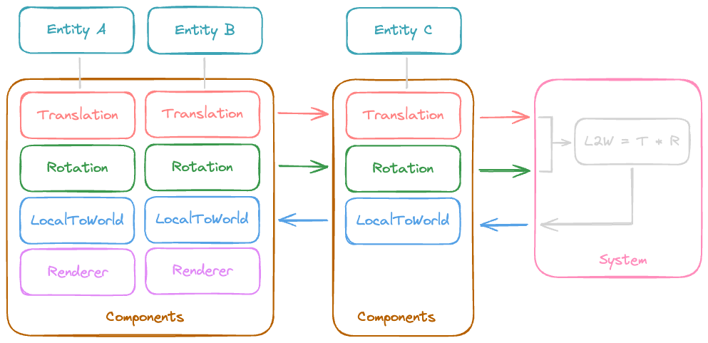

---
tags:
  - pattern
  - architectural
gardening: 🌱
date: 2024-12-23
reference:
  - https://en.wikipedia.org/wiki/Entity_component_system
  - https://github.com/SanderMertens/ecs-faq
  - https://medium.com/ingeniouslysimple/entities-components-and-systems-89c31464240d
  - https://ajmmertens.medium.com/building-an-ecs-2-archetypes-and-vectorization-fe21690805f9
  - https://www.simplilearn.com/entity-component-system-introductory-guide-article#:~:text=add%20new%20features-,How%20Is%20ECS%20Different%20From%20OOP%3F,plain%20old%20data%20(POD)%20objects
---
## Overview

Entity Component System (ECS) is a software architectural pattern utilized primarily in video game development and other performance-critical applications. ECS effectively separates concerns by decomposing entities into data components and systems that operate on those components.



## What is it?

The behavior of an entity can be modified at runtime by systems that add, remove, or change components. This approach resolves the ambiguity issues associated with deep and wide inheritance hierarchies commonly found in Object-Oriented Programming, which can be challenging to understand, maintain, and extend. Many Entity Component System (ECS) approaches are highly compatible with data-oriented design techniques. In this setup, the data for all instances of a component is stored contiguously in physical memory, allowing for efficient memory access for systems that operate on multiple entities.

The Entity Component System (ECS) does not encounter the dependency issues commonly found in Object-Oriented Programming because components are straightforward data containers that do not have dependencies. Each system typically queries the set of components that an entity must possess for the system to function. For instance, a rendering system might require the model, transform, and drawable components. When the system executes, it applies its logic to any entity that has all of these necessary components, while simply skipping over other entities without the need for complex dependency trees. 

However, this simplicity can also lead to hidden bugs, as propagating values between systems through components can be difficult to debug. ECS can be effectively used in scenarios where uncoupled data needs to be associated with a particular lifetime.

### Pros

- **Decoupling/SoC:** The separation of logic from data simplifies modifications and extensions. Systems handle logic, while components store data.
- **Performance:** Systems can function efficiently by using arrays of components, which enables better utilization of CPU cache locality and parallelism.
- **Flexibility/Scalability:** Introducing new behaviors is straightforward—simply add new systems and components.
- **Reusability:** Components and systems can frequently be reused across different entities and projects.

### Cons

- **Learning Curve:** Effectively understanding and implementing ECS can take time.
- **Overhead:** ECS can introduce unnecessary complexity for smaller projects.
- **Debugging:** Tracking issues across entities, components, and systems may be challenging.

## Entity

Entities act as containers for components and serve as unique identifiers, often represented as integers or UUIDs, that signify "objects" or "things" in the world. Entities do not contain any data or logic; they merely function as references.

```text
Entity 1: Player
Entity 2: Enemy
Entity 3: Buff
```

#### Example

```ts
class Entity {
  id: number;

  constructor(id: number) {
    this.id = id;
  }
}
```

## Component

Components are data containers associated with entities that define their properties or characteristics. Each component typically represents one aspect of behavior or state, such as position, velocity, or health. Components contain no logic—only data.

```text
Position: { x: 10, y: 20 }
Velocity: { dx: 5, dy: 0 }
Health: { current: 100, max: 100 }
```

A single entity might have several components associated with it.

```text
Entity 1: [Position, Velocity, Health]
Entity 2: [Position, Health]
```

#### Example

```ts
abstract class Component {
  name: string;

  constructor() {
    this.name = this.constructor.name;
  }
}

class Position extends Component {
  x: number;
  y: number;

  constructor(x: number, y: number) {
    super();
    this.x = x;
    this.y = y;
  }
}

class Velocity extends Component {
  dx: number;
  dy: number;

  constructor(dx: number, dy: number) {
    super();
    this.dx = dx;
    this.dy = dy;
  }
}

class Health extends Component {
  current: number;
  max: number;

  constructor(current: number, max: number) {
    super();
    this.current = current;
    this.max = max;
  }
}

type EntityComponents = {
  Position?: Position;
  Velocity?: Velocity;
  Health?: Health;
};
```

## System

Systems are where the logic resides. They process entities that have specific combinations of components. Systems implement game rules, update state, and perform actions. A system queries entities with the required components and processes them.

```text
// Psuedo Movement System
foreach entity with (Position, Velocity):
  position.x += velocity.dx
  position.y += velocity.dy

// Psuedo Health System
foreach entity with (Health):
  if health.current <= 0:
    destroy(entity)
```

#### Example

```ts
abstract class System {
  name: string;

  constructor() {
    this.name = this.constructor.name;
  }

  abstract update(world: World, deltaTime: number): void;
}

class MovementSystem extends System {
  constructor() {
    super();
  }

  update(world: World, deltaTime: number) {
    const entities = world.query('Position', 'Velocity');

    for (const entityId of entities) {
      const position = world.getComponent<Position>('Position', entityId);
      const velocity = world.getComponent<Velocity>('Velocity', entityId);

      if (position && velocity) {
        position.x += velocity.dx * deltaTime;
        position.y += velocity.dy * deltaTime;

        console.log(`${entityId} moved to (${position.x}, ${position.y})`);
      }
    }
  }
}

class HealthSystem extends System {
  constructor() {
    super();
  }

  update(world: World, deltaTime: number) {
    const entities = world.query('Health');

    for (const entityId of entities) {
      const health = world.getComponent<Health>(entityId, 'Health');

      if (health) {
        if (health.current <= 0) {
          console.log(`${entityId} is dead!`);
        }
      }
    }
  }
}
```

## World

The world (sometimes called Engine) ties everything together. It manages entities, components, and systems.

#### Example

```ts
class World {
  #entities: Map<number, Entity>;
  #components: Map<string, Map<number, Component>>;
  #systems: System[];
  #currentEntityId: number;

  constructor() {
    this.#entities = new Map();
    this.#components = new Map();
    this.#systems = [];
    this.#currentEntityId = 0;
  }

  createEntity() {
    const entity = new Entity(this.#currentEntityId++);
    this.#entities.set(entity.id, entity);

    return entity;
  }

  deleteEntity(entity: Entity) {
    this.#entities.delete(entity.id);

    for (const [_, entityMap] of this.#components.entries()) {
      entityMap.delete(entity.id);
    }
  }

  addComponent(entity: Entity, component: Component) {
    const componentType = component.constructor.name;

    if (!this.#components.has(componentType)) {
      this.#components.set(componentType, new Map());
    }
    
    this.#components.get(componentType)?.set(entity.id, component);
  }

  getComponent<T>(entity: Entity, componentType: keyof EntityComponents) {
    return (
      this.#components.get(componentType)?.get(entity.id) || null
    ) as T | null;
  }

  removeComponent(entity: Entity, componentType: keyof EntityComponents) {
    this.#components.get(componentType)?.delete(entity.id);
  }

  query(...componentTypes: (keyof EntityComponents)[]) {
    const sets = componentTypes.map((type) => {
      return new Set(this.#components.get(type)?.keys() || []);
    });

    return [
      ...sets.reduce((a, b) => new Set([...a].filter((x) => b.has(x))))
    ];
  }

  addSystem(system: System) {
    this.#systems.push(system);
  }

  update(deltaTime: number) {
    for (const system of this.#systems) {
      system.update(this, deltaTime);
    }
  }
}
```

### Example Usage

```ts
// Create the world
const world = new World();

// Create entities
const player = world.createEntity();
const enemy = world.createEntity();

// Add components to entities
world.addComponent(player, new Position(0, 0));
world.addComponent(player, new Velocity(1, 1));
world.addComponent(player, new Health(100, 100));

world.addComponent(enemy, new Position(10, 10));
world.addComponent(enemy, new Health(0, 50)); // Dead enemy

// Add systems
world.addSystem(new MovementSystem());
world.addSystem(new HealthSystem());

// Run the game loop
let elapsed = 0;

function gameLoop(deltaTime: number) {
  console.log('Updating world...');
  world.update(deltaTime);
  elapsed += deltaTime;

  // Stop after 5 seconds
  if (elapsed > 5000) {
    clearInterval(interval);
  }
}

// Run at ~60 FPS
const interval = setInterval(() => gameLoop(1000 / 60), 1000 / 60);
```

With the output being:

```text
Updating world...
Entity 0 moved to (1, 1)
Entity 1 is dead!

Updating world...
Entity 0 moved to (2, 2)
Entity 1 is dead!

Updating world...
Entity 0 moved to (3, 3)
Entity 1 is dead!

//...for 5 seconds
```

## Optimizations

### Sparse Component Arrays

The implementation above uses a `Map` to store _components_, which can be slow for frequent lookups, particularly when dealing with many entities. To improve performance, **sparse arrays** indexed by _entity_ IDs can be utilized. This method reduces overhead by taking advantage of direct indexing (`O(1)`).

#### Example

```ts
class World {
  #entities: Map<number, Entity>;
  #components: Partial<Record<
   keyof EntityComponents, 
   (Component | undefined)[]
  >>;
  #systems: System[];
  #currentEntityId: number;

  constructor() {
    // ...

    // Each component type stores a sparse array
    this.#components = {};
  }

  addComponent(entity: Entity, component: Component) {
    const componentType = 
	  component.constructor.name as keyof EntityComponents;

    if (!this.#components[componentType]) {
      this.#components[componentType] = []; // Sparse array
    }

    this.#components[componentType][entity.id] = component;
  }

  getComponent<T>(entity: Entity, componentType: keyof EntityComponents) {
    return (this.#components[componentType]?.[entity.id] || null) as T | null;
  }

  removeComponent(entity: Entity, componentType: keyof EntityComponents) {
    if (this.#components[componentType]) {
      this.#components[componentType][entity.id] = undefined;
    }
  }

  query(...componentTypes: (keyof EntityComponents)[]) {
    const [firstType, ...restTypes] = componentTypes;
    const candidates = this.#components[firstType] || [];
    const result: number[] = [];

    for (const entityId in candidates) {
      const checkRest = (t: keyof EntityComponents) =>
        this.#components[t]?.[entityId];
      
      if (candidates[entityId] && restTypes.every(checkRest)) {
        result.push(parseInt(entityId, 10));
      }
    }

    return result;
  }
}
```

### Archetype Queries

Searching through all _entities_ to identify matching components can be resource-intensive, particularly with large datasets. **Archetypes** categorize _entities_ by their exact _component_ composition. Instead of dynamically querying entities, systems process already grouped entities.

#### Example

```ts
class Entity {
  id: number;
  components: Set<keyof EntityComponents>;

  constructor(id: number) {
    this.id = id;
    this.components = new Set();
  }
}

class World {
  #entities: Map<number, Entity>;
  #archetypes: Map<string, Set<number>>;
  #components: Map<string, Map<number, Component>>;
  #systems: System[];
  #currentEntityId: number;

  constructor() {
    // ...

    // Group entities by their component composition
    this.#archetypes = new Map();
  }

  createEntity() {
    const entity = new Entity(this.currentEntityId++);

    this.#entities.set(entity.id, entity);
    this.updateArchetype(entity);

    return entity;
  }

  addComponent(entity: Entity, component: Component) {
    // ...

    // Need to add component type to the entity
    // and update the archetypes
    entity.components.add(componentType);
    this.updateArchetype(entity);
  }

  removeComponent(entity: Entity, componentType: keyof EntityComponents) {
    // ...

    // Need to remove component type to the entity
    // and update the archetypes
    entity.components.delete(componentType);
    this.updateArchetype(entity)
  }

  updateArchetype(entity: Entity) {
    const archetypeKey = Array.from(entity.components).sort().join(',');

    if (!this.#archetypes.has(archetypeKey)) {
      this.#archetypes.set(archetypeKey, new Set());
    }

    this.#archetypes.get(archetypeKey)?.add(entity.id);
  }

  query(...componentTypes: (keyof EntityComponents)[]) {
    const queriedComponents = new Set(componentTypes);
    const matchingEntities: Set<number> = new Set();

    for (const [key, entities] of this.#archetypes) {
      const archetypeComponents = new Set(key.split(','));

      if (
        [...queriedComponents]
          .every((type) => archetypeComponents.has(type))
      ) {
        for (const entityId of entities) {
          matchingEntities.add(entityId);
        }
      }
    }

    return matchingEntities;
  }
}
```

### Pooling Entities and Components

Regularly creating and deleting entities and components can lead to memory fragmentation and slower garbage collection. Implementing object pools to reuse entities and components, rather than continually creating and destroying them, can help mitigate this problem.

#### Example

```ts
class Position {
  x: number;
  y: number;

  constructor(x: number, y: number) {
    this.x = x;
    this.y = y;
  }
}

type FactoryFn<T> = () => T;

class Pool<T> {
  #factory: () => T;
  #pool: T[];

  constructor(initialSize: number, factory: FactoryFn<T>) {
    this.#factory = factory;
    this.#pool = [];

    for (let i = 0; i < initialSize; i++) {
      this.#pool.push(factory());
    }
  }

  acquire() {
    return this.#pool.length > 0
      ? this.#pool.pop() as T
      : this.#factory();
  }

  release(obj: T) {
    this.#pool.push(obj);
  }
}

// Example usage
const positionPool = new Pool(20, () => new Position(0, 0));

// Reusing a component
const pos1 = positionPool.acquire();
pos1.x = 10;
pos1.y = 20;
positionPool.release(pos1); // Ready for reuse
```

### System Prioritization

Systems may need to execute in a specific order (e.g., physics before rendering). System priorities can be defined in order to tell the _World_ what order to run them in.

#### Example

```ts
class World {
  #entities: Map<number, Entity>;
  #components: Map<string, Map<number, Component>>;
  #systems: { system: System, priority: number }[];
  #currentEntityId: number;

  addSystem(system: System, priority: number) {
    this.#systems.push({ system, priority });
    // Higher priority first
    this.#systems.sort((a, b) => b.priority - a.priority);
  }

  update(deltaTime: number) {
    for (const { system } of this.#systems) {
      system.update(this, deltaTime);
    }
  }
}

// Usage
const systemPriority = {
  MOVEMENT: 1,
  HEALTH: 10,
} as const;

const world = new World();

world.addSystem(new MovementSystem(), systemPriority.MOVEMENT);
world.addSystem(new HealthSystem(), systemPriority.HEALTH);
```

### Threading with Workers

In large-scale ECS systems, performance can be bottlenecked by CPU-bound operations. Complex computations may be offloaded to Web Workers to take advantage of parallelism.

#### Worker File Example

```ts
type WorkerData = {
  deltaTime: number;
  entities: { position: Position, velocity: Velocity }[],
};

self.onmessage = (e: MessageEvent<WorkerData>) => {
  const { entities, deltaTime } = e.data;

  // Perform physics calculations
  for (const entity of entities) {
    const pos = entity.position;
    const vel = entity.velocity;

    pos.x += vel.dx * deltaTime;
    pos.y += vel.dy * deltaTime;
  }

  self.postMessage(entities); // Send updated entities back
};
```

#### Main Thread Example

```ts
type WorkerRes = { position: Position, velocity: Velocity }[];

worker.onmessage = (e: MessageEvent<WorkerRes>) => {
  const updatedEntities = e.data;
  console.log('Updated entities:', updatedEntities);
};

worker.postMessage({ entities, deltaTime });
```

### Data-Oriented Design

Object-oriented structures can distribute data throughout memory, which may reduce cache efficiency. By adopting a data-oriented design that utilizes flat arrays to store components, memory locality can be improved.

#### Example

```ts
class Positions {
  x: Float32Array;
  y: Float32Array;

  constructor(size: number) {
    this.x = new Float32Array(size); // Preallocated array
    this.y = new Float32Array(size);
  }
}

const positions = new Positions(100);

// Accessing component data
positions.x[entity.id] = 10;
positions.y[entity.id] = 20;
```

### Event-Driven Systems

Systems often need to communicate, such as when collisions occur, triggering health reduction. Event systems can be used to decouple this logic.

#### Example

```ts
type EventCallback<T> = (event: T) => void;

// Event-bus
class EventManager {
  #listeners: Map<string, EventCallback<any>[]>;

  constructor() {
    this.#listeners = new Map();
  }

  on<T>(event: string, callback: EventCallback<T>) {
    if (!this.#listeners.has(event)) {
      this.#listeners.set(event, []);
    }

    this.#listeners.get(event)!.push(callback);
  }

  emit<T>(event: string, data: T) {
    const callbacks = this.#listeners.get(event) || [];

    for (const callback of callbacks) {
      callback(data);
    }
  }
}

// Usage
const eventManager = new EventManager();

eventManager.on('collision', (data) => {
  console.log('Collision detected:', data);
});

eventManager.emit('collision', { entityA: 1, entityB: 2 });
```

### Full Example with Optimizations

So far, we have discussed the following optimization techniques:

- **Sparse Component Arrays:** This method allows for direct index access while minimizing memory overhead for unused slots.
- **Archetypes:** Archetypes significantly reduce query time and are particularly effective for frequent queries.
- **Entity and Component Pooling:** This technique lowers garbage collection (GC) overhead and enhances memory locality for objects that are reused often.
- **System Prioritization:** Which ensures correct execution order and optimizes interdependent systems.
- **Threading with Workers:** This approach takes advantage of multiple CPU cores to offload expensive computations.
- **Data-Oriented Design:** This design philosophy improves CPU cache locality and facilitates Single Instruction, Multiple Data (SIMD) optimizations.
- **Event-Driven Systems:** This approach decouples system dependencies, enhancing modularity and maintainability.

Now, let's combine these techniques into a more advanced Entity Component System (ECS).

#### Example

```ts
type FactoryFn<T> = () => T;

class Pool<T> {
  #factory: () => T;
  #pool: T[];

  constructor(initialSize: number, factory: FactoryFn<T>) {
    this.#factory = factory;
    this.#pool = [];

    for (let i = 0; i < initialSize; i++) {
      this.#pool.push(factory());
    }
  }

  acquire() {
    return this.#pool.length > 0
      ? this.#pool.pop() as T
      : this.#factory();
  }

  release(obj: T) {
    this.#pool.push(obj);
  }
}

// ---

type EventCallback<T> = (event: T) => void;

class EventManager {
  #listeners: Map<string, EventCallback<any>[]>;

  constructor() {
    this.#listeners = new Map();
  }

  on<T>(event: string, callback: EventCallback<T>) {
    if (!this.#listeners.has(event)) {
      this.#listeners.set(event, []);
    }

    this.#listeners.get(event)!.push(callback);
  }

  emit<T>(event: string, data: T) {
    const callbacks = this.#listeners.get(event) || [];

    for (const callback of callbacks) {
      callback(data);
    }
  }
}

// ---

class Entity {
  id: number;

  constructor(id: number) {
    this.id = id;
  }
}

// ---

abstract class Component {
  name: string;

  constructor() {
    this.name = this.constructor.name;
  }
}

class Position extends Component {
  x: number;
  y: number;

  constructor(x: number, y: number) {
    super();
    this.x = x;
    this.y = y;
  }
}

class Velocity extends Component {
  dx: number;
  dy: number;

  constructor(dx: number, dy: number) {
    super();
    this.dx = dx;
    this.dy = dy;
  }
}

class Health extends Component {
  current: number;
  max: number;

  constructor(current: number, max: number) {
    super();
    this.current = current;
    this.max = max;
  }
}

type EntityComponents = {
  Position?: Position;
  Velocity?: Velocity;
  Health?: Health;
};

// ---

class World {
  #entities: Map<number, Entity>;
  #archetypes: Map<string, Set<number>>;
  #components: Partial<Record<
    keyof EntityComponents, 
    (Component | undefined)[]
  >>;
  #currentEntityId: number;

  constructor() {
    this.#entities = new Map();
    this.#archetypes = new Map();
    this.#components = {};
    this.#currentEntityId = 0;
  }

  createEntity() {
    const entity = new Entity(this.#currentEntityId++);

    this.#entities.set(entity.id, entity);
    this.updateArchetype(entity);

    return entity;
  }

  deleteEntity(entity: Entity) {
    this.#entities.delete(entity.id);

    for (const [_, entityMap] of Object.entries(this.#components)) {
      entityMap[entity.id] = undefined;
    }
  }

  addComponent(entity: Entity, component: Component) {
    const componentType =
      component.constructor.name as keyof EntityComponents;

    if (!this.#components[componentType]) {
      this.#components[componentType] = [];
    }

    this.#components[componentType][entity.id] = component;
    this.updateArchetype(entity);
  }

  getComponent<T>(componentType: keyof EntityComponents, entityId?: number) {
    if (!entityId) {
      return (this.#components[componentType] || null) as T | null;
    }

    return (
      this.#components[componentType]?.[entityId] || null
    ) as T | null;
  }

  removeComponent(entity: Entity, componentType: keyof EntityComponents) {
    if (this.#components[componentType]) {
      this.#components[componentType][entity.id] = undefined;
    }

    this.updateArchetype(entity);
  }

  updateArchetype(entity: Entity) {
    const components = Object.keys(this.#components).filter(
      (type) => this.#components[type as keyof EntityComponents]?.[entity.id]
    );

    const archetypeKey = components.sort().join(',');

    for (const archetype of this.#archetypes.values()) {
      archetype.delete(entity.id);
    }

    if (!this.#archetypes.has(archetypeKey)) {
      this.#archetypes.set(archetypeKey, new Set());
    }

    this.#archetypes.get(archetypeKey)?.add(entity.id);
  }

  query(...componentTypes: string[]) {
    const queriedComponents = new Set(componentTypes);
    const matchingEntities: Set<number> = new Set();

    for (const [key, entities] of this.#archetypes) {
      const archetypeComponents = new Set(key.split(','));

      if (
        [...queriedComponents]
          .every((type) => archetypeComponents.has(type))
      ) {
        for (const entityId of entities) {
          matchingEntities.add(entityId);
        }
      }
    }

    return matchingEntities;
  }
}

// ---

abstract class System {
  name: string;

  constructor() {
    this.name = this.constructor.name;
  }

  abstract update(world: World, deltaTime: number): void;
}

class MovementSystem extends System {
  constructor() {
    super();
  }

  update(world: World, deltaTime: number) {
    const entities = world.query('Position', 'Velocity');

    for (const entityId of entities) {
      const position = world.getComponent<Position>('Position', entityId);
      const velocity = world.getComponent<Velocity>('Velocity', entityId);

      if (position && velocity) {
        position.x += velocity.dx * deltaTime;
        position.y += velocity.dy * deltaTime;

        console.log(`${entityId} moved to (${position.x}, ${position.y})`);
      }
    }
  }
}

class CollisionSystem extends System {
  #eventManager: EventManager;

  constructor(eventManager: EventManager) {
    super();
    this.#eventManager = eventManager;
  }

  update(world: World, _deltaTime: number) {
    const entities = world.query('Position');
    const positions = world.getComponent<Position[]>('Position');

    if (positions) {
      for (const entityId of entities) {
        for (const otherId of entities) {
          if (entityId !== otherId) {
            const a = positions[entityId];
            const b = positions[otherId];
  
            if (Math.abs(a.x - b.x) < 1 && Math.abs(a.y - b.y) < 1) {
              this.#eventManager.emit(
                'collision',
                { entityA: entityId, entityB: otherId }
              );
            }
          }
        }
      }
    }
  }
}

type EntityCollision = { 
  entityA: number, 
  entityB: number,
};

// Not extending System for this example
class HealthSystem {
  #eventManager: EventManager;
  name: string;

  constructor(eventManager: EventManager) {
    this.name = this.constructor.name;
    this.#eventManager = eventManager;
    this.#eventManager.on('collision', this.handleCollision.bind(this));
  }

  handleCollision({ entityA, entityB }: EntityCollision) {
    console.log(`Collision detected between ${entityA} and ${entityB}`);

    const healthA = world.getComponent<Health>('Health', entityA);
    const healthB = world.getComponent<Health>('Health', entityB);

    if (healthA) {
      healthA.current -= 10;
    }

    if (healthB) {
      healthB.current -= 10;
    }

    if (healthA && healthA.current <= 0) {
      console.log(`Entity ${entityA} is dead!`);
    }

    if (healthB && healthB.current <= 0) {
      console.log(`Entity ${entityB} is dead!`);
    }
  }
}

// ---

const eventManager = new EventManager();
const world = new World();

// Create pools
const positionPool = new Pool(10, () => new Position(0, 0));
const velocityPool = new Pool(10, () => new Velocity(0, 0));
const healthPool = new Pool(10, () => new Health(100, 100));

// Create systems
const movementSystem = new MovementSystem();
const collisionSystem = new CollisionSystem(eventManager);
const healthSystem = new HealthSystem(eventManager);

// Create entities
const player = world.createEntity();
const enemy = world.createEntity();

// Add components
world.addComponent(player, positionPool.acquire());
world.addComponent(player, velocityPool.acquire());
world.addComponent(player, healthPool.acquire());

world.addComponent(enemy, positionPool.acquire());
world.addComponent(enemy, velocityPool.acquire());
world.addComponent(enemy, healthPool.acquire());

// Assign initial values
world.getComponent<Position>('Position', player.id)!.x = 0;
world.getComponent<Position>('Position', player.id)!.y = 0;
world.getComponent<Velocity>('Velocity', player.id)!.dx = 0.5;
world.getComponent<Velocity>('Velocity', player.id)!.dy = 0.5;

world.getComponent<Position>('Position', enemy.id)!.x = 1;
world.getComponent<Position>('Position', enemy.id)!.y = 1;
world.getComponent<Velocity>('Velocity', enemy.id)!.dx = 0.5;
world.getComponent<Velocity>('Velocity', enemy.id)!.dy = 0.5;

// Game loop
let elapsed = 0;
function gameLoop(deltaTime: number) {
  console.log(`\n=== Frame ${elapsed / deltaTime} ===`);

  movementSystem.update(world, deltaTime);
  collisionSystem.update(world, deltaTime);
  elapsed += deltaTime;

  // Stop after 5 seconds
  if (elapsed > 5000) {
    clearInterval(interval);
  }
}

// Run at ~60 FPS
const interval = setInterval(() => gameLoop(1000 / 60), 1000 / 60);
```

Which outputs:

```text
=== Frame 0 ===
Entity 0 moved to (8.333333333333334, 8.333333333333334)
Entity 1 moved to (9.333333333333334, 9.333333333333334)

=== Frame 1 ===
Entity 0 moved to (16.666666666666668, 16.666666666666668)
Entity 1 moved to (17.666666666666668, 17.666666666666668)

=== Frame 2 ===
Entity 0 moved to (25, 25)
Entity 1 moved to (26, 26)

=== Frame 3 ===
Entity 0 moved to (33.333333333333336, 33.333333333333336)
Entity 1 moved to (34.333333333333336, 34.333333333333336)

...
```


## Further Optimizations

_TBD_