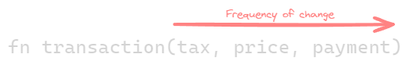

---
tags:
  - functional
gardening: 🌳
---
"Data last" is a coding pattern commonly used in functional programming. It improves function composition, partial application, and overall code readability by requiring that the data being manipulated is passed as the last argument to a function. In this approach, the arguments are organized from the least significant to the most significant.

In various programming paradigms, you may be accustomed to writing functions where the data is the first parameter. For example:

```js
transform(data, config);
```


However, in the "data last" style, we rearrange the function parameters so that the data appears last, following the configuration parameters.

Here’s the same function written in a data-last style:

```js
transform(config, data);
```



## Why Use Data Last?

### Enables Function Composition

By having data last, functions can be chained or composed more effectively.

```js
const f = curry((d, c) => e);
const g = curry((b, a) => c);

const transform = compose(f(x), g(y));
// transform: a -> e

transform(data);
```

### Facilitates Partial Application

Functions can be [curried](../../mathematics/algebra/Curry.md), making it easy to pass initial parameters to configure the function, which will then be ready to accept data later.

```js
const transformData = curry((conf, data) => { /*...*/ });

const configuredTransform = transformData(fnConfig);

const result = configureTransform(myData);
```

### Improved Readability

Having the data at the end of each function call makes it easier to follow the transformation flow when reading a sequence of operations.

```js
const result = process(data, fn1, fn2, fn3);

// vs

const result = fn3(fn2(fn1(data)));
// Enables natural nesting. Which can then be easily composed.
```

### Interoperability with Other Functions

Data last functions integrate well with other higher-order functions like `map` and `filter`, as these functions expect data as their final parameter.

```js
const transformData = curry((conf, data) => { /*...*/ });

const results = list.map(transformData(config));
```

### Consistency with Point-Free Style

Point-free programming minimizes explicit data references, and "data last" complements this approach.

```js
const processList = compose(map(f), filter(g));
```

### Improves Reusability

Functions designed with a "data last" approach are more reusable because they can be easily reconfigured with different initial arguments without requiring the data upfront.